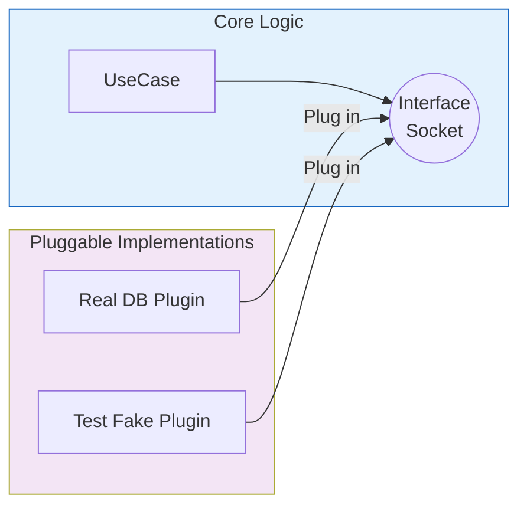

# 第23章：DIP入門（抽象に依存する）🔌⬆️

〜DBやHTTPに“引きずられない設計”の第一歩だよ〜💖

---

## この章のゴール🎯

* 「DIPって何？」を**言葉で説明**できるようになる🗣️✨
* 依存の向きをひっくり返して、**差し替え可能**にできるようになる🔁🎁
* “Repositoryをinterface化”して、**テストがラク**になるのを体験する🧪💚

---

# 1) まず「依存」ってなに？🤔🧩

たとえば、ユースケース（やりたいことの手順）でこんなのを書いたとするね👇

* ユースケースが **DBライブラリ**（Prismaとか）を直で呼ぶ
* ユースケースが **HTTPクライアント**（fetch/axios）を直で呼ぶ
* ユースケースが **特定のメールサービス**（SendGrid等）を直で呼ぶ

これ、動くんだけど……💥
**下の都合（DB/外部サービス）が変わるたびに、上の大事なロジックまで巻き込まれる**のがつらい😵‍💫

---

# 2) DIPって何？（超やさしく）🔌⬆️




Dependency Inversion Principle（依存関係逆転の原則）は、ざっくり言うとこう👇

* **上位（大事なルール・手順）は、下位（DB/外部I/O）に直接依存しない**
* **両方とも “抽象（interface）” に依存する**
* **抽象が詳細に依存しない／詳細が抽象に依存する**

つまり…
「ユースケースはDBの都合を知らないでOK。必要なのは “こういう保存ができるもの” っていう約束（interface）だけ」って感じ！✨
（この2点セットの言い回しがよく引用されるやつだよ） ([ウィキペディア][1])

---

# 3) モジュラーモノリスでDIPが効く理由🧩💪

モジュラーモノリスは「モジュール境界を守る」のが命だよね🛡️
DIPを入れると、こんな嬉しさが出るよ👇

* ✅ **モジュールの中心（domain/application）が安定する**
* ✅ DBや外部連携が変わっても、中心のコードが壊れにくい🔧
* ✅ テストで **本物のDBなし** で動かせる🧪✨
* ✅ “依存の向き”が揃って、設計が読みやすい📚

---

# 4) 具体例：Repositoryをinterface化してDIPする🧩✨

## よくある“DIPなし”の形（つらい版）😇💥


ユースケースがDB直叩きしちゃう例👇

```ts
// modules/tickets/application/createTicket.ts
import { prisma } from "../../infrastructure/prismaClient"; // ← 低レイヤにベタ依存💥

export async function createTicket(input: { title: string; userId: string }) {
  // ここが本当は「やりたいことの手順」のはずなのに…
  const ticket = await prisma.ticket.create({
    data: { title: input.title, userId: input.userId },
  });

  return ticket;
}
```

**問題点あるある**😵‍💫

* DBライブラリを変えるだけでユースケースが書き換え地獄
* テストが「DB立ててね」になりがち
* “中心のロジック”がどんどん汚れる🌀

---

# 5) DIPありの形（気持ちいい版）🌸✨

ポイントはこれ👇
**ユースケース側が “必要な約束（Port/Interface）” を持つ** → それを **下位が実装**する！

## 5-1) まず「ポート（interface）」を切る🔌


```ts
// modules/tickets/domain/ports/TicketRepository.ts
export interface TicketRepository {
  create(input: { title: string; userId: string }): Promise<{ id: string; title: string; userId: string }>;
}
```

ここで大事なのは👇

* interfaceは **domain（またはapplication）側**に置く
* **“欲しい操作”だけ**を定義する（DB都合を漏らさない）🙈✨

---

## 5-2) ユースケースは「抽象（interface）」だけ見る👀✨

```ts
// modules/tickets/application/createTicket.ts
import type { TicketRepository } from "../domain/ports/TicketRepository";

export async function createTicket(
  repo: TicketRepository,
  input: { title: string; userId: string }
) {
  // ここは “手順・ルール” に集中できる💖
  if (!input.title.trim()) throw new Error("タイトルは必須だよ🥺");

  const ticket = await repo.create(input);
  return ticket;
}
```

💡ここでユースケースは「DB？知らん！」って顔しててOK😌✨

---

## 5-3) 下位（infrastructure）が実装する🛠️

```ts
// modules/tickets/infrastructure/PrismaTicketRepository.ts
import type { TicketRepository } from "../domain/ports/TicketRepository";
import { prisma } from "./prismaClient";

export class PrismaTicketRepository implements TicketRepository {
  async create(input: { title: string; userId: string }) {
    const ticket = await prisma.ticket.create({ data: input });
    return { id: ticket.id, title: ticket.title, userId: ticket.userId };
  }
}
```

**詳細が抽象に依存してる**（implementsしてる）＝DIPの形になった！🔌⬆️ ([ウィキペディア][1])

---

## 5-4) つなぐ（Composition Root）🔗✨

※DIは次章でやるから、ここでは手渡しでOK🎁

```ts
// app/bootstrap.ts (例：アプリ起動時に組み立てる場所)
import { createTicket } from "../modules/tickets/application/createTicket";
import { PrismaTicketRepository } from "../modules/tickets/infrastructure/PrismaTicketRepository";

const repo = new PrismaTicketRepository();

const ticket = await createTicket(repo, { title: "学園祭のチケット", userId: "u1" });
console.log(ticket);
```

---

# 6) DIPのご褒美：テストが一気にラクになる🧪💚


DBなしでテストしたい？OK！✨
Fake（偽物）を作って差し替えるだけ〜🎉

```ts
// modules/tickets/test/FakeTicketRepository.ts
import type { TicketRepository } from "../domain/ports/TicketRepository";

export class FakeTicketRepository implements TicketRepository {
  public created: Array<{ title: string; userId: string }> = [];

  async create(input: { title: string; userId: string }) {
    this.created.push(input);
    return { id: "fake-1", ...input };
  }
}
```

```ts
// modules/tickets/test/createTicket.test.ts
import { createTicket } from "../application/createTicket";
import { FakeTicketRepository } from "./FakeTicketRepository";

async function test() {
  const repo = new FakeTicketRepository();

  const ticket = await createTicket(repo, { title: "テスト用", userId: "u1" });

  console.assert(ticket.id === "fake-1");
  console.assert(repo.created.length === 1);
  console.log("OK🧪✨");
}

test();
```

「中心のロジック」をサクッと回せるの、強すぎる…💚

---

# 7) DIPの落とし穴あるある⚠️😵‍💫（ここ超大事！）

## ① interface作りすぎ病📚💦

* 何でもかんでもinterfaceにすると、逆に読みにくい
  ✅ **“外部I/O（DB/HTTP/メール/ファイル）”だけ**を優先で抽象化しよ〜

## ② 抽象に“DB都合”が漏れる🫠


* `findByPrismaWhere` みたいなのはNG🙅‍♀️
  ✅ 抽象は「業務として欲しい操作」だけにする✨

## ③ 戻り値がORMの型そのまま🧟‍♀️

* domain/appにORMの型が入ると、結局ベタ依存になる
  ✅ DTOっぽく整えて返す（さっきの例みたいに）✨

---

# 8) ミニ課題🧩✍️（やると実力つくやつ！）

## 課題A：Repositoryのinterface化🔌

* どこか1つユースケースを選ぶ
* DB直叩きをやめて、`XxxRepository` interfaceを切る
* infrastructureでimplementsする

## 課題B：Fake実装でテスト🧪

* FakeRepositoryを作る
* 「DBなし」でユースケースを動かす

## 課題C：境界を言語化🗣️

* 「ユースケースが知っていいこと／ダメなこと」を3行で書く📝

---

# 9) AIに頼ると爆速になるプロンプト例🤖💡

コピペで使ってOK〜✨

* 「この関数、DB直叩きしてるからDIPに沿ってリファクタして。必要なPort(interface)と実装クラスも提案して」
* 「このユースケースに必要なRepository操作を最小限で設計して。メソッド名・引数・戻り値も」
* 「抽象にDB都合が漏れてないかレビューして。漏れてたら修正案も」
* 「Fake実装を作って、ユースケースのテスト例を3ケース出して」

---

# 10) まとめチェックリスト✅✨


* [ ] ユースケースがDB/HTTP/外部SDKを **importしてない**
* [ ] interface（Port）が **中心側**に置かれている
* [ ] infrastructureが **implements** している
* [ ] Fakeでテストできた🧪💚
* [ ] 抽象に“DB都合”が漏れてない🙈

---

# 次章へのつなぎ🎁➡️

今回は「抽象（Port）を切った」だけで、依存の注入は手渡しだったよね✨
次は **DI（newしないで渡す）** をやって、組み立てをもっとキレイにするよ〜🎉
DIコンテナの代表例として InversifyJS みたいな選択肢もあるよ📦✨ ([InversifyJS][2])

---

必要なら、この章の内容を「あなたの題材アプリ（学内イベント管理とか）に合わせて」**具体的なモジュール分割＋Repository設計**まで落とし込んだ版も作れるよ〜🧩💕

[1]: https://en.wikipedia.org/wiki/Dependency_inversion_principle?utm_source=chatgpt.com "Dependency inversion principle"
[2]: https://inversify.github.io/?utm_source=chatgpt.com "InversifyJS docs | InversifyJS"
