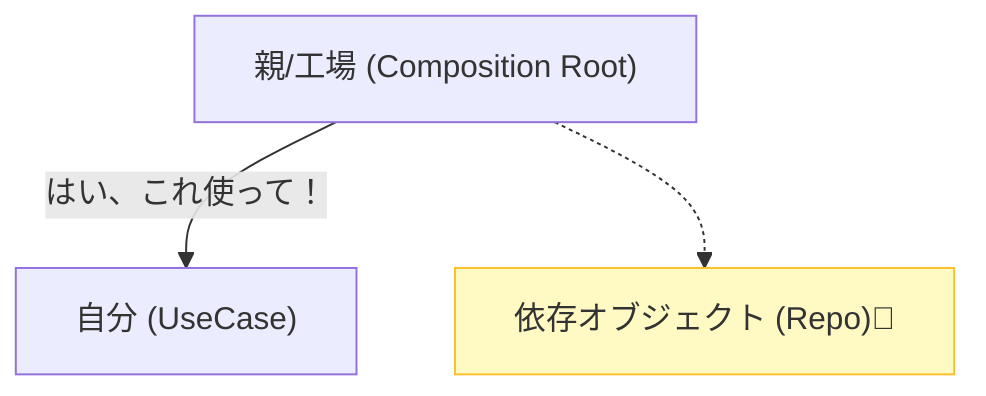

# 第24章：DI入門（newしないで渡す）🎁

（＝依存性注入 / Dependency Injection）

---

## この章でできるようになること🎯💖

* 「`new` 祭り」でコードがゴチャつくのを止められる🙅‍♀️💥
* **差し替えできる設計**（本番DB⇄テスト用Fake）にできる🧪💚
* モジュールの外側で組み立てる「**組み立て場所（Composition Root）**」を作れる🧩🏗️

---

## 1) まずDIってなに？🤔🎁




**DIは「必要な道具を、自分で買いに行かずに、渡してもらう」ことだよ〜🛍️➡️🎁**

* ❌悪い例：クラスの中で勝手に `new` して、道具を自前調達しちゃう
* ✅良い例：必要な道具（依存）を **外から受け取る**（注入）

DIのいちばん王道は **コンストラクタ注入（Constructor Injection）** だよ💡
「依存が見える」「作られた瞬間から必ず揃ってる」ので扱いやすいって言われるよ〜😊✨ ([GitHub][1])

---

## 2) 「newしないで」って、どういう意味？😳🆕

誤解しやすいんだけど…

* **アプリのどこかで `new` は必要**（世界にオブジェクトは出現しないので🤣）
* ただし、`new` していい場所を **1か所に寄せよう**って話！

✅ **`new` していい場所**：アプリ起動時に全部組み立てるところ（Composition Root）
❌ **避けたい場所**：業務ロジックの中（UseCaseやDomainの中）

この「組み立て場所」って考え方は、TS界隈でもよく出てくるよ〜🧠🏗️ ([Reddit][2])

---

## 3) ありがちな「new地獄」例😱🧨（DI前）

たとえばイベント登録のUseCaseが、内部でRepositoryを勝手に作ってると…

```ts
class RegisterEventUseCase {
  async execute(input: { title: string }) {
    const repo = new SqlEventRepository(); // ← 内部new😱
    await repo.save({ title: input.title });
  }
}
```

### これ、何が困るの？🥺💦

* テストで `SqlEventRepository` を避けられない（DB要る…死…）🪦
* 依存が隠れていて、読んだ人が気づきにくい🙈
* 依存関係が増えるほど、修正が雪だるま☃️💥

---

## 4) DIの基本形：コンストラクタ注入👍🎁

UseCaseは「Repositoryが必要！」とだけ言って、**作り方は知らない**ようにするよ🧠✨

```ts
export interface EventRepository {
  save(event: { title: string }): Promise<void>;
}

export class RegisterEventUseCase {
  constructor(private readonly repo: EventRepository) {}

  async execute(input: { title: string }) {
    await this.repo.save({ title: input.title });
  }
}
```

* UseCaseは `EventRepository` にだけ依存（＝抽象）🧩
* 具象（SqlなのかFakeなのか）は外で決める🎁

---

## 5) 「組み立て場所（Composition Root）」でnewする🏗️✨

ここでやっと `new` の出番だよ〜！😆🆕

```ts
// bootstrap.ts（組み立て専用ファイル）
const repo = new SqlEventRepository(/* dbなど */);
const registerEvent = new RegisterEventUseCase(repo);

export const app = {
  registerEvent,
};
```

こうすると…

* 本番は `SqlEventRepository` を渡す🗄️
* テストは `InMemoryEventRepository` を渡す🧪💚

---

## 6) 演習：Fake実装に差し替える🧪🎭

### (1) Fake（インメモリ）を作る

```ts
export class InMemoryEventRepository implements EventRepository {
  public saved: { title: string }[] = [];

  async save(event: { title: string }) {
    this.saved.push(event);
  }
}
```

### (2) テストで差し替える（雰囲気）

```ts
const fakeRepo = new InMemoryEventRepository();
const useCase = new RegisterEventUseCase(fakeRepo);

await useCase.execute({ title: "新歓イベント" });

console.log(fakeRepo.saved); // [{ title: "新歓イベント" }]
```

**「DBいらないテスト」完成〜！🎉💚**
この “差し替え” がDIの超強みだよ😊✨ ([Zenn][3])

---

## 7) モジュラーモノリスでのDI配置のコツ🧩🧭

モジュールが増えると「どこで組み立てるの？」って迷うよね😵‍💫

おすすめはこの形👇✨

### ✅ ルール（シンプル版）

* **各モジュールは「組み立て関数」を持つ**（内部のnewはそこに寄せる）🏗️
* **アプリ全体のComposition Root**が、モジュール同士をつなぐ🤝

例：Eventsモジュールの入口でまとめる🚪

```ts
// modules/events/index.ts（公開API側）
export type EventsModule = {
  registerEvent: RegisterEventUseCase;
};

export function createEventsModule(deps: { eventRepo: EventRepository }): EventsModule {
  const registerEvent = new RegisterEventUseCase(deps.eventRepo);
  return { registerEvent };
}
```

アプリ側で結線する🏗️

```ts
// bootstrap.ts
const eventRepo = new SqlEventRepository();
const events = createEventsModule({ eventRepo });

export const app = { events };
```

「モジュールの境界を守りつつ、差し替え可能」になるよ〜🛡️✨

---

## 8) 便利だけど注意：DIコンテナ（tsyringe / Inversify / Awilix）📦✨

手動DIで十分なことも多いんだけど、依存が増えてくると…

* `new` の行が増えて大変😵‍💫
* ライフサイクル（singletonとか）管理したい🧠

そこで **DIコンテナ**が候補になるよ📦✨

### tsyringe（軽量・Constructor Injection）🪶

* コンストラクタ注入ベースの軽量DIコンテナだよ ([GitHub][1])
* デコレータ＋メタデータの仕組みを使うことが多いよ（`reflect-metadata` など） ([CADDi Tech Blog][4])

### Inversify（本格派）💪

* TypeScriptのリフレクションメタデータ設定が必要、という案内があるよ ([inversify.io][5])

### Awilix（関数寄り・強力）🧰

* Node/TS向けのDIコンテナとして広く使われてるよ ([GitHub][6])

> 迷ったら：最初は **手動DI** → しんどくなったら **tsyringe/Awilix** を検討、がわりと平和😊🌸

---

## 9) つまづきポイント集⚠️🐣

### ❗(1) 「依存が多すぎる」問題

コンストラクタ引数が8個とかになったら、だいたい設計のサインかも🫣

* UseCaseを分割する✂️
* “まとめ役” を作る（Facade/サービスの再編）🧩

### ❗(2) 循環依存（AがB、BがA）🔁💥

DIコンテナでも手動でも爆発しやすい💣

* どっちかが知りすぎてる
* イベント/コールバック/インターフェースで向きを変える、が定番だよ🧭

### ❗(3) interfaceは実行時に消える🫥

TypeScriptの型は基本「コンパイル時のもの」なので、実行時には残らないよ（だからコンテナはTokenを使ったりする） ([Qiita][7])

---

## 10) 章末ミニ課題🧩✅

1. 自分のコード（または題材アプリ）から、UseCase内の `new` を1個探す🔎👀
2. それを「コンストラクタ注入」に直す🎁✨
3. `bootstrap.ts`（組み立て場所）に `new` を移動🏗️
4. Fakeを作って差し替えテストしてみる🧪💚

---

## AIに頼るプロンプト例🤖📝

```text
次のTypeScriptコードの「内部new」をやめて、Constructor Injection＋Composition Root方式にリファクタしてください。
- UseCase/Domain内ではnewしない
- 依存はinterfaceに寄せる
- bootstrap.tsに組み立てを集約
差し替え用にInMemory実装も用意して、簡単なテスト例もください。
（コード：ここに貼る）
```

```text
このモジュラーモノリス構成で、各モジュールのcreateXModule関数の依存（deps）設計案を出してください。
境界を壊さず、テスト差し替えしやすい形にしたいです。
```

---

## まとめ🎀✨

* DIは「依存を外から渡す」🎁
* `new` は **組み立て場所に寄せる**（Composition Root）🏗️
* これで **差し替え可能＝テストしやすい** が一気に進む🧪💚
* 必要ならDIコンテナも選べるけど、最初は手動DIが最強の先生📚✨

次の第25章で、この「差し替え」を **モジュール単位のテスト**に育てていこ〜！🧪🌱

[1]: https://github.com/microsoft/tsyringe?utm_source=chatgpt.com "microsoft/tsyringe: Lightweight dependency injection ..."
[2]: https://www.reddit.com/r/typescript/comments/14je3b0/construction_injection_without_di_framework/?utm_source=chatgpt.com "Construction Injection without DI framework : r/typescript"
[3]: https://zenn.dev/chida/articles/1f7df8f2beb6b6?utm_source=chatgpt.com "TypeScriptのDIとTsyringeについて"
[4]: https://caddi.tech/2025/12/12/092241?utm_source=chatgpt.com "tsyringe で迷わない：Clean Architecture の DI 実装"
[5]: https://inversify.io/docs/faq/requirements/?utm_source=chatgpt.com "TypeScript Requirements"
[6]: https://github.com/jeffijoe/awilix?utm_source=chatgpt.com "jeffijoe/awilix: Extremely powerful Inversion of Control (IoC) ..."
[7]: https://qiita.com/gimite/items/9cd693e1d5473ee07e48?utm_source=chatgpt.com "TypeScriptの型宣言を実行時に取り出す"
