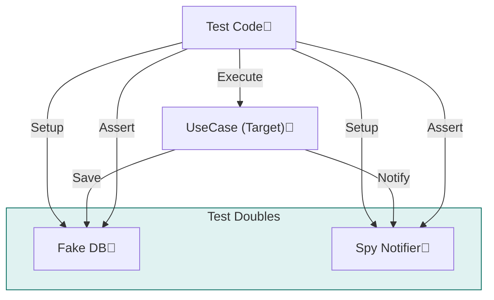

# 第25章：テスト差し替え実践（モジュール単位）🧪💚

この章は「**中心ロジックだけを速く・安定して**テストする」回だよ〜✨
ポイントは **依存（DB/HTTP/メール/外部API）を差し替えて**、モジュールの中身をサクッと検証すること！🏃‍♀️💨

---

## 1) 今日のゴール🎯✨

* ✅ **モジュール単位**で「中心ロジック」をテストできる
* ✅ DBや外部APIに触れない **爆速テスト**が作れる⚡
* ✅ 「Fake/Stub/Spy/Mock」あたりを *ふわっと* 使い分けできる😌
* ✅ AIに **テストケース案**を出させて、抜け漏れを減らせる🤖📝

---

## 2) なんで「差し替え」ると嬉しいの？🥹💡




中心ロジックが外部（DB/HTTP/メール）に直接くっついてると…

* テストが遅い🐢
* ネットワークやDBで落ちる（＝不安定）😵‍💫
* 失敗したとき原因が分かりづらい🌀

だから！
**「外部は interface（ポート）にして、テストでは偽物に差し替える」**ってやると、

* テストが速い⚡（数百〜数千件も回せる）
* 失敗理由が明快🔍
* モジュール境界も守りやすい🛡️

この考え方は DI/DIP と相性抜群だよ〜🎁🔌

---

## 3) テストダブル超ざっくり図鑑📚🧸


難しい言葉だけど、使うのはだいたいこの4つでOK！

* **Fake（フェイク）**：簡易実装（in-memoryのRepositoryとか）🧺
* **Stub（スタブ）**：決め打ちの返答をする（「常に成功」など）🎭
* **Spy（スパイ）**：呼ばれた回数や引数を記録する📒👀
* **Mock（モック）**：呼ばれ方を「こうあるべき！」と厳密に縛る👮‍♀️

初心者さんはまず **Fake + Spy** からで十分強いよ💪✨
（Mockは乱用するとテストが壊れやすくなること多め😇）

---

## 4) ツールは何を使う？🧰✨（2026の今）

* **Vitest**：Viteの流れを活かした高速テスト、Jest互換っぽい書き味もあって人気🧪⚡（Vitest 4 系の情報が公式にまとまってるよ） ([Vitest][1])
* **Jest**：王道。2025年に **Jest 30** が出ていて、継続的にメンテされてる安心感👑 ([GitHub][2])

この章のサンプルは **Vitest** でいくね🧡（速い＆書きやすい！）

---

## 5) 例題：学内イベント管理アプリ🎪📅（モジュール：`events`）

「イベントを作る」中心ロジックをテストしたい！
でも「DB保存」「通知送信」は外部なので差し替え対象だよ〜🎯

### 5.1 フォルダの雰囲気📁✨


* `modules/events/`

  * `public/` … 外に公開する入口🚪
  * `app/` … ユースケース（手順）🎬
  * `domain/` … ルールの中心💎
  * `ports/` … 外部への穴（interface）🕳️
  * `__tests__/` … テスト🧪

---

## 6) 「ポート（interface）」を切る✂️🧩


### 6.1 ports（外部依存）を定義する

```ts
// modules/events/ports/EventRepository.ts
export type EventRecord = {
  id: string;
  title: string;
  dateISO: string;
};

export interface EventRepository {
  save(event: EventRecord): Promise<void>;
  findById(id: string): Promise<EventRecord | null>;
}
```

```ts
// modules/events/ports/Notifier.ts
export interface Notifier {
  notify(message: string): Promise<void>;
}
```

> ここが「差し替えポイント」だよ🧷✨
> DBでも、メモリでも、何でもOKにするための“穴”！

---

## 7) 中心ロジック（ユースケース）を書く🎬✨

```ts
// modules/events/app/CreateEvent.ts
import type { EventRepository } from "../ports/EventRepository.js";
import type { Notifier } from "../ports/Notifier.js";

export type CreateEventCommand = {
  id: string;
  title: string;
  dateISO: string;
};

export class CreateEvent {
  constructor(
    private readonly repo: EventRepository,
    private readonly notifier: Notifier
  ) {}

  async execute(cmd: CreateEventCommand): Promise<void> {
    // 🧠中心ロジック：最低限のルール例
    if (!cmd.title.trim()) throw new Error("title is required");
    if (!/^\d{4}-\d{2}-\d{2}/.test(cmd.dateISO)) throw new Error("dateISO is invalid");

    await this.repo.save({ id: cmd.id, title: cmd.title, dateISO: cmd.dateISO });

    // ✅ ここも「外部」だから、テストでは差し替える
    await this.notifier.notify(`Event created: ${cmd.title}`);
  }
}
```

---

## 8) テストで差し替える🧪💚（Fake + Spy）

### 8.1 Fake（インメモリRepository）を作る🧺


```ts
// modules/events/__tests__/fakes/FakeEventRepository.ts
import type { EventRecord, EventRepository } from "../../ports/EventRepository.js";

export class FakeEventRepository implements EventRepository {
  private store = new Map<string, EventRecord>();

  async save(event: EventRecord): Promise<void> {
    this.store.set(event.id, event);
  }

  async findById(id: string): Promise<EventRecord | null> {
    return this.store.get(id) ?? null;
  }
}
```

### 8.2 Spy（通知が呼ばれたか記録）📒👀

```ts
// modules/events/__tests__/spies/SpyNotifier.ts
import type { Notifier } from "../../ports/Notifier.js";

export class SpyNotifier implements Notifier {
  public calls: string[] = [];

  async notify(message: string): Promise<void> {
    this.calls.push(message);
  }
}
```

---

## 9) Vitestでテストを書く⚡🧪

```ts
// modules/events/__tests__/CreateEvent.spec.ts
import { describe, it, expect } from "vitest";
import { CreateEvent } from "../app/CreateEvent.js";
import { FakeEventRepository } from "./fakes/FakeEventRepository.js";
import { SpyNotifier } from "./spies/SpyNotifier.js";

describe("CreateEvent", () => {
  it("イベントを保存し、通知する", async () => {
    const repo = new FakeEventRepository();
    const notifier = new SpyNotifier();

    const usecase = new CreateEvent(repo, notifier);

    await usecase.execute({
      id: "e1",
      title: "新歓パーティー",
      dateISO: "2026-04-10",
    });

    const saved = await repo.findById("e1");
    expect(saved?.title).toBe("新歓パーティー");

    expect(notifier.calls.length).toBe(1);
    expect(notifier.calls[0]).toContain("新歓パーティー");
  });

  it("タイトルが空ならエラー", async () => {
    const repo = new FakeEventRepository();
    const notifier = new SpyNotifier();
    const usecase = new CreateEvent(repo, notifier);

    await expect(
      usecase.execute({ id: "e2", title: "   ", dateISO: "2026-04-10" })
    ).rejects.toThrow("title is required");

    // 失敗した時は、外部（通知）が呼ばれてないのが理想✨
    expect(notifier.calls.length).toBe(0);
  });
});
```

### ここが超大事💖

* テストは **DB不要**、**ネット不要**、**爆速**⚡
* 「失敗した時に通知が飛ばない」みたいな **副作用の制御**もできる✨

---

## 10) 「モック/スタブ」っていつ使うの？🧸🎭


### Stubが便利なとき

外部が「結果だけ返せばいい」時（例：外部APIが成功したことにしたい）

* 例：`PaymentGateway.charge()` を「常に成功」にする💳✅

### Mockは慎重に⚠️

「呼び出し回数・順番・引数」をガチガチに縛ると、
実装をちょっと整えただけでテストが壊れがち💥

おすすめは：

* まず **Fake + Spy** で書く
* どうしても必要な箇所だけ Stub/Mock を追加

---

## 11) モジュール単位テストの“ちょうど良さ”📏✨


やりがち罠も置いとくね👇

* ❌ private関数を直接テストしたくなる
  → ✅ **公開API / ユースケース**経由でテストしよう🚪
* ❌ 1テストで確認しすぎ
  → ✅ 1テスト = 1意図（読みやすさ最強）📖
* ❌ 依存を増やしすぎ（大量モック）
  → ✅ portは必要最小限に整理しよう🧹

---

## 12) 章末ミニ課題🧩✅

### 課題A（基本）🌱

* `dateISO` が変な形式ならエラーになるテストを追加してね📅❌

### 課題B（ちょい応用）🔥

* 「同じ `id` がすでに存在したらエラー」にしてみよう

  * `repo.findById(id)` を見て分岐する感じ！👀
  * テストも追加🧪✨

### 課題C（設計の筋トレ）💪

* `CreateEvent` の中で `new` を一切しないように保ってみよう（差し替え耐性UP）🎁✨

---

## 13) AIにテストケース案を出させるプロンプト例🤖📝

コピペで使えるやつ置いとくね💕

```text
あなたはTypeScriptのテスト設計レビュー担当です。
次のユースケース(CreateEvent)に対して、
(1) 正常系テストケース
(2) 異常系テストケース
(3) 境界値・入力バリデーション観点
(4) 副作用（通知/保存）の呼ばれ方
を、抜け漏れが少ない形で箇条書き提案してください。
また、Fake/Spy/Stubのどれで差し替えるのが良いかも併記してください。
```

---

## 14) まとめ🎀✨

* モジュール単位テストは **中心ロジックを速く・安定して守る**ための武器🧪🛡️
* 依存（DB/外部API/通知）を **port（interface）** にして、テストでは **Fake/Spy** で差し替え✅
* ツールは **Vitest** が2026時点でも強い選択肢（Vitest 4系の情報が公式で整理されてるよ） ([Vitest][1])
* Jestも **Jest 30** が安定ラインとして案内されてるので、既存資産があるなら全然アリ👑 ([GitHub][2])

---

次の章（第26章：データ所有権🗄️👑）に進む前に、
もしよければ「あなたの題材アプリ」に合わせて、**どのportを切るべきか**一緒に整理して、テスト設計まで作っちゃう？🥰🧩

[1]: https://vitest.dev/?utm_source=chatgpt.com "Vitest | Next Generation testing framework"
[2]: https://github.com/jestjs/jest/releases?utm_source=chatgpt.com "Releases · jestjs/jest"
