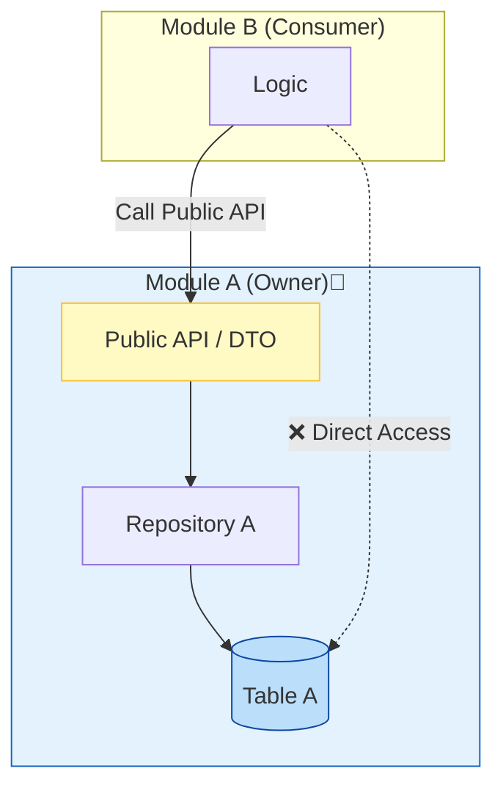
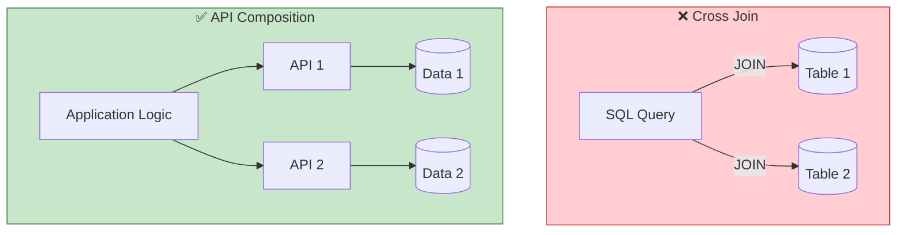

# 第26章：データ所有権（DBは1つでも持ち主を決める）🗄️👑

## この章でできるようになること🎯✨

* 「このテーブルは誰のもの？」を迷わず決められるようになる💡
* “共有DBだから直JOINしちゃえ🙂”の地雷を踏まなくなる💣
* 他モジュールのデータを **安全に** 使うルート（公開API/DTO）を作れる🚪🛡️
* まずは小さく「所有権マップ🗺️」を作って、運用できるようになる✍️

---

## 今日のキーワード📌

* データ所有権（Data Ownership）👑
* “持ち主だけが更新できる”ルール✍️
* 公開API（Public Interface）🚪
* スキーマ分割（Schema per Module）🧩
* 横断クエリ禁止（DBレベル結合を作らない）🚫
* 参照は「お願い」・更新は「依頼」🙏

---

## 26-1. まず結論：DBが1つでも、テーブルは共有しない🙅‍♀️🗄️




モジュラーモノリスでも基本はこれ👇

* **各モジュールは自分のデータを“所有”する**
* 他モジュールは **直接アクセス/更新しない**（内部実装だから）
* 使うなら **公開インターフェース（APIと型）経由** にする🚪✨

この考え方は、モジュラーモノリスでもマイクロサービスでも同じ方向性で語られてます。たとえば「各モジュールが自分のデータを所有し、他からは直接触らせない」・「公開インターフェースを通して最小限共有」・「整合性の単位はモジュール」という原則が整理されています。 ([Binary Igor][1])

---

## 26-2. “共有DB”のよくある事故パターン💥😵‍💫

### 事故①：他モジュールのテーブルを直SELECTし始める📎

最初は「ちょっと読むだけだし…🙂」
でも次にこうなる👇

* 相手がカラム名や正規化を変える
* こっちが壊れる（気づきにくい）
* 依存が“DBの奥底で”増殖して抜けなくなる🕳️

「他モジュールのDBに直クエリ」って、まさにこの **結合地獄** の入口として説明されています。 ([Binary Igor][1])

### 事故②：DBロック・運用が絡んで“実質一体化”🔒

共有DBはランタイム面でも干渉しやすく、ロックなどで別サービス（別モジュール）の動作まで巻き込む問題が挙げられます。 ([microservices.io][2])

---

## 26-3. データ所有権の決め方：おすすめ3段階📶🧩

「いきなり完璧」は無理なので、段階でOKだよ〜☺️💕

### レベル1：テーブル単位で“担当モジュール”を決める（最小）🧾

* 例：`users_*` は Users、`events_*` は Events
* ルール：**担当以外は更新禁止**（読みも原則API経由）

### レベル2：**スキーマをモジュールごとに分ける**（おすすめ）🧩🗂️

* 例：`users` スキーマ、`events` スキーマ
* “同じDBの中で区画整理する”感じ🏠✨
* 「モジュール＝独立アプリに近い」考えで、**共有DBでもスキーマを分ける**のが紹介されています。 ([systemshogun.com][3])

### レベル3：モジュールごとにDBを分ける（将来の独立に最強）🚀

* 将来マイクロサービスへ切り出す時に楽✨
* ただし運用コストも上がるので、最初はレベル2が現実的👍

（参考：マイクロサービス寄りの世界だと「Database per Service」が基本パターンで、同一DBサーバーでも“論理的に分離して資格情報を分ける”などの発想が整理されています） ([microservices.io][4])

---

## 26-4. 超重要：横断JOIN（別スキーマをまたぐSQL）を禁止しよ🚫🍭




DBが1つだと、ついこうしたくなる👇

* `users` と `events` をSQLでJOINして1発で取る

でもこれ、**DBレベルで密結合**が完成しちゃう😱
「別スキーマをまたぐクエリは禁止にした（将来分離できなくなるから）」という判断が、実例として語られています。 ([DEV Community][5])

---

## 26-5. じゃあ他モジュールのデータ、どう使うの？🤔💡

横断JOINしない代わりに、定番はこの3つだよ〜🍀

### パターンA：ID参照＋公開APIで必要分だけ取る📞

* OrdersがUser名を表示したい
  → Usersの公開APIで「表示用ユーザー情報」を取る

メリット：境界がキレイ✨
デメリット：呼び出し回数が増えがち（でもまずはこれでOK！）👍

### パターンB：読み取り専用の“投影テーブル”を持つ（複製）🪞

* Orders側に `order_user_snapshot` みたいな表示用テーブルを持つ
* Users更新時にイベント等で反映（この話は後半章で強くなるやつ📣）

メリット：画面が速い⚡
デメリット：最終的整合性（ちょい遅れ）を許容する設計が必要🕒

### パターンC：アプリ側で“API合成”してインメモリJOINする🧠

* DBでJOINしない
* アプリで「Aから取る」「Bから取る」→メモリで合体

（マイクロサービスの文脈でも “API Composition” がよく出ます） ([microservices.io][6])

---

## 26-6. 実装の基本形：所有者だけがDB層を持つ👑🧩

ここからは **形（テンプレ）** を覚えちゃお〜🫶✨

### ルール（この章のコア）👑

1. **テーブル（またはスキーマ）には“所有者モジュール”がいる**
2. **所有者モジュールだけがRepository/SQLを持つ**
3. 他モジュールは **公開API（関数/クラス）とDTO** だけ見る
4. “便利だから直import / 直SQL” は封印🚫🔒

この「他モジュールは内部実装（DB）を知らず、インターフェース経由で使う」が超大事って話は、原則として強く整理されています。 ([Binary Igor][1])

---

## 26-7. ミニ題材でやってみよ：学内イベント管理📅🎟️

モジュール例👇

* `users`：学生/スタッフ
* `events`：イベント本体
* `registrations`：参加登録

### “所有権マップ”を作る🗺️✍️（まずはこれだけで勝ち！）

| テーブル/スキーマ                          | 所有モジュール          | 他モジュールがやって良いこと         |
| ---------------------------------- | ---------------- | ---------------------- |
| users（例：users_users）               | users 👑         | Users公開APIで参照だけ📞      |
| events（例：events_events）            | events 👑        | Events公開APIで参照だけ📞     |
| registrations（例：reg_registrations） | registrations 👑 | Registration公開APIで操作📞 |

✅ 追加ルール案

* **更新は所有者だけ**（INSERT/UPDATE/DELETE禁止）✍️🚫
* 他モジュールは、必要なら **DTOだけ** もらう📦
* 横断JOIN禁止（スキーマ跨ぎSQL禁止）🚫

---

## 26-8. TypeScriptのコード骨組み（テンプレ）🧱✨

※ORMは何でもOKだよ（ここでは形を優先）😊

### 公開API（Users側）🚪

```ts
// modules/users/public-api.ts
export type UserId = string;

export type UserSummaryDto = {
  id: UserId;
  displayName: string;
  role: "student" | "staff";
};

export interface UsersApi {
  getUserSummary(id: UserId): Promise<UserSummaryDto | null>;
  isStaff(id: UserId): Promise<boolean>;
}
```

### DBアクセスは所有者の中だけ🗄️👑

```ts
// modules/users/infra/user-repository.ts
import type { UserId, UserSummaryDto } from "../public-api";

export interface UserRepository {
  findSummaryById(id: UserId): Promise<UserSummaryDto | null>;
  existsStaff(id: UserId): Promise<boolean>;
}

// ここでSQL/ORMを使う想定（このファイルは users モジュールの外から触らせない）
```

### 実装（Usersモジュール内で閉じる）🔒

```ts
// modules/users/users-service.ts
import type { UsersApi, UserId, UserSummaryDto } from "./public-api";
import type { UserRepository } from "./infra/user-repository";

export class UsersService implements UsersApi {
  constructor(private readonly repo: UserRepository) {}

  async getUserSummary(id: UserId): Promise<UserSummaryDto | null> {
    return this.repo.findSummaryById(id);
  }

  async isStaff(id: UserId): Promise<boolean> {
    return this.repo.existsStaff(id);
  }
}
```

### 他モジュールは“UsersApiだけ”を見る👀✨

```ts
// modules/registrations/register-usecase.ts
import type { UsersApi, UserId } from "../users/public-api";

export class RegisterToEventUsecase {
  constructor(private readonly usersApi: UsersApi) {}

  async execute(input: { userId: UserId; eventId: string }) {
    const isStaff = await this.usersApi.isStaff(input.userId);

    // 例：スタッフだけ登録できるイベント、みたいなルール
    if (!isStaff) {
      throw new Error("スタッフのみ登録できます");
    }

    // registrations のDB更新は registrations モジュール内でやる🗄️👑
  }
}
```

この形にしておくと、後でUsersのテーブル設計を変えても、外側が壊れにくいよ〜☺️🛡️
（「DBは内部実装だから、他はインターフェース越しに使う」が効く✨） ([Binary Igor][1])

---

## 26-9. 実務で効く“追加の縛り”アイデア👮‍♀️✨

### ① スキーマ分割（Schema per Module）🧩

* `users.*`, `events.*` みたいに分ける
* “所有権が目で見える”のが強い👀✨
  （モジュールごとにスキーマ/データストアを持つ考え方が紹介されています） ([systemshogun.com][3])

### ② DB権限で“物理的に”止める（できるなら）🔐

* 本当はこれが最強
* ただモジュラーモノリスはアプリが1プロセスなので、実装は工夫が要る（将来分離の布石としては◎）

### ③ 「横断JOIN禁止」をCIでチェック🚫🧪

* SQL文字列/クエリビルダのルールでもOK
* 「1クエリで触っていいのは自分のスキーマだけ」みたいにする
  （横断クエリが将来の分離を邪魔する、という話は実例で語られています） ([DEV Community][5])

---

## 26-10. 章末ミニ課題🧩💪

### 課題A：所有権マップ作成🗺️✨

あなたの題材アプリで👇を作ってみてね！

* モジュール一覧
* テーブル一覧
* 所有者（👑）
* 他モジュールが欲しがる情報（DTOにする候補📦）

### 課題B：横断JOINをやめる設計に変換🚫➡️✅

「AとBをJOINして取ってた画面」を1つ選んで、

* UsersApiみたいな公開APIで取る
* もしくは“投影テーブル（スナップショット）”案を作る
  どっちかで置き換えてみよう💡

---

## 26-11. AIに頼るプロンプト例🤖📝

そのままコピペで使えるよ〜✨

* 「このテーブル一覧を見て、モジュール所有権（担当）を割り当てて。理由も書いて」
* 「このSQL、スキーマ跨ぎJOINになってない？なってたら代替案を3つ」
* 「この画面の表示要件で、DTOを最小にするならどんな形が良い？」
* 「将来モジュールを別サービスに切り出す前提で、いま禁止すべきDB依存を列挙して」

---

## この章のチェックリスト✅✅✅

* [ ] テーブル/スキーマの所有者（👑）が決まってる
* [ ] 所有者以外がDBを直接触らない（Repositoryが外に漏れてない）
* [ ] 他モジュールが使うのは公開APIとDTOだけ
* [ ] 横断JOIN（別スキーマ跨ぎ）が原則ゼロ
* [ ] “便利だから直参照”が起きない仕組み（ルール/CI/レビュー）がある

---

次の第27章は「トランザクション境界と集約の肌感」だよ〜🌰🔒
第26章で決めた“誰のデータか👑”が、次の“どこまでを1回で整合させるか”に直結するから、ここまでできたらめちゃ強いっ💪💕

[1]: https://binaryigor.com/modular-monolith-and-microservices-data.html "Modular Monolith and Microservices: Data ownership, boundaries, consistency and synchronization"
[2]: https://microservices.io/patterns/data/shared-database.html?utm_source=chatgpt.com "Pattern: Shared database"
[3]: https://systemshogun.com/p/stop-building-monoliths-build-modular "Stop Building Monoliths! Build Modular Monoliths Instead"
[4]: https://microservices.io/patterns/data/database-per-service.html?utm_source=chatgpt.com "Pattern: Database per service"
[5]: https://dev.to/lukaszreszke/sharing-data-between-modules-in-modular-monolith-50on "Sharing data between modules in modular monolith - DEV Community"
[6]: https://microservices.io/patterns/?utm_source=chatgpt.com "A pattern language for microservices"
