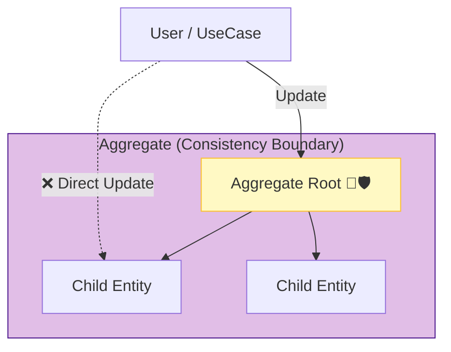

# 第27章：トランザクション境界と集約の肌感🌰🔒

## この章でできるようになるよ🎯✨

* 「どこまでを1回のトランザクションで守るべき？」が判断できる👀
* 「集約（Aggregate）って“まとまり”じゃなくて“整合性の範囲”なんだ！」が腑に落ちる🌰
* 集約ルート経由で更新する設計が、なぜ事故りにくいか説明できる🛡️
* TypeScriptで“それっぽく”実装できる（ユースケース＋リポジトリ＋トランザクション）🧩

---

## 0️⃣ まず超ざっくり：トランザクション境界って？🔒

トランザクションは「成功ならまとめて確定（commit）」「失敗なら全部なかったことに（rollback）」する“ひとまとまりの操作”だよ💡
ここでいう **トランザクション境界** は、もっと設計寄りの言い方で、

> **“この範囲は1回で必ず整合させる（同時に守る）”** を決める線引き✍️

って感じ😊

---

## 1️⃣ なんで境界を決めないとヤバいの？😱💥

境界が曖昧だと、こんな事故が起きやすい…👇

* ✅ 予約は取れたのに、在庫だけ減ってない（逆もある）🌀
* ✅ A画面では「空きあり」→次の瞬間に「満席」でエラー（同時更新競争）🏃‍♀️🏃‍♀️
* ✅ 途中で落ちたら“半分だけ反映”して、データがぐちゃぐちゃ🫠

つまり…
**「この整合性だけは一瞬たりとも壊れちゃダメ！」** を決めて、そこを **1トランザクションで守る** のが大事だよ🛡️✨

---

## 2️⃣ 集約（Aggregate）って結局なに？🌰

DDDの「集約」は、ふわっとした“まとまり”じゃなくて、

* **単一のユニットとして扱えるドメインオブジェクトの塊**（例：注文＋注文明細） ([martinfowler.com][1])
* **整合性（consistency）を守る境界**（この境界の内側は同時に整合させる） ([マイクロソフト ラーン][2])

っていうのがコアだよ🔥

そして集約にはルールがある👇

### ✅ 集約ルート（Aggregate Root）




* 集約には **ルートが1つ**いて、外からは基本ルートだけを入り口にする🚪
* ルートが「集約内の整合性の守護者」になる🛡️
* 集約内の更新は、**ルートのメソッド経由**でやるのが基本（子を直でいじらない） ([マイクロソフト ラーン][3])

---

## 3️⃣ “集約 = だいたい1トランザクション” の肌感✨

初心者のうちは、まずこの感覚でOK🙆‍♀️

* **集約の内側で守るべき不変条件（invariant）**は、1回のトランザクションで守る
* 逆に、集約をまたいで「全部を常に同時に正しく」は、設計コストが爆上がりしがち💣
* 複数集約にまたがる厳密整合性が必要なら、そもそも境界が変か、要件を見直すサイン🚥

（※のちの章で「イベント」「Outbox」「最終的整合性」みたいな話に繋がっていくよ📣）

---

## 4️⃣ 例題で体に入れよう：学内イベント申込み🎪👩‍🎓

### 🎯 要件（守りたい整合性）

* イベントは **定員（capacity）** がある
* 申込みは **定員を超えてはいけない**（これが不変条件🔥）
* 申込みが成功したら、参加者リストに追加される

このとき、自然な集約はこう👇

### 🌰 集約案：Event 集約

* **Event（集約ルート）**

  * capacity（定員）
  * attendees（参加者たち）
  * register(userId) というメソッドで「定員チェック＋追加」を一気にやる

こうすると、**“定員を超えない”がEvent集約の責任**になるから、守りやすい🛡️✨

---

## 5️⃣ TypeScriptでの実装イメージ🧩（ドメイン→ユースケース→永続化）

### 5-1. ドメイン：集約ルートに“守らせる”🌰🔒

```ts
// domain/event/Event.ts
type EventId = string;
type UserId = string;

class DomainError extends Error {}

export class Event {
  private attendees: Set<UserId>;

  constructor(
    public readonly id: EventId,
    private capacity: number,
    attendees: UserId[],
    // 楽観ロック用（後で説明するよ）
    public readonly version: number,
  ) {
    this.attendees = new Set(attendees);
  }

  get remainingSeats(): number {
    return this.capacity - this.attendees.size;
  }

  hasAttendee(userId: UserId): boolean {
    return this.attendees.has(userId);
  }

  register(userId: UserId): void {
    if (this.attendees.has(userId)) {
      throw new DomainError("すでに申込み済みだよ🙅‍♀️");
    }
    if (this.remainingSeats <= 0) {
      throw new DomainError("満席だよ🥺");
    }
    this.attendees.add(userId);
  }

  // 永続化用にスナップショットを返す（例）
  toPrimitives() {
    return {
      id: this.id,
      capacity: this.capacity,
      attendees: [...this.attendees],
      version: this.version,
    };
  }
}
```

ポイントはここ👇

* 「満席か？」の判断は **ユースケースじゃなくてEventが持つ** ✅
* だから、どこから呼ばれても **ルールが破られにくい** 🛡️

---

### 5-2. アプリケーション層：トランザクション境界を作る🎬🔒

ユースケースは「手順の組み立て役」だよ🧑‍🍳✨
ここで **“この操作は1トランザクション”** を宣言する感覚！

```ts
// application/RegisterToEventUseCase.ts
import { Event } from "../domain/event/Event";

export interface EventRepository {
  findById(id: string): Promise<Event | null>;
  save(event: Event): Promise<void>;
}

export interface TransactionRunner {
  runInTransaction<T>(fn: () => Promise<T>): Promise<T>;
}

export class RegisterToEventUseCase {
  constructor(
    private readonly tx: TransactionRunner,
    private readonly events: EventRepository,
  ) {}

  async execute(input: { eventId: string; userId: string }) {
    return this.tx.runInTransaction(async () => {
      const event = await this.events.findById(input.eventId);
      if (!event) throw new Error("イベントがないよ🥺");

      event.register(input.userId); // ← ルールは集約が守る🌰

      await this.events.save(event); // ← 1トランザクションで確定🔒
      return { ok: true };
    });
  }
}
```

---

## 6️⃣ 実際のDBトランザクションはどう書くの？🗄️🔒

ORM/クエリビルダごとに色々あるけど、たとえば Prisma だと `$transaction` が基本になるよ💡 ([Prisma][4])

### Prismaの“インタラクティブトランザクション”例

```ts
// infrastructure/PrismaTransactionRunner.ts
import { PrismaClient } from "@prisma/client";

export class PrismaTransactionRunner {
  constructor(private readonly prisma: PrismaClient) {}

  async runInTransaction<T>(fn: (tx: PrismaClient) => Promise<T>): Promise<T> {
    return this.prisma.$transaction(async (tx) => {
      return fn(tx);
    });
  }
}
```

> ✅ 重要：ユースケースは「どうやってDBがトランザクションするか」を知らない方が強い💪
> だから `TransactionRunner` みたいな“口（interface）”を用意するのが気持ちいいよ😊

---

## 7️⃣ ありがちな落とし穴😵‍💫（ここ、超大事！）

### ❌ 落とし穴1：ユースケースが集約ルートを飛ばして子を更新

* ルールが散らばって、どこかで必ず破れる💥

### ❌ 落とし穴2：1トランザクションに詰め込みすぎ

* “ついで更新”が増えて、ロック競合・性能劣化・事故率UP😇

### ❌ 落とし穴3：他集約をオブジェクト参照で持ちたがる

* 集約の外は「ID参照」が基本、が鉄板（境界を守りやすい）
  （集約が整合性境界だよ、って話と繋がる） ([マイクロソフト ラーン][2])

---

## 8️⃣ 同時更新（競争）への最低限の備え🏃‍♀️💨

満席チェックはドメインでできても、**同時に2人が押したら？** 問題があるよね😳

初心者向けの定番はこの2つ👇

### ✅ A) DB制約＋トランザクション

* 定員を別テーブルで管理して制約をかける、など（DBで守る）🧱

### ✅ B) 楽観ロック（versionで弾く）

* Eventに `version` を持たせて、保存時に「versionが一致しないなら失敗」にする
* 失敗したら「読み直して再実行」する🔁

このへんは実装がDB/ORMで変わるけど、考え方は同じだよ🧠✨

---

## 9️⃣ ミニ演習🧩✍️（手を動かすと一気に分かる！）

### 演習1：不変条件を1つ、文章で書こう📝

例）

* 「イベントの参加者数は定員を超えない」
* 「同じユーザーは同じイベントに2回申し込めない」

### 演習2：どれをEvent集約に入れる？入れない？🤔

候補）

* 参加者のプロフィール（学部/学年）
* 決済情報
* 出欠情報（当日チェックイン）

👉 コツ：**“同時に必ず整合させたいものだけ”を内側に置く**🌰🔒

### 演習3：AIに境界レビューしてもらう🤖👀

* 「この不変条件を守るには、集約境界はどこが自然？」
* 「このユースケースのトランザクション境界は適切？詰め込みすぎ？」
* 「集約をまたいで同時更新してる箇所があったら指摘して」

---

## 🔟 まとめ（今日の“腹落ちポイント”）🎉

* 集約は「まとまり」じゃなくて **整合性の境界** 🌰 ([マイクロソフト ラーン][2])
* 集約ルートは **更新の唯一の入口**（整合性の守護者）🛡️ ([マイクロソフト ラーン][3])
* 「この不変条件は絶対守る！」の範囲を **1トランザクション** にする🔒
* ユースケースは手順担当、ルールは集約担当、永続化はリポジトリ担当🧩

---

## おまけ：TypeScriptの“今”の小ネタ📌✨

2026年1月時点の最新安定版は TypeScript 5.9.2 が公開されているよ（GitHub Releases）。 ([GitHub][5])
あと、Nodeの挙動に寄せた `--module node20` みたいな安定オプションの話も進んでるので、TSの設定を“ふわっと”にしないのが吉🙆‍♀️ ([TypeScript][6])

---

次は「第28章：不変条件を守る（壊れない状態しか作らない）🛡️✨」だから、今日の集約の話がそのままド直球で効いてくるよ〜！💖

[1]: https://martinfowler.com/bliki/DDD_Aggregate.html?utm_source=chatgpt.com "D D D_ Aggregate"
[2]: https://learn.microsoft.com/en-us/azure/architecture/microservices/model/tactical-ddd?utm_source=chatgpt.com "Using tactical DDD to design microservices"
[3]: https://learn.microsoft.com/en-us/dotnet/architecture/microservices/microservice-ddd-cqrs-patterns/microservice-domain-model?utm_source=chatgpt.com "Designing a microservice domain model - .NET"
[4]: https://www.prisma.io/docs/orm/prisma-client/queries/transactions?utm_source=chatgpt.com "Transactions and batch queries (Reference) - Prisma Client"
[5]: https://github.com/microsoft/typescript/releases?utm_source=chatgpt.com "Releases · microsoft/TypeScript"
[6]: https://www.typescriptlang.org/docs/handbook/release-notes/typescript-5-9.html?utm_source=chatgpt.com "Documentation - TypeScript 5.9"
