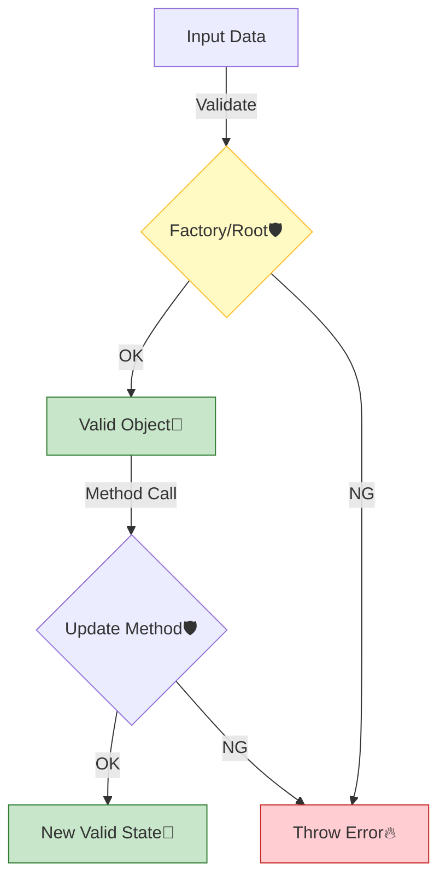

# 第28章：不変条件を守る（壊れない状態しか作らない）🛡️✨

この章はね、「**バグの8割を“そもそも発生させない”**」ための回です💪😊
ポイントは超シンプル👇

* ✅ **壊れた状態のオブジェクトを“作らない”**
* ✅ 更新も **メソッド経由** にして、毎回チェックする
* ✅ テストで「壊せない」ことを証明する🧪

---

## 0) 2026年1月時点の“最新まわり”メモ🧾✨

（バージョンは変わりやすいので「方針」を覚えるのが本命だよ〜！）

* Node.js は **v24 系が Active LTS**（v25 は Current）になってるよ🟩 ([Node.js][1])
* TypeScript は 5.9 のリリースノートが公開済みで、今後 **6.0 が橋渡し**、さらに **7.0（大きめ変化）**に向かう流れが公式から出てるよ🧠 ([TypeScript][2])
* 入力バリデーションには Zod がよく使われてて、npm でも最新が更新されてる📦 ([NPM][3])
* テストは Vitest も人気で、npm 側も継続更新されてる🧪 ([NPM][4])

---

## 1) 今日のゴール🎯✨

この章を終えると、こうなるよ👇

* 「イベントの定員は0以下にできない」みたいな **不変条件（Invariant）** を言語化できる📝
* **生成（create）** と **更新（update）** の両方で、必ず不変条件を守れる設計にできる🔒
* “壊れた状態が作れない”ことを **テストで保証**できる🧪✅

---

## 2) 不変条件ってなに？🍰




一言でいうと👇

> **そのオブジェクトが“正しい存在”でいるために、絶対に守らないといけない約束**🤝✨

例）学内イベント管理アプリ📅の「イベント」なら…

* タイトルは空文字ダメ🙅‍♀️
* 開始日時 < 終了日時 🕒
* 定員は 1 以上👥
* 公開済みイベントは、開始後に定員を減らして参加者が溢れるのはダメ😱
* 「下書き→公開→終了」みたいに状態遷移が決まってる🔁

---

## 3) “入力チェック”と“不変条件”は別物だよ🧠✨


混ざると事故るので、役割分担しよ〜👇

### ✅ 入力チェック（Validation）

* 例：API で受け取った JSON の型・必須・形式チェック
* これは **境界（モジュール公開APIの入口）** でやることが多い🚪✨
* Zod みたいな schema でやると強いよ💎 ([Zod][5])

### ✅ 不変条件（Invariant）

* 例：「定員 >= 参加者数」はドメインの約束
* これは **ドメイン（Aggregate / Entity / VO）** の中で守る🛡️

> つまり：入口で “形” を整える → 中心で “意味” を守る、だね😊✨

---

## 4) 不変条件を守る“置き場所”はここ一択に近い📍


初心者が迷いやすいところだけど、基本は👇

### ✅ 生成：Factory / static create で守る🏭✨

* 「作る瞬間」に必ずチェック
* 壊れたイベントは **存在しない** 世界にする🌍

### ✅ 更新：Aggregate のメソッドで守る🧰🔒

* `event.capacity = -1` みたいな直接代入を封じる🙅‍♀️
* `event.changeCapacity(newCap)` にして、そこで必ず検証する

---

## 5) 例でやろう：Event モジュールの不変条件リスト📝👀

まずは “文章” で書くのが超大事！（AIに頼ってOK🤖✨）

### Event（イベント）の例


* **タイトル**：空文字NG
* **開催期間**：start < end
* **定員**：capacity >= 1
* **公開状態**：Draft/Published/Closed のどれか
* **公開ルール**：start が過去なら Published にできない
* **定員変更**：参加者数を下回れない

この「不変条件リスト」が、設計の背骨になるよ🦴✨

---

## 6) TypeScriptで“壊れない”を作る基本セット🧩✨

### (A) Value Object（VO）で「値の時点で守る」💎


`Capacity` とか `EventPeriod` とかを VO にすると、めっちゃ事故減るよ😊

```ts
// modules/event/domain/Capacity.ts
export class Capacity {
  private constructor(public readonly value: number) {}

  static create(value: number): Capacity {
    if (!Number.isInteger(value)) throw new Error("Capacity must be integer");
    if (value < 1) throw new Error("Capacity must be >= 1");
    return new Capacity(value);
  }
}
```

> これで「capacity は 1 以上」という約束が、**型のレベルで固定**される感じ✨

---

### (B) Aggregate Root に「更新メソッド」を置く🛡️


```ts
// modules/event/domain/Event.ts
import { Capacity } from "./Capacity";

type Status = "Draft" | "Published" | "Closed";

export class Event {
  private constructor(
    public readonly id: string,
    private title: string,
    private period: { start: Date; end: Date },
    private capacity: Capacity,
    private status: Status,
    private registeredCount: number,
  ) {}

  static create(params: {
    id: string;
    title: string;
    start: Date;
    end: Date;
    capacity: number;
  }): Event {
    if (params.title.trim().length === 0) throw new Error("Title is required");
    if (params.start >= params.end) throw new Error("start must be < end");

    const cap = Capacity.create(params.capacity);
    return new Event(
      params.id,
      params.title.trim(),
      { start: params.start, end: params.end },
      cap,
      "Draft",
      0,
    );
  }

  publish(now = new Date()) {
    if (this.status !== "Draft") throw new Error("Only Draft can be published");
    if (this.period.start <= now) throw new Error("Cannot publish past events");
    this.status = "Published";
  }

  changeCapacity(newCapacity: number) {
    const cap = Capacity.create(newCapacity);
    if (cap.value < this.registeredCount) {
      throw new Error("Capacity cannot be less than registeredCount");
    }
    this.capacity = cap;
  }

  register() {
    if (this.status !== "Published") throw new Error("Event is not open");
    if (this.registeredCount >= this.capacity.value) throw new Error("Full");
    this.registeredCount += 1;
  }
}
```

この形にすると👇

* 「更新できる入口」が限定される🚪
* どの更新でも必ずチェックが走る👮‍♀️
* 壊れた状態を作れない🛡️✨

---

## 7) “例外throw”か “Result型”か？⚖️

初心者向けにおすすめ順で言うと👇

* まずは **throw** でOK（わかりやすい！）😊
* 慣れてきたら **Result（成功/失敗）** にすると、エラー処理が設計として綺麗になる✨

「教材としては throw で進めて、発展で Result を紹介」くらいが丁度いいよ👍

---

## 8) テストで「壊せない」を証明しよ🧪💚

Vitest を例に、最低限ここは押さえる✨ ([Vitest][6])

### テスト観点チェックリスト✅

* 作成時に不正値が弾かれる（タイトル空、start>=end、capacity<1）
* 公開のルールが守られる（過去イベントは publish できない）
* 定員変更が参加者数を下回れない
* register が満員で止まる

```ts
import { describe, it, expect } from "vitest";
import { Event } from "../domain/Event";

describe("Event invariants", () => {
  it("rejects empty title", () => {
    expect(() =>
      Event.create({
        id: "e1",
        title: "   ",
        start: new Date("2026-02-01"),
        end: new Date("2026-02-02"),
        capacity: 10,
      }),
    ).toThrow();
  });

  it("cannot set capacity below registeredCount", () => {
    const ev = Event.create({
      id: "e1",
      title: "Game Jam",
      start: new Date("2026-02-01"),
      end: new Date("2026-02-02"),
      capacity: 2,
    });
    ev.publish(new Date("2026-01-01"));
    ev.register();
    ev.register();
    expect(() => ev.changeCapacity(1)).toThrow();
  });
});
```

---

## 9) モジュール公開API側は「形」を整える（Zod例）🚪🧼


外から来るデータは信用しない！ってやつね😊
Zod は「型推論できるバリデーション」って立ち位置でよく使われるよ📦 ([Zod][5])

```ts
import { z } from "zod";

export const CreateEventInput = z.object({
  title: z.string().min(1),
  start: z.string().datetime(),
  end: z.string().datetime(),
  capacity: z.number().int().min(1),
});

export type CreateEventInput = z.infer<typeof CreateEventInput>;
```

ここでやるのは **形式と必須**。
「登録数を下回る定員変更禁止」みたいな **意味の約束**は、ドメイン側で守る🛡️✨

---

## 10) ミニ演習（この章のゴールに直結）🧩✨

### 演習1：不変条件リストを作る📝

あなたの題材アプリの「一番事故りそうなモジュール」を1つ選んで👇

* Entity / Aggregate を1つ決める
* 不変条件を **最低7個** 書く

### 演習2：create と update にチェックを埋める🔧

* `static create()` で作成時チェック
* 更新は必ずメソッド経由にする（直接代入禁止🙅‍♀️）

### 演習3：テストで“壊せない”を確認🧪✅

* 不変条件7個のうち、最低5個はテストを書く

---

## 11) AIに手伝ってもらうプロンプト例🤖📝

コピペで使えるやつ置いとくね😊✨

* 不変条件出し
  「このドメイン（貼り付け）で、バグになりやすい不変条件を10個列挙して。状態遷移の観点も入れて。」

* テスト観点
  「この create/update の不変条件（貼り付け）を破る境界値ケースを列挙して。Vitest でのテスト名案も付けて。」

* 設計レビュー
  「この Event Aggregate のメソッド群（貼り付け）で、不変条件が漏れていそうな箇所を指摘して。直し方も提案して。」

---

## 12) 章末まとめ🎀✨

* 不変条件は「壊れないための約束」🛡️
* **作成（create）と更新（update）** の両方で守るのがコツ✅
* “入口で形、中心で意味” を分けるとスッキリ😊
* テストは「壊せない証拠」🧪✨

---

## 次（第29章）へのつながり🧠➡️🕳️

不変条件をちゃんと作ると、「共通化（Shared/Utils）」したくなる誘惑が出るの…！😇
次章はその **共通化の罠** を避ける話だよ⚠️✨

[1]: https://nodejs.org/en/about/previous-releases?utm_source=chatgpt.com "Node.js Releases"
[2]: https://www.typescriptlang.org/docs/handbook/release-notes/typescript-5-9.html?utm_source=chatgpt.com "Documentation - TypeScript 5.9"
[3]: https://www.npmjs.com/package/zod?utm_source=chatgpt.com "Zod"
[4]: https://www.npmjs.com/package/vitest?utm_source=chatgpt.com "vitest"
[5]: https://zod.dev/?utm_source=chatgpt.com "Zod: Intro"
[6]: https://vitest.dev/?utm_source=chatgpt.com "Vitest | Next Generation testing framework"
