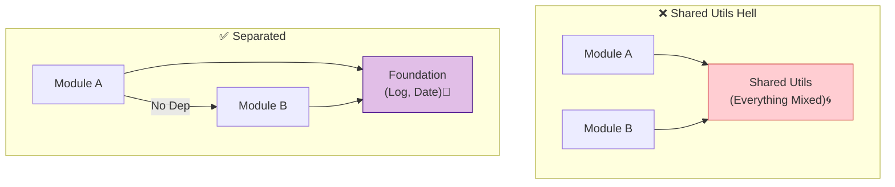
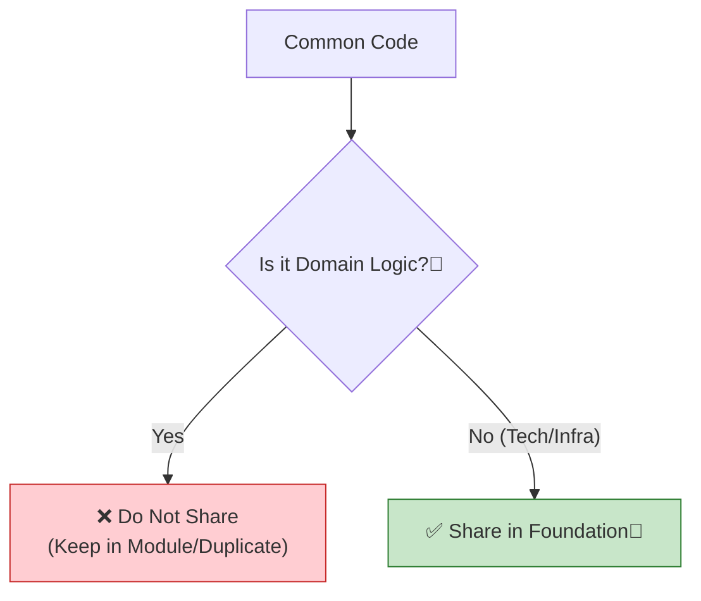

# 第29章：共通化の罠（Shared/Utils地獄を回避）🕳️⚠️

## この章でできるようになること🎯✨

* 「共通化した方が良さそう…」を**ちゃんと判断**できるようになる🧠💡
* `shared/` や `utils/` が**膨張して崩壊**する流れを止められる🛑💥
* “共通化ポリシー” を作って、未来の自分（or チーム）を救う📝🦸‍♀️

---

## 29.1 まず知っておく：Shared/Utils地獄ってなに？😇→😱




**症状あるある**👇

* `shared/utils/` に何でも入ってる（日時・金額・割引・権限・注文…）📦🌀
* 1個直したら**別モジュールが壊れる**（しかも理由がわからない）🧨😵‍💫
* “便利だから” でみんなが import して、**境界が溶ける**🫠
* 結果：モジュールが「分かれてる風」なだけで、実質 “巨大モノリス” に逆戻り😇

---

## 29.2 罠の正体：DRYの“やりすぎ”と、早すぎる抽象化🏃‍♀️💨

DRY（重複を避けよう）は大事なんだけど、**「似てるから同じ」**でまとめると事故りがち⚠️
特に、**将来 “別々に進化する” もの**を共通化すると、あとで苦しくなります😵‍💫

* 「DRYはガイドであって、命令じゃない」
* 「早すぎる抽象化は、柔軟性を奪って硬直化しやすい」
  …みたいな話は、設計の現場でめちゃ出ます📌 ([transcendsoftware.se][1])

---

## 29.3 “共通化していいもの / ダメなもの” ざっくり判定表⚖️✨




### ✅ 共通化しやすい（技術・インフラ寄り）🧰

* **ログ**（logger wrapper）🪵
* **時刻取得**（`now()` を差し替え可能にするとテストが楽）🕰️
* **エラーの基本型**（`Result<T,E>` みたいな汎用）🎁
* **設定読み込み**（config）⚙️
* **観測**（メトリクス/トレースの薄いラッパー）📈
  → これは “業務の意味” が薄いので、共有しても揉めにくい👌

### ❌ 共通化しにくい（ドメイン寄り）💎

* `Money`, `Price`, `Discount`, `User`, `Order` みたいな **意味を持つ型/ロジック**💰🧾
* バリデーション（例：メール、名前、住所…）も、**文脈でルールが違う**ことが多い📮🧩
* 「同じ言葉だけど意味が違う」もの（境界づけられたコンテキストの罠）🧱🗺️

ここで役に立つ考え方が **Shared Kernel（共有カーネル）** です👇

* 複数の境界で **どうしても共有する必要がある “小さな” 部分**だけを共有する
* ただしこれは **例外**で、運用が難しいから慎重に…という立ち位置💡 ([DevIQ][2])

---

## 29.4 “共通化ポリシー”のおすすめテンプレ📝💖

共通化は、**ルールがないと必ず膨張**します😱
なので、最小でいいから「判断の型」を作ろう〜！✨

### ルール0：基本は「共通化しない」🙅‍♀️

まずは **複製（コピペ）OK**。
理由：**後から統合はできる**けど、**間違った共通化の解体は地獄**になりがち🥹 ([transcendsoftware.se][1])

### ルール1：共通化するなら「所有者」を決める👑

* そのコードの “持ち主モジュール” を決める
* 変更の最終判断をする人（未来の自分でもOK）を決める
* 変更で影響が出る範囲を見える化する

### ルール2：共有場所を2種類に分ける（これ超大事）🧠✨

`shared/` を1つにしないで、**性質で分ける**のがコツ👇

* `foundation/`（技術共有）：ログ、時刻、Result、計測、設定など
* `shared-kernel/`（例外的ドメイン共有）：共有しないと成立しない “小さな” 型や規約だけ

### ルール3：共有コードは “薄く” する（厚くすると依存爆発）💥

* if/else が増えたら黄色信号🚥
* “便利オプション” が増えたら赤信号🚨
* 「呼ぶ側の都合」を入れ始めたら、だいたい終わり😇

---

## 29.5 ありがちな地獄を「回避する設計パターン」3つ🧩✨

### パターンA：共通化じゃなくて「DTOで合わせる」📦

モジュール間は **公開API + DTO** でやり取りするのが安全🎀
（中身のドメイン型は共有しない）

```ts
// ✅ 境界を跨ぐのは DTO だけ
export type MoneyDTO = { amount: number; currency: "JPY" | "USD" };

// Billing側の内部は Billing の都合で自由に進化してOK
class BillingMoney {
  constructor(private amount: bigint) {}
  // ...
}
```

### パターンB：「同じだけど別物」は、別々に持つ（複製OK）🧬

`UserId` といっても、モジュールによって
「会員ID」「学籍番号」「管理ユーザーID」みたいに意味が違うことあるよね？👀
→ そういうのは **別々に持ってOK**🙆‍♀️

### パターンC：Shared Kernel を使うなら “極小＆変更ルール厳しめ”🧊

Shared Kernel は **境界分離の例外**だから、

* 共有範囲は最小
* 変更はレビュー必須
* バージョンや互換の考えも必要
  …って感じで慎重運用が前提です🧤 ([ddd-practitioners.com][3])

---

## 29.6 実践：`shared/utils` を解体して救出する手順🛠️🚑

### ステップ1：まず棚卸し（分類）📋

`shared/` の各ファイルにラベルを付けるだけ！

* 🧰 **TECH**：ログ、時刻、型ユーティリティ、計測、設定
* 💎 **DOMAIN**：金額、割引、注文、権限など意味が濃い
* 🌀 **MIXED**：TECH と DOMAIN が混ざってる（危険！）

### ステップ2：移動ルール🚚

* 🧰 TECH → `foundation/` へ
* 💎 DOMAIN → **元のモジュールに戻す**（もしくは DTO化）
* 🌀 MIXED → まず分離してから判断（ほぼ戻すことになる）😇

### ステップ3：最後に “共有を増やさない仕組み” を入れる👮‍♀️

（第15〜16章でやった境界チェックの応用だね！）

* `shared/` 直下に何でも追加できないように
* 追加するなら「目的」「所有者」「利用モジュール」「互換ルール」を一言残す📝✨

---

## 29.7 ミニ演習🧩💖（そのまま授業で使えるやつ）

### 演習①：これ、共通化していい？🙋‍♀️

次を「🧰TECH / 💎DOMAIN / 🌀MIXED」に分類してみてね👇

1. `formatDateForUI(date)` 📅
2. `Money`（通貨・端数処理あり）💰
3. `logger.info()` のラッパー 🪵
4. `validateEmail()` 📮
5. `Result<T,E>` 型 🎁
6. `calculateDiscount()` 🏷️

**目安**：

* UI向けフォーマットは “UI層/該当モジュール寄り” になりがち
* 金額/割引はドメイン寄りになりがち
* logger / Result は共有しやすい

### 演習②：共通化ポリシーを3行で書く📝✨

例：

* 「基本は共通化しない。3回以上同じ変更が続いたら検討」
* 「共有するなら foundation（TECH）か shared-kernel（例外）に限定」
* 「共有コードには所有者と変更ルールを書く」

---

## 29.8 AI活用プロンプト例🤖📝（コピペOK）

* 「この `shared/utils` の一覧を見て、TECH / DOMAIN / MIXED に分類して理由も説明して」
* 「この共通関数、将来 “分岐オプション地獄” になりそう？リスクと代案を3つ出して」
* 「“DTOで合わせる案” に変換して。境界を跨ぐ型だけ提案して」
* 「共通化ポリシーを、初心者が守れる短いルールにして」

---

## おまけ：TypeScriptの“今”の空気感（2026）🧠✨

* `npm` で入る最新は **TypeScript 5.9**（本日時点）([TypeScript][4])
* さらに将来に向けて、**TypeScript 7（高速化のネイティブ化/刷新）**のプレビューや進捗も出てるよ〜🚀（ただしプレビュー扱い）([Microsoft Developer][5])

---

## 章末チェック✅✅✅

* 「共通化＝正義」じゃなくて、**未来の分岐**を見て判断できた？👀
* `shared/` を **TECH と（例外の）shared-kernel に分ける**方針にできた？🧩
* 「所有者」「変更ルール」をセットで運用できそう？👑📝

---

次は、あなたの題材アプリの `shared/`（もしくは共通候補）を想定して、**“共通化していい/ダメ” を具体例つきで仕分け**する回も作れるよ〜！🥰📦

[1]: https://transcendsoftware.se/posts/the-perils-of-premature-abstraction/?utm_source=chatgpt.com "The Perils of Premature Abstraction: When Code Duplication ..."
[2]: https://deviq.com/domain-driven-design/shared-kernel?utm_source=chatgpt.com "Shared Kernel in DDD"
[3]: https://ddd-practitioners.com/home/glossary/bounded-context/bounded-context-relationship/shared-kernel/?utm_source=chatgpt.com "Shared Kernel - Domain-driven Design: A Practitioner's Guide"
[4]: https://www.typescriptlang.org/download/?utm_source=chatgpt.com "How to set up TypeScript"
[5]: https://developer.microsoft.com/blog/typescript-7-native-preview-in-visual-studio-2026?utm_source=chatgpt.com "TypeScript 7 native preview in Visual Studio 2026"
