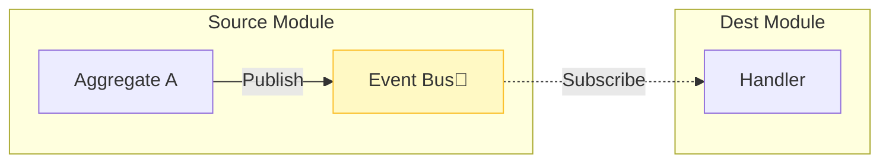
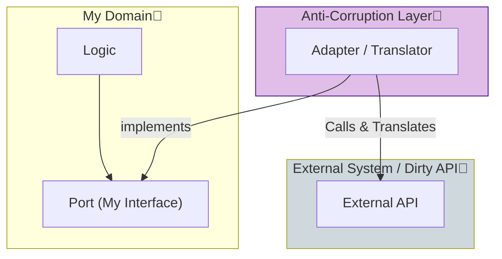

# 第30章：仕上げ（イベント・ACL・ADR・将来の分割）🎉🚀

この章は「完成させる章」です！🧩✨
ここまで作ってきた“境界があるモジュラーモノリス”に、**将来も強い仕上げ**を入れていきます💪😊

---

## 今日のゴール🎯✨

* **ドメインイベント**で、モジュール同士を“ゆるく”つなげられる📣
* **ACL（Anti-Corruption Layer）**で、外部連携や将来の分割に強くする🧼🔌 ([マイクロソフト ラーン][1])
* **ADR**で、設計の意思決定を“未来の自分/チーム”に残す📝💖 ([Architectural Decision Records][2])
* 「必要になったら一部だけサービス化」を**安全に**できる準備をする🧭🌱 ([AWS ドキュメント][3])

---

## 最新の前提（2026年1月の“今”）🧰✨

* TypeScript は **5.9.3** が stable の最新（npm/GitHub）🟦 ([NPM][4])
* Node.js は **v24 が Active LTS**、v25 は Current（短命）🟩 ([Node.js][5])
* TypeScript は **6.0が“橋渡し”で、7.0はネイティブ（Go移植）**で大きく速くなる方向🛫⚡ ([Microsoft for Developers][6])

> なのでこの章は「いま安定して動かしつつ、将来の変化も吸収できる」作りに寄せます😊🌈

---

# 1) ドメインイベントで疎結合📣🧩




## 1-1. ドメインイベントってなに？🤔✨

**「ドメインで意味のある出来事が起きた」**を表すものです🎊
例：`UserRegistered` / `EventCreated` / `PaymentSucceeded` など。

* DDDでは、集約（Aggregate）が更新されたときにイベントを出して、他の処理に伝播させます📣 ([microservices.io][7])
* 「更新のついでに色んな処理を直書き」すると依存が増えるので、イベントで分離するとスッキリします✨😌 ([マイクロソフト ラーン][8])

## 1-2. ざっくり使い分け（超大事）📌✨

* ✅ **ドメインイベント**：ドメイン内の出来事（内部向け、粒度は業務）
* ✅ **インテグレーションイベント**：他システム/他サービスに届ける（外部向け、契約が重要）
* ✅ モジュラーモノリスではまず **“内部イベント（in-process）”** でOK → 将来必要なら外部へ🏃‍♀️💨

---

## 1-3. ハンズオン：ミニイベント基盤を作る🛠️💖

### フォルダ案📁✨

* `modules/<A>/domain/...`：集約や値オブジェクト
* `modules/<A>/application/...`：ユースケース
* `platform/eventing/...`：イベントバス（横断だけど、意図が明確な“基盤モジュール”に寄せる）🧱✨

  * ※なんでも `shared/` に入れない！は第29章の教訓⚠️😇

### ① イベント型（最小）📦

```ts
// platform/eventing/domain-event.ts
export type DomainEvent<TType extends string = string, TPayload = unknown> = Readonly<{
  type: TType;
  occurredAt: string;        // ISO文字列（Date直より扱いやすい）
  payload: TPayload;
  correlationId?: string;    // 追跡用（任意）
}>;
```

ポイント💡

* `occurredAt` は ISO文字列だとログ/保存/比較が楽ちんです🕒✨
* `correlationId` を付けると、ログ追跡が神になります🙏📌

### ② イベントをためる集約（超よくある型）🌰✨

```ts
// platform/eventing/aggregate-root.ts
import { DomainEvent } from "./domain-event";

export abstract class AggregateRoot {
  private _events: DomainEvent[] = [];

  protected addEvent(event: DomainEvent) {
    this._events.push(event);
  }

  pullEvents(): DomainEvent[] {
    const events = this._events;
    this._events = [];
    return events;
  }
}
```

### ③ EventBus（in-process）📣✨

```ts
// platform/eventing/event-bus.ts
import { DomainEvent } from "./domain-event";

export type EventHandler<T extends DomainEvent = DomainEvent> = (event: T) => Promise<void> | void;

export interface EventBus {
  publish(event: DomainEvent): Promise<void>;
  publishAll(events: DomainEvent[]): Promise<void>;
  subscribe(type: string, handler: EventHandler): void;
}
```

```ts
// platform/eventing/in-memory-event-bus.ts
import { DomainEvent } from "./domain-event";
import { EventBus, EventHandler } from "./event-bus";

export class InMemoryEventBus implements EventBus {
  private handlers = new Map<string, EventHandler[]>();

  subscribe(type: string, handler: EventHandler) {
    const list = this.handlers.get(type) ?? [];
    list.push(handler);
    this.handlers.set(type, list);
  }

  async publish(event: DomainEvent) {
    const list = this.handlers.get(event.type) ?? [];
    // “順番に実行”が最初は安全（並列は慣れてから）😊
    for (const h of list) await h(event);
  }

  async publishAll(events: DomainEvent[]) {
    for (const e of events) await this.publish(e);
  }
}
```

---

## 1-4. 例：Event作成 → 通知モジュールが反応する📣💌

### Eventモジュール（出来事を出す側）🎫✨

```ts
// modules/events/domain/event.ts
import { AggregateRoot } from "../../../platform/eventing/aggregate-root";

type EventCreatedPayload = { eventId: string; title: string };

export class EventAggregate extends AggregateRoot {
  private constructor(
    private readonly id: string,
    private title: string,
  ) { super(); }

  static create(id: string, title: string) {
    const agg = new EventAggregate(id, title);

    agg.addEvent({
      type: "EventCreated",
      occurredAt: new Date().toISOString(),
      payload: { eventId: id, title } satisfies EventCreatedPayload,
    });

    return agg;
  }

  getId() { return this.id; }
  getTitle() { return this.title; }
}
```

### ユースケース（イベントを publish）🎬✨

```ts
// modules/events/application/create-event.usecase.ts
import { EventBus } from "../../../platform/eventing/event-bus";
import { EventAggregate } from "../domain/event";

export class CreateEventUseCase {
  constructor(private readonly eventBus: EventBus) {}

  async execute(input: { id: string; title: string }) {
    const agg = EventAggregate.create(input.id, input.title);

    // ここでDB保存するなら、保存が終わったあとに publish したい✨
    // await eventRepository.save(agg);

    await this.eventBus.publishAll(agg.pullEvents());

    return { id: agg.getId() };
  }
}
```

### Notificationsモジュール（反応する側）🔔✨

```ts
// modules/notifications/application/on-event-created.ts
import { DomainEvent } from "../../../platform/eventing/domain-event";

type EventCreated = DomainEvent<"EventCreated", { eventId: string; title: string }>;

export const onEventCreated = async (e: EventCreated) => {
  // メール送信やPush通知など（ここではログ）
  console.log("🔔 New event:", e.payload.eventId, e.payload.title);
};
```

### 起動時にsubscribe（アプリの組み立て）🧩✨

```ts
// app/bootstrap.ts
import { InMemoryEventBus } from "../platform/eventing/in-memory-event-bus";
import { onEventCreated } from "../modules/notifications/application/on-event-created";
import { CreateEventUseCase } from "../modules/events/application/create-event.usecase";

const bus = new InMemoryEventBus();
bus.subscribe("EventCreated", onEventCreated);

const createEvent = new CreateEventUseCase(bus);

await createEvent.execute({ id: "ev_001", title: "学内LT会🎤" });
```

---

## 1-5. “信頼性”が必要になったら：Outboxへ📮✨

将来、イベントを「別プロセス（メッセージブローカー等）に確実に届ける」必要が出たら、**Transactional Outbox** が定番です📮🔥
「DB更新」と「イベント記録」を同じトランザクションで行い、後から安全に配信します。 ([microservices.io][9])

---

# 2) ACLで外部連携を“汚さない”🧼🔌




## 2-1. ACLってなに？🤔

外部システムや別コンテキストとの間に置く **翻訳レイヤー** です🧼✨

* 自分のドメインモデルを守りつつ、外の都合に合わせて変換する
* 外部が変更されても、被害をACLで止められる🛡️ ([マイクロソフト ラーン][1])

## 2-2. どこに置く？📍

おすすめは「モジュールの外側（infrastructure / integrations側）」に置くこと💡

* `modules/calendar/integrations/google-calendar-acl.ts` みたいに
* ドメイン層に外部SDK型が侵入しないようにする🚫😇

## 2-3. 例：外部Calendar APIをACLで包む📅✨

```ts
// modules/calendar/integrations/calendar-acl.ts
export type InternalCalendarEvent = {
  id: string;
  title: string;
  startsAt: string; // ISO
};

type ExternalCalendarEvent = {
  event_id: string;
  summary: string;
  start_time: number; // epoch ms
};

export class CalendarAcl {
  // 外部→内部に変換
  toInternal(e: ExternalCalendarEvent): InternalCalendarEvent {
    return {
      id: e.event_id,
      title: e.summary,
      startsAt: new Date(e.start_time).toISOString(),
    };
  }

  // 内部→外部に変換
  toExternal(e: InternalCalendarEvent): ExternalCalendarEvent {
    return {
      event_id: e.id,
      summary: e.title,
      start_time: Date.parse(e.startsAt),
    };
  }
}
```

これで、外部仕様が変わっても直す場所が **ACLだけ** になります😊💖

---

# 3) ADRで“意思決定”を残す📝✨

## 3-1. ADRってなに？🤔

ADR（Architectural Decision Record）は、**重要な決定とその理由/結果**を1枚ずつ残す小さな文書です📝
「あとで読める」「更新しやすい」が強み！ ([Architectural Decision Records][2])

## 3-2. 形式（超定番）📄✨

Michael Nygard系テンプレはこの形が有名です👇 ([GitHub][10])

* Title
* Status（提案/採用/廃止など）
* Context（背景）
* Decision（決定）
* Consequences（影響）

## 3-3. ADRの例（この章にピッタリ）🧡

`docs/adr/0001-in-process-domain-events.md` とかでOK！

```md
# 0001 In-process Domain Events を採用する

## Status
Accepted

## Context
モジュール間の疎結合を進めたいが、最初から外部ブローカー導入は重い。

## Decision
モジュラーモノリス内は InMemoryEventBus による in-process ドメインイベントを採用する。

## Consequences
+ ユースケースが単純に保てる
+ 将来は Outbox で外部配信へ拡張できる
- プロセス落ちた時の配信保証はない（必要になったらOutboxへ）
```

書けたら勝ちです🏆✨（長文禁止！短く！）

---

# 4) 将来の“部分サービス化”に備える🧭🚀

## 4-1. いつサービス化を考える？👀

よくある合図👇

* チームが別れて、独立デプロイが必要👥
* その機能だけスケールしたい📈
* 外部公開APIとして境界が固まった🌍
* 依存が整理されて「切り出しても痛くない」状態になった🧩✨

## 4-2. 一番安全な移行の考え方：Strangler Fig🌳✨

いきなり全部書き直さず、**新旧が共存しながら少しずつ置き換える**方法が定番です🌱
“変換 → 共存 → 置換（古いのを消す）”の流れで進めます。 ([AWS ドキュメント][3])

## 4-3. モジュラーモノリスだと、こう進めやすい💖

モジュール境界がすでにあるので…

1. **切り出す候補モジュール**を1つ選ぶ（依存が少ない/価値が高い）
2. そのモジュールの公開APIを **HTTP/gRPC等の“外部契約”**に置き換える
3. 旧モノリス側は **ACL/Adapter** を介して呼ぶ（中身の直参照禁止）🧼
4. トラフィックを少しずつ新サービスへ（Stranglerの“共存”）
5. 動いたら、モノリス側の実装を削除（“置換”完了）✨

「段階的に移行」が推奨される流れとしてよく紹介されています。 ([microservices.io][11])

---

# 5) 最終課題（自己採点チェックリスト）✅✅✅

## 提出物（3点セット）🎁✨

### ① ドメインイベントで疎結合にした機能（1つ）

* [ ] イベント名が業務っぽい（`XxxCreated` など）📣
* [ ] 送信側は「誰が受け取るか」を知らない🙈
* [ ] 受信側はモジュール境界を破ってない🛡️

### ② ACLで外部or将来境界を守った箇所（1つ）

* [ ] 外部の型/命名がドメイン層に漏れてない🚫
* [ ] 変換ロジックがACLに集約されてる🧼✨

### ③ ADR（最低1本）

* [ ] 背景（Context）が書けてる
* [ ] 決定（Decision）が1文で言える
* [ ] 影響（Consequences）に“良い/悪い”が両方ある

## おまけ（将来分割プラン）🧭

* [ ] 「切り出し候補モジュール」1つ
* [ ] Stranglerでの移行ステップ（3〜5行）🌳✨ ([AWS ドキュメント][3])

---

# 6) AIに頼るとこ頼ろう🤖💖（プロンプト例）

## 設計レビュー用👀

* 「このイベント名、業務的に自然？粒度大きすぎない？」
* 「このACLの変換はどこに置くのが一番自然？」 ([マイクロソフト ラーン][1])

## ADR生成用📝

* 「この決定をADRにしたい。Context/Decision/Consequencesを短く書いて」 ([Architectural Decision Records][2])

## 将来分割プラン用🧭

* 「このモジュールを最初に切り出すなら、Stranglerのステップを提案して」 ([AWS ドキュメント][3])

---

# 7) よくある事故💥（先に潰す）

* ❌ イベントが“技術イベント”になってしまう（例：`RowInserted`）→ 業務の言葉に戻す📣
* ❌ 受信側が送信側の内部に触りにいく → 公開API/イベントだけで完結させる🛡️
* ❌ ACLをサボって外部の型がドメインに侵入 → 後で地獄😇🕳️ ([マイクロソフト ラーン][1])
* ❌ ADRが長文化して読まれない → “1枚・短く・1決定”📝✨ ([Architectural Decision Records][2])

---

ここまでできたら、もう「ただのTSアプリ」じゃなくて、**育つ設計**になってます🥹💖🎉
次は、あなたの題材アプリのモジュール名を1つだけ決めて、**この章の最終課題をその題材に当てはめた“提出例”**も作れるよ〜！📚✨

[1]: https://learn.microsoft.com/en-us/azure/architecture/patterns/anti-corruption-layer?utm_source=chatgpt.com "Anti-corruption Layer pattern - Azure Architecture Center"
[2]: https://adr.github.io/?utm_source=chatgpt.com "Architectural Decision Records"
[3]: https://docs.aws.amazon.com/prescriptive-guidance/latest/modernization-decomposing-monoliths/strangler-fig.html?utm_source=chatgpt.com "Strangler fig pattern - AWS Prescriptive Guidance"
[4]: https://www.npmjs.com/package/typescript?utm_source=chatgpt.com "typescript"
[5]: https://nodejs.org/en/about/previous-releases?utm_source=chatgpt.com "Node.js Releases"
[6]: https://devblogs.microsoft.com/typescript/progress-on-typescript-7-december-2025/?utm_source=chatgpt.com "Progress on TypeScript 7 - December 2025"
[7]: https://microservices.io/patterns/data/domain-event.html?utm_source=chatgpt.com "Pattern: Domain event"
[8]: https://learn.microsoft.com/en-us/dotnet/architecture/microservices/microservice-ddd-cqrs-patterns/domain-events-design-implementation?utm_source=chatgpt.com "Domain events: Design and implementation - .NET"
[9]: https://microservices.io/patterns/data/transactional-outbox.html?utm_source=chatgpt.com "Pattern: Transactional outbox"
[10]: https://github.com/joelparkerhenderson/architecture-decision-record/blob/main/locales/en/templates/decision-record-template-by-michael-nygard/index.md?utm_source=chatgpt.com "Decision record template by Michael Nygard"
[11]: https://microservices.io/refactoring/?utm_source=chatgpt.com "Refactoring a monolith to microservices"
