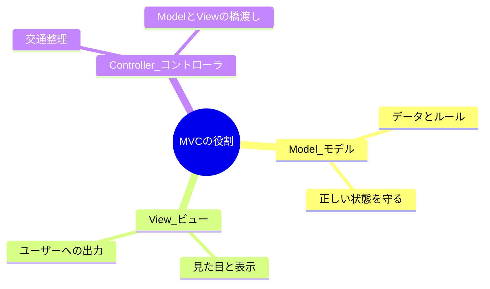
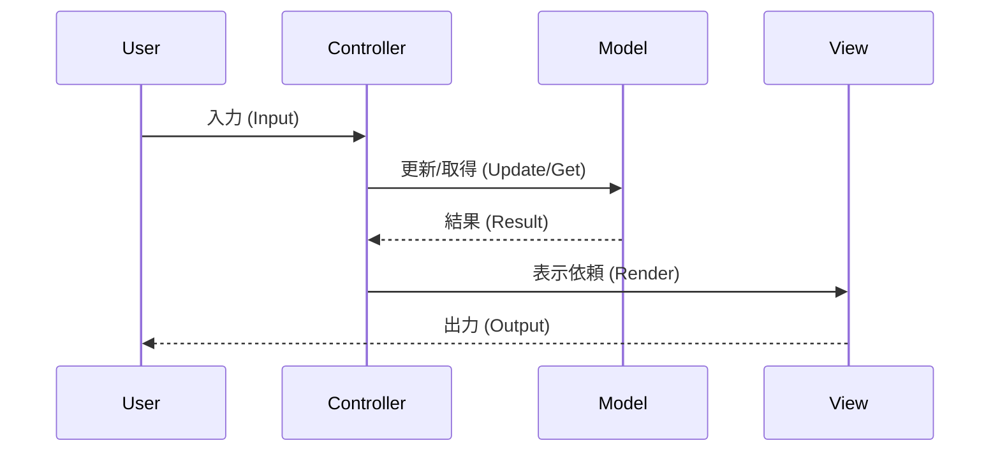

# 第01章：MVCってなに？まず「分ける理由」を体で理解しよう🧠✨

## この章でできるようになること🎯

* MVC（Model / View / Controller）を**自分の言葉**で説明できる🗣️✨
* 「混ぜるとツラい😇」「分けるとラク💪」を**実感**できる
* CampusTodo（課題メモ）を作る前に、**役割分担の地図🗺️**が頭に入る

---

## 1) MVCは“役割分担”の設計パターンだよ🍱✨


MVCは、アプリを大きく3つの役に分ける考え方だよ〜👇

* **Model（モデル）**：データとルール（何が正しいか）📦🛡️
* **View（ビュー）**：見た目（表示）👀🎨
* **Controller（コントローラ）**：操作の受付と交通整理🚦🎮

これはWebでも超有名で、ASP.NET Coreでも「MVCは3つに分けて関心事を分離する」って整理されてるよ📚✨ ([Microsoft Learn][1])
MVCという考え方そのものも「UI・データ・制御ロジックを分ける」って説明されてるよ🧠 ([MDN Web Docs][2])



---

## 2) なんで分けるの？混ぜるほど地獄だから😇🔥（でも最初はみんな混ぜる）


プログラムって、最初はこうなりがち👇

* 画面表示（Console.WriteLineとか）
* 入力処理（ReadLineとか）
* データの持ち方（Listとか）
* ルール（タイトル空欄NGとか）
* 保存（ファイル/DBとか）

全部が1箇所に混ざると…

### あるある地獄あるある😇

* 表示をちょっと変えたいだけなのに、ロジックが壊れる💥
* “直したはず”が別の機能を壊す（副作用どーん）🧨
* テストができない（手でポチポチ確認だけ）🫠
* 追加機能するたびに怖くなる😱

### 分けると何が嬉しい？🌈

* 表示を変えても、ルールはそのまま🧠➡️🎨（安心！）
* ルールを変えても、表示はそのまま🛡️（安心！！）
* “どこを直すか”がすぐ分かる🔍✨
* チームでも分担しやすい👯‍♀️

---

## 3) CampusTodoに当てはめると、3役はこうなるよ📚✅


この教材の通し課題「CampusTodo（課題メモ）」で考えてみよ〜💡

### Model（モデル）📦🛡️

* Todoのデータ（タイトル、期限、完了など）
* Todoのルール（例：タイトル空欄はダメ、など）
* 「正しい状態」を守る役✨

### View（ビュー）👀🎨

* 一覧を見やすく表示（番号、期限、状態など）
* エラーをやさしく表示（怒らない💖）
* **表示に徹する**（ここ重要！）

> ASP.NET Coreの説明でも「Viewは表示とユーザーとのやり取り担当」って整理されてるよ👀 ([Microsoft Learn][3])

### Controller（コントローラ）🚦🎮

* ユーザー入力を受け取る（例：`add` / `list` / `done 2`）
* どの処理を呼ぶか決める（振り分け）
* Modelを更新して、Viewに表示をお願いする🙏✨

---

## 4) MVCの“流れ”を1枚でイメージしよう🌀✨


Console版でも流れはほぼ同じだよ👇

* ユーザー入力⌨️
  ↓
* **Controller**が受け取る🚦
  ↓
* 必要なら**Model**を更新/取得📦
  ↓
* **View**に「これ表示して〜」って渡す👀
  ↓
* ユーザーが結果を見る🎉

ざっくり図にするとこんな感じ👇



```text
[User] -> (入力) -> [Controller] -> (更新/取得) -> [Model]
                         |
                         └-> (表示依頼) -> [View] -> (出力) -> [User]
```

---

## 5) “混ぜるコード” vs “分けるコード”をチラ見して感覚を掴む👀✨


まだ本格実装はしないけど、「空気感」を先に掴むと超ラク〜☺️

### ❌ 混ぜるとこうなりがち😇（全部入り弁当🍱）

```csharp
// イメージ（まだ作らなくてOK！）
while (true)
{
    Console.WriteLine("add/list/done ?");
    var input = Console.ReadLine();

    // 入力解析（Controllerっぽい）
    // データ更新（Modelっぽい）
    // ルールチェック（Modelっぽい）
    // 表示整形（Viewっぽい）
    // 全部ここに混ざる😇
}
```

### ✅ 分けるとこうなる✨（お弁当を仕切る🍱➡️🍱🍱🍱）

```csharp
// イメージ（まだ作らなくてOK！）
controller.Handle(input);
// controllerが判断して、model更新して、viewに表示をお願いする
```

ポイントはこれ👇
**“分ける”＝ファイルを増やすことじゃなくて、責任（責務）を分けること**だよ🧠✨

---

## 6) ミニ演習：Todoアプリの処理を3つに仕分けしよう📝✨（紙でOK！）


やることは超シンプル！でも効果バツグン💪💕

### 手順🍀

1. 紙に「Todoアプリで起きること」を思いつく限り書く📝
   例：追加する、一覧を見る、完了にする、編集する、削除する、検索する…
2. それを**3つの箱**に分ける📦📦📦

   * View（表示）
   * Controller（操作）
   * Model（データとルール）
3. 迷ったらこう考える💡

   * **見せ方？** → View
   * **入力を受けて指示？** → Controller
   * **正しさ・ルール・データ？** → Model

### 例（ちょい見本）👀

* 「一覧を見やすく整形して表示」→ View🎨
* 「`done 2` を解釈して2番を完了にする」→ Controller🚦
* 「タイトル空欄はNG」→ Model🛡️

---

## 7) AI活用🤖💡（第1章用：たとえ話で理解を固定する）


AIは“理解の補助輪🚲”にすると最強だよ✨
おすすめプロンプト👇（コピペOK！）

### たとえ話を作ってもらう☕️🍰

* 「MVCをカフェに例えて、女子大生向けに説明して。3パターン出して」
* 「MVCを学園祭に例えて。Model/View/Controllerの役割を明確にして」

### 自分の理解チェック🧐

* 「私の説明が正しいかチェックして：『Modelは〜、Viewは〜、Controllerは〜』」
* 「CampusTodoでModel/View/Controllerに分けるなら、具体例を10個ずつ出して」

> ここでのコツ：**出してもらった案を“そのまま採用”じゃなく、良いとこ取り✂️✨**（後の章で効いてくるよ〜！）

---

## 8) 理解チェッククイズ🎓✨（サクッと！）

Q1️⃣：Controllerの一番大事な役割は？
A) 画面をきれいに表示する
B) データの正しさを保証する
C) 入力を受けて処理を振り分ける

Q2️⃣：「タイトル空欄NG」はどこに置くのが自然？
A) View
B) Controller
C) Model

Q3️⃣：Viewがやっちゃダメなことは？
A) データを見やすく整形する
B) ルール判定でデータを更新する
C) 画面を描画する

<details>
<summary>✅答え（開く）</summary>

* Q1：C 🚦
* Q2：C 🛡️
* Q3：B 🙅‍♀️（Viewは表示に徹する！）

</details>

---

## 9) 次章へのつながり🚀✨

第1章で「分ける理由」が腹落ちしたら、次は**動く環境を作って、最小のプロジェクトを立ち上げる**よ🛠️🎉
ちなみに今のC#は **C# 14（.NET 10）**が最新として案内されてるよ✨ ([Microsoft Learn][4])
.NET 10はLTS（長期サポート）として整理されてるのも安心ポイント🧸💖 ([Microsoft][5])

---

もしよければ、あなたが演習で仕分けした紙メモ（箇条書きでOK）を貼ってくれたら、**「それめっちゃ良い分け方！」「ここだけ混ざりやすいから注意⚠️」**みたいに、超やさしくレビューするよ〜🧁💕

[1]: https://learn.microsoft.com/en-us/aspnet/core/mvc/overview?view=aspnetcore-10.0&utm_source=chatgpt.com "Overview of ASP.NET Core MVC"
[2]: https://developer.mozilla.org/en-US/docs/Glossary/MVC?utm_source=chatgpt.com "MVC - Glossary - MDN Web Docs"
[3]: https://learn.microsoft.com/en-us/aspnet/core/mvc/views/overview?view=aspnetcore-10.0&utm_source=chatgpt.com "Views in ASP.NET Core MVC"
[4]: https://learn.microsoft.com/en-us/dotnet/csharp/whats-new/csharp-14?utm_source=chatgpt.com "What's new in C# 14"
[5]: https://dotnet.microsoft.com/en-us/platform/support/policy/dotnet-core?utm_source=chatgpt.com "NET and .NET Core official support policy"
