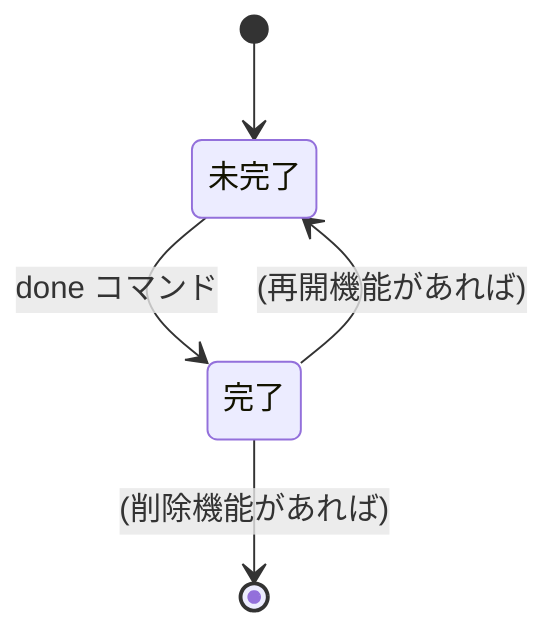
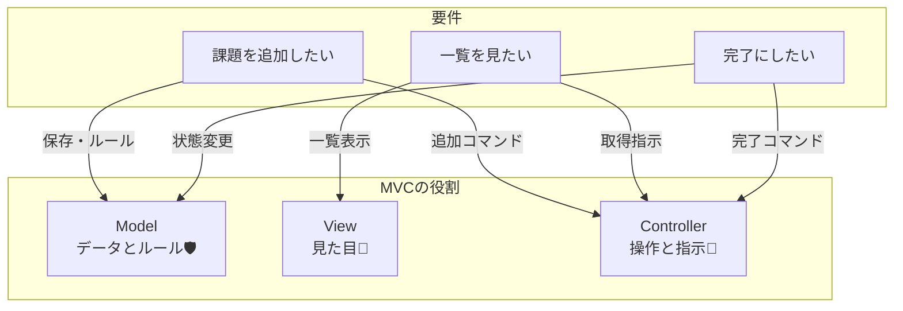

# 第03章：題材要件を作る（MVCは“設計”なのでここ超大事）🧩📌

> この章は「MVCの前に、そもそも何を作るの？」を決める回だよ〜！
> ここがふわっとしてると、あとで Controller も Model も View も全部ブレて地獄になる😇🔥
> 逆にここが決まると、MVCの分担がスルスル決まって超ラクになるよ🧠✨

---

## 0. いまの“最新”メモ（2026/01/14 時点）🆕🗓️

* **Visual Studio 2026** が公開されていて、2026/01/13 に **January Update 18.2.0** が出てるよ🪄✨ ([Microsoft Learn][1])
* **.NET 10.0** はダウンロードページが用意されていて、10.0.x が提供されてるよ（例：Desktop Runtime 10.0.2 など）💎 ([Microsoft][2])
* .NET のサポートポリシーも公式に整理されてるよ📜 ([Microsoft][3])

（この章は要件づくり中心だけど、「最新版前提」の根拠として置いとくね🧁）

---

## 1. この章のゴール🎯✨

この章を終えたら、あなたはこうなる💪🌸

* 「CampusTodo（課題メモ）」で **何を作るか／何を作らないか** を言える🗣️✅
* “最小の完成（MVP）”を決めて、次章以降の実装が迷子にならない🧭✨
* 要件を **MVCに分けやすい形** にしておける（ここ重要！）🧠🔪

---

## 2. まずは“作るもの”を一言で決めよう📣🧁

要件を始める前に、キャッチコピーを1行で固定しよ！

**CampusTodo：**
「授業や課題を、サクッと追加して、一覧で見て、終わったら完了にできるアプリ」📚✅✨

これがあると、仕様で迷った時に戻れる“北極星”になるよ🌟🧭

---

## 3. ユーザー（主人公）を決めよう👩‍🎓🎒

要件って、結局「誰が」「何をしたいか」だからね！

**ペルソナ（例）**

* 学部3年の学生さん👩‍🎓
* 締め切りが近い課題を忘れがち🥺
* できれば“短い操作”で済ませたい⌨️⚡

これだけでも十分！盛りすぎなくてOK🙆‍♀️✨

---

## 4. ユーザーストーリーを3つだけ作る🧾✨

MVP（最小の完成）として、まずはこの3つに絞ろう✂️✨
（この3つが、後の MVC 分担の“芯”になるよ！）

### 4.1 ストーリー①：課題を追加したい➕📝

* **As a** 学生
* **I want** 課題を追加したい
* **So that** 忘れずに管理できる

### 4.2 ストーリー②：課題を一覧で見たい📋👀

* **As a** 学生
* **I want** 課題一覧を見たい
* **So that** 何が残ってるか把握できる

### 4.3 ストーリー③：課題を完了にしたい✅🎉

* **As a** 学生
* **I want** 終わった課題を完了にしたい
* **So that** 残タスクが減って気持ちいい

---

## 5. “画面（表示）”と“操作（入力）”を洗い出す🧼✨

ここで MVC の分け方が見えてくるよ〜！👀✨

### 表示（Viewが担当しそう）🎨

* 一覧表示：番号つきでズラッと📋
* 完了したものが分かる（例：`[x]`）✅
* エラー表示：優しく案内する🥺💬

### 操作（Controllerが担当しそう）🎮➡️

* `add`：追加する
* `list`：一覧を見る
* `done <番号>`：完了にする

### データ（Modelが担当しそう）📦

* 課題タイトル（必須）
* 完了フラグ（true/false）
* 追加日時（あると便利）⏰✨（最初は“あってもなくても”OK）

---

## 6. 受け入れ条件（Acceptance Criteria）を付ける✅📏

ここがあると、**実装が終わったか判定できる**よ！🎯
形式は “Given/When/Then” が分かりやすい✨

### 6.1 add の受け入れ条件➕

* **Given** アプリが起動している
* **When** `add レポート提出` を入力する
* **Then** 一覧に「レポート提出」が追加される

**エラー系も1個だけ入れよう**（超大事！）🚨

* **When** `add` だけでタイトルが空
* **Then** 「タイトルを入れてね🥺」と表示して追加しない

### 6.2 list の受け入れ条件📋

* **When** `list` を入力
* **Then** 登録された課題が番号つきで表示される

### 6.3 done の受け入れ条件✅

* **Given** 2番の課題が存在する
* **When** `done 2`
* **Then** 2番が完了扱いになって、一覧で完了が分かる

---

## 7. 今回は“やらないこと”も決める🙅‍♀️✨

これを決めると、設計がスッキリするよ〜！🧹🌸

**第3章時点（MVP）ではやらない例**

* 編集（edit）✏️ → 後の章でやる
* 削除（delete）🗑️ → 後の章でやる
* 検索（search）🔍 → 後の章でやる
* 保存（ファイル/DB）💾 → もっと後の章でやる

「今やらない」＝「永遠にやらない」じゃないよ🙆‍♀️
ただの **順番** だよ🌱✨

---

## 8. 要件を“優先度つきバックログ”にする📌🗂️

ここまで来たら、タスクの並びを確定しよ！

### Must（絶対いる）🔥

1. 課題を追加できる（add）➕
2. 課題を一覧表示できる（list）📋
3. 課題を完了にできる（done）✅

### Should（できれば欲しい）🌸

4. 入力ミスのエラーが優しい🥺💬
5. 完了が見た目で分かる（`[x]` とか）✅👀

### Could（余裕があれば）🍀

6. 期限や重要度🏷️
7. 並び替え📌

---

## 9. MVCに落とし込む“境界線”を引く🧠🪄

ここがこの章の本番！✨
要件を「責務」に変換すると、MVCの設計が爆速になるよ⚡

### Model が守るもの（ルールの芽）🌱📦

* 「タイトルは空にしない」みたいな **不変条件の候補**🛡️
  （本格的にやるのは第9章だけど、ここで“候補”は書いとくと強い✨）

### Controller がやること（交通整理）🚦

* コマンドを読み取って
* どの処理を呼ぶか決めて
* 結果を View に渡す

### View がやること（見せ方）🎨

* 一覧を読みやすく表示
* エラーを優しく表示
* “操作の説明”を出す（例：`add/list/done`）

---

## 10. ミニ演習📝✨（15〜30分）

### 演習A：ユーザーストーリーを自分の言葉に直す🗣️

上の3つを、あなたの言葉で1行ずつ書いてみて✍️✨
（言い換えるだけで理解が深くなるよ〜！）

### 演習B：受け入れ条件を1つ追加する✅

例えば `done` のエラー系を追加しよう！

* **When** `done 99`（存在しない番号）
* **Then** 「その番号はないよ🥺」と表示して落ちない

---

## 11. AI活用（この章はめっちゃ相性いい）🤖💡✨

### 11.1 抜け漏れチェック用プロンプト🔎

「CampusTodoのMVP要件（add/list/done）を作っています。抜け漏れになりがちな観点を、優先度つきで10個ください。各観点に“具体例”も1つ付けてください。」

### 11.2 受け入れ条件の量産プロンプト✅

「下記ユーザーストーリーに対して、Given/When/Then形式の受け入れ条件を“正常系3つ＋異常系3つ”出してください。異常系はユーザーに優しいメッセージ案もください。」

### 11.3 MVC分担レビュー用プロンプト🧠

「以下の要件を、Model/Controller/Viewにどう分担すべきかレビューしてください。責務が混ざりそうなポイントも指摘してください。」

⚠️ポイント：AIの案は“採用”じゃなくて“候補”ね！
最後はあなたが「それ今いる？（YAGNI）」で切る✂️✨

---

## 12. まとめ🍰✨

* MVCは“分け方”だけど、**分ける前に要件が必要**だよ🧠📌
* MVP（add/list/done）まで落とすと、次章以降の設計がラクになる🌱✨
* 受け入れ条件があると「終わった？」が判断できて最高✅🎯
* AIは「抜け漏れ検出」「受け入れ条件づくり」に超強い🤖💪

---

## 次章へのつながり🔜✨

次は **Model（データを“型”で表す）** に入っていくよ📦🧠
この章で決めた「TodoItemに何が必要？」が、そのままC#のクラス設計に直結するからね〜！🚀✨

[1]: https://learn.microsoft.com/en-us/visualstudio/releases/2026/release-notes?utm_source=chatgpt.com "Visual Studio 2026 Release Notes"
[2]: https://dotnet.microsoft.com/en-US/download/dotnet/10.0?utm_source=chatgpt.com "Download .NET 10.0 (Linux, macOS, and Windows) | .NET"
[3]: https://dotnet.microsoft.com/en-us/platform/support/policy/dotnet-core?utm_source=chatgpt.com "NET and .NET Core official support policy"
