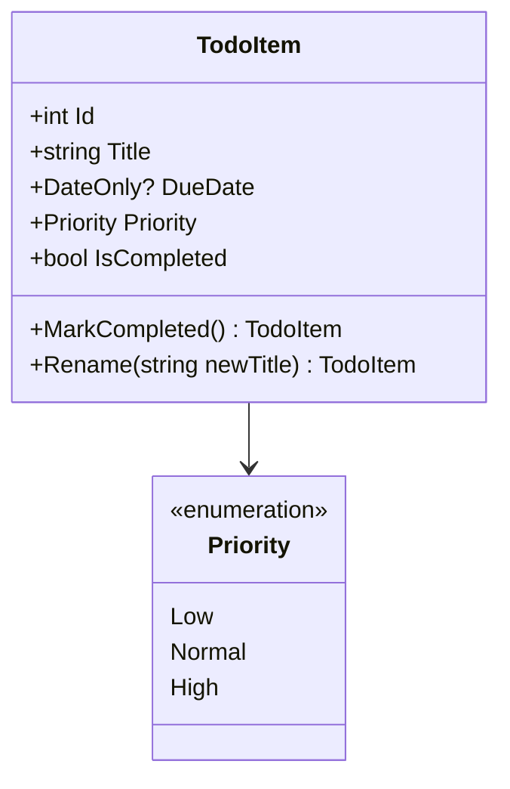

# 第04章：Model入門①：データを“型”で表す（ルールの土台）📦🧠

この章は **「Todoのデータを、C#の“型”でキレイに表現できるようになる」** 回だよ〜！🌷
（C# 14 が最新で、.NET 10 上で動く前提だよ） ([Microsoft Learn][1])

---

## 4-1. Modelってなに？（ここがアプリの“心臓”だよ❤️）


Modelはざっくり言うと👇

* **アプリが扱うデータ**（Todoの中身📦）
* **そのデータのルール**（変な状態にしない🛡️）

たとえばTodoなら…

* タイトルは必須（空はダメ🙅‍♀️）
* 期限は「日付」って決める（文字列でごまかさない📅）
* 重要度は「High / Normal / Low」みたいに決める（自由入力にしない🎚️）

こういうのを **Modelが土台として支える** から、ViewやControllerがスッキリするよ✨

---

## 4-2. “型”で守ると、何がうれしいの？🥹✨


### ✅ 文字列だけで全部やると、地獄が始まる😇

たとえば期限を `string` で持つと…

* `"2026/02/30"` みたいな存在しない日付が入る💥
* `"tomorrow"` とか入ってくる（誰だよ😇）
* 表示・比較・ソートがぐちゃぐちゃ🌀

### ✅ 型を決めると、ミスが“そもそも起きにくい”💪

* 日付 → `DateOnly`（日付だけ欲しい時にちょうどいい📅）
* 完了 → `bool`
* 重要度 → `enum`
* 必須 → `required`（入れ忘れをコンパイル時に止める🧱）

---

## 4-3. CampusTodo の TodoItem を設計しよう✍️📦


ここで大事なのが **「最小から作る」** だよ✂️✨（YAGNI感覚！）

### 🎯 今回（第4章）で採用する最小セット

* `Id`（識別用）🔢
* `Title`（必須）📝
* `DueDate`（任意）📅
* `Priority`（任意・デフォルトあり）🎚️
* `IsCompleted`（完了フラグ）✅

> 「メモ欄」「タグ」「担当者」「繰り返し」…とかは、欲しくなってからでOK🙆‍♀️✨

---

## 4-4. 実装してみよう（Model作成）🛠️✨

### ステップ1：Models フォルダを作る📁

プロジェクト内に `Models` フォルダを作ってね〜！

* `Models/Priority.cs`
* `Models/TodoItem.cs`

---

### ステップ2：Priority（重要度）を enum で作る🎚️✨


```csharp
namespace CampusTodo.Models;

public enum Priority
{
    Low = 0,
    Normal = 1,
    High = 2
}
```

---

### ステップ3：TodoItem を “record” で作る📦✨（おすすめ）


recordは **「データの箱」** として超便利！
さらに `with` で“変更したコピー”が作れるから、うっかり破壊的変更しにくいよ〜🧼✨

```csharp
namespace CampusTodo.Models;

public sealed record TodoItem
{
    public int Id { get; init; }

    // required：作るときに必ず入れさせる（入れ忘れ防止）🧱
    public required string Title { get; init; }

    // 期限は「あるかも、ないかも」なので nullable にするよ📅
    public DateOnly? DueDate { get; init; }

    public Priority Priority { get; init; } = Priority.Normal;

    public bool IsCompleted { get; init; }

    // “完了にする”は Model の操作として自然だよ✅
    public TodoItem MarkCompleted() => this with { IsCompleted = true };

    // タイトル更新：まずは超入門の「空は禁止」だけ守る🛡️
    public TodoItem Rename(string newTitle)
    {
        if (string.IsNullOrWhiteSpace(newTitle))
            throw new ArgumentException("タイトルが空っぽはダメだよ〜😵", nameof(newTitle));

        return this with { Title = newTitle.Trim() };
    }
}
```

※ `required` は「初期化時に必須」の仕組みだよ（仕様） ([Microsoft Learn][2])



---

## 4-5. ミニ演習：仮データを3件作ってみよう🧪🎉


`Program.cs` で仮データを作って、まずはModelが動く感覚をつかもう〜！

```csharp
using CampusTodo.Models;

var today = DateOnly.FromDateTime(DateTime.Today);

var todos = new List<TodoItem>
{
    new() { Id = 1, Title = "レポートのテーマ決め", DueDate = today.AddDays(3), Priority = Priority.High },
    new() { Id = 2, Title = "図書館で参考文献さがす", DueDate = today.AddDays(7), Priority = Priority.Normal },
    new() { Id = 3, Title = "サークルの連絡返す", DueDate = null, Priority = Priority.Low }
};

// 2番を完了にしてみる✅（“置き換え”のイメージ）
todos[1] = todos[1].MarkCompleted();

// タイトル変更もやってみる📝
todos[0] = todos[0].Rename("レポートのテーマ決め（3案作る）");

// いったん表示（Viewは後で丁寧にやるので、今は仮でOK🙆‍♀️）
foreach (var t in todos)
{
    Console.WriteLine($"{t.Id}. [{(t.IsCompleted ? "x" : " ")}] {t.Title} (Priority: {t.Priority}, Due: {t.DueDate?.ToString() ?? "なし"})");
}
```

### ✅ できたらチェック🎀

* `Title` を入れ忘れるとコンパイルで怒られる（`required`）🧱
* `DueDate` が `null` でも落ちない（`DateOnly?`）🌙
* `MarkCompleted()` で完了状態になって表示が変わる✅

---

## 4-6. “無効な状態を作らない” 超入門🛡️✨


この章では、まずこれだけ守れれば100点💯💕

* タイトルは空にしない
* 期限は「日付型」で持つ（文字列で持たない）
* 重要度は enum（自由入力にしない）

「期限は過去NG」みたいな本格ルールは **第9章（不変条件）** で強化するよ🔥✨
今は“型で土台を固める”のが目的だよ〜🧁

---

## 4-7. AI相棒の使い方（Model編）🤖💡✨

### ✅ 1) “項目案”はAIに出させてOK、でも採用は最小✂️

コピペ用プロンプト👇

* 「CampusTodoのTodoItemに入りそうな項目を10個出して。初心者向けで理由も添えて」
* 「その10個からMVPに必要な最小5個だけに絞って。削った理由も説明して」

### ✅ 2) “型”の提案をさせると強い💪

* 「期限は DateTime / DateOnly どっちがよさそう？このアプリは“日付だけ”でOK。理由も」

### ✅ 3) 生成物は“レビュー前提”で使う🧐

AIの出力にありがち👇

* なんでもかんでも `string` にしがち😇
* `memo`, `tag`, `userId` みたいに盛りすぎがち🍔
  → **「今やる必要ある？」** を合言葉に削ろう✂️✨

---

## 4-8. よくあるつまずきポイント集😵‍💫🧯


* `Title` を `string?` にして、nullが入り放題になる
  → 必須は `string` + `required` が安心🧱✨
* 期限を `string` にして、パース地獄になる
  → `DateOnly?` がすっきり📅✨
* `IsCompleted` を `int`（0/1）で持ちたくなる
  → `bool` が読みやすいよ✅
* Modelに `Console.WriteLine` を入れたくなる
  → 表示はViewで！Modelは静かにデータを守る係🧘‍♀️

---

## まとめ🎀✨

この章でやったのはこれだよ〜！🌷

* Modelは「データ＋ルール」の土台📦🛡️
* “型”で表すと、ミスが起きにくくなる💪✨
* `TodoItem` を作って、仮データ3件で動かした🧪🎉

次の第5章では、いよいよ **「表示（View）は表示だけ！」** を体で覚えるよ〜🎨🙅‍♀️✨

[1]: https://learn.microsoft.com/en-us/dotnet/csharp/whats-new/csharp-14 "What's new in C# 14 | Microsoft Learn"
[2]: https://learn.microsoft.com/en-us/dotnet/csharp/language-reference/proposals/csharp-11.0/required-members?utm_source=chatgpt.com "Required members - C# feature specifications"
