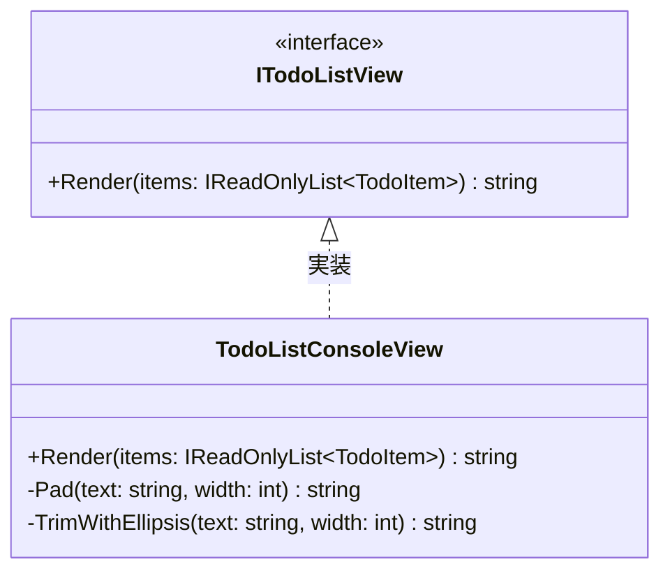

# 第05章：View入門①：表示は“表示だけ”にする（ロジック混ぜない）🎨🙅‍♀️

この章は **「見せ方」と「処理」をちゃんと分ける練習**だよ〜！✨
CampusTodo の「一覧表示」を、**読みやすく・きれいに**していくよ📋💖

（※この教材は .NET 10 / C# 14 世代の前提で書いてるよ。C# 14 は .NET 10 SDK / Visual Studio 2026 で試せるよ〜💡） ([Microsoft for Developers][1])

---

## この章のゴール🎯✨

* View の役割を「表示だけ！」って言えるようになる🗣️💡
* Todo一覧を **“読みやすく整形して表示”** できる📋✨
* Viewにロジック（更新・判定・保存…）を混ぜないクセがつく🙅‍♀️🧠

---

## まず大事：Viewって何する係？👀🎨


Viewはね、超ざっくり言うと…

* ✅ **見せ方を決める**（表、カード、色、並び、ラベルなど）
* ✅ **表示用に整える**（日付の見せ方、長い文字を切る、罫線、余白など）
* ✅ **出力する**（Console.WriteLine とか）

逆に、これはやっちゃダメ🙅‍♀️🔥

* ❌ Todoを追加・完了にする（更新処理）
* ❌ 入力チェック（タイトル空はダメ！とかのルール判定）
* ❌ 保存・読み込み（ファイル/DB）
* ❌ 「何を表示するか」を決める（フィルタや並び替えの判断）

> ルール：**Viewは“表示のための変換”まではOK**。
> でも **“業務判断”や“状態変更”が入ったらアウト** だよ〜⚠️

---

## 今回作るもの🧁✨（成果物）

Todo一覧を「表っぽく」綺麗に表示する View を作るよ📋✨
たとえばこんな感じ👇

* No / 状態 / タイトル / 期限 みたいに揃えて表示
* タイトルが長いときは “…” で省略
* 完了は ✅、未完了は ⬜ で見やすく

---

## 実装方針：Viewを“文字列生成係”にすると強い💪✨


Consoleに直接 `WriteLine` してもいいんだけど、最初は **Viewが「表示文字列を作る」→ 最後に出力** の形がめっちゃ学びやすいよ😊

* ✅ Viewは `string Render(...)` を返す
* ✅ Controller（または仮のProgram）が `Console.Write(...)` する
* ✅ テストもしやすい（あとで第16章で効いてくる🧪✨）

---

## ハンズオン🛠️✨：Todo一覧Viewを作ろう！

### 1) フォルダとファイル構成📁

ざっくりこんな感じにするよ（例）👇

* `Models/TodoItem.cs`
* `Views/ITodoListView.cs`
* `Views/TodoListConsoleView.cs`

---

### 2) Model（TodoItem）は前章のを使ってOK📦

もしサンプルが必要なら、最低限こんな形でも動くよ👇（すでにあるならスキップでOK！）

```csharp
// Models/TodoItem.cs
namespace CampusTodo.Models;

public sealed record TodoItem(
    int No,
    string Title,
    DateOnly? DueDate,
    bool IsDone
);
```

---

### 3) Viewのインターフェイスを作る（責務の境界線）🧱✨


```csharp
// Views/ITodoListView.cs
using CampusTodo.Models;

namespace CampusTodo.Views;

public interface ITodoListView
{
    string Render(IReadOnlyList<TodoItem> items);
}
```

ポイント😊💡

* `Render` は **表示用の文字列を作るだけ**
* `items` は `IReadOnlyList` にして「Viewが勝手に編集しない」気持ちを表現🫶

---

### 4) Console用のViewを実装する🎨🖥️


```csharp
// Views/TodoListConsoleView.cs
using System.Text;
using CampusTodo.Models;

namespace CampusTodo.Views;

public sealed class TodoListConsoleView : ITodoListView
{
    public string Render(IReadOnlyList<TodoItem> items)
    {
        var sb = new StringBuilder();

        sb.AppendLine("🌸 === CampusTodo 一覧 === 🌸");
        sb.AppendLine();

        // ヘッダ（表示の都合）
        sb.AppendLine($"{Pad("No", 4)} {Pad("状態", 4)} {Pad("タイトル", 22)} {Pad("期限", 12)}");
        sb.AppendLine(new string('-', 4 + 1 + 4 + 1 + 22 + 1 + 12));

        // 本体（ここでやってるのは「表示用の整形」だけ）
        foreach (var item in items)
        {
            var status = item.IsDone ? "✅" : "⬜";
            var title = TrimWithEllipsis(item.Title, 22);
            var due = item.DueDate is null ? "----/--/--" : item.DueDate.Value.ToString("yyyy/MM/dd");

            sb.AppendLine($"{Pad(item.No.ToString(), 4)} {Pad(status, 4)} {Pad(title, 22)} {Pad(due, 12)}");
        }

        sb.AppendLine();
        sb.AppendLine("操作ヒント：add / list / done みたいに入力してね💖");

        return sb.ToString();
    }

    private static string Pad(string text, int width)
        => text.Length >= width ? text : text.PadRight(width);

    private static string TrimWithEllipsis(string text, int width)
    {
        if (string.IsNullOrEmpty(text)) return "";
        if (text.Length <= width) return text;

        // width が小さい時の保険
        if (width <= 1) return "…";

        return text.Substring(0, width - 1) + "…";
    }
}
```

ここでやってるのは全部 **「見せ方」** だよ〜🎨✨
✅ `✅/⬜` にする
✅ 日付を `yyyy/MM/dd` にする
✅ 文字幅をそろえる
✅ 長すぎたら省略する



---

### 5) 動作確認（仮の Program でOK）🚀

```csharp
using CampusTodo.Models;
using CampusTodo.Views;

var items = new List<TodoItem>
{
    new(1, "レポート提出（英語）", new DateOnly(2026, 1, 20), false),
    new(2, "ゼミの資料づくり（スライド）めっちゃ大事", new DateOnly(2026, 1, 18), true),
    new(3, "バイトのシフト確認", null, false),
};

ITodoListView view = new TodoListConsoleView();
Console.Write(view.Render(items));
```

---

## よくある事故ポイント😇💥（ここで矯正しよ！）


### 🚫 ViewでやりがちNG

* `item.IsDone = true;` みたいに **更新してしまう**
* `if (title is empty) throw...` みたいに **ルール判定を始める**
* `items = items.Where(...).ToList()` みたいに **何を表示するか決める**

👉 これらは **Controller/Service/Model 側の仕事**だよ〜🚦✨

---

## “混ざってない？”チェックリスト✅🧠

Viewのメソッドを見て、これが入ってたら黄色信号🚥💛

* 「保存」「読み込み」「DB」「ファイル」って単語が出てくる💾
* `Add` / `Remove` / `Update` みたいな変更がある🧨
* “タイトル空欄NG”みたいな仕様判断がある📏
* 例外を投げてユーザー教育し始める😡（怖い！）

---

## ミニ演習📝✨（ちゃんと身につくやつ）

### 演習A：表示フォーマットを3種類作る🎨


同じ items を、次の3パターンで表示してみて〜✨

1. 表形式（今回のやつ）📋
2. 箇条書き形式（`- ✅ タイトル (期限)`）🧾
3. カード形式（1件ずつ枠で区切る）🗂️

👉 最終的に「自分が一番読みやすい」1つを採用でOK💖

### 演習B：表示用のルールを追加する🌟

* 期限が今日より前なら `⚠️` マークを付ける
  ※ここは微妙ラインだけど「表示上の注意」ならOK寄り！
  ただし **“完了にする”とかの状態変更は絶対しない**🙅‍♀️

---

## AI活用🤖💡（この章は相性バツグン！）

AIに投げると良いお願い例👇✨

* 「ConsoleでTodo一覧を見やすく表示するフォーマット案を3つ。表/カード/箇条書きで」📋🗂️🧾
* 「タイトルが長いときの省略ルールを、初心者向けに3案」✂️
* 「このRenderメソッド、表示以外の責務が混ざってないかレビューして」🧐
* 「列幅の決め方、読みやすさ優先で提案して」👀✨

コツはいつも通り🫶

* そのまま採用しないで、**“理由つきで1つ選ぶ”**のが勝ち🏆✨

---

## まとめ🌸✨

* Viewは **表示だけ！** 🎨👀
* 変換はOKだけど、**業務判断・更新・保存**は混ぜない🙅‍♀️
* `Render()` で文字列を作る形にすると、責務が守りやすいし後で強い💪✨

---

## 次章予告📣✨

次は **Controller入門①**！🎮➡️🧠
「入力を受けて、ModelやViewに指示する交通整理係🚦」を作って、MVCが回り始めるよ〜🌀💖

[1]: https://devblogs.microsoft.com/dotnet/announcing-dotnet-10/?utm_source=chatgpt.com "Announcing .NET 10"
