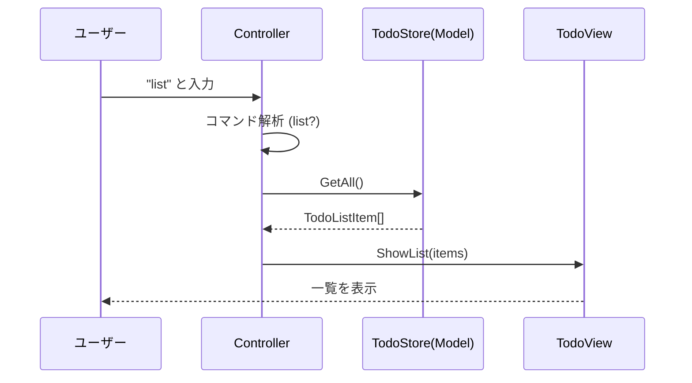
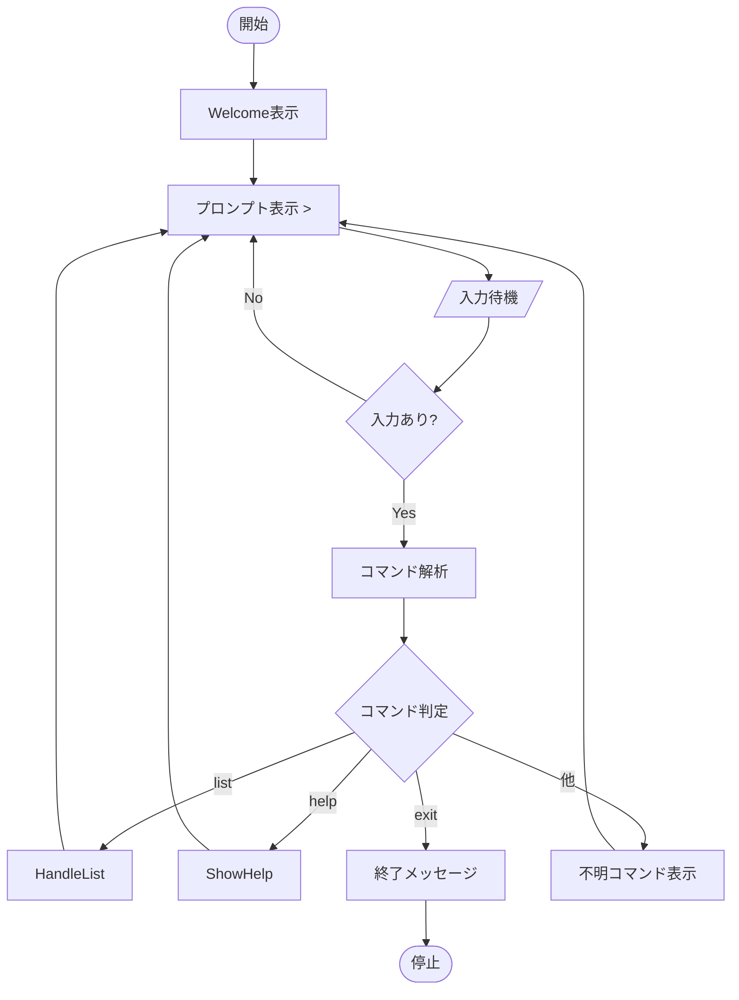

# 第06章：Controller入門①：入力を受けて“指示する”係🎮➡️🧠

この章は **「MVCがちゃんと回り始める最初の山」** だよ〜！⛰️✨
Model（データ）と View（表示）を作ったら、次はそれらをつなぐ **Controller（交通整理）** の出番🚦💨

---

## 6章のゴール🎯✨


この章が終わったら、こうなってるのが理想👇

* Controllerが **「入力を受ける」→「どの処理を呼ぶか決める」→「表示をお願いする」** 係だと説明できる🗣️✨
* `list` コマンドで Todo 一覧が出せる✅
* **Viewにロジックを混ぜない**、**Controllerを太らせない**感覚がうっすら掴める🌱

---

## Controllerってなに？一言でいうと…🚦✨


Controllerは **「ユーザー操作の受付係」** だよ🙋‍♀️
ユーザーが何か入力したら、それを受け取って…

1. 「何したいの？」を読み取って🔎
2. 「じゃあこの処理ね！」ってModel側に指示して📦
3. 「表示お願い！」ってViewに頼む🎨

…っていう **交通整理** をする係🚥✨

---

## まず“やること / やらないこと”をハッキリしよう✂️✅


### Controllerがやること🙆‍♀️

* 入力を受け取る（コマンド文字列など）⌨️
* 入力の“形”チェック（空、数値じゃない…みたいな）🔎
* どの処理を呼ぶか振り分ける（今回のメイン！）📮
* 画面に何を出すかを決めてViewにお願いする👀

### Controllerがやらないこと🙅‍♀️

* データのルールを持つ（それはModelの仕事）📦🛡️
  例：「タイトル空欄NG」とか
* 表示の装飾にこだわる（それはViewの仕事）🎨
  例：「枠線どうする？」とか

---

## 今回作るもの（ミニ完成形）🧁✨

通し課題 **CampusTodo** で、まずは **`list` コマンド**だけ動かすよ✅

* `list` → Todo一覧を表示📋✨
* `help` → 使い方を表示🆘
* `exit` → 終了👋

> ちなみに最新のC#は **C# 14** で、.NET 10 上でサポートされてるよ〜。([Microsoft Learn][1])
> Visual Studio 2026 には .NET 10 SDK が入ってる、って明記されてるよ。([Microsoft Learn][1])

---

## フォルダ構成（この章でのおすすめ）📁✨


Consoleアプリでも「役割の部屋」を分けると一気にMVCっぽくなるよ〜🏠✨

* `Models/`

  * `TodoItem.cs`
  * `TodoStore.cs`（メモリに保持するだけの簡易ストア）
* `Views/`

  * `TodoView.cs`
* `Controllers/`

  * `TodoController.cs`
* `Program.cs`

---

## 実装ステップ①：Model（最低限）📦✨

### TodoItem.cs

```csharp
namespace CampusTodo.Models;

public class TodoItem
{
    public int Id { get; }
    public string Title { get; }
    public bool IsDone { get; private set; }

    public TodoItem(int id, string title)
    {
        if (string.IsNullOrWhiteSpace(title))
            throw new ArgumentException("タイトルが空だよ🥺", nameof(title));

        Id = id;
        Title = title.Trim();
        IsDone = false;
    }

    public void MarkDone() => IsDone = true;
}
```

### TodoStore.cs（今回は“仮データ置き場”）

```csharp
using CampusTodo.Models;

namespace CampusTodo.Models;

public class TodoStore
{
    private readonly List<TodoItem> _items = new();

    public TodoStore()
    {
        // 仮データ（第4章で作った想定でもOK！）
        _items.Add(new TodoItem(1, "レポート下書き"));
        _items.Add(new TodoItem(2, "ゼミの資料作り"));
        _items.Add(new TodoItem(3, "洗濯する"));
    }

    public IReadOnlyList<TodoItem> GetAll() => _items;
}
```

---

## 実装ステップ②：View（表示だけ！）🎨✨

### TodoView.cs

```csharp
using CampusTodo.Models;

namespace CampusTodo.Views;

public class TodoView
{
    public void ShowWelcome()
    {
        Console.WriteLine("CampusTodoへようこそ〜！🎓✨");
        Console.WriteLine("help と打つと使い方が出るよ🆘");
        Console.WriteLine();
    }

    public void ShowHelp()
    {
        Console.WriteLine("使い方📘✨");
        Console.WriteLine("  list      : 一覧を見る📋");
        Console.WriteLine("  help      : 使い方🆘");
        Console.WriteLine("  exit      : 終了👋");
        Console.WriteLine();
    }

    public void ShowList(IReadOnlyList<TodoItem> items)
    {
        Console.WriteLine("Todo一覧📋✨");

        if (items.Count == 0)
        {
            Console.WriteLine("  まだ何もないよ〜🌱");
            Console.WriteLine();
            return;
        }

        foreach (var item in items)
        {
            var mark = item.IsDone ? "✅" : "⬜";
            Console.WriteLine($"  {mark} {item.Id}. {item.Title}");
        }

        Console.WriteLine();
    }

    public void ShowError(string message)
    {
        Console.WriteLine($"エラーだよ〜🥺：{message}");
        Console.WriteLine();
    }

    public void ShowUnknownCommand(string? cmd)
    {
        Console.WriteLine($"「{cmd}」は知らないコマンドかも…🤔");
        Console.WriteLine("help を見てね🆘");
        Console.WriteLine();
    }
}
```

---

## 実装ステップ③：Controller（この章の主役！）🎮🚦✨

ポイントはこれ👇
Controllerは **「入力を読む」→「振り分ける」→「Model/Viewを呼ぶ」** だけ！




### TodoController.cs

```csharp
using CampusTodo.Models;
using CampusTodo.Views;

namespace CampusTodo.Controllers;

public class TodoController
{
    private readonly TodoStore _store;
    private readonly TodoView _view;

    public TodoController(TodoStore store, TodoView view)
    {
        _store = store;
        _view = view;
    }

    public void Run()
    {
        _view.ShowWelcome();

        while (true)
        {
            Console.Write("> ");
            var line = Console.ReadLine();

            if (line is null)
                return; // 入力ストリームが閉じた

            var cmd = line.Trim();

            if (cmd.Length == 0)
                continue;

            // 今回は “超シンプル” に：最初の単語だけで判定
            var first = cmd.Split(' ', StringSplitOptions.RemoveEmptyEntries)[0]
                           .ToLowerInvariant();

            switch (first)
            {
                case "list":
                    HandleList();
                    break;

                case "help":
                    _view.ShowHelp();
                    break;

                case "exit":
                case "quit":
                    Console.WriteLine("またね〜👋✨");
                    return;

                default:
                    _view.ShowUnknownCommand(first);
                    break;
            }
        }
    }


    private void HandleList()
    {
        // Controllerは「取ってきて表示して〜」って段取りするだけ
        var items = _store.GetAll();
        _view.ShowList(items);
    }
}
```




---

## 実装ステップ④：Program.cs（全部つなぐ🔌✨）


```csharp
using CampusTodo.Controllers;
using CampusTodo.Models;
using CampusTodo.Views;

var store = new TodoStore();
var view = new TodoView();
var controller = new TodoController(store, view);

controller.Run();
```

---

## 動作確認（イメージ）👀✨

```text
CampusTodoへようこそ〜！🎓✨
help と打つと使い方が出るよ🆘

> list
Todo一覧📋✨
  ⬜ 1. レポート下書き
  ⬜ 2. ゼミの資料作り
  ⬜ 3. 洗濯する

> help
使い方📘✨
  list      : 一覧を見る📋
  help      : 使い方🆘
  exit      : 終了👋

> exit
またね〜👋✨
```

---

## つまずきポイントあるある集🥺🧯

* **Viewに処理を書いちゃう**
  例：`ShowList()` の中で `store.GetAll()` し始める → 責務混ざる😵‍💫
* **Controllerが全部やり始める（Fat Controllerの芽🌱）**
  今回はOKだけど、増えてきたら第12章のService層で分けるよ🍔➡️🥗
* **入力パースが雑で落ちる**
  まずは「help出す」「エラーでも落ちない」が正義😌✨

---

## AI活用コーナー🤖💡（この章で効くやつ）

### 1) コマンド設計案を出してもらう🧾✨

* 「CampusTodoのコマンド案を、初心者が覚えやすい形で5個。短い理由つきで」

### 2) Controllerが責務を守れてるかレビューしてもらう🧐

* 「このControllerのコード見て、Controllerがやりすぎてる所があれば指摘して。理由もお願い」

### 3) switch地獄になりそうな予兆チェック⚠️

* 「コマンドが増えたときにswitchが読みにくくなる兆候と、今できる小さな対策を3つ教えて」

---

## ミニ演習（この章の宿題）📚✅✨

### 演習A：`list` をちょい進化させる🌱

* `list done` で完了だけ表示✅
* `list todo` で未完了だけ表示⬜

（ヒント：Controllerで引数を読み取って、Model側に“取得メソッド”を増やす…でもOK👌）

### 演習B：`help` の表示をもう少し優しくする🌸

* 例：「まずは list してみよ〜📋✨」みたいな一言を追加💬

---

## 章末チェック（3問）🧠✨

1. Controllerの役目を一言でいうと？（自分の言葉でOK🙆‍♀️）
2. 「タイトル空欄NG」は、Controller / View / Model どこに置くのが自然？📦
3. `list` のとき Controller は具体的に何をしてる？（3ステップで）🚦

---

次の第7章では、`done 2` みたいに **操作→更新→再表示** のループを回して「MVCが回ってる感」🌀✨を掴みにいくよ〜！

[1]: https://learn.microsoft.com/en-us/dotnet/csharp/whats-new/csharp-14?utm_source=chatgpt.com "What's new in C# 14"
