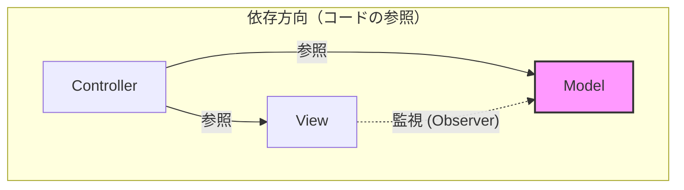
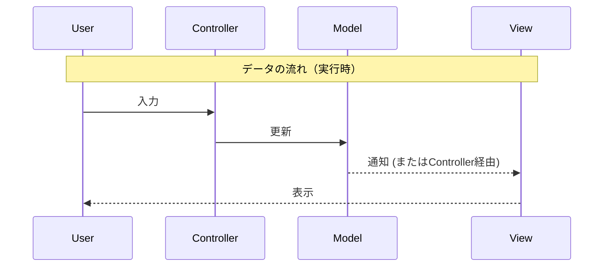
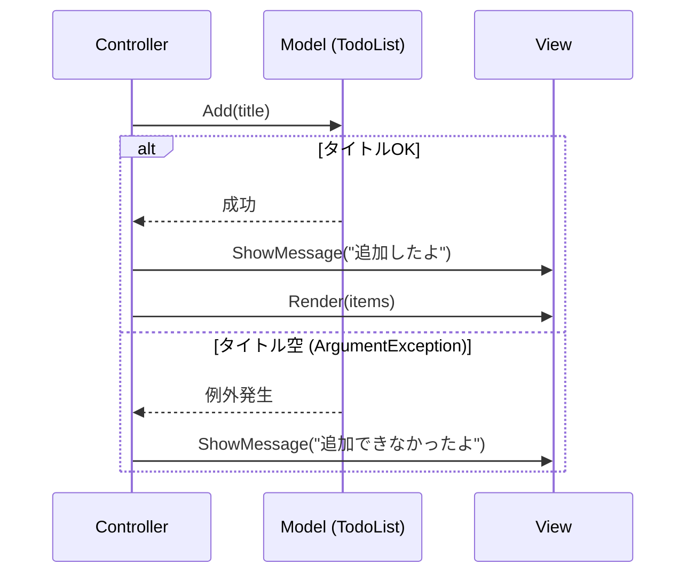

# 第07章：MVCのデータ流れを接続する（Model→Controller→View）🔁✨

この章はね、**「MVCが“回る”瞬間」**を体で覚える回だよ〜🌀💖
（.NET 10 / C# 14 世代で作る想定だよ🧁） ([Microsoft for Developers][1])

---

## 今日のゴール🎯✨

* **操作 → 更新 → 再表示** のループを作れる🔁✅
* 「データの流れ」と「依存の向き」が別物だってわかる🧠💡
* **done 2** みたいなコマンドで、更新→再表示まで一気通貫でできる🎉

---

## まず大事：2つの矢印を分けよう🧠➡️➡️


### ① データの流れ（実行時）🌊

ユーザー操作が入ってから、画面が更新されるまでの“道”だよ👇

* ユーザーが入力する⌨️
* Controllerが受け取る🎮
* Modelを更新する📦
* ViewがModelを表示する🎨

### ② 依存の向き（コードの参照関係）🧱

「どの層が、どの層を知っててOK？」って話だよ👇

* View → Model を知ってOK（表示に必要）👀
* Controller → Model / View を知ってOK（交通整理役）🚦
* **Model → View / Controller は基本NG**（Modelはピュアでいたい）🚫💎

図にするとこんな感じ〜🧁✨





```text
【依存（参照）】            【データの流れ（実行時）】
View  ───▶ Model            ユーザー入力 → Controller → Model更新 → View再表示
Controller ─▶ Model
Controller ─▶ View
Model（どこにも依存しない）
```

---

## 今回作る「回るMVC」：CampusTodo（コンソール版）📚✅

### コマンド（最低限）🧾✨

* help（使い方）
* list（一覧）
* add 文字（追加）
* done 番号（完了）
* exit（終了）

---

## 実装：MVCを“接続”する最小セット🛠️💖

フォルダはこんな感じにすると迷子になりにくいよ〜📁✨

```text
CampusTodo/
  Models/
    TodoItem.cs
    TodoList.cs
  Views/
    ConsoleTodoView.cs
  Controllers/
    TodoController.cs
  Program.cs
```

---

## 1) Model：TodoItem + TodoList（更新はModelが担当）📦🛡️

### Models/TodoItem.cs

```csharp
namespace CampusTodo.Models;

public sealed class TodoItem
{
    public string Title { get; private set; }
    public bool IsDone { get; private set; }

    public TodoItem(string title)
    {
        Title = ValidateTitle(title);
        IsDone = false;
    }

    public void MarkDone()
    {
        IsDone = true;
    }

    private static string ValidateTitle(string title)
    {
        if (string.IsNullOrWhiteSpace(title))
            throw new ArgumentException("タイトルが空だよ〜🥺", nameof(title));

        return title.Trim();
    }
}
```

### Models/TodoList.cs

```csharp
using System.Collections.ObjectModel;

namespace CampusTodo.Models;

public sealed class TodoList
{
    private readonly List<TodoItem> _items = new();

    public ReadOnlyCollection<TodoItem> Items => _items.AsReadOnly();

    public void Add(string title)
    {
        _items.Add(new TodoItem(title));
    }

    // 「done 2」みたいに、表示番号(1始まり)で完了にする
    public bool TryMarkDoneByNumber(int number)
    {
        var index = number - 1;
        if (index < 0 || index >= _items.Count) return false;

        _items[index].MarkDone();
        return true;
    }
}
```

ポイント💡
Modelは「完了にする」っていう**ルールと更新**を持ってるよ🛡️✨
Controllerが直接 IsDone をいじり始めると、責務が混ざりやすい⚠️

---

## 2) View：表示は表示だけ（入力もここでOK）🎨⌨️

### Views/ConsoleTodoView.cs

```csharp
using CampusTodo.Models;

namespace CampusTodo.Views;

public sealed class ConsoleTodoView
{
    public void ShowWelcome()
    {
        Console.WriteLine("CampusTodoへようこそ〜📚✅  help で使い方が出るよ💡");
    }

    public void ShowPrompt()
    {
        Console.Write(">> ");
    }

    public string ReadCommandLine()
    {
        return Console.ReadLine() ?? "";
    }

    public void ShowMessage(string message)
    {
        Console.WriteLine(message);
    }

    public void Render(IReadOnlyList<TodoItem> items)
    {
        Console.WriteLine();
        Console.WriteLine("📋 Todo一覧");
        if (items.Count == 0)
        {
            Console.WriteLine("（まだ何もないよ〜🌱）");
            Console.WriteLine();
            return;
        }

        for (int i = 0; i < items.Count; i++)
        {
            var item = items[i];
            var check = item.IsDone ? "✅" : "⬜";
            Console.WriteLine($"{i + 1}. {check} {item.Title}");
        }
        Console.WriteLine();
    }

    public void ShowHelp()
    {
        Console.WriteLine("🧾 つかいかた");
        Console.WriteLine("  help           : 使い方");
        Console.WriteLine("  list           : 一覧表示");
        Console.WriteLine("  add タイトル   : 追加");
        Console.WriteLine("  done 番号      : 完了（例：done 2）");
        Console.WriteLine("  exit           : 終了");
        Console.WriteLine();
    }
}
```

ポイント💡
Viewは「見せ方」係だから、**完了にする処理（MarkDone）とかはやらない**🙅‍♀️✨
表示のフォーマット（✅/⬜とか）はViewが持っててOKだよ〜🎨

---

## 3) Controller：受け取って振り分け、Model更新して、Viewへ🔁🚦

### Controllers/TodoController.cs

```csharp
using CampusTodo.Models;
using CampusTodo.Views;

namespace CampusTodo.Controllers;

public sealed class TodoController
{
    private readonly TodoList _model;
    private readonly ConsoleTodoView _view;

    public TodoController(TodoList model, ConsoleTodoView view)
    {
        _model = model;
        _view = view;
    }

    // 戻り値：false ならアプリ終了
    public bool Handle(string input)
    {
        var trimmed = input.Trim();
        if (trimmed.Length == 0) return true;

        var parts = trimmed.Split(' ', 2, StringSplitOptions.RemoveEmptyEntries);
        var cmd = parts[0].ToLowerInvariant();
        var arg = parts.Length >= 2 ? parts[1] : "";

        switch (cmd)
        {
            case "help":
                _view.ShowHelp();
                return true;

            case "list":
                _view.Render(_model.Items);
                return true;

            case "add":
                return HandleAdd(arg);

            case "done":
                return HandleDone(arg);

            case "exit":
                _view.ShowMessage("またね〜👋✨");
                return false;

            default:
                _view.ShowMessage("そのコマンドわかんないかも🥺  help を見てね💡");
                return true;
        }
    }

    private bool HandleAdd(string title)
    {
        try
        {
            _model.Add(title);
            _view.ShowMessage("追加したよ〜🌱✨");
            _view.Render(_model.Items); // 更新したら再表示✅
        }
        catch (ArgumentException ex)
        {
            _view.ShowMessage($"追加できなかったよ🥺：{ex.Message}");
        }
        return true;
    }

    private bool HandleDone(string numberText)
    {
        if (!int.TryParse(numberText.Trim(), out var n))
        {
            _view.ShowMessage("番号が読めないよ〜🥺  例：done 2");
            return true;
        }

        var ok = _model.TryMarkDoneByNumber(n);
        if (!ok)
        {
            _view.ShowMessage("その番号は存在しないよ〜🥺  list で確認してね📋");
            return true;
        }

        _view.ShowMessage("完了にしたよ〜✅🎉");
        _view.Render(_model.Items); // 更新したら再表示✅
        return true;
    }
}
```



ここが第7章の核心💖
**Controllerが「更新したら、必ず再表示する」**って流れを作ると、MVCが気持ちよく回り始めるよ〜🌀✨

---

## 4) Program：3人（Model/View/Controller）を出会わせて、ループ開始🔁🚀

### Program.cs

```csharp
using CampusTodo.Controllers;
using CampusTodo.Models;
using CampusTodo.Views;

var model = new TodoList();
model.Add("レポートの下書きを作る📝");
model.Add("ゼミの資料をまとめる📚");

var view = new ConsoleTodoView();
var controller = new TodoController(model, view);

view.ShowWelcome();
view.Render(model.Items);

while (true)
{
    view.ShowPrompt();
    var input = view.ReadCommandLine();

    var cont = controller.Handle(input);
    if (!cont) break;
}
```

---

## 動かし方イメージ🎮✨

```text
>> list
1. ⬜ レポートの下書きを作る📝
2. ⬜ ゼミの資料をまとめる📚

>> done 2
完了にしたよ〜✅🎉
1. ⬜ レポートの下書きを作る📝
2. ✅ ゼミの資料をまとめる📚

>> add 洗濯する🧺
追加したよ〜🌱✨
1. ⬜ レポートの下書きを作る📝
2. ✅ ゼミの資料をまとめる📚
3. ⬜ 洗濯する🧺
```

---

## ミニ演習（この章の勝ち筋）💪✨

### 演習A：done の“優しさ”強化🧸💖

* done 0 / done -1 / done 999 を試して、**落ちない**ようにする🧯
* メッセージをもっと優しくする🌸

### 演習B：list を「完了 / 未完了」で見やすく🎨✨

* 未完了を上に出す（表示順だけ変える）⬜➡️✅
  ※ Modelの並び替えにしないで、**View側の工夫**でできたら最高🎉（次章の伏線💡）

### 演習C：help を見ずに使える導線づくり🧭✨

* 起動直後に「help って打つと使い方出るよ」って出す📣

---

## あるある事故まとめ（混ざってきたサイン）⚠️🧠

* Viewの中で「IsDone = true」し始めた 🙅‍♀️💥
* Controllerが「表示フォーマット（✅とか揃え方）」を持ち始めた 🙅‍♀️🎨
* ModelがConsoleを触り出した（Console.WriteLine） 🙅‍♀️🧨

このへん出たら、だいたいMVCがグチャってきてる合図だよ〜🥺🧹✨

---

## AI相棒の使い方🤖💡（Copilot / Codex向け）

そのままコピって投げてOKだよ〜🫶✨

* 「Console MVCで、Controllerは更新したら必ずView.Renderする構造にしたい。責務が混ざらないようにリファクタ案を出して」🧹
* 「doneコマンドの入力バリデーションを、初心者向けに読みやすく改善して」🧸
* 「ModelがViewに依存しないように、依存関係をチェックして指摘して」🔍
* 「このコードにログ（Controller→Model→Viewの流れが見えるやつ）を最小で入れて」🧾

⚠️コツ：AIの提案は“全部採用”じゃなくて、**差分で1個ずつ**入れると安全だよ〜🧠✨

---

## ふりかえりチェック✅🧁

* 「done 2」したとき、**Model更新→再表示**まで1回で流れてる？🔁
* ModelはConsoleを触ってない？📦🚫
* 表示の工夫はViewに寄せられてる？🎨
* Controllerは「振り分け＋指示」に集中できてる？🚦

---

### ちょい最新メモ📝✨

今の主流ラインだと **.NET 10（LTS）/ C# 14** が“土台”になってるよ〜（Visual Studio 2026 系でのサポートも案内されてる） ([Microsoft for Developers][1])

---

次の章（第8章）では、このControllerの **if/switch が肥大化する問題**を「ルーティング表」でスッキリさせるよ〜🗺️✨

[1]: https://devblogs.microsoft.com/dotnet/announcing-dotnet-10/?utm_source=chatgpt.com "Announcing .NET 10"
