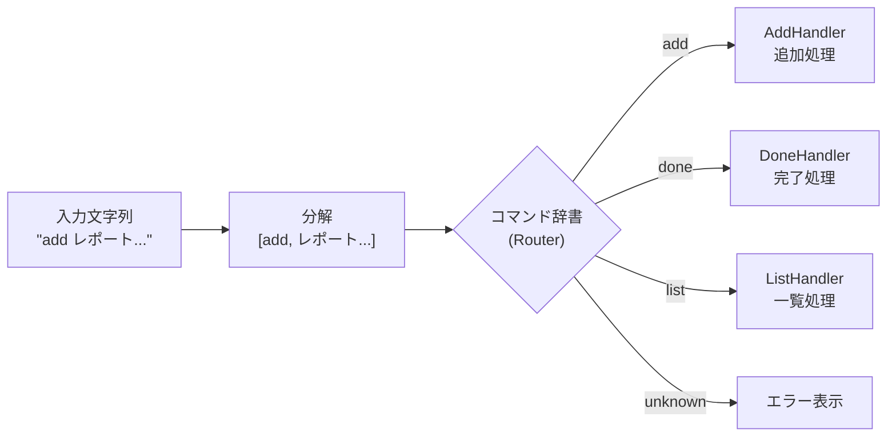
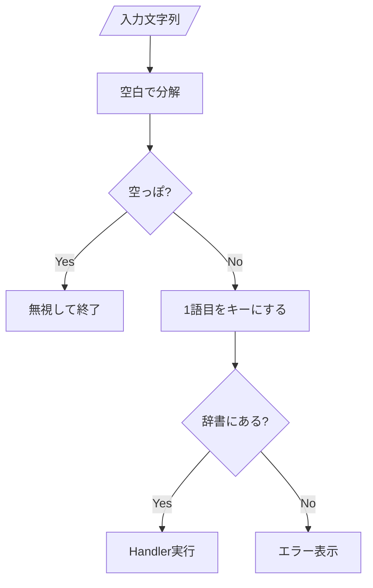

# 第08章：Controller入門②：ルーティング（振り分け表）を作る🗺️📌

（題材：CampusTodo📚✅）

---

## 0. この章のゴール🎯✨

この章が終わったら、こんな状態になってるのが理想だよ〜！🧁💕

* `if / else if / else` の **分岐だらけ地獄** から卒業できる😇➡️🎉
* `add` / `list` / `done` / `edit` みたいなコマンドが、**「対応表（ルート表）」で管理**できる🗺️📌
* 新しいコマンドを追加するとき、**1か所だけちょい足し**で済むようになる🧱✨
* ルーティングの考え方が、将来の **ASP.NET Core MVC のルーティング**にもつながる🌐🚀 ([Microsoft Learn][1])

---

## 1. ルーティングってなに？（超やさしく）🧠💡

ルーティングは一言でいうと…

> 「入力（URLやコマンド）を見て、どの処理に渡すか決める係」🛣️➡️🎯

WebのMVCだと、URL（例：`/Products/Details/5`）を見て、どのコントローラーのどのアクションに行くか決めるよね🌐
ASP.NET Core MVC でも「URL → アクション」の対応を **ルート**で決めるよ〜🧭✨ ([Microsoft Learn][1])

今回のCampusTodo（コンソール版）では、URLの代わりに **コマンド文字列**を使うだけ！

* `add "レポート" 2026-01-20`
* `list`
* `done 2`

これを見て「どの処理に行く？」を決めるのが、第8章のテーマだよ🗺️✨

---

## 2. まず、ありがちな“if地獄”を体感しよ😇🧨


最初はだいたいこうなる：

```csharp
if (command == "add")
{
    // 追加
}
else if (command == "list")
{
    // 一覧
}
else if (command == "done")
{
    // 完了
}
else if (command == "edit")
{
    // 編集
}
else if (command == "delete")
{
    // 削除
}
else
{
    // 不明コマンド
}
```

これ、コマンドが増えるほど…

* 読みにくい📉😵
* 追加が怖い😨
* ミスってバグりやすい🐛💥

だから **「振り分け表」** にしちゃおう！🗺️📌✨
（KISS：シンプルに保つ🍀）

---

## 3. 解決アイデア：コマンド辞書（ルート表）🗂️✨




イメージはこれ👇

* `add` → AddHandler
* `list` → ListHandler
* `done` → DoneHandler
* `help` → HelpHandler

C#なら `Dictionary<string, ...>` がちょうどいい🧺✨

さらに「説明」や「使い方」も一緒に持たせると、`help` が超作りやすくなるよ😌📚

---

## 4. 実装：CommandDefinition と CommandRouter を作ろう🧱✨

### 4.1 CommandDefinition（コマンド1個ぶんの定義）📌

```csharp
public sealed record CommandDefinition(
    string Name,
    string Usage,
    string Description,
    Action<string[]> Handler
);
```

* `Name`：コマンド名（`add` とか）
* `Usage`：使い方（例：`add <title>`）
* `Description`：説明（help表示用）
* `Handler`：実際に動かす処理（引数配列を受け取る）

---

### 4.2 CommandRouter（振り分け係）🛣️➡️🎯


```csharp
public sealed class CommandRouter
{
    private readonly Dictionary<string, CommandDefinition> _routes
        = new(StringComparer.OrdinalIgnoreCase);

    public void Register(CommandDefinition command)
    {
        _routes[command.Name] = command;
    }

    public bool TryDispatch(string inputLine)
    {
        var tokens = Tokenize(inputLine);
        if (tokens.Length == 0) return true; // 何も入力してないならスルーでOK🙂

        var commandName = tokens[0];
        var args = tokens.Skip(1).ToArray();

        if (_routes.TryGetValue(commandName, out var command))
        {
            command.Handler(args);
            return true;
        }

        Console.WriteLine($"❓ コマンドが分からないよ: {commandName}");
        Console.WriteLine("💡 `help` を打つと一覧が見れるよ！");
        return false;
    }

    public IReadOnlyCollection<CommandDefinition> GetAllCommands()
        => _routes.Values;

    private static string[] Tokenize(string inputLine)
    {
        // まずは超シンプル：空白区切り（※ "..." の引用対応は“発展課題”にしよ🧁）
        return inputLine.Split(' ', StringSplitOptions.RemoveEmptyEntries);
    }
}
```



ポイント💡

* `StringComparer.OrdinalIgnoreCase` で `LIST` とか `List` も許せる😌✨
* `TryDispatch` が「入力を受けて、実行先を決める」メイン処理🗺️
* まだ引用符（`"レポート提出"`）をちゃんと扱えないけど、今はOK！👌（後で強化できる）

---


## 5. Controllerに組み込もう🎮➡️🧠✨


ここからが「Controller入門②」っぽいところだよ〜！

### 5.1 例：TodoController（超ざっくり版）🍀

```csharp
public sealed class TodoController
{
    private readonly CommandRouter _router = new();

    public TodoController(TodoService service, TodoView view)
    {
        // list
        _router.Register(new CommandDefinition(
            Name: "list",
            Usage: "list",
            Description: "Todo一覧を表示する📋",
            Handler: _ =>
            {
                var items = service.GetAll();
                view.ShowList(items);
            }
        ));

        // done
        _router.Register(new CommandDefinition(
            Name: "done",
            Usage: "done <id>",
            Description: "指定したTodoを完了にする✅",
            Handler: args =>
            {
                if (args.Length < 1)
                {
                    view.ShowError("⚠️ idが必要だよ！ 例: done 2");
                    return;
                }

                if (!int.TryParse(args[0], out var id))
                {
                    view.ShowError("⚠️ idは数字でお願い！ 例: done 2");
                    return;
                }

                service.MarkDone(id);
                view.ShowMessage($"✅ 完了にしたよ！（id: {id}）");
            }
        ));

        // help
        _router.Register(new CommandDefinition(
            Name: "help",
            Usage: "help",
            Description: "コマンド一覧を表示する🆘",
            Handler: _ =>
            {
                view.ShowHelp(_router.GetAllCommands()
                    .OrderBy(c => c.Name)
                    .ToArray());
            }
        ));
    }

    public void Run()
    {
        Console.WriteLine("🌸 CampusTodoへようこそ！ help で使い方が見れるよ✨");

        while (true)
        {
            Console.Write("📝 > ");
            var line = Console.ReadLine() ?? "";

            if (line.Equals("exit", StringComparison.OrdinalIgnoreCase))
            {
                Console.WriteLine("👋 またね〜！");
                break;
            }

            _router.TryDispatch(line);
        }
    }
}
```

ここで大事な感覚はこれ👇✨

* Controllerは「入力を受ける」📝
* Routerは「どれを呼ぶか決める」🗺️
* 実処理（ビジネス寄り）は Service に寄せる（第12章で本格的にやる🍔➡️🥗）

---

## 6. View側：help表示をちょい足ししよ📺✨


```csharp
public sealed class TodoView
{
    public void ShowHelp(CommandDefinition[] commands)
    {
        Console.WriteLine("📚 使えるコマンド一覧だよ〜✨");
        foreach (var c in commands)
        {
            Console.WriteLine($"- 🧩 {c.Name} : {c.Description}");
            Console.WriteLine($"    🧾 使い方: {c.Usage}");
        }
        Console.WriteLine("💡 終了したいときは `exit` だよ👋");
    }

    public void ShowError(string message) => Console.WriteLine(message);
    public void ShowMessage(string message) => Console.WriteLine(message);

    public void ShowList(IEnumerable<TodoItem> items)
    {
        Console.WriteLine("📋 Todo一覧");
        foreach (var item in items)
        {
            Console.WriteLine($"- {(item.IsDone ? "✅" : "⬜")} {item.Id}: {item.Title}");
        }
    }
}
```

---

## 7. ミニ演習🧪✨（ここが超大事！）

### 演習A：`add` をルート表に追加しよう➕🧁

* `add <title>` で追加できるようにする
* 引数が無ければ、優しくエラーを出す😌🌸

### 演習B：`delete <id>` を追加しよう🗑️✨

* 数字チェックも忘れずに✅

### 演習C：別名（エイリアス）を作ろう🎭✨

* `ls` を `list` と同じにしたい！
  → `Register` をもう1回すればOKだよ〜！

---

## 8. チェックポイント✅✨（セルフテスト）

* [ ] 新コマンド追加が **Register 1個**でできる？🧱
* [ ] `help` が **自動的に増える**形になってる？📚
* [ ] “Controllerが太りすぎてる感”は、前より減った？🍔➡️🥗
* [ ] `if地獄` が消えて、読みやすくなった？📖✨

---

## 9. AI活用🤖💡（この章でめっちゃ相性いい！）


使い方は「丸投げ」じゃなくて、**案を出させて自分で選ぶ**のがコツだよ✂️✨

### 9.1 ルーティング案を複数出させる🗺️

* 「C#でコマンドルーティングを作りたい。`if` を減らす案を3つ。初心者向けで読みやすさ優先で！」

### 9.2 “責務混ざってない？”レビューしてもらう🧐

* 「このController、責務が混ざってる？ Router/Controller/View/Serviceの切り分け観点で指摘して」

### 9.3 help文言を可愛く整える🌸

* 「helpの説明文を、優しく短く、初心者向けに整えて。絵文字も少し入れて」

---

## 10. ちょい豆知識🌟：Web MVCのルーティングとつながる話🌐

ASP.NET Core では、ルーティングは「URL → エンドポイント（Controller Actionなど）」を結びつける仕組みだよ🛣️✨
`MapControllerRoute` みたいな形で “パターン” を登録するのが定番！ ([Microsoft Learn][1])

だから今回やった「コマンド → ハンドラー」の発想は、ぜんぜん別物じゃなくて、未来への伏線って感じ😆🔮✨

ちなみに **現行の .NET は .NET 10 が最新**で、**C# 14 は .NET 10 でサポート**されてるよ〜🚀 ([Microsoft][2])

---

## まとめ🎀✨

第8章でやったのはこれ！

* 「入力 → 処理」を **対応表（ルート表）** にした🗺️✨
* `if地獄` を倒して、追加が楽な構造にした🎉
* `help` が育つ仕組みを作った📚🌱

次に進むと、Model側で「守るべきルール」をちゃんと持つ（第9章）ので、さらに設計っぽくなっていくよ〜🛡️📦✨

[1]: https://learn.microsoft.com/en-us/aspnet/core/mvc/controllers/routing?view=aspnetcore-10.0&utm_source=chatgpt.com "Routing to controller actions in ASP.NET Core"
[2]: https://dotnet.microsoft.com/en-us/download/dotnet?utm_source=chatgpt.com "Browse all .NET versions to download | .NET"
