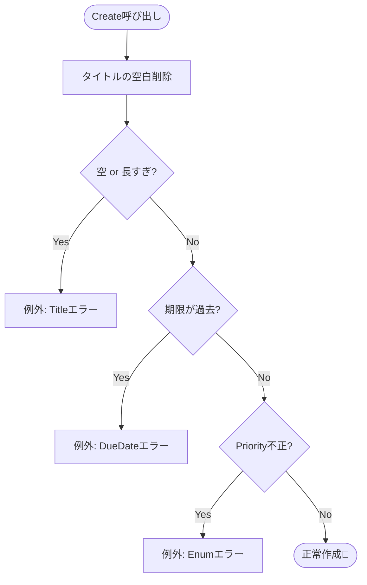

# 第09章：Model入門②：不変条件（守るべきルール）をModel側に置く🛡️📦

この章はひとことで言うと **「Todoを“壊れないデータ”に育てる回」** だよ🌱✨
今のCampusTodoは、動くけど…入力が変だと一気にグラつく可能性があるのね😇💥
そこで **Modelが自分のルールを自分で守る** ようにして、アプリを強くするよ💪🥰

---

## 1) この章のゴール🎯✨

* **不変条件（Invariant）** が何かを説明できる🗣️🛡️
* ルールを **ControllerじゃなくてModel側に集める理由** がわかる🧠💡
* TodoItemが **無効な状態になれない** ように実装できる✅🔒
* 失敗したときにアプリが落ちず、ちゃんと案内できる😌🚨

---

## 2) 不変条件ってなに？🍀（超やさしく）


**不変条件 = そのデータが“データとして成立するための約束”** だよ🤝✨
Todoでいうと例えば👇

* タイトルが空はダメ🙅‍♀️📝
* 期限が「昨日」はダメ🙅‍♀️📅
* もう完了したTodoを、もう一回完了にするのはダメ🙅‍♀️✅✅

こういう **「破ったらアプリが変になるルール」** を、Modelが握るのがポイント🛡️📦

---

## 3) なんでControllerじゃなくてModelに置くの？🚦➡️📦


Controllerでチェックすると、一見ちゃんとして見えるんだけど…落とし穴があるの🥺

### ❌ Controllerだけでチェックすると起きる悲劇😇

* 別の機能（編集・インポート・将来のAPI化など）で **別ルート** が生まれた瞬間、チェック漏れが発生🕳️💥
* ルールがいろんな場所に散らばって **「どれが正解？」** になる🌀
* 仕様変更で「期限ルール変えたい！」ってなった時に **修正箇所が地獄** 🧟‍♀️🧯

### ✅ Modelに置くと嬉しいこと🥰

* **どこから触っても** ルールが守られる（最強）🛡️✨
* ルール変更が **Modelだけ** で済みやすい🧹
* 「このデータは正しい」と信じられて、上の層がシンプルになる🎀

---

## 4) 今回追加する“不変条件”の例🧠📌

CampusTodo（コンソールMVC）で、まずはこのへんから始めるのがちょうどいいよ🍩✨

### TodoItemの不変条件（例）

1. **Title**：空・空白だけはNG🙅‍♀️
2. **Title**：長すぎNG（例：60文字まで）📏
3. **DueDate**：過去日はNG（「今日」以降だけOK）📅
4. **Done**：二重完了NG（完了済みをもう一回doneしない）✅🔁🙅‍♀️

> ルールは増やしすぎ注意だよ✂️✨（「必要になったら足す」がちょうどいい🥰）

---

## 5) 実装方針：Modelを“壊れない形”にするコツ🛠️✨

ここ大事〜！💖

### ✅ コツ1：プロパティは「勝手に書き換えられない」ようにする🔒

* `private set;` にして、勝手に変更できないようにする
* 変更は **メソッド経由** にする（そこでルールを守る）

### ✅ コツ2：作るとき（Create/コンストラクタ）に必ずチェックする👶🛡️

* 「生まれた瞬間から正しい」状態にする✨

### ✅ コツ3：失敗したら “早めに” 止める（Fail Fast）🚫⚡

* 変なデータを奥に通さない
* エラーはModelが出して、Controllerが案内する😌📣

---

## 6) まずはコード：DomainException（ルール違反専用）🚨📦


Modelが「それはルール違反だよ〜🥺」って伝えるための例外クラスを作るよ✨
（例外がイヤならResult方式もあるけど、まずはこれがわかりやすい🍬）

```csharp
// Models/DomainException.cs
namespace CampusTodo.Models;

public sealed class DomainException : Exception
{
    public string Code { get; }

    public DomainException(string code, string message) : base(message)
        => Code = code;
}
```

* `Code` は「どのルールに違反したか」の識別子だよ🏷️
* UI側でメッセージ差し替えもできるし、ログにも便利🧾✨

---

## 7) TodoItemを“壊れないModel”に改造しよう🛡️✅

### 7-1) まずは優先度をenumにして、変な値を防ぐ🎚️✨

```csharp
// Models/TodoPriority.cs
namespace CampusTodo.Models;

public enum TodoPriority
{
    Low = 1,
    Normal = 2,
    High = 3,
}
```

### 7-2) TodoItem本体：Createで検証、変更はメソッド経由に🧱✨


```csharp
// Models/TodoItem.cs
namespace CampusTodo.Models;

public sealed class TodoItem
{
    public int Id { get; }
    public string Title { get; private set; }
    public DateOnly? DueDate { get; private set; }
    public TodoPriority Priority { get; private set; }
    public bool IsDone { get; private set; }
    public DateTimeOffset CreatedAt { get; }
    public DateTimeOffset? DoneAt { get; private set; }

    private TodoItem(
        int id,
        string title,
        DateOnly? dueDate,
        TodoPriority priority,
        DateTimeOffset createdAt
    )
    {
        Id = id;
        Title = title;
        DueDate = dueDate;
        Priority = priority;
        CreatedAt = createdAt;
    }

    public static TodoItem Create(
        int id,
        string title,
        DateOnly? dueDate,
        TodoPriority priority
    )
    {
        var now = DateTimeOffset.Now;

        var normalizedTitle = NormalizeTitle(title);
        if (normalizedTitle.Length == 0)
            throw new DomainException("Todo.Title.Empty", "タイトルは空にできないよ😢");

        if (normalizedTitle.Length > 60)
            throw new DomainException("Todo.Title.TooLong", "タイトルが長すぎるよ〜😵（60文字まで）");

        if (dueDate is not null)
        {
            var today = DateOnly.FromDateTime(now.LocalDateTime);
            if (dueDate.Value < today)
                throw new DomainException("Todo.DueDate.Past", "期限が過去日になってるよ📅💦（今日以降にしてね）");
        }

        if (!Enum.IsDefined(typeof(TodoPriority), priority))
            throw new DomainException("Todo.Priority.Invalid", "重要度が変だよ😵（Low/Normal/High）");

        return new TodoItem(
            id: id,
            title: normalizedTitle,
            dueDate: dueDate,
            priority: priority,
            createdAt: now
        );
    }

    public void Rename(string newTitle)
    {
        var normalized = NormalizeTitle(newTitle);
        if (normalized.Length == 0)
            throw new DomainException("Todo.Title.Empty", "タイトルは空にできないよ😢");
        if (normalized.Length > 60)
            throw new DomainException("Todo.Title.TooLong", "タイトルが長すぎるよ〜😵（60文字まで）");

        Title = normalized;
    }

    public void ChangeDueDate(DateOnly? newDueDate)
    {
        if (newDueDate is not null)
        {
            var today = DateOnly.FromDateTime(DateTime.Now);
            if (newDueDate.Value < today)
                throw new DomainException("Todo.DueDate.Past", "期限が過去日だよ📅💦（今日以降にしてね）");
        }

        DueDate = newDueDate;
    }

    public void MarkDone()
    {
        if (IsDone)
            throw new DomainException("Todo.AlreadyDone", "それ、もう完了してるよ✅💕");

        IsDone = true;
        DoneAt = DateTimeOffset.Now;
    }

    private static string NormalizeTitle(string? title)
        => (title ?? "").Trim();
}
```



### 🌟ここが「MVCの美しさ」ポイント


* ルールは **Model（TodoItem）に集約** 🛡️
* Controllerは「入力を受けて呼ぶ」だけに近づく🚦✨
* Viewは表示するだけ🎨👀

---

## 8) Controller側はどうする？（落とさず案内する）🚦😌


Controllerは「形式チェック（パース）」と「例外を受けて表示」が担当だよ✨
（ルール判断の本体はModelがやる！）

```csharp
// Controllers/TodoController.cs（イメージ）
using CampusTodo.Models;
using CampusTodo.Views;

namespace CampusTodo.Controllers;

public sealed class TodoController
{
    private readonly TodoView _view;
    private readonly List<TodoItem> _items = new();
    private int _nextId = 1;

    public TodoController(TodoView view) => _view = view;

    public void Add(string title, string? dueDateText, string? priorityText)
    {
        // ① 形式チェック（入力の形が正しい？）
        DateOnly? dueDate = null;
        if (!string.IsNullOrWhiteSpace(dueDateText))
        {
            if (!DateOnly.TryParse(dueDateText, out var parsed))
            {
                _view.ShowError("日付の形式が違うよ📅💦 例：2026-01-20");
                return;
            }
            dueDate = parsed;
        }

        var priority = ParsePriority(priorityText);

        // ② ルールチェックはModelにお任せ
        try
        {
            var item = TodoItem.Create(_nextId++, title, dueDate, priority);
            _items.Add(item);
            _view.ShowMessage("追加できたよ〜🎉✨");
        }
        catch (DomainException ex)
        {
            // ③ やさしく案内（アプリは落とさない）
            _view.ShowError(ex.Message);
            // 余裕があれば ex.Code をログへ🧾
        }
    }

    private static TodoPriority ParsePriority(string? text)
    {
        return (text ?? "").Trim().ToLower() switch
        {
            "low" => TodoPriority.Low,
            "high" => TodoPriority.High,
            _ => TodoPriority.Normal
        };
    }
}
```

---

## 9) ミニ演習🧪✨（ここで手を動かす！）

### 演習A：タイトル空欄NGを体感しよう📝🙅‍♀️

1. `add ""` みたいな入力を投げる
2. アプリが落ちないで、エラーが出ることを確認😌🚨
3. Modelが守ってるから、どこからでも安全って実感する🛡️✨

### 演習B：期限が過去日NGを体感📅🙅‍♀️

1. `add レポート 2020-01-01`
2. 「今日以降にしてね」って出たらOK✅💕

### 演習C：doneの二重実行を防ぐ✅🔁

1. あるTodoを `done`
2. 同じTodoをもう一回 `done`
3. 「もう完了してるよ✅💕」が出たら勝ち🎉

---

## 10) AI活用🤖💡（この章での“使いどころ”）

AIはめちゃ便利だけど、**判断（採用する/しない）はあなたがボス** だよ👑✨

### そのまま使えるプロンプト例🪄

* 「CampusTodoの不変条件を10個出して。初心者向けに“採用優先度”もつけて🧠✨」
* 「TodoItem.Create にガード節を入れて、例外コードも付けて。ルールは“タイトル空NG、過去期限NG、長さ制限”」
* 「Controller側で DomainException を捕まえて、ユーザーに優しいメッセージで表示する実装例を出して」
* 「このModel、外から勝手に壊せない？壊せるなら修正案を出して🛡️」
* 「命名レビューして：DomainException / Invariant / GuardClause の観点で改善点ある？」

---

## 11) よくある落とし穴まとめ🕳️⚠️

* **ControllerにもModelにも同じチェックを書く** → 二重管理で地獄😇（基本はModelに寄せる）
* **public set にしてしまう** → どこからでも破壊できる💥（`private set` + メソッド）
* **Trimしない** → `"   "` がタイトルとして通る🫠（Normalize大事）
* **日付の「形式」と「ルール」を混ぜる**

  * 形式：`TryParse`（Controller寄り）
  * ルール：過去日NG（Model寄り）

---

## 12) まとめ🧁✨

* **不変条件はModelが守る** 🛡️📦
* Modelを「壊れない箱」にすると、Controller/ViewがスッキリしてMVCがキレイに回り出す🌀✨
* 次章のViewModelにもつながるよ！（表示の都合でModelを汚さない）🧺🎨

ちなみに、現行の最新LTSは **.NET 10**（2025-11-11リリース）で、C#は **C# 14** が .NET 10 でサポートされてるよ🆕✨ ([Microsoft][1])

---

次は第10章で **ViewModel（表示専用の形）** を入れて、「表示の都合でModelがぐちゃぐちゃ」問題をスッキリ解決していくよ〜🧺✨

[1]: https://dotnet.microsoft.com/ja-jp/platform/support/policy/dotnet-core?utm_source=chatgpt.com ".NET および .NET Core の公式サポート ポリシー"
