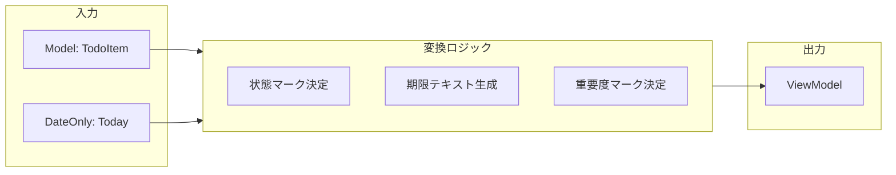

# 第10章：View入門②：ViewModel（表示用の形）を導入する🧺✨

（ちょい最新メモ🗒️）いまの最新どころだと **.NET 10 は 2025/11/11 リリースの LTS**で、**2028/11/14 までサポート**、**2026/01/13 に .NET 10.0.2** が出てるよ〜📦✨ ([Microsoft][1])
C# は **C# 14（2025年11月リリース）**が最新ライン🧠✨ ([Microsoft Learn][2])
IDE も **Visual Studio 2026** のリリースノートが公開されてる🛠️✨ ([Microsoft Learn][3])

---

## 1) 今日のゴール🎯✨

この章のゴールはこれっ👇💕

* **「表示の都合」で Model を汚さない**って感覚を身につける🧼✨
* **View が欲しい“表示用データ”を ViewModel にまとめる**🧺
* **Controller から View に渡すのは ViewModel**にする（Modelを直渡ししない）🎮➡️🎨

---

## 2) なんで ViewModel が必要なの？🥺🧩


今までの CampusTodo って、View が Model（TodoItem）を直接読んで表示してたよね👀
でも、だんだんこういう“表示の欲”が出てくるの…👇

* 期限を `2026-01-20` じゃなくて **「あと3日」**にしたい⏳✨
* 完了状態を `true/false` じゃなくて **「✅/⬜」**で見せたい
* 重要度を `High/Medium/Low` じゃなくて **「★★★」**にしたい⭐️
* 期限切れは **「⚠️期限切れ（2日前）」**って強調したい🚨

ここでやりがちなのが…😇

### ❌ダメな例：Model に表示用プロパティを足し始める

* `TodoItem.DisplayDueText` とか作りたくなる
* でもそれって **業務の形（Model）**が **UIの都合**で変形していくってこと😱

✅そこで登場するのが **ViewModel** だよ〜🧺✨

* Model：**業務の形**（正しいデータとルール）📦
* ViewModel：**表示の形**（見やすさ・UI都合）🎨

---

## 3) ViewModelって結局なに？🧠✨（超ざっくり）

**View が描画に必要な情報だけを持つ、表示専用の入れ物**だよ🧺💕

* だいたい `string` が増える（表示テキスト化するから）📝
* “計算結果”を持てる（例：あと何日）📆
* Model をそのまま持たない or 最小だけ持つ（好みだけど初心者は分けるのが安全）🛡️

---

## 4) CampusTodo での完成イメージ👀✨

表示がこうなってほしいとするね👇

```text
⬜ 1. レポート提出   期限: あと3日   重要: ★★★
✅ 2. ゼミ資料作成   期限: 期限なし  重要: ★
⚠️⬜ 3. 図書館返却    期限: 期限切れ(2日前) 重要: ★★
```

この“見せ方の都合”を **ViewModel が全部持つ**感じ👍✨

---

## 5) 実装してみよう🛠️✨（手順どおりでOK！）

### Step 0：いまの状態を確認（Model直読みになってない？）🔍

たとえば View がこんな感じだと、表示ロジックが肥えてくるよね〜🍔💦

```csharp
// ❌例：ViewがModelを直で見て、表示変換もやってる
foreach (var item in todoItems)
{
    var status = item.IsDone ? "✅" : "⬜";
    var due = item.DueDate is null ? "期限なし" : item.DueDate.Value.ToString("yyyy-MM-dd");
    Console.WriteLine($"{status} {item.Id}. {item.Title} 期限:{due}");
}
```

ここを **ViewModel経由**に変えるよ〜🧺✨

---

### Step 1：ViewModels フォルダを作る📁✨

* `ViewModels/` を追加
* まず「一覧行」用 ViewModel を作る

```csharp
namespace CampusTodo.ViewModels;

public sealed record TodoListItemViewModel(
    int Id,
    string Title,
    string StatusMark,
    string DueText,
    string PriorityText
);
```

> record にしておくと “表示用データの箱” 感が出てスッキリするよ〜🧺✨

---

### Step 2：一覧全体の ViewModel も作る📋✨

「画面（一覧）」として View に渡す単位を用意しよっ🌸

```csharp
namespace CampusTodo.ViewModels;

public sealed record TodoListViewModel(
    IReadOnlyList<TodoListItemViewModel> Items
);
```

---

### Step 3：ViewModel を作る場所を決める🏭✨（Factory / Mapper）

初心者におすすめはこれ👇

* **Controller が ViewModel を作って View に渡す**🎮➡️🎨
* “作る処理”は `Factory` に寄せると Controller が太りにくい🍔➡️🥗（次章以降にも効く！）

```csharp
using CampusTodo.Models;
using CampusTodo.ViewModels;

namespace CampusTodo.Presentation;

public static class TodoViewModelFactory
{
    public static TodoListItemViewModel ToListItem(TodoItem item, DateOnly today)
    {
        var status = item.IsDone ? "✅" : "⬜";

        var dueText = item.DueDate is null
            ? "期限なし"
            : BuildDueText(item.DueDate.Value, today);

        var priorityText = item.Priority switch
        {
            TodoPriority.Low => "★",
            TodoPriority.Medium => "★★",
            TodoPriority.High => "★★★",
            _ => "★"
        };

        // 期限切れなら注意マークを足す（表示の都合なのでViewModel側へ）
        var warning = (item.DueDate is not null && item.DueDate.Value < today && !item.IsDone)
            ? "⚠️"
            : "";

        return new TodoListItemViewModel(
            Id: item.Id,
            Title: item.Title,
            StatusMark: warning + status,
            DueText: dueText,
            PriorityText: priorityText
        );
    }

    public static TodoListViewModel ToList(IReadOnlyList<TodoItem> items, DateOnly today)
        => new(items.Select(x => ToListItem(x, today)).ToList());

    private static string BuildDueText(DateOnly due, DateOnly today)
    {
        var days = due.DayNumber - today.DayNumber;

        if (days == 0) return "今日まで";
        if (days > 0) return $"あと{days}日";
        return $"期限切れ({Math.Abs(days)}日前)";
    }
}
```




💡ポイントだよ〜✨

* ここでやってるのは **表示のための変換だけ**🧁
* 「期限が過去はNG」みたいな **ルール（不変条件）**は Model 側（第9章）で守る🛡️

---

### Step 4：Controller から View に ViewModel を渡す🎮➡️🎨

Controller 側で「Model取得 → ViewModel化 → Viewへ」って流れにするよ🌀✨

```csharp
using CampusTodo.Presentation;
using CampusTodo.Services;
using CampusTodo.ViewModels;

namespace CampusTodo.Controllers;

public sealed class TodoController
{
    private readonly TodoService _service;
    private readonly ITodoView _view;

    public TodoController(TodoService service, ITodoView view)
    {
        _service = service;
        _view = view;
    }

    public void List()
    {
        var items = _service.GetAll();
        var today = DateOnly.FromDateTime(DateTime.Today);

        TodoListViewModel vm = TodoViewModelFactory.ToList(items, today);
        _view.RenderTodoList(vm);
    }
}
```

---

### Step 5：View を “ViewModelだけ” で描画する🎨✨

View はもう Model を知らなくてOK🙆‍♀️（気持ちいい分離〜！）

```csharp
using CampusTodo.ViewModels;

namespace CampusTodo.Views;

public interface ITodoView
{
    void RenderTodoList(TodoListViewModel vm);
}

public sealed class ConsoleTodoView : ITodoView
{
    public void RenderTodoList(TodoListViewModel vm)
    {
        Console.WriteLine("===== CampusTodo =====");
        foreach (var item in vm.Items)
        {
            Console.WriteLine($"{item.StatusMark} {item.Id}. {item.Title}   期限: {item.DueText}   重要: {item.PriorityText}");
        }
        Console.WriteLine("======================");
    }
}
```

これで View は「表示だけ」になったよ〜🎉✨

---

## 6) ミニ演習（やってみよ〜！）🧪💕

### 演習A：完了済みは期限表示を短くする✂️✨

* 完了済みは `DueText` を `"完了🎉"` にする、とか
* ViewModelFactory の中で分岐してOK（表示の都合なので）👌

### 演習B：タイトルが長いときは省略して表示する📏✨

* 例：15文字超えたら `…` をつける
* Model の Title はそのまま！ ViewModel で `Title` を加工してOK🙆‍♀️

### 演習C：期限切れは行の先頭を「🚨」にする🚨✨

* いまは `⚠️` だけど、もっと目立たせてもOK
* 表示だけの話なので ViewModel でやっちゃおう🎀

---

## 7) AI活用コーナー🤖💡（この章は相性よすぎ！）

### ✅プロパティ案を出してもらう（でも採用は最小✂️）

お願い例👇

* 「Todo一覧表示のための ViewModel プロパティ候補を10個。初心者向けに“必要度”も付けて」
* 「“表示の都合”と“業務ルール”が混ざってないかチェックして」

### ✅Factoryの骨組みを作らせる（差分レビュー前提🧐）

* 「TodoItem から TodoListItemViewModel に変換する ToListItem を作って。期限は “あとN日/期限切れ” 表示」

---

## 8) ありがちミス集😇（ここだけ見返してもOK）

* ❌ **ViewModelに業務ルール**を入れる（例：期限が過去なら例外！）
  ✅ それは Model 側の仕事🛡️
* ❌ Model に `DisplayXxx` を足す
  ✅ 表示は ViewModel へ🧺
* ❌ View が Model を参照し続ける
  ✅ View は ViewModel だけ見る🎨
* ❌ ViewModelがでかくなりすぎる
  ✅ 「画面ごとに最小」を意識✂️✨（一覧用・詳細用で分けてOK）

---

## 9) まとめ🍓✨

* **Model＝業務の形**、**ViewModel＝表示の形**📦🧺
* 表示のための「あと3日」「★★★」「⚠️」みたいなのは **ViewModelに寄せる**🎨✨
* **Controller → ViewModel → View** の流れにすると責務がスッキリ🌀

---

## 次章予告👀✨（第11章：Validationとエラーメッセージ😌🚨）

次は「入力ミスがあってもアプリが落ちない」ようにするよ〜🧯💕

* 形式チェックはどこ？
* ルールチェックはどこ？
* 優しいエラーメッセージどう出す？🌸

続けて第11章もこのテンションでいこっか〜？🥰✨

[1]: https://dotnet.microsoft.com/ja-jp/platform/support/policy/dotnet-core?utm_source=chatgpt.com ".NET および .NET Core の公式サポート ポリシー"
[2]: https://learn.microsoft.com/ja-jp/dotnet/csharp/whats-new/csharp-version-history?utm_source=chatgpt.com "C# の歴史"
[3]: https://learn.microsoft.com/en-us/visualstudio/releases/2026/release-notes?utm_source=chatgpt.com "Visual Studio 2026 Release Notes"
