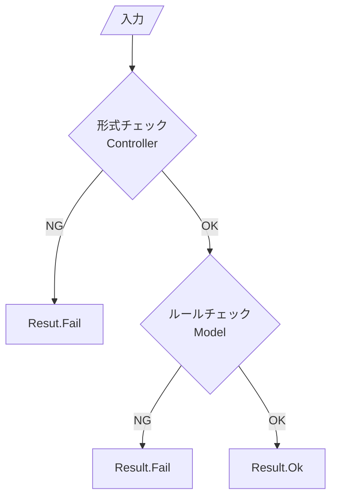

# 第11章：Validationとエラーメッセージ（ユーザーに優しく）😌🚨

（通し課題：CampusTodo 📚✅）

---

## この章のゴール 🎯✨

* 入力ミスがあっても **アプリが落ちない** ようにできる🧯
* 「どこで」「何を」チェックするかを **MVC的に整理**できる🧠
* エラーメッセージを **怖くなく・分かりやすく**書ける🌸

---

## まず結論：Validationは2種類に分けると超ラク！🧠✨


### ① 形式チェック（Controller寄り）🧾🔎

「文字が日付として読める？」「数字として読める？」「コマンドの書き方合ってる？」みたいなやつ✨
例：

* 「done 2」→ 2 が数字か？
* 「add レポート 2026-02-30」→ 日付として読めるか？（そもそも存在しない日付）

### ② ルールチェック（Model寄り）🛡️📦

「アプリの世界のルールとしてOK？」ってやつ✨
例：

* タイトル空欄はNG
* 期限が過去日はNG
* 重要度は 1〜3 だけ、など

この切り分けができると、**責務が混ざらない＝地獄回避😇** です👍

---

## 今日の完成イメージ 🧁✨（こうなったら勝ち！）

ユーザーがミスっても…

* ❌ 落ちない（例外で終了しない）
* ✅ 何がダメか教えてくれる
* ✅ 次にどう直せばいいか出る

例：

> ⚠️ 入力がちょっとだけ違うみたい！
> ✅ 例：add 「レポート」 2026-02-01
> 💡 日付は「YYYY-MM-DD」で入れてね！

---

## Step1：失敗を「例外」じゃなく「結果」で返す（Resultパターン）📦📨✨


入力ミスは「よくあること」なので、毎回 try/catch で戦うより
**Result（成功/失敗）で返す**ときれいになります🌸
（.NETの例外処理ガイドでも「よくある条件は例外を避ける」系の考え方が出てきます）([Microsoft Learn][1])

### ✅ まずは共通の Result を作ろう

```csharp
namespace CampusTodo.App;

public sealed record AppError(string Code, string Message, string? Hint = null);

public sealed class Result<T>
{
    public bool IsSuccess { get; }
    public T? Value { get; }
    public IReadOnlyList<AppError> Errors { get; }

    private Result(bool isSuccess, T? value, IReadOnlyList<AppError> errors)
    {
        IsSuccess = isSuccess;
        Value = value;
        Errors = errors;
    }

    public static Result<T> Ok(T value) => new(true, value, Array.Empty<AppError>());
    public static Result<T> Fail(params AppError[] errors) => new(false, default, errors);
}
```

* Code：機械用（ログ・テスト・分類）🤖
* Message：ユーザーに見せる文章💬
* Hint：直し方のヒント💡

---

## Step2：Controllerで「形式チェック」する🧾🚦✨

ここでは例として、コマンドをこんな形にします👇

* add 「タイトル」 期限(任意)
* done 番号
* delete 番号

### ✅ add の入力（Controllerが受け取る形）を定義

```csharp
namespace CampusTodo.App;

public sealed record AddTodoInput(string Title, DateOnly? DueDate);
```

### ✅ 文字列から AddTodoInput を作る（形式チェック）

```csharp
using System.Globalization;

namespace CampusTodo.App;

public static class CommandParsers
{
    public static Result<AddTodoInput> TryParseAdd(string[] args)
    {
        // 例: add レポート 2026-02-01
        if (args.Length < 2)
        {
            return Result<AddTodoInput>.Fail(
                new AppError(
                    "ADD_ARGS_MISSING",
                    "add の書き方が足りないみたい…！😢",
                    "例：add レポート 2026-02-01（期限は省略OK）"
                )
            );
        }

        var title = args[1].Trim();
        if (string.IsNullOrWhiteSpace(title))
        {
            return Result<AddTodoInput>.Fail(
                new AppError("ADD_TITLE_EMPTY", "タイトルが空っぽだよ〜！🫠", "例：add レポート")
            );
        }

        DateOnly? dueDate = null;
        if (args.Length >= 3)
        {
            var raw = args[2].Trim();

            // TryParse = 形式チェックの王様👑（失敗しても例外にならない）
            if (!DateOnly.TryParseExact(raw, "yyyy-MM-dd", CultureInfo.InvariantCulture, DateTimeStyles.None, out var parsed))
            {
                return Result<AddTodoInput>.Fail(
                    new AppError("ADD_DATE_FORMAT", "期限の日付が読み取れなかったよ🥺", "YYYY-MM-DD で入れてね！例：2026-02-01")
                );
            }

            dueDate = parsed;
        }

        return Result<AddTodoInput>.Ok(new AddTodoInput(title, dueDate));
    }

    public static Result<int> TryParseIndex(string raw, string commandName)
    {
        if (!int.TryParse(raw, out var index))
        {
            return Result<int>.Fail(
                new AppError("INDEX_NOT_NUMBER", $"{commandName} の番号が数字じゃないみたい！😵", $"例：{commandName} 2")
            );
        }

        if (index <= 0)
        {
            return Result<int>.Fail(
                new AppError("INDEX_OUT_OF_RANGE", $"{commandName} の番号は 1 以上でお願い🙏", $"例：{commandName} 1")
            );
        }

        return Result<int>.Ok(index);
    }
}
```

ここでやってるのは **「読めるかどうか」だけ** です🧾✨
「期限が過去かどうか」みたいな “アプリのルール” は Model 側へ🛡️

---

## Step3：Modelで「ルールチェック」する🛡️📦✨

前章（不変条件）の流れを使って、TodoItem を **ルールで守る** ようにします💪

```csharp
namespace CampusTodo.Domain;

using CampusTodo.App;

public sealed class TodoItem
{
    public int Id { get; }
    public string Title { get; private set; }
    public DateOnly? DueDate { get; private set; }
    public bool IsDone { get; private set; }

    private TodoItem(int id, string title, DateOnly? dueDate)
    {
        Id = id;
        Title = title;
        DueDate = dueDate;
        IsDone = false;
    }

    public static Result<TodoItem> Create(int id, string title, DateOnly? dueDate, DateOnly today)
    {
        if (string.IsNullOrWhiteSpace(title))
        {
            return Result<TodoItem>.Fail(
                new AppError("TODO_TITLE_EMPTY", "タイトルは空にできないよ🙂", "1文字以上で入れてね！")
            );
        }

        if (title.Length > 60)
        {
            return Result<TodoItem>.Fail(
                new AppError("TODO_TITLE_TOO_LONG", "タイトルが長すぎるかも…！😳", "60文字以内にしてみてね！")
            );
        }

        if (dueDate is not null && dueDate.Value < today)
        {
            return Result<TodoItem>.Fail(
                new AppError("TODO_DUEDATE_PAST", "期限が過去日になってるよ〜！⏳", "今日以降の日付にしてね！")
            );
        }

        return Result<TodoItem>.Ok(new TodoItem(id, title.Trim(), dueDate));
    }

    public Result<bool> MarkDone()
    {
        if (IsDone)
        {
            return Result<bool>.Fail(new AppError("TODO_ALREADY_DONE", "それ、もう完了済みだよ〜！✅"));
        }

        IsDone = true;
        return Result<bool>.Ok(true);
    }
}
```

ポイントはこれ👇

* Controller：形式（読める？）
* Model：ルール（世界観的にOK？）



---

## Step4：Viewで「怖くないエラー表示」にする🌸🖥️✨

エラーメッセージの基本形はこれが強いです👇
**①何が起きた？ → ②なぜ？ → ③どう直す？**
これはWindowsのエラーメッセージガイドでも「分かりやすく役に立つ内容に」みたいな方向で整理されています([Microsoft Learn][2])

```csharp
namespace CampusTodo.Presentation;

using CampusTodo.App;

public static class ConsoleView
{
    public static void ShowErrors(IEnumerable<AppError> errors)
    {
        Console.WriteLine();
        Console.WriteLine("⚠️ うまくいかなかったみたい…！でも大丈夫☺️");

        foreach (var e in errors)
        {
            Console.WriteLine($"- ❌ {e.Message}");
            if (!string.IsNullOrWhiteSpace(e.Hint))
                Console.WriteLine($"   💡 {e.Hint}");
        }

        Console.WriteLine();
    }
}
```

---

## Step5：アプリの最上位で「予期しない例外」を受け止める🧯🧠✨

入力ミスは Result で処理してOK👌
でも「バグ」や「想定外」は起きます。だから最上位で **保険の try/catch** を置きます🧯
例外処理の考え方は .NET のガイドに沿っておくと安心です([Microsoft Learn][1])

```csharp
using CampusTodo.App;
using CampusTodo.Domain;
using CampusTodo.Presentation;

try
{
    // ここからアプリのループ開始（例）
    while (true)
    {
        Console.Write("👉 ");
        var line = Console.ReadLine();
        if (line is null) break;

        var args = line.Split(' ', StringSplitOptions.RemoveEmptyEntries);
        if (args.Length == 0) continue;

        if (args[0].Equals("add", StringComparison.OrdinalIgnoreCase))
        {
            var parsed = CommandParsers.TryParseAdd(args);
            if (!parsed.IsSuccess)
            {
                ConsoleView.ShowErrors(parsed.Errors);
                continue;
            }

            // 例：Modelルールチェック（todayは一旦 DateOnly.FromDateTime でOK）
            var today = DateOnly.FromDateTime(DateTime.Today);
            var created = TodoItem.Create(id: 1, parsed.Value!.Title, parsed.Value!.DueDate, today);

            if (!created.IsSuccess)
            {
                ConsoleView.ShowErrors(created.Errors);
                continue;
            }

            Console.WriteLine("✅ 追加できたよ〜！🎉");
        }
    }
}
catch (Exception ex)
{
    // ユーザーには優しく、ログには詳しく（ここでは簡易）
    Console.WriteLine();
    Console.WriteLine("💥 ごめんね、想定外のエラーが起きちゃった…！");
    Console.WriteLine("📝 もう一回やり直してみてね。");

    // 本当はログファイルに ex.ToString() を書くのがおすすめ✨
}
```

---

## おまけ：Validationを「ライブラリ」に任せる選択肢もあるよ🤖📦✨

### DataAnnotations（標準機能）🧷

属性で書けてシンプル！Validator で検証できます([Microsoft Learn][3])

### FluentValidation（人気ライブラリ）🧁

ルールを別クラスに分離できて気持ちいい！
2025年時点の 12系は「最低 .NET 8 以上」みたいな変更も入っています([GitHub][4])

※ CampusTodo は学習目的なので、この章は **まず手書きでOK**（理解が爆伸びします🔥）

---

## AI活用コーナー 🤖💬✨（使いどころが最高に合う章！）

### ① エラーメッセージを優しくする🧁

Copilot / Codex にこう聞く👇

* 「このエラー文を、怖くなく短くして。次に何をすればいいかも入れて。候補を3つ出して」
* 「女子大生向けの口調で、絵文字多めでお願い」

### ② チェック漏れを探す🔍

* 「add/done/delete の入力ミスパターンを10個出して。優先度も付けて」
* 「コマンド入力で落ちそうな点をレビューして」

ちなみに最近の Visual Studio 2026 では Copilot まわりの統合も進んでいて、NuGetの更新提案なども強化されています（更新日 2026-01-13）([Microsoft Learn][5])
（※この章だと「メッセージ文面の改善」や「テスト観点の洗い出し」に使うのが特に強いです💪）

---

## ミニ演習 🧪✨（これできたら一気に“実務っぽい”！）

次の入力で、**落ちずに**やさしく案内できるようにしよう☺️

1. add の引数が足りない
2. add の日付が変（2026-02-30 / 2026/02/01）
3. done の番号が数字じゃない（done aaa）
4. done の番号が 0 以下
5. タイトルが長すぎる
6. 期限が過去日

✅ クリア条件：

* アプリが継続して入力受付する
* エラーに「直し方（例）」が入ってる

---

## まとめ 🎀✨

* Validationは **Controller（形式）** と **Model（ルール）** に分けるとキレイ🌸
* 入力ミスは Result で返すと、処理が読みやすくなる📦
* エラーメッセージは「何が起きた → どう直す」が最強💬

次の第12章では、処理が増えてきたControllerを **Service層でスッキリ**させます🍔➡️🥗✨

[1]: https://learn.microsoft.com/en-us/dotnet/standard/exceptions/best-practices-for-exceptions?utm_source=chatgpt.com "Best practices for exceptions - .NET"
[2]: https://learn.microsoft.com/en-us/windows/win32/debug/error-message-guidelines?utm_source=chatgpt.com "Error Message Guidelines - Win32 apps"
[3]: https://learn.microsoft.com/en-us/dotnet/api/system.componentmodel.dataannotations.validator?view=net-10.0&utm_source=chatgpt.com "Validator Class (System.ComponentModel.DataAnnotations)"
[4]: https://github.com/FluentValidation/FluentValidation/releases "Releases · FluentValidation/FluentValidation · GitHub"
[5]: https://learn.microsoft.com/en-us/visualstudio/releases/2026/release-notes "Visual Studio 2026 Release Notes | Microsoft Learn"
