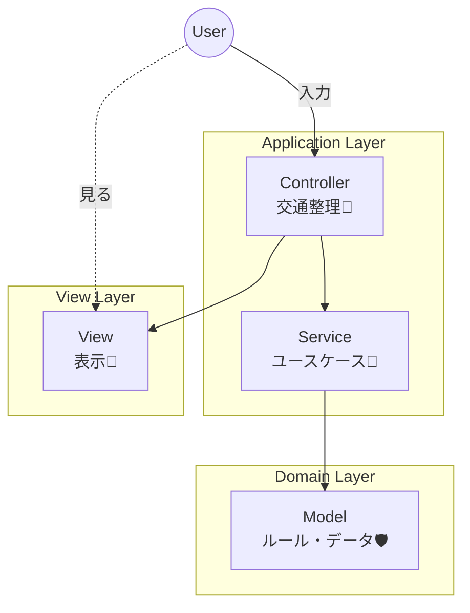
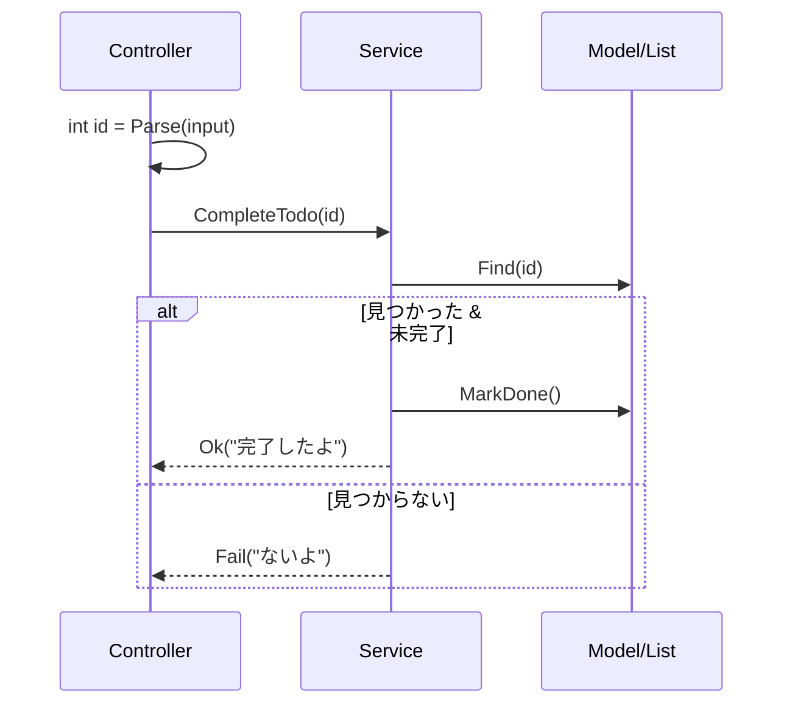

# 第12章：Service層（Controllerを太らせない）🍔➡️🥗

（題材：CampusTodo📚✅）

---

## 0) この章でできるようになること🎯✨

* 「Controllerがやること／やらないこと」をスパッと分けられる✂️✨
* **Fat Controller（太りすぎController）** を回避できる💪😤
* 追加・完了みたいな処理を **Service層に移して整理**できる🧼🧺
* 次の章（保存・Repository・DI）にスムーズに進める🚀✨

ちなみに、2026-01-14時点の最新は **.NET 10 / C# 14** だよ〜🧁（.NET 10の最新SDK更新も2026-01-13付） ([Microsoft][1])
Visual Studioも **Visual Studio 2026** が案内されてるよ🛠️✨ ([Microsoft Learn][2])

---

## 1) まず「Fat Controller」ってなに？😵‍💫🍔


Controllerが、こんな感じになってくるやつ👇

* コマンド文字列の解析（入力パース）もする🧾
* Todoの追加ロジック（ルール）も書く🧠
* 表示用の整形もする🎨
* エラーメッセージも考える💬
* どんどんifが増えて巨大化😇

結果どうなる？

* 同じロジックがあちこちにコピペされがち📎
* 仕様変更が入ると「どこ直すの？😱」ってなる
* テストしづらい（Controllerは外部入力が多いから）🧪🥲

---

## 2) Service層ってなにをするの？🥗✨

一言でいうと…

> **「アプリとしての処理（ユースケース）」をまとめる場所**🧠✨

たとえば CampusTodo のユースケースはこんな感じ👇

* Todoを追加する➕
* Todoを完了にする✅
* Todoを編集する✏️
* Todoを削除する🗑️
* 検索する🔍

この「やりたいこと（ユースケース）」を **Serviceが担当**して、Controllerは**交通整理**だけに寄せるのがコツ🚦✨
（アプリケーション層の考え方として、Microsoftのアーキテクチャ資料でも “Application layer” として説明されてるよ） ([Microsoft Learn][3])

---

## 3) MVC + Service の形（イメージ図）🗺️✨


### ✅ 目標の依存の流れ

* **Controller → Service → Model**
* **Controller → View**（表示）
* ModelがViewやControllerを知らない（逆流しない）🚫



ざっくり図👇

```text
[User入力] → Controller → Service → Model
                     ↓
                   View（表示）
```

---

## 4) 「どこに何を書く？」判断基準🚦🧠✨

### Controllerに書く✅（交通整理）

* 入力を受け取る（文字列）🧾
* コマンドを振り分ける（routing）🗺️
* 形式チェック（数値か？日付か？）みたいな **薄いチェック**🔎
* Serviceを呼ぶ📞
* 結果をViewへ渡す🎁

### Serviceに書く✅（ユースケース）

* 「Todoを追加する」等の **手順**（作る→保存→整形して返す…）🔁
* 「完了済みなら完了にできない」みたいな **業務寄り判断**🧠
* 複数のModel操作をまとめる🧩

### Modelに書く✅（守るべきルール・状態）

* TodoItemの不変条件🛡️
* 状態変更（MarkDoneとか）✅
* 「無効な状態を作らない」仕組み💪

### Viewに書く✅（見せ方だけ）

* 文字の整形、一覧の見せ方、色（Consoleなら記号）🎨✨
* ロジックは混ぜない🙅‍♀️

---

## 5) 実装してみよう：TodoServiceを作る🧑‍🍳🥗✨

### 5-1) フォルダ構成（おすすめ）📁

* Models
* Views
* Controllers
* **Services** ← ここを追加✨

---

### 5-2) Result（成功/失敗）を軽く用意する🎁✨

Controllerに「例外処理地獄」を持ち込みたくないので、まずは軽いResultでいこ〜😌🌸

```csharp
namespace CampusTodo;

public sealed record AppResult(bool IsSuccess, string Message)
{
    public static AppResult Ok(string message = "OKだよ✨") => new(true, message);
    public static AppResult Fail(string message) => new(false, message);
}
```

---

### 5-3) TodoService（追加・完了）を作る🥗✅

ここではまだ永続化しないので、いったん **List<TodoItem>** を握ってOK👌✨
（保存は次の章以降で綺麗に分離する💾）

```csharp
using System;
using System.Collections.Generic;
using System.Linq;

namespace CampusTodo.Services;

public sealed class TodoService
{
    private readonly List<TodoItem> _items;

    public TodoService(List<TodoItem> items)
    {
        _items = items;
    }

    public AppResult AddTodo(string title, DateOnly? dueDate, int importance)
    {
        // Model側のルールに乗せるのが理想（TryCreateなど）
        if (string.IsNullOrWhiteSpace(title))
            return AppResult.Fail("タイトルが空っぽだと登録できないよ🥲");

        if (importance is < 1 or > 5)
            return AppResult.Fail("重要度は1〜5でお願い🙏✨");

        if (dueDate is not null && dueDate.Value < DateOnly.FromDateTime(DateTime.Today))
            return AppResult.Fail("期限が過去になってるかも…！日付を見直してね📅💦");

        var nextId = (_items.Count == 0) ? 1 : _items.Max(x => x.Id) + 1;

        var item = new TodoItem(
            id: nextId,
            title: title.Trim(),
            dueDate: dueDate,
            importance: importance
        );

        _items.Add(item);

        return AppResult.Ok($"追加したよ〜🎉：{item.Title}");
    }

    public AppResult CompleteTodo(int id)
    {
        var item = _items.FirstOrDefault(x => x.Id == id);
        if (item is null)
            return AppResult.Fail("その番号のTodoが見つからないよ🥲");

        if (item.IsDone)
            return AppResult.Fail("それ、もう完了してるよ〜✅✨");

        item.MarkDone();
        return AppResult.Ok($"完了にしたよ✅：{item.Title}");
    }
}
```

>   * `"done 3"` の `"3"` を int にするのはController
>   * `CompleteTodo(3)` はService



---

### 5-4) Controllerを痩せさせる🚦✨

Controllerは「振り分け＆呼び出し」に集中💪

```csharp
using System;

namespace CampusTodo.Controllers;

public sealed class TodoController
{
    private readonly TodoService _service;
    private readonly TodoView _view;

    public TodoController(TodoService service, TodoView view)
    {
        _service = service;
        _view = view;
    }

    public void Handle(string input)
    {
        var parts = input.Split(' ', 2, StringSplitOptions.RemoveEmptyEntries);
        if (parts.Length == 0) return;

        var command = parts[0].ToLowerInvariant();
        var args = (parts.Length == 2) ? parts[1] : "";

        switch (command)
        {
            case "add":
                HandleAdd(args);
                break;

            case "done":
                HandleDone(args);
                break;

            default:
                _view.ShowMessage("コマンドがわからないよ🥲（add / done / list ...）");
                break;
        }
    }

    private void HandleAdd(string args)
    {
        // 例： add レポート作成 | 2026-02-01 | 3
        var tokens = args.Split('|', StringSplitOptions.TrimEntries);

        var title = tokens.Length >= 1 ? tokens[0] : "";
        DateOnly? due = null;
        var importance = 3;

        if (tokens.Length >= 2 && DateOnly.TryParse(tokens[1], out var d))
            due = d;

        if (tokens.Length >= 3 && int.TryParse(tokens[2], out var p))
            importance = p;

        var result = _service.AddTodo(title, due, importance);
        _view.ShowResult(result);
    }

    private void HandleDone(string args)
    {
        if (!int.TryParse(args, out var id))
        {
            _view.ShowMessage("done の後は番号を入れてね🥺（例：done 2）");
            return;
        }

        var result = _service.CompleteTodo(id);
        _view.ShowResult(result);
    }
}
```

---

## 6) ミニ演習：追加/完了をServiceに移す🔁✨（やることリスト✅）

1. `Services` フォルダを作る📁
2. `TodoService` を作る🥗
3. Controllerの `Add` / `Done` の “中身の処理” を Service へ移す✂️
4. Controllerは「入力パース→Service呼び出し→View表示」だけにする🚦
5. 動作確認：

   * `add レポート | 2026-02-01 | 3` が追加できる🎉
   * `done 1` が完了できる✅

---

## 7) よくある落とし穴⚠️😵‍💫

* **Serviceが“第二のController”になって太る**🍔
  → ユースケース単位でメソッドを分けて、長くなったら小さく分割✂️
* **Controllerが相変わらず全部知ってる**🙅‍♀️
  → 「Serviceに渡す前に文字列処理しすぎてない？」をチェック👀
* **ModelのルールがServiceに散らばる**🧩💥
  → “状態としてダメ”はModel側へ（第9章の気持ち）🛡️✨

---

## 8) AI活用（この章向け）🤖💡✨

そのまま丸のみ禁止〜🙅‍♀️✨（でも相棒としては最強💪）

### 使いやすいお願い文（コピペOK）📝

* 「このControllerのadd/done処理をService層に移したいです。Controllerは入力パースと結果表示だけにして、Serviceにユースケースを寄せた設計案と差分をください」
* 「Fat Controllerになってる箇所を指摘して、Serviceへ移す優先順位をつけて」
* 「Service/Model/View/Controllerの責務が混ざってないかレビューして、混ざってる行を理由付きで教えて」

### AIの回答をチェックする観点🔍✨

* Controllerに **業務判断**（完了済み判定とか）が残ってない？
* Serviceが **文字列パース**してない？（それはController寄り）
* Modelの不変条件が守られてる？🛡️

---

## 9) 理解度チェック（ミニクイズ）🧠✨

1. `done 3` の `"3"` を `int` に変換するのはどこ？🤔
2. 「完了済みをもう一回完了にできない」判断はどこ？🤔
3. 「期限を“あと3日”表示」にするのはどこ？🤔

✅答え（目安）

1. Controller / 2) Service（or Model寄りでもOK） / 3) ViewModel or View 🎀

---

## 次章チラ見せ👀✨

次は **保存（永続化）** に入るよ〜💾✨
今Service層を作っておくと、保存先を足してもControllerが太らなくて最高🥳

「今のCampusTodoのコード構成（Controller/Model/View）貼ってくれたら、**あなたの実コード**をベースに“どこをServiceに移すか”を一緒に仕分けするよ〜🧁✨

[1]: https://dotnet.microsoft.com/en-US/download/dotnet/10.0?utm_source=chatgpt.com "Download .NET 10.0 (Linux, macOS, and Windows) | .NET"
[2]: https://learn.microsoft.com/en-us/visualstudio/releases/2026/release-notes?utm_source=chatgpt.com "Visual Studio 2026 Release Notes"
[3]: https://learn.microsoft.com/en-us/dotnet/architecture/microservices/microservice-ddd-cqrs-patterns/microservice-application-layer-implementation-web-api?utm_source=chatgpt.com "Implementing the microservice application layer using ..."
