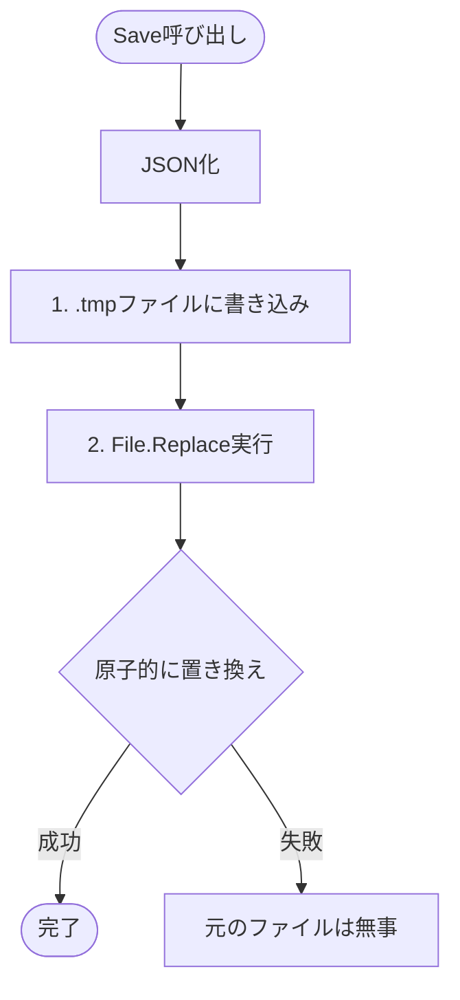

# 第13章：永続化①：保存の境界を作る（まずはファイル保存でもOK）💾📦

> 今日いちばん新しいところだけメモしておくね📝
> **.NET は 10.0.2 が最新（2026-01-13）**で、Visual Studio 2026 のアップデートも **2026-01-13** に出てるよ〜！🚀 ([Microsoft][1])

---

## 1) この章のゴール🎯✨

* Todo が **終了→再起動しても残る**ようになる🎉
* 「保存」を **Model の外側**に置いて、あとで差し替えやすい形にする🔁🧼
* 壊れにくい保存（途中終了しても壊れにくい）を “それっぽく” 入門する🛡️💾

---

## 2) まず考え方：永続化は「アプリの外」🌍➡️📦


保存先（ファイル/DB/クラウド）はアプリから見ると **外の世界**だよね🌏
なので Model に `Save()` とかを書き始めると、Model が急に「外界の事情」に詳しくなってしまう…😵‍💫

そこでこの章の合言葉はこれ👇

* **Model：やりたいこと・守りたいルール**📦
* **View：見せ方**👀
* **Controller/Service：操作の流れ**🚦
* **保存：外部との接続（インフラ）**🔌💾

---

## 3) 今回の保存方針（いちばん気楽で、あとで置き換えやすい）🍀

### 保存形式：JSON にする📄✨

* 人間が開いて読める（デバッグが超ラク）👀
* まずは最短で成功体験つくれる🎉
* すぐ DB（SQLite 等）へ移行できる（次の章でやる）🔁

`System.Text.Json` を使うよ〜！
「JSON を文字列 or ファイルに書くには `JsonSerializer.Serialize`」が基本だよ🧠✨ ([Microsoft Learn][2])

---

## 4) 保存場所：ユーザーごとのデータ領域に置く📁🪟

おすすめは **LocalApplicationData**（ユーザーごとの安全な場所）にアプリ用フォルダを作るやり方💡
`Environment.GetFolderPath(Environment.SpecialFolder.LocalApplicationData)` が王道だよ〜！ ([Microsoft Learn][3])

例：
`%LOCALAPPDATA%\CampusTodo\campus-todo.json` 🗂️✨

---

## 5) ファイルが壊れにくい保存のコツ（超入門）🛡️💾


いきなり本番ファイルに上書きすると、書き込み途中で落ちたときに壊れがち😇
そこでよくある作戦👇

1. **一時ファイルに書く**（例：`campus-todo.json.tmp`）✍️
2. **置き換える**（必要ならバックアップも作る）🔁

`.NET` には **File.Replace** があって、置き換え＋バックアップができるよ🧯 ([Microsoft Learn][4])

---

## 6) 実装：保存専用クラスを 1 個作ろう🧱✨

### 6-1) まず「保存用の型（DTO）」を用意する📦

Model は “アプリの中心” だから、**保存の都合で Model をいじらない**方向にするよ〜🧼✨
（今は同じ形でもOKだけど、分ける癖をつけると後が楽🥳）

```csharp
// Infrastructure/TodoFileFormat.cs
namespace CampusTodo.Infrastructure;

public sealed record TodoItemDto(
    int Id,
    string Title,
    bool IsDone,
    DateTime CreatedAt,
    DateTime? DueAt
);

public sealed record TodoFileData(
    int SchemaVersion,
    int NextId,
    List<TodoItemDto> Items
);
```

* `SchemaVersion` は将来の拡張用（データ構造が変わっても移行しやすい）🧠✨
* `NextId` を保存しておくと、再起動してもIDが衝突しにくい🔢👍

---

### 6-2) 保存・読み込みクラス（ファイル担当）を作る💾🧰

ポイントはここ👇

* 読み込み：無ければ空で開始
* 壊れてたら “壊れてるよ” を伝えつつ空で開始（落とさない）🧯
* 保存：temp に書いて `File.Replace` で置換（バックアップも）🧷

```csharp
// Infrastructure/TodoFileStore.cs
using System.Text;
using System.Text.Json;

namespace CampusTodo.Infrastructure;

public sealed class TodoFileStore
{
    private readonly string _filePath;
    private readonly JsonSerializerOptions _jsonOptions = new()
    {
        WriteIndented = true // 読みやすいJSONにする🪄
    };

    public TodoFileStore(string filePath)
    {
        _filePath = filePath;
    }

    public TodoFileData LoadOrNew()
    {
        if (!File.Exists(_filePath))
        {
            return NewEmpty();
        }

        try
        {
            var json = File.ReadAllText(_filePath, Encoding.UTF8);
            var data = JsonSerializer.Deserialize<TodoFileData>(json, _jsonOptions);
            return data ?? NewEmpty();
        }
        catch
        {
            // 壊れた JSON の可能性：いったん空で開始（落とさない）🧯
            return NewEmpty();
        }
    }

    public void Save(TodoFileData data)
    {
        EnsureDirectory();

        var json = JsonSerializer.Serialize(data, _jsonOptions);

        var tmp = _filePath + ".tmp";
        var bak = _filePath + ".bak";

        // 1) まず temp に書く✍️
        File.WriteAllText(tmp, json, Encoding.UTF8); // 既存があれば上書きされる :contentReference[oaicite:4]{index=4}

        // 2) 置き換え（バックアップも）🔁
        if (File.Exists(_filePath))
        {
            File.Replace(tmp, _filePath, bak, ignoreMetadataErrors: true); // 置換＋バックアップ :contentReference[oaicite:5]{index=5}
        }
        else
        {
            File.Move(tmp, _filePath);
        }
    }

    private void EnsureDirectory()
    {
        var dir = Path.GetDirectoryName(_filePath);
        if (!string.IsNullOrWhiteSpace(dir))
        {
            Directory.CreateDirectory(dir);
        }
    }

    private static TodoFileData NewEmpty()
        => new(SchemaVersion: 1, NextId: 1, Items: new List<TodoItemDto>());
}
```



> ちょい注意⚠️
> .NET 10 から `System.Text.Json` は、特定条件で `$type` / `$id` / `$ref` みたいな “メタデータ用の名前” と衝突するプロパティがあるとエラーを早めに出すようになってるよ〜（変な JSON を作らないため）🛡️ ([Microsoft Learn][5])
> （普通の Todo ならまず踏まないけど、「Type」みたいな名前を多用するときは思い出してね🧠）

---

### 6-3) 保存パスを作るヘルパー📁✨

```csharp
// Infrastructure/AppPaths.cs
namespace CampusTodo.Infrastructure;

public static class AppPaths
{
    public static string TodoDataFilePath()
    {
        var baseDir = Environment.GetFolderPath(Environment.SpecialFolder.LocalApplicationData);
        return Path.Combine(baseDir, "CampusTodo", "campus-todo.json");
    }
}
```

`SpecialFolder` は “特殊フォルダの種類” を表すやつだよ🗂️ ([Microsoft Learn][3])

---

## 7) アプリに接続：起動時ロード＆更新時オートセーブ🔁💾

ここは超シンプルにいこう〜！✨

* 起動時：ファイル読み込み → Service に初期データを渡す
* 変更（add/done/edit/delete）したら：保存する

### 7-1) Service に「入出力」メソッドを足す（最小改造）🧩

```csharp
// Services/TodoService.cs（例：必要なところだけ）
using CampusTodo.Infrastructure;

public sealed class TodoService
{
    private readonly List<TodoItem> _items;
    private int _nextId;

    public TodoService(IEnumerable<TodoItem> initialItems, int nextId)
    {
        _items = new List<TodoItem>(initialItems);
        _nextId = nextId;
    }

    public IReadOnlyList<TodoItem> GetAll() => _items;

    public TodoItem Add(string title, DateTime? dueAt)
    {
        var item = new TodoItem(_nextId++, title, createdAt: DateTime.Now, dueAt: dueAt);
        _items.Add(item);
        return item;
    }

    // done/edit/delete ...（この章では省略）

    // 保存用スナップショット（DTOへ変換）
    public TodoFileData ExportForSave()
    {
        var dtos = _items.Select(x => new TodoItemDto(
            Id: x.Id,
            Title: x.Title,
            IsDone: x.IsDone,
            CreatedAt: x.CreatedAt,
            DueAt: x.DueAt
        )).ToList();

        return new TodoFileData(
            SchemaVersion: 1,
            NextId: _nextId,
            Items: dtos
        );
    }
}
```

※ `TodoItem` 側は、ここまでで作ってきた形に合わせて読み替えてね〜（プロパティ名はプロジェクトの実物優先でOK）😊✨

---

### 7-2) Program でロードして、Controller から “更新のたびに保存” する🎮💾

（Controller/Service の設計はプロジェクトに合わせて微調整OKだよ〜！）

```csharp
// Program.cs（例）
using CampusTodo.Infrastructure;

var store = new TodoFileStore(AppPaths.TodoDataFilePath());

// 起動時にロード📥
var data = store.LoadOrNew();

// Service 初期化🌱
var service = new TodoService(
    initialItems: data.Items.Select(dto => new TodoItem(
        dto.Id, dto.Title, dto.CreatedAt, dto.DueAt, dto.IsDone
    )),
    nextId: data.NextId
);

// 例：何か変更が起きたタイミングで保存する関数を用意🪄
void SaveNow()
{
    store.Save(service.ExportForSave());
}

// あとは Controller の add/done/edit/delete のあとに SaveNow() を呼ぶだけ🎉
```

> 「毎回保存って重くない？」と思ったら：
> Todo 程度なら全然OKなことが多いよ〜😊
> 重くなってきたら「一定間隔」「終了時」「変更があったら数秒後にまとめて」みたいに進化させればOK🧠✨

---

## 8) ミニ演習✅🎓✨（この章の勝ち筋）

### 演習A：再起動しても残る🎉

1. Todo を 3 件追加✍️
2. アプリ終了👋
3. 再起動🚀
4. 3 件が残ってたらクリア✅

### 演習B：JSON をのぞいてみる👀📄

* `campus-todo.json` をエディタで開く
* ちゃんと `Items` が入ってるのを確認✨
* `WriteIndented = true` のおかげで読みやすいはず〜🪄

---

## 9) よくあるつまずき集😵‍💫🧯

* **保存されない**
  → 保存の呼び出しが「追加/完了/編集/削除」の後に入ってるかチェック✅
* **読み込みで落ちる**
  → `LoadOrNew()` は例外を飲んで空にしてるので、落ちるなら別の場所で例外が出てるかも👀
* **文字化け**
  → `Encoding.UTF8` を指定しているか確認（サンプルは指定済み）🧠

---

## 10) AI活用🤖💡（この章での使いどころ）

Copilot / Codex に投げるなら、こういうお願いが強いよ〜✨

* 「`TodoFileStore` に `LoadOrNew()` と `Save()` を作って。temp ファイル→置換の流れで」🧰💾
* 「`TodoItem` と `TodoItemDto` の相互変換コードだけ作って（命名はプロジェクト準拠で）」🔁
* 「読み込み失敗時の挙動案を3つ（初心者向けに）」🧯💬

最後にひとこと：**生成されたコードは、必ず “保存先パス” と “例外時の挙動” だけは自分の目でチェック**してね〜！👀✨

---

## 次章予告📣✨

次はここまでの `TodoFileStore` を **Repository にして差し替え可能**にするよ〜！🔁🧲
「ファイル保存→SQLite保存」に移行するときに、上の層がほぼノーダメになるのが気持ちいいやつ🥳

[1]: https://dotnet.microsoft.com/en-US/download/dotnet/10.0 "Download .NET 10.0 (Linux, macOS, and Windows) | .NET"
[2]: https://learn.microsoft.com/en-us/dotnet/standard/serialization/system-text-json/how-to?utm_source=chatgpt.com "How to serialize JSON in C# - .NET"
[3]: https://learn.microsoft.com/ja-jp/dotnet/api/system.environment.specialfolder?view=net-8.0&utm_source=chatgpt.com "Environment.SpecialFolder 列挙型 (System)"
[4]: https://learn.microsoft.com/en-us/dotnet/api/system.io.file.replace?view=net-10.0&utm_source=chatgpt.com "File.Replace Method (System.IO)"
[5]: https://learn.microsoft.com/en-us/dotnet/core/compatibility/serialization/10/property-name-validation "Breaking change: System.Text.Json checks for property name conflicts - .NET | Microsoft Learn"
