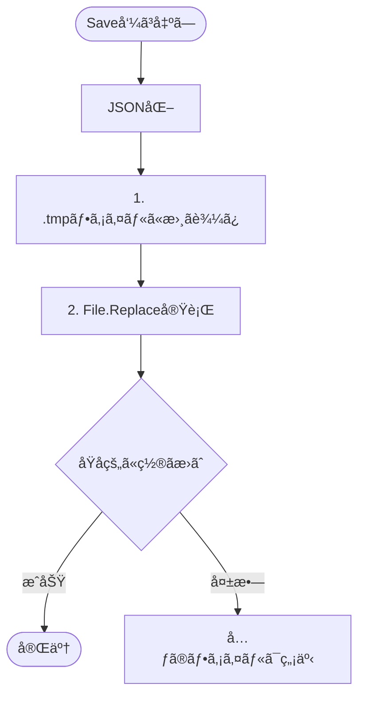

# 第13章：永続化①：ä¿å­˜ã®å¢ƒç•Œã‚’作る（ã¾ãšã¯ãƒ•ã‚¡ã‚¤ãƒ«ä¿å­˜ã§ã‚‚OK）💾📦

> 今日ã„ã¡ã°ã‚“æ–°ã—ã„ã¨ã“ã‚ã ã‘メモã—ã¦ãŠãã­ğŸ“
> **.NET 㯠10.0.2 ãŒæœ€æ–°ï¼ˆ2026-01-13）**ã§ã€Visual Studio 2026 ã®ã‚¢ãƒƒãƒ—デートも **2026-01-13** ã«å‡ºã¦ã‚‹ã‚ˆã€œï¼ğŸš€ ([Microsoft][1])

---

## 1) ã“ã®ç« ã®ã‚´ãƒ¼ãƒ«ğŸ¯âœ¨

* Todo ㌠**終了→å†èµ·å‹•ã—ã¦ã‚‚残る**よã†ã«ãªã‚‹ğŸ‰
* 「ä¿å­˜ã€ã‚’ **Model ã®å¤–å´**ã«ç½®ã„ã¦ã€ã‚ã¨ã§å·®ã—替ãˆã‚„ã™ã„å½¢ã«ã™ã‚‹ğŸ”🧼
* 壊れã«ãã„ä¿å­˜ï¼ˆé€”中終了ã—ã¦ã‚‚壊れã«ãã„）を “ãã‚Œã£ã½ã†入門ã™ã‚‹ğŸ›¡ï¸ğŸ’¾

---

## 2) ã¾ãšè€ƒãˆæ–¹ï¼šæ°¸ç¶šåŒ–ã¯ã€Œã‚¢ãƒ—リã®å¤–ã€ğŸŒâ¡ï¸ğŸ“¦


ä¿å­˜å…ˆï¼ˆãƒ•ã‚¡ã‚¤ãƒ«/DB/クラウド）ã¯ã‚¢ãƒ—リã‹ã‚‰è¦‹ã‚‹ã¨ **外ã®ä¸–ç•Œ**ã ã‚ˆã­ğŸŒ
ãªã®ã§ Model ã« `Save()` ã¨ã‹ã‚’書ã始ã‚ã‚‹ã¨ã€Model ãŒæ€¥ã«ã€Œå¤–ç•Œã®äº‹æƒ…ã€ã«è©³ã—ããªã£ã¦ã—ã¾ã†â€¦ğŸ˜µâ€ğŸ’«

ãã“ã§ã“ã®ç« ã®åˆè¨€è‘‰ã¯ã“れ👇

* **Model：やりãŸã„ã“ã¨ãƒ»å®ˆã‚ŠãŸã„ルール**📦
* **View：見ã›æ–¹**👀
* **Controller/Service：æ“作ã®æµã‚Œ**🚦
* **ä¿å­˜ï¼šå¤–部ã¨ã®æ¥ç¶šï¼ˆã‚¤ãƒ³ãƒ•ãƒ©ï¼‰**🔌💾

---

## 3) 今å›ã®ä¿å­˜æ–¹é‡ï¼ˆã„ã¡ã°ã‚“気楽ã§ã€ã‚ã¨ã§ç½®ãæ›ãˆã‚„ã™ã„）ğŸ€


### ä¿å­˜å½¢å¼ï¼šJSON ã«ã™ã‚‹ğŸ“„✨

* 人間ãŒé–‹ã„ã¦èª­ã‚る（デãƒãƒƒã‚°ãŒè¶…ラク）👀
* ã¾ãšã¯æœ€çŸ­ã§æˆåŠŸä½“験ã¤ãれるğŸ‰
* ã™ã DB（SQLite 等）ã¸ç§»è¡Œã§ãる（次ã®ç« ã§ã‚„る）ğŸ”

`System.Text.Json` を使ã†ã‚ˆã€œï¼
「JSON を文字列 or ファイルã«æ›¸ãã«ã¯ `JsonSerializer.Serialize`ã€ãŒåŸºæœ¬ã ã‚ˆğŸ§ âœ¨ ([Microsoft Learn][2])

---

## 4) ä¿å­˜å ´æ‰€ï¼šãƒ¦ãƒ¼ã‚¶ãƒ¼ã”ã¨ã®ãƒ‡ãƒ¼ã‚¿é ˜åŸŸã«ç½®ãğŸ“🪟


ãŠã™ã™ã‚㯠**LocalApplicationData**（ユーザーã”ã¨ã®å®‰å…¨ãªå ´æ‰€ï¼‰ã«ã‚¢ãƒ—リ用フォルダを作るやり方💡
`Environment.GetFolderPath(Environment.SpecialFolder.LocalApplicationData)` ãŒç‹é“ã ã‚ˆã€œï¼ ([Microsoft Learn][3])

例：
`%LOCALAPPDATA%\CampusTodo\campus-todo.json` 🗂ï¸âœ¨

---

## 5) ファイルãŒå£Šã‚Œã«ãã„ä¿å­˜ã®ã‚³ãƒ„（超入門）🛡ï¸ğŸ’¾


ã„ããªã‚Šæœ¬ç•ªãƒ•ã‚¡ã‚¤ãƒ«ã«ä¸Šæ›¸ãã™ã‚‹ã¨ã€æ›¸ãè¾¼ã¿é€”中ã§è½ã¡ãŸã¨ãã«å£Šã‚ŒãŒã¡ğŸ˜‡
ãã“ã§ã‚ˆãã‚る作戦👇

1. **一時ファイルã«æ›¸ã**（例：`campus-todo.json.tmp`）âœï¸
2. **ç½®ãæ›ãˆã‚‹**（必è¦ãªã‚‰ãƒãƒƒã‚¯ã‚¢ãƒƒãƒ—も作る）ğŸ”

`.NET` ã«ã¯ **File.Replace** ãŒã‚ã£ã¦ã€ç½®ãæ›ãˆï¼‹ãƒãƒƒã‚¯ã‚¢ãƒƒãƒ—ãŒã§ãるよ🧯 ([Microsoft Learn][4])

---

## 6) 実装：ä¿å­˜å°‚用クラスを 1 個作ã‚ã†ğŸ§±âœ¨

### 6-1) ã¾ãšã€Œä¿å­˜ç”¨ã®å‹ï¼ˆDTO）ã€ã‚’用æ„ã™ã‚‹ğŸ“¦


Model 㯠“アプリã®ä¸­å¿ƒâ€ ã ã‹ã‚‰ã€**ä¿å­˜ã®éƒ½åˆã§ Model ã‚’ã„ã˜ã‚‰ãªã„**æ–¹å‘ã«ã™ã‚‹ã‚ˆã€œğŸ§¼âœ¨
（今ã¯åŒã˜å½¢ã§ã‚‚OKã ã‘ã©ã€åˆ†ã‘ã‚‹ç™–ã‚’ã¤ã‘ã‚‹ã¨å¾ŒãŒæ¥½ğŸ¥³ï¼‰

```csharp
// Infrastructure/TodoFileFormat.cs
namespace CampusTodo.Infrastructure;

public sealed record TodoItemDto(
    int Id,
    string Title,
    bool IsDone,
    DateTime CreatedAt,
    DateTime? DueAt
);

public sealed record TodoFileData(
    int SchemaVersion,
    int NextId,
    List<TodoItemDto> Items
);
```

* `SchemaVersion` ã¯å°†æ¥ã®æ‹¡å¼µç”¨ï¼ˆãƒ‡ãƒ¼ã‚¿æ§‹é€ ãŒå¤‰ã‚ã£ã¦ã‚‚移行ã—ã‚„ã™ã„）🧠✨
* `NextId` ã‚’ä¿å­˜ã—ã¦ãŠãã¨ã€å†èµ·å‹•ã—ã¦ã‚‚IDãŒè¡çªã—ã«ãã„🔢ğŸ‘

---

### 6-2) ä¿å­˜ãƒ»èª­ã¿è¾¼ã¿ã‚¯ãƒ©ã‚¹ï¼ˆãƒ•ã‚¡ã‚¤ãƒ«æ‹…当）を作る💾🧰


ãƒã‚¤ãƒ³ãƒˆã¯ã“ã“👇

* 読ã¿è¾¼ã¿ï¼šç„¡ã‘ã‚Œã°ç©ºã§é–‹å§‹
* 壊れã¦ãŸã‚‰ “壊れã¦ã‚‹ã‚ˆâ€ ã‚’ä¼ãˆã¤ã¤ç©ºã§é–‹å§‹ï¼ˆè½ã¨ã•ãªã„）🧯
* ä¿å­˜ï¼štemp ã«æ›¸ã„㦠`File.Replace` ã§ç½®æ›ï¼ˆãƒãƒƒã‚¯ã‚¢ãƒƒãƒ—も）🧷

```csharp
// Infrastructure/TodoFileStore.cs
using System.Text;
using System.Text.Json;

namespace CampusTodo.Infrastructure;

public sealed class TodoFileStore
{
    private readonly string _filePath;
    private readonly JsonSerializerOptions _jsonOptions = new()
    {
        WriteIndented = true // 読ã¿ã‚„ã™ã„JSONã«ã™ã‚‹ğŸª„
    };

    public TodoFileStore(string filePath)
    {
        _filePath = filePath;
    }

    public TodoFileData LoadOrNew()
    {
        if (!File.Exists(_filePath))
        {
            return NewEmpty();
        }

        try
        {
            var json = File.ReadAllText(_filePath, Encoding.UTF8);
            var data = JsonSerializer.Deserialize<TodoFileData>(json, _jsonOptions);
            return data ?? NewEmpty();
        }
        catch
        {
            // 壊れ㟠JSON ã®å¯èƒ½æ€§ï¼šã„ã£ãŸã‚“空ã§é–‹å§‹ï¼ˆè½ã¨ã•ãªã„）🧯
            return NewEmpty();
        }
    }

    public void Save(TodoFileData data)
    {
        EnsureDirectory();

        var json = JsonSerializer.Serialize(data, _jsonOptions);

        var tmp = _filePath + ".tmp";
        var bak = _filePath + ".bak";

        // 1) ã¾ãš temp ã«æ›¸ãâœï¸
        File.WriteAllText(tmp, json, Encoding.UTF8); // 既存ãŒã‚ã‚Œã°ä¸Šæ›¸ãã•ã‚Œã‚‹ :contentReference[oaicite:4]{index=4}

        // 2) ç½®ãæ›ãˆï¼ˆãƒãƒƒã‚¯ã‚¢ãƒƒãƒ—も）ğŸ”
        if (File.Exists(_filePath))
        {
            File.Replace(tmp, _filePath, bak, ignoreMetadataErrors: true); // ç½®æ›ï¼‹ãƒãƒƒã‚¯ã‚¢ãƒƒãƒ— :contentReference[oaicite:5]{index=5}
        }
        else
        {
            File.Move(tmp, _filePath);
        }
    }

    private void EnsureDirectory()
    {
        var dir = Path.GetDirectoryName(_filePath);
        if (!string.IsNullOrWhiteSpace(dir))
        {
            Directory.CreateDirectory(dir);
        }
    }

    private static TodoFileData NewEmpty()
        => new(SchemaVersion: 1, NextId: 1, Items: new List<TodoItemDto>());
}
```


```mermaid
flowchart TD
    Start([Save呼ã³å‡ºã—]) --> Serialize[JSON化]
    Serialize --> WriteTmp[1. .tmpファイルã«æ›¸ãè¾¼ã¿]
    WriteTmp --> Replace[2. File.Replace実行]
    Replace --> Atom{åŸå­çš„ã«ç½®ãæ›ãˆ}
    Atom -->|æˆåŠŸ| Done([完了])
    Atom -->|失敗| Safe[å…ƒã®ãƒ•ã‚¡ã‚¤ãƒ«ã¯ç„¡äº‹]
```

> ã¡ã‚‡ã„注æ„âš ï¸
> .NET 10 ã‹ã‚‰ `System.Text.Json` ã¯ã€ç‰¹å®šæ¡ä»¶ã§ `$type` / `$id` / `$ref` ã¿ãŸã„㪠“メタデータ用ã®åå‰â€ ã¨è¡çªã™ã‚‹ãƒ—ロパティãŒã‚ã‚‹ã¨ã‚¨ãƒ©ãƒ¼ã‚’æ—©ã‚ã«å‡ºã™ã‚ˆã†ã«ãªã£ã¦ã‚‹ã‚ˆã€œï¼ˆå¤‰ãª JSON を作らãªã„ãŸã‚ï¼‰ğŸ›¡ï¸ ([Microsoft Learn][5])
> （普通㮠Todo ãªã‚‰ã¾ãšè¸ã¾ãªã„ã‘ã©ã€ã€ŒTypeã€ã¿ãŸã„ãªåå‰ã‚’多用ã™ã‚‹ã¨ãã¯æ€ã„出ã—ã¦ã­ğŸ§ ï¼‰

---

### 6-3) ä¿å­˜ãƒ‘スを作るヘルパーğŸ“✨

```csharp
// Infrastructure/AppPaths.cs
namespace CampusTodo.Infrastructure;

public static class AppPaths
{
    public static string TodoDataFilePath()
    {
        var baseDir = Environment.GetFolderPath(Environment.SpecialFolder.LocalApplicationData);
        return Path.Combine(baseDir, "CampusTodo", "campus-todo.json");
    }
}
```

`SpecialFolder` 㯠“特殊フォルダã®ç¨®é¡â€ を表ã™ã‚„ã¤ã ã‚ˆğŸ—‚ï¸ ([Microsoft Learn][3])

---

## 7) アプリã«æ¥ç¶šï¼šèµ·å‹•æ™‚ロード＆更新時オートセーブğŸ”💾

ã“ã“ã¯è¶…シンプルã«ã„ã“ã†ã€œï¼âœ¨

* 起動時：ファイル読ã¿è¾¼ã¿ → Service ã«åˆæœŸãƒ‡ãƒ¼ã‚¿ã‚’渡ã™
* 変更（add/done/edit/delete）ã—ãŸã‚‰ï¼šä¿å­˜ã™ã‚‹

### 7-1) Service ã«ã€Œå…¥å‡ºåŠ›ã€ãƒ¡ã‚½ãƒƒãƒ‰ã‚’足ã™ï¼ˆæœ€å°æ”¹é€ ï¼‰ğŸ§©


```csharp
// Services/TodoService.cs（例：必è¦ãªã¨ã“ã‚ã ã‘）
using CampusTodo.Infrastructure;

public sealed class TodoService
{
    private readonly List<TodoItem> _items;
    private int _nextId;

    public TodoService(IEnumerable<TodoItem> initialItems, int nextId)
    {
        _items = new List<TodoItem>(initialItems);
        _nextId = nextId;
    }

    public IReadOnlyList<TodoItem> GetAll() => _items;

    public TodoItem Add(string title, DateTime? dueAt)
    {
        var item = new TodoItem(_nextId++, title, createdAt: DateTime.Now, dueAt: dueAt);
        _items.Add(item);
        return item;
    }

    // done/edit/delete ...（ã“ã®ç« ã§ã¯çœç•¥ï¼‰

    // ä¿å­˜ç”¨ã‚¹ãƒŠãƒƒãƒ—ショット（DTOã¸å¤‰æ›ï¼‰
    public TodoFileData ExportForSave()
    {
        var dtos = _items.Select(x => new TodoItemDto(
            Id: x.Id,
            Title: x.Title,
            IsDone: x.IsDone,
            CreatedAt: x.CreatedAt,
            DueAt: x.DueAt
        )).ToList();

        return new TodoFileData(
            SchemaVersion: 1,
            NextId: _nextId,
            Items: dtos
        );
    }
}
```

※ `TodoItem` å´ã¯ã€ã“ã“ã¾ã§ã§ä½œã£ã¦ããŸå½¢ã«åˆã‚ã›ã¦èª­ã¿æ›¿ãˆã¦ã­ã€œï¼ˆãƒ—ロパティåã¯ãƒ—ロジェクトã®å®Ÿç‰©å„ªå…ˆã§OK）😊✨

---

### 7-2) Program ã§ãƒ­ãƒ¼ãƒ‰ã—ã¦ã€Controller ã‹ã‚‰ “更新ã®ãŸã³ã«ä¿å­˜â€ ã™ã‚‹ğŸ®ğŸ’¾

（Controller/Service ã®è¨­è¨ˆã¯ãƒ—ロジェクトã«åˆã‚ã›ã¦å¾®èª¿æ•´OKã ã‚ˆã€œï¼ï¼‰

```csharp
// Program.cs（例）
using CampusTodo.Infrastructure;

var store = new TodoFileStore(AppPaths.TodoDataFilePath());

// 起動時ã«ãƒ­ãƒ¼ãƒ‰ğŸ“¥
var data = store.LoadOrNew();

// Service åˆæœŸåŒ–🌱
var service = new TodoService(
    initialItems: data.Items.Select(dto => new TodoItem(
        dto.Id, dto.Title, dto.CreatedAt, dto.DueAt, dto.IsDone
    )),
    nextId: data.NextId
);

// 例：何ã‹å¤‰æ›´ãŒèµ·ããŸã‚¿ã‚¤ãƒŸãƒ³ã‚°ã§ä¿å­˜ã™ã‚‹é–¢æ•°ã‚’用æ„🪄
void SaveNow()
{
    store.Save(service.ExportForSave());
}

// ã‚ã¨ã¯ Controller ã® add/done/edit/delete ã®ã‚ã¨ã« SaveNow() を呼ã¶ã ã‘ğŸ‰
```

> 「æ¯å›ä¿å­˜ã£ã¦é‡ããªã„？ã€ã¨æ€ã£ãŸã‚‰ï¼š
> Todo 程度ãªã‚‰å…¨ç„¶OKãªã“ã¨ãŒå¤šã„よ〜😊
> é‡ããªã£ã¦ããŸã‚‰ã€Œä¸€å®šé–“éš”ã€ã€Œçµ‚了時ã€ã€Œå¤‰æ›´ãŒã‚ã£ãŸã‚‰æ•°ç§’後ã«ã¾ã¨ã‚ã¦ã€ã¿ãŸã„ã«é€²åŒ–ã•ã›ã‚Œã°OK🧠✨

---

## 8) ミニ演習✅ğŸ“✨（ã“ã®ç« ã®å‹ã¡ç­‹ï¼‰

### 演習A：å†èµ·å‹•ã—ã¦ã‚‚残るğŸ‰

1. Todo ã‚’ 3 件追加âœï¸
2. アプリ終了👋
3. å†èµ·å‹•ğŸš€
4. 3 件ãŒæ®‹ã£ã¦ãŸã‚‰ã‚¯ãƒªã‚¢âœ…

### 演習B：JSON ã‚’ã®ãã„ã¦ã¿ã‚‹ğŸ‘€ğŸ“„

* `campus-todo.json` をエディタã§é–‹ã
* ã¡ã‚ƒã‚“㨠`Items` ãŒå…¥ã£ã¦ã‚‹ã®ã‚’確èªâœ¨
* `WriteIndented = true` ã®ãŠã‹ã’ã§èª­ã¿ã‚„ã™ã„ã¯ãšã€œğŸª„

---

## 9) よãã‚ã‚‹ã¤ã¾ãšã集😵â€ğŸ’«ğŸ§¯

* **ä¿å­˜ã•ã‚Œãªã„**
  → ä¿å­˜ã®å‘¼ã³å‡ºã—ãŒã€Œè¿½åŠ /完了/編集/削除ã€ã®å¾Œã«å…¥ã£ã¦ã‚‹ã‹ãƒã‚§ãƒƒã‚¯âœ…
* **読ã¿è¾¼ã¿ã§è½ã¡ã‚‹**
  → `LoadOrNew()` ã¯ä¾‹å¤–を飲んã§ç©ºã«ã—ã¦ã‚‹ã®ã§ã€è½ã¡ã‚‹ãªã‚‰åˆ¥ã®å ´æ‰€ã§ä¾‹å¤–ãŒå‡ºã¦ã‚‹ã‹ã‚‚👀
* **文字化ã‘**
  → `Encoding.UTF8` を指定ã—ã¦ã„ã‚‹ã‹ç¢ºèªï¼ˆã‚µãƒ³ãƒ—ルã¯æŒ‡å®šæ¸ˆã¿ï¼‰ğŸ§ 

---

## 10) AI活用🤖💡（ã“ã®ç« ã§ã®ä½¿ã„ã©ã“ã‚）

Copilot / Codex ã«æŠ•ã’ã‚‹ãªã‚‰ã€ã“ã†ã„ã†ãŠé¡˜ã„ãŒå¼·ã„よ〜✨

* 「`TodoFileStore` ã« `LoadOrNew()` 㨠`Save()` を作ã£ã¦ã€‚temp ファイル→置æ›ã®æµã‚Œã§ã€ğŸ§°ğŸ’¾
* 「`TodoItem` 㨠`TodoItemDto` ã®ç›¸äº’変æ›ã‚³ãƒ¼ãƒ‰ã ã‘作ã£ã¦ï¼ˆå‘½åã¯ãƒ—ロジェクト準拠ã§ï¼‰ã€ğŸ”
* 「読ã¿è¾¼ã¿å¤±æ•—時ã®æŒ™å‹•æ¡ˆã‚’3ã¤ï¼ˆåˆå¿ƒè€…å‘ã‘ã«ï¼‰ã€ğŸ§¯ğŸ’¬

最後ã«ã²ã¨ã“ã¨ï¼š**生æˆã•ã‚ŒãŸã‚³ãƒ¼ãƒ‰ã¯ã€å¿…㚠“ä¿å­˜å…ˆãƒ‘ス†㨠“例外時ã®æŒ™å‹•â€ ã ã‘ã¯è‡ªåˆ†ã®ç›®ã§ãƒã‚§ãƒƒã‚¯**ã—ã¦ã­ã€œï¼ğŸ‘€âœ¨

---

## 次章予告📣✨

次ã¯ã“ã“ã¾ã§ã® `TodoFileStore` ã‚’ **Repository ã«ã—ã¦å·®ã—替ãˆå¯èƒ½**ã«ã™ã‚‹ã‚ˆã€œï¼ğŸ”🧲
「ファイルä¿å­˜â†’SQLiteä¿å­˜ã€ã«ç§»è¡Œã™ã‚‹ã¨ãã«ã€ä¸Šã®å±¤ãŒã»ã¼ãƒãƒ¼ãƒ€ãƒ¡ã«ãªã‚‹ã®ãŒæ°—æŒã¡ã„ã„ã‚„ã¤ğŸ¥³

[1]: https://dotnet.microsoft.com/en-US/download/dotnet/10.0 "Download .NET 10.0 (Linux, macOS, and Windows) | .NET"
[2]: https://learn.microsoft.com/en-us/dotnet/standard/serialization/system-text-json/how-to?utm_source=chatgpt.com "How to serialize JSON in C# - .NET"
[3]: https://learn.microsoft.com/ja-jp/dotnet/api/system.environment.specialfolder?view=net-8.0&utm_source=chatgpt.com "Environment.SpecialFolder åˆ—æŒ™å‹ (System)"
[4]: https://learn.microsoft.com/en-us/dotnet/api/system.io.file.replace?view=net-10.0&utm_source=chatgpt.com "File.Replace Method (System.IO)"
[5]: https://learn.microsoft.com/en-us/dotnet/core/compatibility/serialization/10/property-name-validation "Breaking change: System.Text.Json checks for property name conflicts - .NET | Microsoft Learn"
