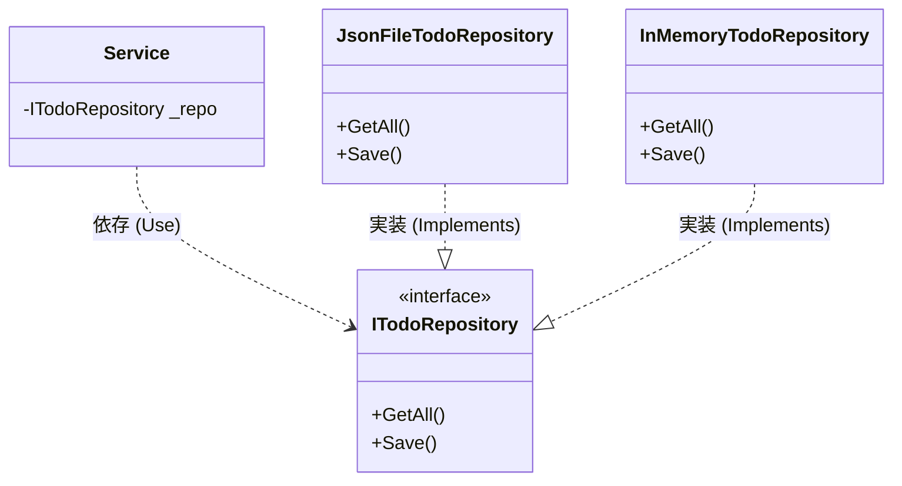
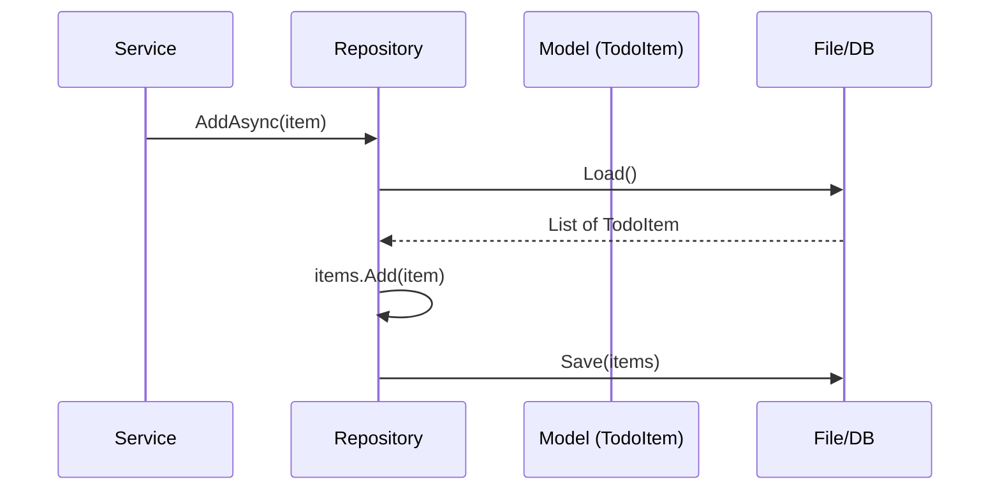

# 第14章：永続化②：Repositoryで差し替え可能にする🔁🧲

この章は、「保存する場所（JSONファイル/SQLite/クラウド）を変えたくなっても、上の層（Service/Controller）が壊れないようにする」回だよ〜！✨
いまどきの .NET は **.NET 10（LTS）** が最新ラインで、**Visual Studio 2026** と一緒に使うのが自然な流れだよ🪟🛠️（2025-11-11 リリース、LTSで2028年までサポート） ([Microsoft][1])

---

## この章のゴール🎯✨

できるようになることはこの3つ！

* 保存先を **interface（抽象）** の後ろに隠せる🫣🧩
* Service が **「ファイル」「JSON」** を知らなくなる（責務分離できる）🧼✨
* Repository を差し替えてもアプリが動く（DIP入門）🔁💪

---

## なんでRepositoryが必要なの？🤔💡


第13章で「ファイルに保存できた！🎉」ってなったあと、だいたいこうなるの👇

* 「SQLiteにしたい…」🗄️
* 「クラウドに置きたい…」☁️
* 「テストのときだけメモリ保存にしたい…」🧪🧸

でも保存処理が Service にベタ書きだと、こうなる😇

* Service が肥える🍔（Fat Service）
* 変更が怖くなる😱
* テストがしんどい😭

そこで Repository！🧲
Repository は「保存の出入口（倉庫の受付）」みたいな役だよ📦🚪

---

## 今日の主役：DIP（依存関係逆転）の超やさしい感覚🔄🧠


**DIPの気持ち：**



「Service（上の偉い人）が、FileRepository（具体）に依存しないで、**ITodoRepository（約束）**に依存しようね」ってこと🌸

### Before（つらい）😵‍💫

Service → JSONファイルの読み書き（具体）に直依存💥

### After（うれしい）🥰

Service → **ITodoRepository（抽象）**
JsonFileTodoRepository / InMemoryTodoRepository はあとで自由に差し替えOK✨

---

## ざっくり完成図🗺️✨

* Controller：コマンド受け取り＆呼び出し係🎮
* Service：アプリの処理の中心🥗
* Repository：保存（外部）との境界💾
* Model：ルールとデータ🛡️📦

---

## 実装ステップ①：Repositoriesフォルダを作る📁✨


プロジェクトにこういう構成を足すイメージ👇

* `Models/`
* `Services/`
* `Controllers/`
* `Views/`
* `Repositories/` ← ここ追加💖

---

## 実装ステップ②：まずは“最小の約束”を決める（interface）🧩✍️


`Repositories/ITodoRepository.cs` を作るよ✨
ポイントは **「最小」** にすること！✂️（最初から盛りすぎない）

```csharp
using System;
using System.Collections.Generic;
using System.Threading.Tasks;
using CampusTodo.Models;

namespace CampusTodo.Repositories;

public interface ITodoRepository
{
    Task<IReadOnlyList<TodoItem>> GetAllAsync();
    Task AddAsync(TodoItem item);
    Task UpdateAsync(TodoItem item);
    Task DeleteAsync(Guid id);
}
```

> ✅ `Guid id` を使うと「順番が変わっても同じTodoを指せる」から、あとあと楽だよ〜🧷✨

---

## 実装ステップ③：JSONファイル版Repositoryを作る💾📄✨

`Repositories/JsonFileTodoRepository.cs` を作るよ！
保存先は Windows の `LocalApplicationData`（ユーザーごとの安全な場所）に置くのが無難👍🪟

```csharp
using System;
using System.Collections.Generic;
using System.IO;
using System.Linq;
using System.Text.Json;
using System.Threading;
using System.Threading.Tasks;
using CampusTodo.Models;

namespace CampusTodo.Repositories;

public sealed class JsonFileTodoRepository : ITodoRepository
{
    private readonly string _filePath;
    private readonly SemaphoreSlim _gate = new(1, 1);

    public JsonFileTodoRepository(string filePath)
    {
        _filePath = filePath;
        EnsureDirectory();
    }

    public async Task<IReadOnlyList<TodoItem>> GetAllAsync()
    {
        await _gate.WaitAsync();
        try
        {
            var items = await LoadUnsafeAsync();
            // 外に渡すときはコピー気味に（勝手に書き換えられないように）🛡️
            return items.ToList();
        }
        finally
        {
            _gate.Release();
        }
    }

    public async Task AddAsync(TodoItem item)
    {
        await _gate.WaitAsync();
        try
        {
            var items = await LoadUnsafeAsync();
            items.Add(item);
            await SaveUnsafeAsync(items);
        }
        finally
        {
            _gate.Release();
        }
    }

    public async Task UpdateAsync(TodoItem item)
    {
        await _gate.WaitAsync();
        try
        {
            var items = await LoadUnsafeAsync();
            var index = items.FindIndex(x => x.Id == item.Id);
            if (index < 0) return;

            items[index] = item;
            await SaveUnsafeAsync(items);
        }
        finally
        {
            _gate.Release();
        }
    }

    public async Task DeleteAsync(Guid id)
    {
        await _gate.WaitAsync();
        try
        {
            var items = await LoadUnsafeAsync();
            items.RemoveAll(x => x.Id == id);
            await SaveUnsafeAsync(items);
        }
        finally
        {
            _gate.Release();
        }
    }

    private void EnsureDirectory()
    {
        var dir = Path.GetDirectoryName(_filePath);
        if (!string.IsNullOrWhiteSpace(dir))
        {
            Directory.CreateDirectory(dir);
        }
    }

    private async Task<List<TodoItem>> LoadUnsafeAsync()
    {
        if (!File.Exists(_filePath))
            return new List<TodoItem>();

        try
        {
            var json = await File.ReadAllTextAsync(_filePath);
            var items = JsonSerializer.Deserialize<List<TodoItem>>(json);
            return items ?? new List<TodoItem>();
        }
        catch
        {
            // 壊れたJSONでもアプリが落ちないように保険🧯
            return new List<TodoItem>();
        }
    }

    private async Task SaveUnsafeAsync(List<TodoItem> items)
    {
        var json = JsonSerializer.Serialize(items, new JsonSerializerOptions
        {
            WriteIndented = true
        });

        await File.WriteAllTextAsync(_filePath, json);
    }
}
```

> ✅ `SemaphoreSlim` は「同時に保存が走ってファイルが壊れる」事故を軽く防ぐお守りだよ🧿✨（難しければ最初は無しでもOK！）

---

## 実装ステップ④：Model（TodoItem）を“保存できる形”に整える📦✨

もし Model がまだ `Id` を持ってないなら追加しよ〜！

```csharp
using System;

namespace CampusTodo.Models;

public sealed class TodoItem
{
    public Guid Id { get; init; } = Guid.NewGuid();
    public string Title { get; init; } = "";
    public bool IsDone { get; init; }

    public TodoItem() { }

    public TodoItem(string title)
    {
        Title = title;
    }

    public TodoItem MarkDone()
        => new TodoItem
        {
            Id = this.Id,
            Title = this.Title,
            IsDone = true
        };
}
```

> 💡 ここは第9章の“不変条件”と相性よいよ！
> 「Title空はダメ」とかは Model 側で守れるとキレイ🛡️✨

---

## 実装ステップ⑤：ServiceをRepository経由にする🥗➡️🧲


Service が **File/JSON を知らない** 状態にするのが最重要だよ〜！🥰

```csharp
using System;
using System.Collections.Generic;
using System.Linq;
using System.Threading.Tasks;
using CampusTodo.Models;
using CampusTodo.Repositories;

namespace CampusTodo.Services;

public sealed class TodoService
{
    private readonly ITodoRepository _repo;

    public TodoService(ITodoRepository repo)
    {
        _repo = repo;
    }

    public Task<IReadOnlyList<TodoItem>> GetAllAsync()
        => _repo.GetAllAsync();

    public async Task AddAsync(string title)
    {
        var item = new TodoItem(title);
        await _repo.AddAsync(item);
    }

    public async Task<bool> DoneAsync(Guid id)
    {
        var items = await _repo.GetAllAsync();
        var target = items.FirstOrDefault(x => x.Id == id);
        if (target is null) return false;

        await _repo.UpdateAsync(target.MarkDone());
        return true;
    }

    public Task DeleteAsync(Guid id)
        => _repo.DeleteAsync(id);
}

```



---

## 実装ステップ⑥：Program.cs（組み立て係）で差し替え可能にする🧩🔧✨


ここが「差し替えポイント」になるよ！
後の第15章（DI）で、ここをもっと気持ちよくするよ〜🔌✨

```csharp
using System;
using System.IO;
using CampusTodo.Repositories;
using CampusTodo.Services;

var appDir = Path.Combine(
    Environment.GetFolderPath(Environment.SpecialFolder.LocalApplicationData),
    "CampusTodo"
);
var filePath = Path.Combine(appDir, "todos.json");

ITodoRepository repo = new JsonFileTodoRepository(filePath);
// ITodoRepository repo = new InMemoryTodoRepository(); // ←差し替えデモ用

var service = new TodoService(repo);

// ここから先は Controller を呼ぶとか、コマンドループとか…🎮
// 例：await service.AddAsync("レポート提出");
Console.WriteLine("CampusTodo ready! ✅");
```

---

## ミニ演習①：InMemory版Repositoryを作って差し替えよう🧸🔁✨


「保存しない（メモリだけ）」Repository を作ると、テストや動作確認が爆速になるよ〜！🚀

```csharp
using System;
using System.Collections.Generic;
using System.Linq;
using System.Threading.Tasks;
using CampusTodo.Models;

namespace CampusTodo.Repositories;

public sealed class InMemoryTodoRepository : ITodoRepository
{
    private readonly List<TodoItem> _items = new();

    public Task<IReadOnlyList<TodoItem>> GetAllAsync()
        => Task.FromResult((IReadOnlyList<TodoItem>)_items.ToList());

    public Task AddAsync(TodoItem item)
    {
        _items.Add(item);
        return Task.CompletedTask;
    }

    public Task UpdateAsync(TodoItem item)
    {
        var index = _items.FindIndex(x => x.Id == item.Id);
        if (index >= 0) _items[index] = item;
        return Task.CompletedTask;
    }

    public Task DeleteAsync(Guid id)
    {
        _items.RemoveAll(x => x.Id == id);
        return Task.CompletedTask;
    }
}
```

✅ Program.cs の `repo` を差し替えて動かしてみてね！
「Service 側は一切変更なし」で動いたら成功〜！🎉🧲

---

## よくある落とし穴🥺⚠️

* interface にメソッドを盛りすぎる🍱💥
  → まずは **Get/Add/Update/Delete** の最小でOK✂️✨
* Service が `JsonSerializer` とか `File` を使い始める😇
  → それは Repository の仕事！💾
* Repository が UI（表示）を触り始める🙅‍♀️
  → それは View/Controller の仕事！🎨🎮

---

## AI活用プロンプト例🤖💬✨（コピペOK）

* 「今の `TodoService` にあるファイル保存処理を `ITodoRepository` と `JsonFileTodoRepository` に移して。差分パッチ形式で」🧩
* 「このアプリに必要な `ITodoRepository` の最小メソッドセットを提案して。理由も添えて」✂️
* 「Repository差し替えのために、Serviceの責務が混ざってる箇所を指摘して」🧹🧐
* 「JSONが壊れてるときの復旧方針を3案。ユーザーに優しい案で」🧯🌸

> 👀 AIの出力は「そのまま採用」じゃなくて、**責務が正しいか**だけチェックしてね〜！✨

---

## 章末チェックリスト✅📌

* [ ] Service から `File.*` / `JsonSerializer` が消えた？🧼
* [ ] `ITodoRepository` を差し替えても動いた？🔁
* [ ] 保存の都合（JSONの形）で Model を変えすぎてない？📦🛡️

---

## 次章の予告👀✨（第15章）

次はこの「差し替え」をさらに強くするために、**DI（依存を外から渡す）**をやるよ〜！🔌🧪
「new を減らす」ってどういう気持ちいいの？ってのが分かってくるはず🥰✨

必要なら、いまのあなたの第13章のコード（保存まわり）を貼ってくれたら、**第14章の形に“具体的に差分で”整形**して見せるよ〜🧁💖

[1]: https://dotnet.microsoft.com/en-us/platform/support/policy/dotnet-core?utm_source=chatgpt.com "NET and .NET Core official support policy"
