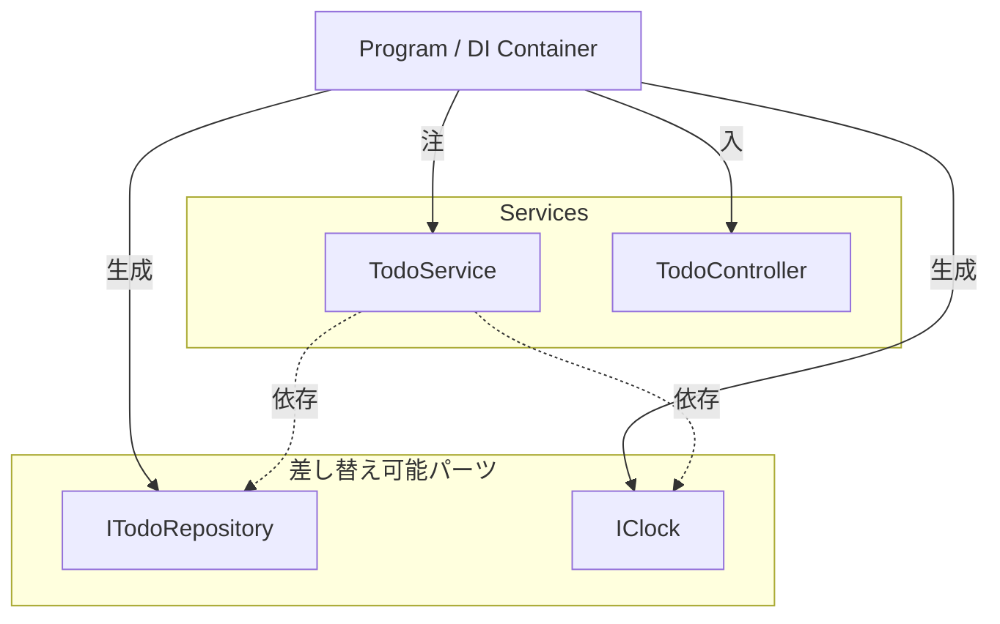

# 第15章：テスタブルMVC：DI（依存を外から渡す）🔌🧪

この章は「テストしやすい形に変えるための準備体操」だよ〜！💪😆
**ポイントはたった1つ：`new` を減らして、差し替えできるようにすること**✨

（※本日 2026-01-14 時点で .NET 10 の最新SDKは 10.0.2（2026-01-13リリース）だよ〜📦✨） ([Microsoft][1])
（Visual Studio 2026 も公開されてるよ〜🧁） ([Microsoft Learn][2])

---

## 1) 今日のゴール🎯✨

* 「依存（RepositoryとかClockとか）」を **外から渡せる** ようにする🔌
* **Fake（偽物）** を差し替えて動作確認できるようにする🧸✅
* 次の章（テスト入門🧪）にスムーズに入れるようにする🚀

---

## 2) DIってなに？いちばん短い説明🍀

DI（Dependency Injection）＝ **「必要な部品を、外から渡してもらう設計」** だよ✨
.NET には DI が “標準の考え方” として組み込まれていて、`IServiceCollection` に登録して `IServiceProvider` から取り出す感じになるよ〜📦 ([Microsoft Learn][3])

---

## 3) いま何がツラい？（DIが欲しくなる瞬間）😇💥

たとえば Service の中でこうなってるとするね👇

* `new FileTodoRepository(...)` を Service 内で作っちゃう💾
* `DateTime.Now` を直接使っちゃう⏰
* `Console.WriteLine` 直書きしちゃう🖥️

これ、**テストしたいときに差し替えできない**のが問題〜😭
「ファイル使わないFakeにしたい」とか「時間を固定したい」とかができない…！

---

## 4) 依存を “見える化” しよっか👀📝✨

CampusTodo で DI したい依存、だいたいこの3つが鉄板だよ〜👇

1. **Repository**：保存先（ファイル/DB/メモリ）を差し替えたい💾🔁
2. **Clock**：今日の日付を固定したい（期限・過去チェック）⏰🧊
3. **入出力**：Console を Fake にして自動化したい🖥️🤖

---

## 5) まずは “差し替え口” を作る（Interface化）🧩✨

### 5-1. Repository を interface にする💾➡️🧲

```csharp
public interface ITodoRepository
{
    IReadOnlyList<TodoItem> GetAll();
    void SaveAll(IReadOnlyList<TodoItem> items);
}
```

ファイル保存は実装側に寄せる👇

```csharp
public sealed class FileTodoRepository : ITodoRepository
{
    public IReadOnlyList<TodoItem> GetAll()
    {
        // ファイルから読み込み（JSONなど）
        throw new NotImplementedException();
    }

    public void SaveAll(IReadOnlyList<TodoItem> items)
    {
        // ファイルへ保存
        throw new NotImplementedException();
    }
}
```

---

### 5-2. Clock を interface にする⏰➡️🧊

```csharp
public interface IClock
{
    DateTime Today { get; }
}

public sealed class SystemClock : IClock
{
    public DateTime Today => DateTime.Today;
}
```

---

## 6) “new を消す” メイン作業：コンストラクタ注入🔌✨

### 6-1. Service が依存を受け取る🍔➡️🥗

```csharp
public sealed class TodoService
{
    private readonly ITodoRepository _repo;
    private readonly IClock _clock;

    public TodoService(ITodoRepository repo, IClock clock)
    {
        _repo = repo;
        _clock = clock;
    }

    public IReadOnlyList<TodoItem> GetList()
        => _repo.GetAll();

    public void Add(string title, DateTime? dueDate)
    {
        if (string.IsNullOrWhiteSpace(title))
            throw new ArgumentException("タイトルは必須だよ〜🥺", nameof(title));

        if (dueDate is not null && dueDate.Value.Date < _clock.Today)
            throw new ArgumentException("期限が過去になってるよ〜⏰💦", nameof(dueDate));

        var list = _repo.GetAll().ToList();
        list.Add(TodoItem.Create(title, dueDate));

        _repo.SaveAll(list);
    }
}
```

✅ **Service 内に `new FileTodoRepository()` が無い**
✅ **`DateTime.Today` 直書きが無い**
→ これだけでテスタブル度がグンっと上がるよ〜！📈✨

---

## 7) 依存を “組み立てる場所” を1か所に集める（Composition Root）🏗️✨


ここが大事！
**依存の組み立ては Program.cs に寄せる**（1か所にまとめる）🧠💡

### 7-1. いちばんシンプル版（ServiceCollectionでDI）📦

```csharp
using Microsoft.Extensions.DependencyInjection;

var services = new ServiceCollection();

services.AddSingleton<ITodoRepository, FileTodoRepository>();
services.AddSingleton<IClock, SystemClock>();

services.AddTransient<TodoService>();
services.AddTransient<TodoController>();

using var provider = services.BuildServiceProvider();

var controller = provider.GetRequiredService<TodoController>();
controller.Run();
```

.NET のDIは `IServiceCollection` に登録して使うのが基本だよ〜📚✨ ([Microsoft Learn][3])

---

### 7-2. “汎用ホスト” 版（ログや設定も伸ばしやすい）🧰✨

「あとでログとか設定とか足したい！」ってなったら、汎用ホストが便利〜！
（コンソール向けのDIチュートリアルでもこの流れが紹介されてるよ） ([Microsoft Learn][4])

```csharp
using Microsoft.Extensions.DependencyInjection;
using Microsoft.Extensions.Hosting;

var builder = Host.CreateApplicationBuilder(args);

builder.Services.AddSingleton<ITodoRepository, FileTodoRepository>();
builder.Services.AddSingleton<IClock, SystemClock>();
builder.Services.AddTransient<TodoService>();
builder.Services.AddTransient<TodoController>();

using var host = builder.Build();

var controller = host.Services.GetRequiredService<TodoController>();
controller.Run();
```

---

## 8) AddSingleton / AddTransient の使い分け（超ざっくり）🍀

* `AddSingleton`：1個をずっと使う（Repository/Clockみたいに軽いやつ）♾️
* `AddTransient`：呼ばれるたび新しい（Controller/Serviceによく使う）🔁

※ `AddScoped` は「Webの1リクエスト内で同じ」みたいな時に効いてくるので、いまは「そういうのもあるんだ〜👀」くらいでOKだよ🫶

---

## 9) ミニ演習：FakeRepository を差し替えて動作確認🧸✅


### 9-1. Fake を作る（メモリ保存）🧸

```csharp
public sealed class FakeTodoRepository : ITodoRepository
{
    private List<TodoItem> _items;

    public FakeTodoRepository(IEnumerable<TodoItem>? seed = null)
        => _items = seed?.ToList() ?? new List<TodoItem>();

    public IReadOnlyList<TodoItem> GetAll()
        => _items;

    public void SaveAll(IReadOnlyList<TodoItem> items)
        => _items = items.ToList();
}
```

### 9-2. FakeClock も作る（時間固定）🧊⏰

```csharp
public sealed class FakeClock : IClock
{
    public FakeClock(DateTime today) => Today = today.Date;
    public DateTime Today { get; }
}
```

### 9-3. Program で差し替えて “実験” する🔁✨

```csharp
var services = new ServiceCollection();

services.AddSingleton<ITodoRepository>(_ =>
    new FakeTodoRepository(new[]
    {
        TodoItem.Create("レポート提出📄", DateTime.Today.AddDays(2)),
        TodoItem.Create("ゼミ準備📚", DateTime.Today.AddDays(1)),
    })
);

services.AddSingleton<IClock>(_ => new FakeClock(new DateTime(2026, 1, 14)));

services.AddTransient<TodoService>();
services.AddTransient<TodoController>();

using var provider = services.BuildServiceProvider();

provider.GetRequiredService<TodoController>().Run();
```



💡これができたら「保存がファイルじゃなくても動く！」って体感できるよ🎉
テストの世界に片足つっこんだね〜🧪✨

---

## 10) やりがち注意⚠️（テスタビリティが下がるやつ）

* ❌ Service の中で `new FileTodoRepository()` しちゃう（差し替え不能）
* ❌ `IServiceProvider` をあちこちに渡す（Service Locator になりがち）😵‍💫
* ❌ なんでもかんでもDI（小さい値まで注入しはじめる）
* ✅ **「外部に触るもの」から優先してDI**（ファイル・時間・通信・DB）✨

---

## 11) AI活用（この章で効くプロンプト例）🤖💡

Copilot / Codex に投げるときは、**“目的＋制約” を一緒に**がコツだよ〜🪄

* 「`TodoService` の中の `new` を無くしたい。constructor injection に変えて、必要な interface も提案して」
* 「`DateTime.Today` を直接使ってる箇所を列挙して、`IClock` に置き換える修正案を出して」
* 「DI登録（ServiceCollection）を Program.cs にまとめたい。AddSingleton/Transient のおすすめも添えて」

---

## 12) 仕上げチェックリスト✅✨

* [ ] Service / Controller の中に **`new` がほぼ無い**（あっても Model の生成くらい）
* [ ] **外部依存（保存・時間・I/O）** が interface 経由になってる
* [ ] 依存の組み立てが **Program.cs 1か所**にまとまってる
* [ ] Fake に差し替えても動く🧸✅

---

## まとめ🌸

DIは「難しい機能」じゃなくて、**差し替えできるようにする設計の型**だよ🔌✨
ここまでできたら次の第16章で、**Model/Serviceをテストで守る🛡️🧪**が一気にラクになるよ〜！

次、いよいよテスト書こっか？😆🧁

[1]: https://dotnet.microsoft.com/en-US/download/dotnet/10.0?utm_source=chatgpt.com "Download .NET 10.0 (Linux, macOS, and Windows) | .NET"
[2]: https://learn.microsoft.com/en-us/visualstudio/releases/2026/release-notes?utm_source=chatgpt.com "Visual Studio 2026 Release Notes"
[3]: https://learn.microsoft.com/en-us/dotnet/core/extensions/dependency-injection?utm_source=chatgpt.com "Dependency injection - .NET"
[4]: https://learn.microsoft.com/ja-jp/dotnet/core/extensions/dependency-injection-usage?utm_source=chatgpt.com "チュートリアル: .NET で依存関係の挿入を使用する"
