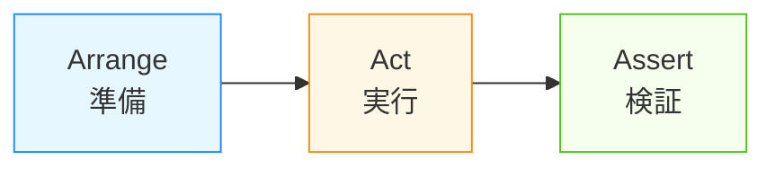

# 第16章：テスト入門（MVCの“守り方”）🛡️🧪✨

（通し課題：CampusTodo📚✅）

---

## 0. 今日のゴール🎯✨

この章が終わったら、こんな状態になってたら勝ちです💪😊

* **Model のルールを 1本、テストで守れる**（例：タイトル空欄NG）🧱🧪
* **Service の処理を 1本、テストで守れる**（例：追加したら保存される）🍱🧪
* 「壊れたらテストが教えてくれる✨」の安心感を体験できる😌🔔

ちなみに本日（2026-01-14）時点だと、.NET の最新 LTS は **.NET 10（2025-11-11リリース、2026-01-13時点で10.0.2）** だよ〜📦✨ ([Microsoft][1])
同時期に **Visual Studio 2026** も一般提供が始まってるよ🛠️✨ ([gihyo.jp][2])

---

## 1. テストって結局なに？🧠🧪


テストは超ざっくり言うと…

> **「この動き、ずっと同じでいてね？」を自動で見張る仕組み**👀🔁

MVCでいうと、まず守りたいのはここ👇

* **Model**：ルールの塊（壊れると全体が崩れる）📦⚠️
* **Service**：処理の中心（バグが乗りやすい）🍳⚠️
* View は薄めになりがちだから、最初は後回しでOK🙆‍♀️✨

---

## 2. どのテストから書くのが楽？🥳✨（おすすめ順）

初心者がつまずきにくい順に並べるね👇

1. **Model の不変条件テスト**（例外が投げられる/投げられない）🛡️
2. **Service の “結果” テスト**（追加された？完了になった？保存呼ばれた？）✅
3. Controller は「振り分け」だから、慣れてからでOK🚦

---

## 3. テスト環境を作ろう🛠️✨（VS / CLIどっちでもOK）

### 3-1. Visual Studioで作る（かんたん）🎀

1. ソリューションを右クリック
2. **[追加] → [新しいプロジェクト]**
3. **xUnit テストプロジェクト** を選ぶ（.NET 10 を選択）🧪
4. プロジェクト名：`CampusTodo.Tests` みたいにする📁✨
5. `CampusTodo.Tests` から、アプリ（または Core）に参照追加🔗

   * 右クリック → **[参照] → [プロジェクト参照の追加]**

> いまどきは xUnit v3 系も普通に使えるよ（.NET 8+対応）🧪✨ ([xUnit.net][3])
> Visual Studio の Test Explorer 用アダプタは `xunit.runner.visualstudio` が定番だよ📌 ([NuGet][4])

---

### 3-2. .NET CLIで作る（コピペでOK）⌨️✨

（ソリューション直下で）

```bash
dotnet new xunit -n CampusTodo.Tests
dotnet sln add .\CampusTodo.Tests\CampusTodo.Tests.csproj

# 例：アプリ(またはCore)を参照する
dotnet add .\CampusTodo.Tests\CampusTodo.Tests.csproj reference .\CampusTodo\CampusTodo.csproj

dotnet test
```

✅ これで「テストを走らせる」準備OK！

---

## 4. まずは Model のルールを 1本守ろう🛡️🧪（ミニ演習①）

ここでは例として「タイトル空欄NG」を守るテストを書くよ✍️✨
（あなたの `TodoItem` の実装に合わせて、コンストラクタ/Factory/メソッド名は読み替えてね🙏💦）

### 4-1. AAA（Arrange / Act / Assert）だけ覚えよ🧁

* Arrange：準備
* Act：実行
* Assert：確認

この型にすると、読みやすさが爆上がりするよ📈✨



### 4-2. 例外が出ることをテストする（空欄はNG）🚫🧪

```csharp
using Xunit;

public class TodoItemTests
{
    [Fact]
    public void Create_TitleIsEmpty_ThrowsArgumentException()
    {
        // Arrange
        var emptyTitle = "";

        // Act + Assert
        Assert.Throws<ArgumentException>(() =>
        {
            // 例：TodoItem.Create(...) でも new TodoItem(...) でもOK
            var item = TodoItem.Create(emptyTitle, dueDate: DateOnly.FromDateTime(DateTime.Today));
        });
    }
}
```

### 4-3. “OKなケース”も1本あると安心😊✅

```csharp
using Xunit;

public class TodoItemTests
{
    [Fact]
    public void Create_TitleIsValid_CreatesItem()
    {
        // Arrange
        var title = "レポート提出";
        var due = DateOnly.FromDateTime(DateTime.Today);

        // Act
        var item = TodoItem.Create(title, due);

        // Assert
        Assert.Equal(title, item.Title);
        Assert.False(item.IsDone);
    }
}
```

🎉 これで Model の「守り」ができた！

---

## 5. 次は Service の処理を 1本守ろう🍳🧪（ミニ演習②）

Service は「アプリの中心」だから、テストの効果がデカいよ💥✨
ここでは例として「追加したら Repository に保存される」を守るね💾✅

### 5-1. FakeRepository（偽物）でテストする🧸✨

モックの道具を増やす前に、まずは **手書き Fake** が最強に分かりやすいです🙂‍↕️✨

```csharp
public sealed class FakeTodoRepository : ITodoRepository
{
    private readonly List<TodoItem> _items = new();

    public IReadOnlyList<TodoItem> Items => _items;

    public void Add(TodoItem item) => _items.Add(item);

    public TodoItem? FindById(int id) => _items.FirstOrDefault(x => x.Id == id);

    public void Save() { /* 何もしない（呼ばれてもOK） */ }
}
```

### 5-2. Service のテストを書く✅🧪

```csharp
using Xunit;

public class TodoServiceTests
{
    [Fact]
    public void Add_ValidTitle_ItemIsAddedToRepository()
    {
        // Arrange
        var repo = new FakeTodoRepository();
        var service = new TodoService(repo);

        // Act
        service.Add("ゼミ資料まとめ", dueDate: DateOnly.FromDateTime(DateTime.Today));

        // Assert
        Assert.Single(repo.Items);
        Assert.Equal("ゼミ資料まとめ", repo.Items[0].Title);
    }
}
```

💡ポイント：

* Service が「どこに保存するか」を知らなくてOK（Repository に任せる）
* テストは「結果」を見るだけでOK（UI触らない）👀✨

---

## 6. 境界値テストってなに？📏🧪（やさしく）


「ギリギリのところ」がバグりやすいから、そこを刺す感じ🎯

例（期限のルールがある場合）📅

* **今日**はOK？
* **昨日**はNG？
* **空欄**はNG？
* **1文字**はOK？

xUnit だと `Theory` でまとめられるよ🧪✨

```csharp
using Xunit;

public class TodoItemBoundaryTests
{
    [Theory]
    [InlineData("a")]
    [InlineData("課題")]
    public void Create_TitleNotEmpty_IsOk(string title)
    {
        var item = TodoItem.Create(title, DateOnly.FromDateTime(DateTime.Today));
        Assert.Equal(title, item.Title);
    }
}
```

---

## 7. テストの実行方法🏃‍♀️💨

### Visual Studioで

* **テスト** → **テスト エクスプローラー** を開く
* ▶️「すべて実行」
* 赤（失敗）になったら、そこが “壊れた場所” の目印🚨✨

### CLIで

```bash
dotnet test
```

特定のテストだけ走らせたい時もできるよ（慣れたらでOK）🎯

---

## 8. （おまけ）カバレッジって気になる？📊✨

「どのくらいテストで通ったか」を見るのがカバレッジだよ👀
ただし最近はテスト基盤に **Microsoft.Testing.Platform** も出てきてて、**Coverlet の `coverlet.collector` は VSTest 専用**だから、組み合わせで注意がいるよ⚠️ ([Microsoft Learn][5])

初心者のうちは、まずは **“大事なルールがテストで守れてるか”** を優先でOK🙆‍♀️💖

---

## 9. AI（Copilot/Codex）活用レシピ🤖✨（雑に使うと危険なのでコツ付き）

### 9-1. いい感じに使える指示例🍯

* 「`TodoItem` の不変条件から **境界値テスト案を10個**、重複なしで」🧠
* 「この Service の責務から、**副作用の観点でテスト観点**を出して」🔍
* 「AAA形式で、**読みやすいテスト名**にリネームして」🏷️✨

### 9-2. 絶対やること（1分チェック）✅

* 生成されたテストが **何を守ってるか** 1行で言える？🗣️
* そのテストは **落ちたら何が困るか** 想像できる？😵‍💫➡️😌
* テストが **実装の細部** を触りすぎてない？（リファクタで壊れやすい）🧨

---

## 10. まとめ🎁✨（この章でできたこと）

* Model の “ルール” をテストで守れた🛡️🧪
* Service の “処理結果” をテストで守れた🍳🧪
* 「壊れたらテストが教えてくれる」安心の入口に立った🚪✨

---

## 宿題（かんたん）📚💖

次のどれか1つだけやってみてね（10〜15分くらい）🕒✨

* `done 2` みたいな処理があるなら、**完了になるテスト**✅
* 期限ルールがあるなら、**昨日NG / 今日OK** を `Theory` で📅🧪
* タイトルが長すぎる等の制限があるなら、**境界値**を追加📏✨

---

必要なら、この章のために「あなたのCampusTodoのクラス構造（TodoItem / Service / Repository の今のコード）」を貼ってくれたら、**その形にピッタリ合わせたテストを“実際に動く形”で**組み直すよ🧁🧪✨

[1]: https://dotnet.microsoft.com/ja-jp/platform/support/policy/dotnet-core?utm_source=chatgpt.com ".NET および .NET Core の公式サポート ポリシー"
[2]: https://gihyo.jp/article/2025/11/dotnet-10?utm_source=chatgpt.com "NET 10をリリース —— Visual Studio 2026も一般提供開始"
[3]: https://xunit.net/?utm_source=chatgpt.com "xUnit.net: Home"
[4]: https://www.nuget.org/packages/xunit.runner.visualstudio?utm_source=chatgpt.com "xunit.runner.visualstudio 3.1.5"
[5]: https://learn.microsoft.com/en-us/dotnet/core/testing/microsoft-testing-platform-extensions-code-coverage?utm_source=chatgpt.com "Microsoft.Testing.Platform Code Coverage extensions - .NET"
