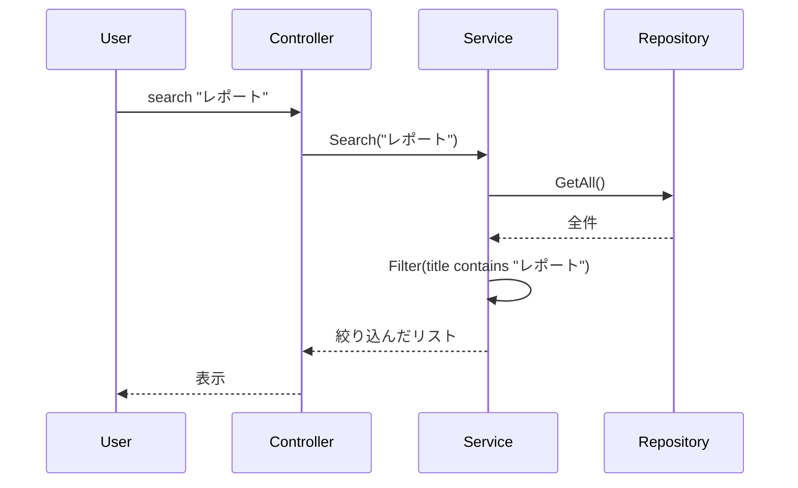

# 第17章：総合演習（完成）＋ふりかえり（MVCが身についたか確認）🎓🌸

いよいよ最終章〜！✨
この章は **「動く」→「気持ちよく動く」→「人に説明できる」** まで仕上げて、CampusTodo を“作品”にします📚✅

---

## 1) この章のゴール🎯✨

ゴールはこの3つだけ覚えればOKだよ〜☺️💕

1. **CampusTodo 完成版**にする✅
2. **MVCの責務（だれが何してるか）を言語化**できる🗣️🧠
3. **読みやすく整える（リファクタ＋テスト＋README）**🧹🧪📘

---

## 2) まずは「完成チェックリスト」✅🧾（ここが超大事！）

### 機能✅

* [ ] 追加（add）
* [ ] 一覧（list）
* [ ] 完了（done）
* [ ] 編集（edit）
* [ ] 削除（delete）
* [ ] 検索（search / list --q）🔍
* [ ] 並び替え（期限/重要度など）↕️
* [ ] 保存（終了→再起動しても残る）💾

### つくり（MVC + Service + Repository）🧩

* [ ] View は **表示だけ**（ルールや更新を持たない）🎨
* [ ] Controller は **入力→指示**（交通整理）🚦
* [ ] Service は **処理の中心**（Controllerを太らせない）🥗
* [ ] Repository は **保存の担当**（外部と接続）🧲
* [ ] Model は **ルールを守る**（不変条件）🛡️

### 品質🧪

* [ ] Model or Service のテストが数本ある（正常/異常/境界値）📏
* [ ] 例外で落ちずに、やさしいメッセージが出る😌🚨
* [ ] 変数名・クラス名が納得できる（読める）👀✨

---

## 3) 仕上げ機能①：検索を入れて「使える感」爆上げ🔍✨


### おすすめ仕様（シンプルでOK）🍀

* `search <keyword>`：タイトルに含まれるものだけ出す
* もしくは `list --q <keyword>`（どっちでもOK）

**ポイント**：検索は Controller が頑張りすぎないで、Service に「検索して〜」ってお願いする形にしよう☺️🫶

### Service側のイメージ（超ざっくり）🧠

```csharp
public IReadOnlyList<TodoItem> Search(string keyword)
{
    keyword = (keyword ?? "").Trim();
    if (keyword.Length == 0) return GetAll(); // 仕様：空なら全部でもOK

    return _repo.GetAll()
        .Where(x => x.Title.Contains(keyword, StringComparison.OrdinalIgnoreCase))
        .ToList();
}
```

* `StringComparison.OrdinalIgnoreCase` で大文字小文字ゆるく検索できて優しい😊✨

### Viewはどうする？🎨

検索結果の表示は View に任せるだけでOK📋
（Viewは “見せ方” のプロなので、ここで頑張る💪）

---

## 4) 仕上げ機能②：並び替えで「気持ちよさ」UP↕️✨

### まずはこの2つが鉄板🥇

* 期限が近い順（DueDate asc）⏰
* 重要度が高い順（Priority desc）🔥

例：Serviceで `list` を作る時にオプションとして受け取る感じ👇

```csharp
public IReadOnlyList<TodoItem> GetList(ListOptions opt)
{
    var items = _repo.GetAll().AsEnumerable();

    if (!string.IsNullOrWhiteSpace(opt.Keyword))
        items = items.Where(x => x.Title.Contains(opt.Keyword, StringComparison.OrdinalIgnoreCase));

    if (opt.OnlyOpen)
        items = items.Where(x => !x.IsDone);

    items = opt.SortBy switch
    {
        SortBy.DueDate => items.OrderBy(x => x.DueDate),
        SortBy.Priority => items.OrderByDescending(x => x.Priority),
        _ => items
    };

    return items.ToList();
}
```

`ListOptions` は **ViewModel じゃなくて “問い合わせ用の型”** って感覚でOKだよ〜🧺✨（Modelを汚さないのがえらい👏）

---

## 5) 最終リファクタ：MVCの“責務”を整えて完成形へ🧹✨

ここは「設計の超入門者」が一番伸びるとこ！🌱

### 5-1) “依存の向き” 最終点検🔁🚦

* Controller → Service → Repository ✅
* View → ViewModel ✅
* **Model →（Controller/Service/View/Repository）に依存しない** ✅（基本ね！）

### 5-2) よくある「最終章あるある」😇

* Controller に処理が増えてる（Fat Controller）🍔
  → Service に寄せよう🥗
* View に if が増えてる（表示ロジック地獄）🎨💥
  → ViewModel 側で整形しよう🧺
* Repository があちこちで呼ばれてる🧲💦
  → Service 経由に統一しよう✨

### 5-3) フォルダ構成を整える📁✨（例）

* `Models/`
* `Services/`
* `Repositories/`
* `Views/`
* `ViewModels/`
* `Controllers/`

名前が揃うだけで、理解速度が一気に上がるよ〜🚀💕

---

## 6) テスト：最終章は「守り」を最低限つけて完成🛡️🧪✨

テストは欲張らなくてOK！
**「壊れたら困るところだけ」** 守ろう☺️

### 守る優先順位🥇

1. Modelの不変条件🛡️
2. Serviceの検索/並び替え/更新処理🔁
3. Repository（ファイル保存）は最低限でもOK💾

ちなみに xUnit は **v3 が .NET 8 以降をサポート**してて、CLIやVSでも扱えるよ〜🧪✨ ([xUnit.net][1])

---

## 7) READMEを作って「作品」にする📘✨（超重要！）

提出物として強いのはここ！💪

### READMEテンプレ（そのまま使ってOK）🧁

```md
# CampusTodo 🧁✅

## できること
- Todoの追加 / 一覧 / 完了 / 編集 / 削除
- 検索 / 並び替え
- 保存（再起動しても残る）

## 使い方（コマンド例）
- add "レポート" --due 2026-01-20 --priority High
- list
- search "レポート"
- done 2

## アーキテクチャ（MVC）
- Controller：入力を受け取って Service に指示する
- Service：アプリの処理の中心（検索・更新など）
- Model：Todoのデータとルール（不変条件）
- View：表示だけ担当
- Repository：保存/読み込み担当（差し替え可能）

## フォルダ構成
（ここにツリーを書いてOK）

## テスト
- Model：タイトル空欄NG のテスト
- Service：検索と並び替えのテスト
```

**これがあるだけで「説明できる人」感が出るよ〜！✨**

---

## 8) “MVCの責務”を1枚メモにする📝✨（口で説明できる最強アイテム）


最後にこれを作ると、理解が定着するよ☺️💕

### 1枚メモの例📝

* **Model**：正しい状態を守る（タイトル空欄NG、期限の扱いなど）🛡️
* **View**：見た目（一覧の整形、色/記号、表示の工夫）🎨
* **Controller**：入力を解釈して、どの処理を呼ぶか決める🚦
* **Service**：アプリのユースケース（追加、完了、検索、並び替え）を実行🧠
* **Repository**：保存先（ファイル/DB）とやり取りする💾



---

## 9) AI活用（最終章の勝ちパターン）🤖🏆✨

Visual Studio の Copilot Chat は、VSのバージョンによってはインストーラーの推奨コンポーネントとして“統合体験”で入るよ〜（17.10以降の話）🤝 ([Microsoft Learn][2])
あと、VS上で Copilot を使う条件として **VS 2022 17.8+** が案内されてるよ🪟🧠 ([GitHub Docs][3])

### 最終章で使うと強いプロンプト集🧠💡

* 「このController、太りすぎてない？Serviceに移す候補を列挙して」🍔➡️🥗
* 「このメソッド名、意図が伝わる命名案を10個」🪄
* 「検索と並び替えの境界値テスト案を出して」📏🧪
* 「READMEをこのプロジェクト構成で下書きして（短めで）」📘
* 「MVCの責務を初心者向けに3パターンで説明して」🗣️✨

**使い方のコツ**：出力をそのまま採用せず、**“自分の言葉”に直す**と一気に身につくよ☺️🫶

---

## 10) ふりかえりクイズ（これ答えられたら勝ち🎉）🧠✨

1. 「検索」は Controller と Service、どっちに置くのが自然？理由も言える？🔍
2. View に if が増えてきた。どう直す？🎨
3. Repository を Controller から直接呼ぶのはなぜ微妙？🧲
4. Model の不変条件ってなに？例を1つ言える？🛡️
5. 「このアプリのMVC責務」を30秒で説明できる？⏱️🗣️

---

## 11) 仕上げの“最新”メモ（今この瞬間の基準）🧾✨

* .NET は **.NET 10.0 が “latest” 扱いで、10.0.2 が 2026-01-13 リリース**になってるよ💎 ([Microsoft][4])
* ついでに `global.json` を置くと「環境差で動かない」を減らせるよ〜（SDK版固定）🧷

  * .NET 10.0 SDK は **10.0.102（2026-01-13）**が案内されてるよ📌 ([Microsoft][5])
* Visual Studio は **Visual Studio 2026（Version 18.x）**のリリースノートが公開されてるよ🛠️✨ ([Microsoft Learn][6])

---

## 最終成果物（提出セット）🎁✨

* ✅ CampusTodo 完成版
* ✅ README（使い方＋構造説明）📘
* ✅ MVC責務 1枚メモ📝
* ✅ テスト数本（Model/Service中心）🧪

---

必要なら次のメッセージで、**あなたの今のCampusTodoの構成（フォルダ構成 or クラス一覧）**を貼ってくれたら、
「最終章のチェックリスト」に沿って **“どこをどう直すと完成形になるか”** を、超具体で一緒に仕上げるよ〜☺️💪💖

[1]: https://xunit.net/ "Home | xUnit.net "
[2]: https://learn.microsoft.com/en-us/visualstudio/ide/visual-studio-github-copilot-chat?view=visualstudio "About GitHub Copilot Chat in Visual Studio - Visual Studio (Windows) | Microsoft Learn"
[3]: https://docs.github.com/copilot/get-started/quickstart "Quickstart for GitHub Copilot - GitHub Docs"
[4]: https://dotnet.microsoft.com/en-us/download/dotnet "Browse all .NET versions to download | .NET"
[5]: https://dotnet.microsoft.com/en-us/download?utm_source=chatgpt.com "Download .NET (Linux, macOS, and Windows) | .NET"
[6]: https://learn.microsoft.com/en-us/visualstudio/releases/2026/release-notes "Visual Studio 2026 Release Notes | Microsoft Learn"
