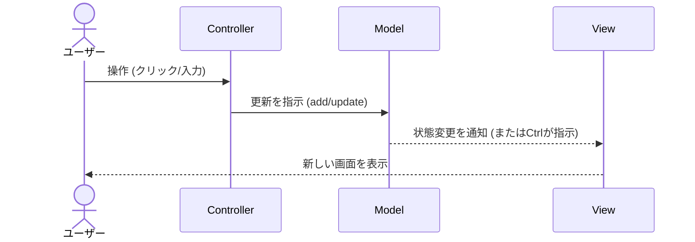

# 第01章：MVCってなに？まず“分ける理由”をつかもう🧠✨

## 1) この章のゴール🎯

この章が終わったら、あなたが **自分の言葉で** こう言えるようになるのがゴールだよ〜💬✨

* MVCって、**Model / View / Controller の役割分担**だよね〜👯‍♀️
* “分ける”と、UI変更とか機能追加が **ラクになる理由**が説明できる💪
* Todoアプリ（CampusTodo）を見て、どれがModel/View/Controllerか **ざっくり仕分け**できる🧺✅

---

## 2) まず「混ぜる」と何が起きる？😇💥

最初にありがちなやつ👇
**1ファイルに全部書く**と、最初は速いけど…後からつらい😂

* 画面をちょっと変えたら、保存処理が壊れる😵
* バリデーション直したら、表示が崩れる😵‍💫
* 「どこ触ればいいの？」が毎回迷子🧭💦

たとえば、こういう“ごちゃ混ぜ”の未来が来がち👇


```ts
// 例：やりたいこと全部ここに書いちゃう（つらいやつ😇）
addButton.onclick = () => {
  const title = input.value.trim();

  if (title === "") {
    error.textContent = "入力してね";
    return;
  }

  todos.push({ id: Date.now(), title, done: false });
  localStorage.setItem("todos", JSON.stringify(todos));

  list.innerHTML = "";              // 表示もここで全部…
  for (const t of todos) {
    const li = document.createElement("li");
    li.textContent = t.title;
    list.appendChild(li);
  }
};
```

このコード、何が問題かというと…

* **UI（DOM操作）**
* **ルール（空欄NG）**
* **データ（todos）**
* **保存（localStorage）**

…が **ぜんぶ一緒** で、どれかを変えると連鎖で壊れやすいの🥲💣

---

## 3) MVCってなに？ひとことで言うと…🧩✨


MVCは、UIまわりの作り方でよく使われる「設計パターン」だよ〜📚
**Model / View / Controller に分けて**、役割をごちゃ混ぜにしないのがポイント✨
MDNも「UI・データ・制御ロジックを分ける」って説明してるよ。([MDN Web Docs][1])

---

## 4) 3人チームで考えると超わかりやすい👯‍♀️👯‍♀️👯‍♀️


### 🧺 Model（モデル）：データとルール担当📦🛡️

* Todoのデータ（例：`title`, `done`）を持つ
* ルール（例：タイトル空欄NG）を守る
* **画面のこと（DOM）を知らない**のが大事🙅‍♀️

イメージ：
「課題メモの台帳係」📒✨（中身とルールを守る担当）

---

### 🎨 View（ビュー）：見た目担当👀✨

* 画面に描く（DOMを作る/更新する）
* 見た目の調整（並べ方、文言、色など）
* **ルール判断や保存はやらない**（やり始めると太る🐷💦）

イメージ：
「掲示板係」📌（見やすく貼り出す担当）

---

### 🚦 Controller（コントローラ）：交通整理担当🎮➡️🧠

* ボタン押した！入力された！…みたいな **イベントを受ける**
* Modelに「追加して〜」「完了切り替えて〜」ってお願いする
* その結果を View に「表示更新して〜」ってお願いする

イメージ：
「受付＆指示係」🗣️（人の動きに合わせて指示する担当）

---

## 5) CampusTodoをMVCで仕分けしてみよう📝✅


CampusTodo（課題メモ）なら、こんな感じで分けられるよ〜🌸

* **Model**：Todoの配列、`addTodo()`、`toggleDone()`、（あとで）ルール🛡️
* **View**：一覧を描画する、エラー表示する、入力欄をクリアする🎨
* **Controller**：クリックや送信イベントを受けて、Model更新→View再描画🚦

---

## 6) MVCが“回る”ってこういうこと🌀✨


超ざっくりの流れはこれ👇

1. ユーザーが操作（クリック/入力）👆
2. **Controller** が受け取る🚦
3. **Model** を更新する📦
4. **View** が Model の状態を表示する🎨

MDNでも、Model/View/Controllerの役割がこう整理されてるよ。([MDN Web Docs][1])



---

## 7) ミニ演習🧪：Todoの処理を3つに分解してみよう✂️✨

ここ、手を動かすと一気に理解できるよ〜🙌💕

### 演習A：仕分けゲーム🧺✅


次の「やりたいこと」を、Model / View / Controller に振り分けてみてね✍️

* ①「追加ボタンが押された」
* ②「入力が空欄ならエラーを出す」
* ③「Todoを配列に追加する」
* ④「一覧を画面に表示する」
* ⑤「保存する（あとでやる予定）」

ヒント💡

* 「押された/受け取った」は Controller
* 「データ増やす/ルール守る」は Model
* 「見せる/描く」は View

---

### 演習B：1本の処理をMVCに分割して“擬似コード”で書く📝


（まだプロジェクト作ってなくてもOK👌）

```ts
// Model（データ・ルール）
const model = {
  todos: [] as { id: number; title: string; done: boolean }[],
  add(title: string) {
    // ルールはここに寄せたい（例：空欄NG）
    this.todos.push({ id: Date.now(), title, done: false });
  }
};

// View（表示だけ）
const view = {
  render(todos: { id: number; title: string; done: boolean }[]) {
    // DOMに描画（詳細は次章以降でOK）
  },
  showError(message: string) {
    // エラー表示だけ
  }
};

// Controller（イベント→指示）
function onAddClicked(inputText: string) {
  if (inputText.trim() === "") {
    view.showError("入力してね🥺");
    return;
  }

  model.add(inputText.trim());
  view.render(model.todos);
}
```

ポイントはこれだけ覚えればOK👍✨
**「Controllerが受けて、Modelを更新して、Viewが表示」** 🌀

---

## 8) AI相棒の使い方🤖💡（この章でめっちゃ効くやつ）

GitHub Copilot には「提案」「チャット」「編集支援」など色々あるよね。([GitHub Docs][2])
この章では **“理解の補助”** に使うのが超おすすめ🫶✨

### そのまま使えるプロンプト例🎪


* 「MVCを学園祭に例えて、女子大生向けにやさしく説明して！絵文字多めで！」🎪💖
* 「この処理（貼り付ける）をModel/View/Controllerに分けるとしたら、どこに何を書く？」🧺✅
* 「Viewに入れちゃダメな処理って何？初心者がやりがちなミスも教えて」🙅‍♀️💦

### AIの答えを“丸呑み”しないコツ🍬⚠️

* 出てきた提案に対して、**「それModelの責務？」**って毎回ツッコミを入れる😼✨
* 迷ったら **責務の境界** だけ相談する（実装は自分で）💪

---

## 9) よくある落とし穴あるある🐣💥（先に知ると勝ち）


* Viewが **保存** を始める（Viewが外部に触ると壊れやすい）💾❌
* Modelが **DOM** を触る（Modelは画面を知らない方が強い）🖥️❌
* Controllerがなんでもやって **太る**（次の章以降で“痩せさせ方”やるよ🥗）🍔➡️🥗

---

## 10) まとめ🎀

* MVCは **役割分担**：Model（データ/ルール）・View（表示）・Controller（交通整理）✨ ([MDN Web Docs][1])
* “分ける”と、変更に強くなる💪
* CampusTodoは MVCの練習題材にちょうどいい📚✅
* AI相棒は「理解の補助」と「仕分けレビュー」に使うと最強🤖✨ ([GitHub Docs][2])

---

## 🔎ちょい最新メモ（2026の空気感）🆕✨

* TypeScript は npm 上で **5.9.3** が最新として案内されてるよ。([npm][3])
* TypeScriptチームは、将来的な高速化のために **ネイティブ実装（TypeScript 7 Native Preview）** も進めてるよ（大規模プロジェクトでビルド時間が大幅短縮の報告も）。([Microsoft Developer][4])
* VS Code 側も Copilot 体験を整理して「Copilot Chat 側に統合していく」流れがあるよ。([Visual Studio Code][5])

---

次の第2章では、いよいよ CampusTodo を動かす準備に入るよ〜🚀🧑‍💻✨

[1]: https://developer.mozilla.org/en-US/docs/Glossary/MVC "MVC - Glossary | MDN"
[2]: https://docs.github.com/en/copilot/get-started/features "GitHub Copilot features - GitHub Docs"
[3]: https://www.npmjs.com/package/typescript?utm_source=chatgpt.com "TypeScript"
[4]: https://developer.microsoft.com/blog/typescript-7-native-preview-in-visual-studio-2026 "TypeScript 7 native preview in Visual Studio 2026 - Microsoft for Developers"
[5]: https://code.visualstudio.com/blogs/2025/11/04/openSourceAIEditorSecondMilestone "Open Source AI Editor: Second Milestone"
