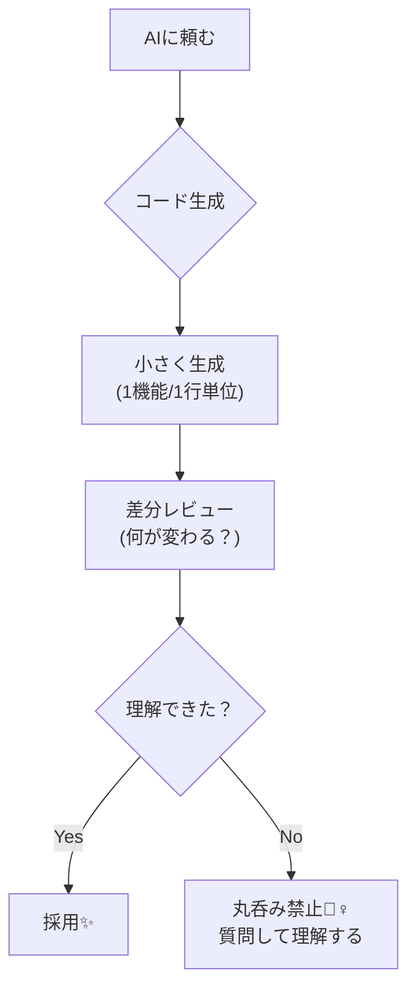

# 第02章：開発環境（Windows＋VS Code）＋AI相棒の使い方🤝🛠️🤖

**〜「迷わず動かせる状態」を作って、すぐ開発に入れるようにする章〜**🚀✨

---

## 2-0. 今日のゴール🎯✨

この章が終わったら、こうなってるのが理想だよ〜！🌸

* ✅ TypeScriptの開発プロジェクトを **Viteで作れる**
* ✅ `npm run dev` で **ブラウザ起動まで迷わない**
* ✅ VS Codeで **（ほぼ）快適にTSが書ける**
* ✅ AI（Copilot / Codex等）を **安全に・便利に**使える🤖✨

---

## 2-1. まずは「動く土台」：Node.jsを入れる🧱🟩

Viteは最近のNode.jsが必要だよ〜！
（Vite 7系は **Node 20.19+ / 22.12+ が必要**って明記されてるよ）([vitejs][1])

### ① どのNodeを入れるのがいい？🧐

おすすめは **Active LTS（安定運用向き）**✨
2026/01時点だと、Nodeのリリース状況はこんな感じ（公式表）👇([Node.js][2])

* **v24（Active LTS）**：安定して長く使える💚
* v25（Current）：新しめ（攻めたい人向け）🧪

👉 迷ったら **v24（Active LTS）** にしよ！💚

### ② インストール手順（超ざっくり）🪟✨


1. Node.js公式サイトから **LTS** を入れる
2. インストーラは基本「次へ次へ」でOK🙆‍♀️
3. 入ったか確認する（ここ大事！）🔎

確認コマンド（PowerShellでOK）👇

```bash
node -v
npm -v
```

* `v24.x.x` みたいなのが出たら成功🎉
* もし `node` が見つからないって出たら → **再起動** or **PATH反映待ち**が多いよ😇💦

---

## 2-2. VS Codeを「TS書きやすい状態」にする🧑‍💻✨

VS Codeは **TypeScriptサポートが標準で強い**のが最高ポイント！🎀
（公式ドキュメントでも「VS CodeでTSを扱える」って説明されてるよ）([Visual Studio Code][3])

### ① VS Codeでまずやること🧩

* フォルダを開く（プロジェクト単位でね📁）
* ターミナルを開く（VS Code内でOK）

  * メニュー：**表示 → ターミナル** 💻✨

### ② 拡張機能：最低限これだけ入れよ🧰✨


**絶対おすすめ**（“迷ったらこれ”セット）👇

* ✅ ESLint（コードのミスを早めに教えてくれる）
* ✅ Prettier（見た目を整えてくれる✨）
* ✅ GitHub Copilot（補完）＋ Copilot Chat（相談）🤖

CopilotはVS Code向け拡張として提供されてるよ([Visual Studio Marketplace][4])

---

## 2-3. ViteでTypeScriptプロジェクトを作る🧩✨（CampusTodoの土台）

Viteは「爆速で開発開始できる」便利ツール💨
しかも公式ガイドがすごく分かりやすいよ〜！([vitejs][1])
あと、2026/01あたりは **Vite 7.3.1 が最新**として出てるよ([GitHub][5])

### ① プロジェクト作成コマンド🛠️


VS Codeのターミナルで、作業したい場所に移動してから👇

```bash
npm create vite@latest campus-todo -- --template vanilla-ts
```

次に👇

```bash
cd campus-todo
npm install
npm run dev
```

成功したら、ターミナルに出るURL（だいたい `http://localhost:5173/`）を開いて🎉✨

### ② 「動いた！」のチェックポイント✅


* ブラウザにViteの画面が出る
* ターミナルがエラーで赤くなってない
* `src/main.ts` をちょい編集すると、すぐ反映される（気持ちいい💞）

---

## 2-4. ここで“AI相棒”を入れる🤖💡（使い方ルール付き）

AIは便利なんだけど、**使い方を間違えると事故る**😇💥
特に「拡張機能」や「AIエージェント」周りは、過去にセキュリティの話題もあったので、**更新＆出どころ確認は習慣**にしよ🛡️
（例：AWSがVS Code拡張のセキュリティ更新情報を公開してる）([Amazon Web Services, Inc.][6])


### ✅ AIを安全に使う3原則（この章の合言葉）📌✨



1. **小さく生成**（一気に全部作らせない）🧩
2. **差分レビュー**（何が変わったか必ず見る）🔍
3. **丸呑み禁止**（意味わからないコードは採用しない）⚠️

---

## 2-5. AIへの「勝ちやすい頼み方」テンプレ集📮💬🤖


ここ、めっちゃ効くよ〜！✨
**AIにお願いするときは「条件」「出力形式」「確認ポイント」をセット**にすると成功率UP⤴️

### テンプレ①：次にやることを3つに絞る🔎

```text
CampusTodoをVite+TypeScriptで作り始めました。
今の状態は「npm run dev で起動できた」だけです。
次に確認すべきことを “3つだけ” 箇条書きで出して。
```

### テンプレ②：コマンドは“理由つき”で出してもらう🧠

```text
ESLintとPrettierを入れたいです。
「何のために」「どのコマンドを」「どのファイルに何を書くか」をセットで教えて。
```

### テンプレ③：変更は“差分”で提案してもらう🧾

```text
今のpackage.jsonにスクリプトを追加したいです。
追加する行だけを差分形式（before/after）で出して。
```

---

## 2-6. 章内ミニ演習🎮✨（ここまでで完成！）

### 演習A：起動できた証拠を作ろう📸✅


`src/main.ts` の表示文言を変えてみてね👇

```ts
// src/main.ts
document.querySelector<HTMLDivElement>('#app')!.innerHTML = `
  <div>
    <h1>CampusTodo ✅</h1>
    <p>開発環境OK！次はMVCで分けるよ〜✨</p>
  </div>
`;
```

ブラウザに反映されたらクリア🎉

### 演習B：AIに「確認係」をやらせる🕵️‍♀️🤖

AIにこう聞いてみて👇

```text
いま私の環境で「躓きやすいポイント」を5個あげて、
それぞれの“確認コマンド”も添えて。
```

出てきた内容を、実際に自分のPCでチェック✅（これが強い！）

---

## 2-7. つまずき救急箱🧯💨（よくあるやつ）


* 😭 `npm install` が失敗する
  → まずは **ターミナル再起動**、それでもダメなら **Nodeのバージョン確認**（Vite 7はNode要件あり）([vitejs][1])

* 😭 `node` が見つからない
  → PC再起動、VS Code再起動、PATH反映待ちが多い🪄

* 😭 ブラウザが開かない
  → ターミナルに出てるURLを **コピペ**して開くのが確実👍

---

## 2-8. この章のまとめ🌟

* Vite 7系はNode要件があるので、そこだけ押さえたら勝ち！([vitejs][1])
* VS Code＋拡張機能で、TS開発がめっちゃ快適になる💖
* AIは「小さく生成→差分レビュー→理解して採用」で安全＆最強🤖🛡️

---

## 次章予告📌✨（第3章）

次は「作る範囲」をちゃんと決めて、迷子を防ぐよ〜！🧭
CampusTodoの要件をスッキリ整理して、MVC設計に入る準備をするよ🎀📚

[1]: https://vite.dev/guide/?utm_source=chatgpt.com "Getting Started"
[2]: https://nodejs.org/en/about/previous-releases?utm_source=chatgpt.com "Node.js Releases"
[3]: https://code.visualstudio.com/docs/languages/typescript?utm_source=chatgpt.com "TypeScript in Visual Studio Code"
[4]: https://marketplace.visualstudio.com/items?itemName=GitHub.copilot&utm_source=chatgpt.com "GitHub Copilot"
[5]: https://github.com/vitejs/vite/releases?utm_source=chatgpt.com "Releases · vitejs/vite"
[6]: https://aws.amazon.com/security/security-bulletins/AWS-2025-015/?utm_source=chatgpt.com "Security Update for Amazon Q Developer Extension for Visual ..."
