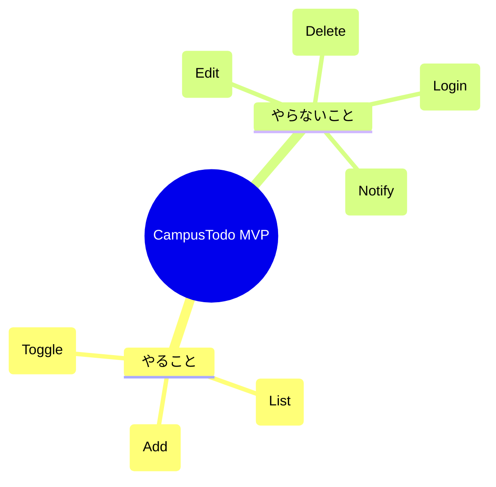

# 第03章：題材の要件を決める（ここが設計の入口）📌✨

題材：**CampusTodo（課題メモ）**📚✅

---

## 0. この章でできるようになること🎯💖

この章のゴールはズバリ…👇✨

* 「**何を作るアプリなのか**」を短い文章で説明できる🗣️💡
* 「**最小で作る機能（MVP）**」を自分で決められる✅
* 「**画面に何が必要か**」を整理できる👀🧠
* 次章（Modelの型設計）にスムーズに進める📦➡️✨

---

## 1. なんで“要件決め”が最初に必要なの？🧭😵‍💫➡️😌

アプリ作りで一番よくある事故がこれ👇

* 「とりあえず作り始める」→ 途中で迷子🌀
* 「機能を増やしすぎる」→ 終わらない😇
* 「何が正解かわからない」→ バグ直し地獄🪦

だから先に **“作る範囲（要件）”を決めて、迷子にならない地図を作る** のが超大事だよ〜🗺️✨

---

## 2. まずは1行で言える？アプリ説明文を作ろう✍️🎀

CampusTodoを、まずは「1行」で表すよ👇

> **「課題をメモして、終わったら完了にできる、シンプルな課題管理アプリ」**📚✅

この“1行説明”があると、後で機能が増えそうになったときに、こう言えるようになる👇😌

* 「それってこの1行に必要？」
* 「今はMVPだから後回しでOKじゃない？」

---

## 3. ユーザーストーリーを作ろう🎭📝✨（要件の基本）

“ユーザーストーリー”っていうのは、アプリを使う人の「やりたいこと」を短い文章にしたものだよ🧡

型はこれ👇

* **私は（だれ）が**
* **（なに）したい**
* **なぜなら（理由）**

### CampusTodoのユーザーストーリー例📚✨

MVP（最小構成）として、まずはこの3つで十分👍

1. **追加したい➕**

* 私は学生として、課題を追加したい。なぜなら忘れたくないから。📌

2. **一覧で見たい👀**

* 私は学生として、課題一覧を見たい。なぜなら今やるべきものを把握したいから。📋✨

3. **完了にしたい✅**

* 私は学生として、終わった課題を完了にしたい。なぜなら達成感がほしいし、未完了だけ見たいから。🎉

この3つがアウトラインにあった **「追加/一覧/完了」** だね💯✨

---

## 4. “受け入れ条件”を決めよう✅🧪（できたか判定するルール）

ユーザーストーリーだけだと、実装中にこうなるの👇
「追加って…どこまで？タイトルだけ？期限は？」って迷う😵‍💫

そこで **受け入れ条件（Acceptance Criteria）** を付けるよ✨
おすすめは **Given / When / Then**（日本語でもOK）🧁

### 4.1 追加の受け入れ条件➕✅

* **When** タイトルを入力して追加ボタンを押したら
* **Then** 一覧に新しい課題が表示される📋✨
* **And** 追加直後は `done = false`（未完了）になっている😌
* **And** 入力欄は空になる🧼✨
* **And** タイトルが空なら追加できず、やさしいエラーを表示する🌸🚨

### 4.2 一覧の受け入れ条件👀📋

* 画面を開いたら課題が一覧表示される✨
* 0件なら「まだ課題がないよ〜」みたいに案内が出る🫶

### 4.3 完了トグルの受け入れ条件✅🔁

* チェックを押したら完了/未完了が切り替わる🔁
* 完了は見た目で分かる（取り消し線など）✍️✨

---

## 5. 画面要件を整理しよう🖥️🎀（“画面に必要な情報”を決める）

CampusTodoは、MVPなら **画面は1つ** でOK🙆‍♀️✨
（ページを増やすのは後でいいよ〜！）

### 5.1 画面に置くもの（MVP）🧩✨

* 入力欄：課題タイトル✍️
* 追加ボタン➕
* 一覧📋

  * 完了チェック✅
  * タイトル表示📝
* （できれば）未完了件数表示「未完了：3件」みたいなやつ📌✨
* エラーメッセージ表示エリア🌸🚨

### 5.2 画面のワイヤー（超ざっくり）🧁

（雰囲気がわかればOKだよ〜！）

* タイトル入力欄：［＿＿＿＿＿＿］（追加）
* エラー：ここに表示🌸
* 未完了：3件
* [ ] レポート提出（未完了）
* [x] 予習動画を見る（完了）

---

## 6. データ要件を決めよう📦✨（次章のModelにつながる！）

ここは次の第4章に直結するよ〜🧠➡️📦

MVPで必要なデータは最小でOK👌✨
おすすめはこれ👇

* `id`：一意なID（文字列）🪪
* `title`：課題タイトル📝
* `done`：完了フラグ✅/⬜

余裕があれば（でもMVPでは後回しでもOK）👇

* `createdAt`：作成日時🕒
* `dueDate`：期限📅（入れるなら“過去禁止”とかルールが増えるよ！）

---

## 7. “ルール（制約）”も要件だよ🛡️✨（超入門）

設計っぽく聞こえるけど、やってることはシンプル😌
**「変なデータを入れない」** って決めるだけ！

MVPのルール例👇

* タイトルは空文字NG🙅‍♀️
* タイトルは長すぎNG（例：100文字まで）✂️
* 追加した直後は必ず未完了（done=false）✅

この章では「決める」だけでOK。
実際に守るのは後の章（Model側に寄せる🛡️）でやるよ✨

---

## 8. スコープを切ろう✂️😌（やらないことリストが最強）

MVPで一番大事なのは、「やること」より **“やらないこと”** を決めることだよ〜🔥

### 今回はやらない（MVP外）例🙅‍♀️🚫

* 編集✏️（タイトル変更）
* 削除🗑️
* 期限通知🔔
* タグ機能🏷️
* ログイン🔐
* クラウド同期☁️
* 複数端末共有📱💻

“やらない”って決めると、完成が近づく💯✨

---

## 9. 要件をMVCに翻訳してみよう🔁🧠✨（ここが気持ちいい！）

要件を決めたら、MVCでこう分けられるようになるよ👇

### Model（データ・ルール）📦🛡️

* TodoItemのデータ（id/title/done）
* タイトル空NGなどのルール候補

### View（表示だけ）🎨👀

* 入力欄、一覧、エラー表示
* 完了の見た目（取り消し線など）

### Controller（操作の交通整理）🚦🎮

* 追加ボタン押された！
* チェック押された！
* → Model更新して、Viewに再描画指示🔁

この分け方ができると、次章以降がめっちゃ楽になるよ〜🎉

---

## 10. 演習：MVP要件シートを完成させよう📄✅✨

この章の成果物はこれ！👇

### ✅ 成果物（コピペして埋めてOK）🧡

* アプリ1行説明：

  * 「＿＿＿＿＿＿＿＿＿＿＿＿＿＿＿＿＿＿」
* MVPユーザーストーリー（3つ）：

  * 1. ＿＿＿＿
  * 2. ＿＿＿＿
  * 3. ＿＿＿＿
* 受け入れ条件（各ストーリー最低3つ）：

  * 追加：＿＿＿＿
  * 一覧：＿＿＿＿
  * 完了：＿＿＿＿
* 画面に出すもの：

  * 入力：＿＿＿＿
  * 一覧：＿＿＿＿
  * エラー：＿＿＿＿
* データ項目：

  * id / title / done（＋必要なら…＿＿）
* やらないこと（MVP外）：

  * ＿＿＿＿、＿＿＿＿、＿＿＿＿

---

## 11. AI活用🤖💡：要件の抜け漏れチェック（便利すぎ注意⚠️💕）

AIは「要件のたたき台」と「抜け漏れ発見」が得意だよ✨
（でも最後は自分で“削って”小さくするのがコツ✂️😌）

### そのまま使えるプロンプト例🪄

**① ユーザーストーリーを増やしすぎないための依頼**

* 「CampusTodoのユーザーストーリーを10個出して。次に“学習用MVPに必要な上位3つ”だけ選んで理由も書いて」

**② 受け入れ条件を作る依頼**

* 「“課題を追加する”の受け入れ条件をGiven/When/Thenで5つ。初心者向けで」

**③ 抜け漏れチェック依頼📋**

* 「MVP要件（追加/一覧/完了）だけで、実装で迷いそうな点を10個質問形式で指摘して」

---

## 12. 2026-01-14時点の“最新ツールメモ”🆕🧰✨

この章は要件中心だけど、開発の前提がブレると困るので、**いま最新として確認できる範囲のメモ**だけ置いとくね📝✨

* Node.js：v24 系が **Active LTS（Krypton）**、2026-01-13に v24.13.0 のリリース情報あり🟩 ([Node.js][1])
* TypeScript：公式リリースノートとして **TypeScript 5.9** が公開されている📘 ([TypeScript][2])
* Vite：GitHubのReleases表示では **v7.3.1** が “Latest” として見える（2026-01-07の表示）⚡ ([GitHub][3])
* VS Code：リリースノート上、**version 1.108** の案内と Release date が確認できる🧑‍💻 ([Visual Studio Code][4])

（※この章では“要件”が主役だから、バージョンはこのくらいでOKだよ〜😊）

---

## 13. ミニ確認クイズ🎓💞（3問だけ！）

1. MVPで一番大事なのは「やること」より「やらないこと」である。◯/×
2. 受け入れ条件は「できたか判定するルール」である。◯/×
3. Viewは保存やルール判定などのロジックをいっぱい持つ。◯/×

---

## 次章予告📦✨

次は **第4章：Model入門①：データを型で表す（TodoItem）** だよ〜！
この章で決めた **データ要件（id/title/done）** を、TypeScriptでキレイに型にしていくよ🧠🧷✨

[1]: https://nodejs.org/en/about/previous-releases?utm_source=chatgpt.com "Node.js Releases"
[2]: https://www.typescriptlang.org/docs/handbook/release-notes/typescript-5-9.html?utm_source=chatgpt.com "Documentation - TypeScript 5.9"
[3]: https://github.com/vitejs/vite/releases?utm_source=chatgpt.com "Releases · vitejs/vite"
[4]: https://code.visualstudio.com/updates?utm_source=chatgpt.com "December 2025 (version 1.108)"
