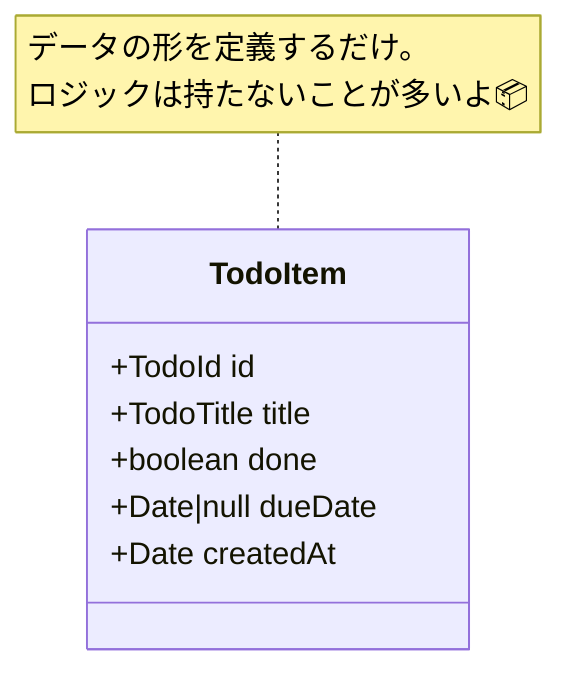

# 第04章：Model入門①：データを型で表す（TodoItem）📦🧷

この章は「Todoの“設計図”をTypeScriptで作る回」だよ〜！🧡
MVCでいう **Model** は、まず **“データの形”をきれいに決める**のが第一歩✨
（ルールや保存はあとでやるから、今日は型でスッキリさせよ〜！🧹🎀）

---

## 0) ちょこっと最新状況だけ👀✨

* TypeScript の最新安定版は **5.9.3（2025-10-01）**だよ〜📌 ([GitHub][1])
* Vite は **v7.3.1（2026-01-07時点でLatest表示）**が見えてるよ〜⚡ ([GitHub][2])
* Node.js は **v24 が Active LTS（Krypton）**で、最近も更新されてる📦 ([Node.js][3])

> つまり「TS + Vite」で作るなら、今どきの構成で安心って感じ🥳✨

---

## 1) Modelってなに？（今日は“データの形”だけ集中🎯）

Modelはざっくり言うと…

* **アプリが持つデータ（状態）** 📦
* **そのデータが守るべきルール（制約）** 🛡️

今回はまず、**Todoのデータ構造**をキレイに決めるよ🧁✨
「どんなプロパティがあって」「型は何で」「空でもいいの？」を **型で固定**する感じ！

---

## 2) TodoItemの最小セットを決めよ〜✂️✅

第3章で決めた最小機能（追加／一覧／完了）から考えると、最低これが必要だよね👇

* `id`：Todoを区別するためのID 🆔
* `title`：表示するタイトル 📝
* `done`：完了した？ ✅
* `dueDate`：期限（なくてもOK）📅
* `createdAt`：作った日時（あると便利）🕒

> ここで大事なのは「まず最小」✨
> priority（重要度）とか tags（タグ）はあとから追加でOKだよ〜🌸



---

## 3) `type` と `interface` の使い分け（ふわっとでOK🙆‍♀️）

TypeScript公式でも「どっちも似てるけど違いあるよ」って説明されてるよ📘✨
たとえば…

* `interface` は **オブジェクトの形**に強い（あとで拡張もしやすい）
* `type` は **union（A or B）**とか、もう少し自由な表現ができる
* そして **interfaceは再オープン（宣言マージ）できるけど、typeはできない** みたいな差もあるよ🧩 ([TypeScript][4])

この教材では、迷ったらこうでいこっか💡

* **オブジェクトの形** → `interface`
* **IDみたいな別名・特殊な型**（union/ブランド型）→ `type`

---

## 4) “無効な状態”を作らないコツ🛡️✨（超入門ver）

いきなり完璧にやらなくてOKなんだけど、最初からちょっと意識すると後がラク🥺💕


### コツ①：`id` をただの `string` にしない（名札をつける🎫）

`id` と `title` が両方 `string` だと、間違えて入れ替えても気づきにくいの…😇
だから `TodoId` みたいに「名札」をつけると事故が減るよ✨

### コツ②：期限が「ない」をどう表すか決める📅

`dueDate?: Date`（ない＝undefined）でもいいし、`Date | null`（ない＝null）でもいい。
今回は **`Date | null`** にして、「ない」を明確にするよ〜🙌

### コツ③：Todoを作る関数（Factory）を用意する🧁

`TodoItem` を直書きで作りまくると、あとでルール追加したときに大変💦
だから **create関数**で作る入口をひとつにするのが気持ちいい✨

---

## 5) 実装しよ〜！ `TodoItem` を作る📦🧷

### 5-1) `src/model/TodoItem.ts` を作る✍️

```ts
// src/model/TodoItem.ts

// ✅ "名札(ブランド)" を付けるための仕掛け
declare const todoIdBrand: unique symbol;
declare const todoTitleBrand: unique symbol;

export type TodoId = string & { readonly [todoIdBrand]: never };
export type TodoTitle = string & { readonly [todoTitleBrand]: never };

// ✅ Todoの本体（オブジェクトの形）
export interface TodoItem {
  readonly id: TodoId;
  readonly title: TodoTitle;
  readonly done: boolean;
  readonly dueDate: Date | null;
  readonly createdAt: Date;
}

/**
 * ✅ IDを発行する（ブラウザの crypto.randomUUID を使う）
 */
export function newTodoId(): TodoId {
  return crypto.randomUUID() as TodoId;
}

/**
 * ✅ タイトルを作る（超ライトなチェックだけ）
 * - 空欄はダメ
 * - 長すぎも一旦60文字まで
 */
export function createTodoTitle(raw: string): TodoTitle | null {
  const t = raw.trim();
  if (t.length === 0) return null;
  if (t.length > 60) return null;
  return t as TodoTitle;
}

/**
 * ✅ Todoを作る入口（Factory）
 * ここに集約しておくと、後でルール追加がラク🎀
 */
export function createTodoItem(params: {
  title: TodoTitle;
  dueDate?: Date | null;
}): TodoItem {
  return {
    id: newTodoId(),
    title: params.title,
    done: false,
    dueDate: params.dueDate ?? null,
    createdAt: new Date(),
  };
}

/**
 * ✅ ちょい便利：完了トグル（後の章でControllerから使う想定）
 */
export function toggleDone(todo: TodoItem): TodoItem {
  return { ...todo, done: !todo.done };
}
```

💡ポイントだよ〜✨

* `TodoItem` は `readonly` にして、「勝手に書き換えない」方向に寄せたよ🧊
* `createTodoTitle` が `null` を返すのは「失敗した」合図🚨（第11章で優しく表示していく💗）

---

## 6) 仮データ3件を作ってみよ🧪✨

次は「表示の準備」用にサンプルを作るよ〜📋💕

### 6-1) `src/model/sampleTodos.ts`

```ts
// src/model/sampleTodos.ts
import { createTodoItem, createTodoTitle, TodoItem } from "./TodoItem";

function mustTitle(raw: string) {
  const t = createTodoTitle(raw);
  if (!t) throw new Error("title is invalid");
  return t;
}

export const sampleTodos = [
  createTodoItem({ title: mustTitle("レポートのテーマ決める📝") }),
  createTodoItem({ title: mustTitle("図書館で参考文献探す📚"), dueDate: new Date(Date.now() + 3 * 86400000) }),
  createTodoItem({ title: mustTitle("提出前に誤字チェック✅") }),
] satisfies TodoItem[];
```

`satisfies TodoItem[]` を付けると、
「型はTodoItem配列として満たしてる？」をチェックしてくれて安心🫶✨
（余計な型変換でふわっとしないのが良い感じ〜！）

---

## 7) ミニ演習🎯✨（手を動かすと覚える〜！）

### 演習A：`dueDate` を “今日” にしたTodoを1件追加📅

* sampleに1つ足してみてね✨

### 演習B：`TodoItem` に `note: string | null` を足してみる📝

* まずは `null` でOK！
* あとで「詳細メモ」画面を足したくなった時に便利だよ〜💗

### 演習C：`createTodoTitle` の制限を変える✂️

* 60文字 → 80文字にしたらどんな影響ある？👀✨
  （UIの崩れも想像できると設計っぽくて最高🙆‍♀️）

---

## 8) AI相棒の使い方（この章のおすすめプロンプト🤖💬✨）

Copilot / Codex に投げるならこんな感じが便利だよ〜🌸

* 「TodoアプリのModelとして必要なプロパティ候補を10個出して。初心者向けに理由も添えて」
* 「上の候補から“最小機能”だけに絞るならどれ？理由も」
* 「`TodoItem` の型定義を `interface` ベースで提案して。`dueDate` の表し方も2案」
* 「`id` と `title` を取り違えないためのTypeScriptの工夫を初心者にわかる比喩で説明して」

コツはこれ👇
**AIにたくさん出してもらう → 人間が最小に削る✂️**
これだけで設計力めっちゃ育つよ🥳✨

---

## 9) よくあるハマりポイント😵‍💫🧯

* **`Date` はJSONにすると文字列になる**
  → 保存（第13章）でちゃんと扱うから今はOK👌✨
* **`title: string` のまま突っ走ると後で事故りやすい**
  → 今回みたいに名札つけると安心🎫
* **`type` と `interface` で迷子**
  → 公式でも違い（拡張や再オープン等）が説明されてるけど、最初は「形＝interface」でOK🙆‍♀️ ([TypeScript][4])

---

## 10) まとめ🎀✨（この章でできたこと）

今日できたのはこれ〜！🎉

* ✅ Todoデータの最小構造を決めた
* ✅ `TodoItem` を `interface` で表現できた
* ✅ `TodoId` / `TodoTitle` に名札を付けて事故を減らした
* ✅ Factory（`createTodoItem`）で作成ルートを固定した
* ✅ 仮データ3件を用意できた🧪✨

次の章（View）では、**この `TodoItem[]` をDOMに表示**して「見える化」していくよ〜📋🎨✨

[1]: https://github.com/microsoft/typescript/releases "Releases · microsoft/TypeScript · GitHub"
[2]: https://github.com/vitejs/vite/releases "Releases · vitejs/vite · GitHub"
[3]: https://nodejs.org/en/about/previous-releases?utm_source=chatgpt.com "Node.js Releases"
[4]: https://www.typescriptlang.org/docs/handbook/2/everyday-types.html?utm_source=chatgpt.com "Documentation - Everyday Types"
