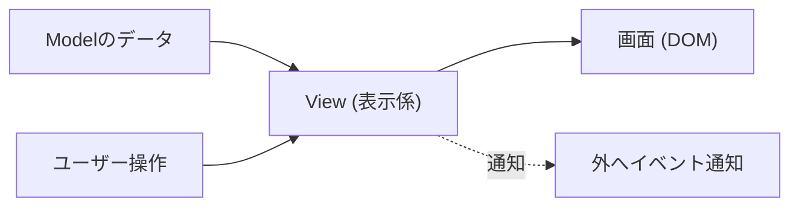

# 第05章：View入門①：DOM表示は“表示だけ”にする🎨🙅‍♀️

この章は **「画面に出す」担当＝View** を、キレイに作る回だよ〜！📺💖
ここでちゃんと分けられると、あとでControllerやModelが育っても破綻しない👍🌱

---

## 0) この章のゴール🎯✨

* Viewの役割をひと言で言える💬（「表示だけ担当！」）
* Todo一覧を **DOMに描画（render）** できる📋✨
* Viewにロジック（ルール・保存・判断）を混ぜない🚫🧠
* Controllerから「描画して〜」って呼ばれたら描画できる設計にする📞➡️📺

---

## 1) Viewの仕事ってなに？👀✨

Viewはね、ざっくりこう👇

* ✅ **Modelの状態を画面に見せる**
* ✅ **ユーザー操作（クリック等）を“拾って”、外に通知する**（判断はしない）
* ❌ ルール判定（タイトル空欄NGとか）はしない
* ❌ 保存（localStorage等）もしない
* ❌ 「どう更新するか」も決めない（それControllerの仕事）

つまり…

> Viewは「表示係」🎨
> 判断するのは外（Controller/Service/Model）🧠



---

## 2) Viewに入れちゃダメなものリスト🚫🍔➡️🥗


ありがちミスを先に封印しよ〜！🪄✨

* ❌ `if (title === "") { ... }` みたいな入力ルール判断（※後の章でModel/Validation側へ）
* ❌ `localStorage.setItem(...)`（永続化は外の層）
* ❌ `todos.push(...)`（Model更新はController/Service）
* ❌ API呼び出し（将来やるとしてもViewじゃない）

Viewは **「与えられたデータを表示」** と **「イベント通知」** だけでOK🙆‍♀️🌸

---

## 3) “良いView”の形：render(state)パターン🔁✨


Viewは基本、**render** を持つと強い💪💕

* `render(todos)` を呼ばれたら

  * 一旦クリアして🧹
  * もう一回描く✍️✨

この「毎回描き直す」スタイルは、初心者にめちゃ相性いい👌
（差分更新は慣れてからでOKだよ〜🙂）

---

## 4) 見やすいHTML構造案 3つ🍰🍮🧁


Viewを作る前に、DOMの置き場所を決めよう📌✨

### A案：最小シンプル（おすすめ）🥇

* フォーム（入力＋追加ボタン）
* 一覧（ul）

### B案：カード型（見た目よし）💳✨

* div.card を繰り返す
* 完了・期限の表示が増えたとき強い

### C案：テーブル型（整列強い）📊✨

* 期限や優先度で列が増えるなら便利

この章は **A案** で行くよ〜！🚀

---

## 5) 実装していこう🛠️✨（Viewだけ作る）

### 5-1) index.html（器を用意）🏠✨

```html
<div id="app">
  <h1>CampusTodo 📚✅</h1>

  <form id="todo-form">
    <input id="todo-title" type="text" placeholder="課題を入力してね📝" />
    <button type="submit">追加 ➕</button>
  </form>

  <ul id="todo-list"></ul>
</div>
```

---

### 5-2) View用の型（今は最小でOK）📦✨

```ts
export type TodoItem = {
  id: string;
  title: string;
  done: boolean;
};
```

---

### 5-3) TodoListView を作る（表示だけ担当）🎨✨

ポイントはこれ👇

* DOM要素を掴む（constructor）
* `render(todos)` で描画
* ユーザー操作は「コールバックで外へ通知」📣

```ts
import type { TodoItem } from "../model/TodoItem";

type AddHandler = (title: string) => void;
type ToggleHandler = (id: string) => void;

export class TodoListView {
  private formEl: HTMLFormElement;
  private titleEl: HTMLInputElement;
  private listEl: HTMLUListElement;

  private onAdd?: AddHandler;
  private onToggle?: ToggleHandler;

  constructor(private root: HTMLElement) {
    const form = root.querySelector<HTMLFormElement>("#todo-form");
    const title = root.querySelector<HTMLInputElement>("#todo-title");
    const list = root.querySelector<HTMLUListElement>("#todo-list");

    if (!form || !title || !list) {
      throw new Error("Viewの初期化に必要な要素が見つからないよ🥲");
    }

    this.formEl = form;
    this.titleEl = title;
    this.listEl = list;

    this.wireEvents();
  }

  // Controllerから「追加したい」通知先を登録してもらう📞✨
  bindAdd(handler: AddHandler) {
    this.onAdd = handler;
  }

  // Controllerから「トグルしたい」通知先を登録してもらう📞✨
  bindToggle(handler: ToggleHandler) {
    this.onToggle = handler;
  }

  // 表示：与えられたtodosを、そのままDOMに描く🎨
  render(todos: TodoItem[]) {
    // 一旦ぜんぶ消す🧹
    this.listEl.replaceChildren();

    const frag = document.createDocumentFragment();

    for (const todo of todos) {
      frag.appendChild(this.createTodoRow(todo));
    }

    this.listEl.appendChild(frag);
  }

  // ---- private ----

  private wireEvents() {
    // フォーム送信：Viewは「タイトルを渡して通知」するだけ📣
    this.formEl.addEventListener("submit", (e) => {
      e.preventDefault();

      const title = this.titleEl.value.trim();
      if (!title) return; // UI都合の空送信ガードだけ（ルール判断は後の章で強化🛡️）

      this.onAdd?.(title);

      // 入力欄を空にする（表示の都合なのでViewの仕事でOK🙆‍♀️）
      this.titleEl.value = "";
      this.titleEl.focus();
    });

    // 一覧クリック：イベント委譲でラクする🪄
    this.listEl.addEventListener("click", (e) => {
      const target = e.target as HTMLElement;

      const btn = target.closest<HTMLButtonElement>('button[data-action="toggle"]');
      if (!btn) return;

      const id = btn.dataset.id;
      if (!id) return;

      this.onToggle?.(id);
    });
  }

  private createTodoRow(todo: TodoItem): HTMLLIElement {
    const li = document.createElement("li");
    li.dataset.id = todo.id;

    // title（textContentで安全に表示👍）
    const titleSpan = document.createElement("span");
    titleSpan.textContent = todo.title;

    if (todo.done) {
      titleSpan.style.textDecoration = "line-through";
      titleSpan.style.opacity = "0.6";
    }

    // toggle button
    const toggleBtn = document.createElement("button");
    toggleBtn.type = "button";
    toggleBtn.dataset.action = "toggle";
    toggleBtn.dataset.id = todo.id;
    toggleBtn.textContent = todo.done ? "未完了に戻す ↩️" : "完了 ✅";

    li.appendChild(titleSpan);
    li.appendChild(document.createTextNode(" "));
    li.appendChild(toggleBtn);

    return li;
  }
}
```

### ✅ ここ大事：`innerHTML` より `textContent` 寄りが安全👮‍♀️✨

ユーザー入力が混ざる表示で `innerHTML` を使うと、危険な文字列が混ざったときに事故りやすいの🥲
MDNでも `innerHTML` の危険性と対策（Trusted Typesなど）が警告されてるよ。 ([MDN Web Docs][1])
文字を入れるだけなら `textContent` が基本の安心枠💖 ([MDN Web Docs][2])

---

## 6) ミニ演習：仮データ3件を描画してみよう🧪📋✨

`main.ts` で、まずView単体を動かしてみるよ〜！

```ts
import { TodoListView } from "./view/TodoListView";
import type { TodoItem } from "./model/TodoItem";

const app = document.querySelector<HTMLElement>("#app");
if (!app) throw new Error("appが見つからないよ🥲");

const view = new TodoListView(app);

const mock: TodoItem[] = [
  { id: "1", title: "レポートの構成を決める📚", done: false },
  { id: "2", title: "参考文献を集める🔎", done: true },
  { id: "3", title: "提出前に誤字チェックする👀", done: false },
];

view.render(mock);

// まだControllerがないので、通知はconsoleで見るだけ👀✨
view.bindAdd((title) => console.log("Add requested:", title));
view.bindToggle((id) => console.log("Toggle requested:", id));
```

✅ できたら、画面に3件出て、ボタン押したらconsoleにログが出ればOK🎉✨

---

## 7) AI相棒の使い方🤖💡（この章向けプロンプト例）

### 🍓HTML構造を考えてもらう

* 「Todoアプリの最小UIのHTML案を3つ。フォーム＋一覧を含めて。初心者向けで。」

### 🍋Viewの責務チェックをしてもらう

* 「このコードのViewに、Model更新や永続化が混ざってないかチェックして。混ざってたら理由と修正案。」

### 🍇render設計を整えてもらう

* 「render(todos)で描画するViewのTypeScriptクラス雛形を作って。イベントはコールバックで外に渡す方式で。」

（生成されたら、**差分レビュー**して、混ざってる責務を削るのがコツだよ✂️✨）

---

## 8) つまずきポイント集🥲➡️😊✨

* `querySelector(...)` が `null`
  → id名のタイポが9割😂（`#todo-list` など）
* クリックイベントが反応しない
  → `data-action="toggle"` が付いてるか確認🔍
* 文字がうまく表示されない
  → `textContent` を使う（`innerHTML` で遊ばない）🧼

---

## 9) この章のセルフチェック✅💖

* [ ] Viewは **render(todos)** を持ってる
* [ ] Viewは **Modelを更新してない**
* [ ] Viewは **保存してない**
* [ ] Viewは **クリック等を拾って、外へ通知**してる
* [ ] 表示は `textContent` 中心で安全寄り👮‍♀️

---

## 10) 次章の予告🎮➡️🧠✨

次はControllerが登場！🚦
Viewから来た「追加したい！」「完了押された！」を受けて、Modelを更新して、またViewに `render` を指示するよ〜🔁💕

---

### （最新メモ🗒️✨）

本日時点で、npm上の **TypeScript latest は 5.9.3**、**Vite latest は 7.3.1** になってるよ。 ([npmjs.com][3])

[1]: https://developer.mozilla.org/en-US/docs/Web/API/Element/innerHTML?utm_source=chatgpt.com "Element: innerHTML property - Web APIs | MDN"
[2]: https://developer.mozilla.org/en-US/docs/Web/API/Node/textContent?utm_source=chatgpt.com "Node: textContent property - Web APIs | MDN"
[3]: https://www.npmjs.com/package/typescript?utm_source=chatgpt.com "TypeScript"
