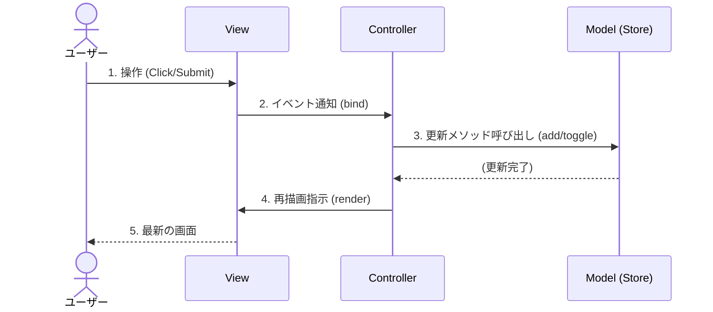

# 第06章：Controller入門①：入力（イベント）を受けて指示する🎮➡️🧠

この章は「Controller＝交通整理🚦」を体に入れる回だよ〜！✨
ボタンやフォームの入力イベントを受け取って、**Modelを更新して → Viewに“描画してね”と指示する**流れを作ります🔁💕

---

## この章のゴール🎯✨

* Controllerがやることを説明できる（交通整理🚦ってこういう意味！）
* **Viewからイベントを受け取る**（submit / click / change）🖱️⌨️
* **Modelを更新して、Viewを再描画する**基本ループが作れる🔁✅
* 「Viewにロジックを入れすぎない🙅‍♀️」を守れる

---

## まず結論：Controllerって何者？👀✨

Controllerは一言でいうと、

* **ユーザー操作（イベント）を受け取る**
* **どの処理を動かすか決める**
* **Modelを更新して**
* **Viewに再描画を頼む**

…っていう、**交通整理係🚦**です！

✅ **Model**：データとルール（Todoの正体📦）
✅ **View**：表示（DOMを作る・更新する🎨）
✅ **Controller**：入力を受けて指示する（司令塔🎮）

---

## 2026/01時点の “今どき”メモ🧃✨（超さらっと）

* TypeScript の最新版は **5.9系**（npm上の Latest は 5.9.3） ([typescriptlang.org][1])
* Vite の Latest は **7.3.1** ([NPM][2])
* Node.js は **v24 が Active LTS**（v25 は Current） ([Node.js][3])
  ※ 2026-01-13 に Node v24.13.0 (LTS) のセキュリティリリースも出てるよ〜🔒 ([Node.js][4])

（章の内容はバージョンに強く依存しないように作ってあるよ🙆‍♀️）

---

## 今日つくる動き（CampusTodo）🧠➡️✅


### ✅ 1) 追加（Add）

* 入力欄にタイトル入れる✍️
* 追加ボタン or Enter で追加➕
* 一覧に反映📋✨

### ✅ 2) 完了トグル（Toggle）

* チェックボックスを押す✅
* done が切り替わる🔁
* 一覧に反映📋✨

---

## “責務まぜまぜ”を防ぐルール🍀🙅‍♀️


**Viewに書いていいのはコレだけ！**👇

* DOMを作る / 更新する
* イベントを拾って「外に通知する」（＝Controllerに渡す）

**Viewに書いちゃダメ！**👇

* todos配列の更新
* id採番
* 追加・完了の業務ロジック

これをController側に寄せるよ〜🚚✨

---

# 実装：Controllerを入れてMVCを回す🌀✨

ここでは最小構成でいくよ！
（あとで第12章でService層に分けるから、今はControllerが少し頑張る💪）

## ファイル構成（例）📁✨


* `src/model/TodoTypes.ts`
* `src/model/TodoStore.ts`
* `src/view/TodoView.ts`
* `src/controller/TodoController.ts`
* `src/main.ts`

---

## 1) Model：TodoStore（データ置き場）📦

```ts
// src/model/TodoTypes.ts
export type TodoId = string;

export type TodoItem = {
  id: TodoId;
  title: string;
  done: boolean;
  createdAt: number;
};
```

```ts
// src/model/TodoStore.ts
import type { TodoId, TodoItem } from "./TodoTypes";

export class TodoStore {
  private todos: TodoItem[] = [];

  getAll(): readonly TodoItem[] {
    return this.todos;
  }

  add(title: string): TodoItem {
    const trimmed = title.trim();
    if (trimmed.length === 0) {
      throw new Error("タイトルが空だよ😢");
    }

    const todo: TodoItem = {
      id: crypto.randomUUID(),
      title: trimmed,
      done: false,
      createdAt: Date.now(),
    };

    this.todos = [todo, ...this.todos];
    return todo;
  }

  toggle(id: TodoId): void {
    this.todos = this.todos.map((t) =>
      t.id === id ? { ...t, done: !t.done } : t
    );
  }
}
```

> ここでは「最低限のルール」として **空タイトルNG**だけ入れてるよ😌
> （もっとルール増やすのは第9章で本格的にやる予定🛡️✨）

---

## 2) View：表示だけ + “イベントを外に渡す窓口”🎨📣

ポイントは「ViewがControllerを直接知らない」こと！
だから `bindAddTodo()` みたいな **イベント登録メソッド**を用意して、外（Controller）から関数を渡してもらう形にするよ🤝✨

```ts
// src/view/TodoView.ts
import type { TodoId, TodoItem } from "../model/TodoTypes";

export class TodoView {
  private form: HTMLFormElement;
  private input: HTMLInputElement;
  private list: HTMLUListElement;

  constructor(root: HTMLElement) {
    this.form = root.querySelector<HTMLFormElement>("#todo-form")!;
    this.input = root.querySelector<HTMLInputElement>("#todo-input")!;
    this.list = root.querySelector<HTMLUListElement>("#todo-list")!;
  }

  render(todos: readonly TodoItem[]): void {
    this.list.innerHTML = "";

    for (const todo of todos) {
      const li = document.createElement("li");

      const label = document.createElement("label");
      label.style.display = "flex";
      label.style.gap = "8px";
      label.style.alignItems = "center";

      const checkbox = document.createElement("input");
      checkbox.type = "checkbox";
      checkbox.checked = todo.done;
      checkbox.dataset.todoId = todo.id;

      const span = document.createElement("span");
      span.textContent = todo.title;
      if (todo.done) {
        span.style.textDecoration = "line-through";
        span.style.opacity = "0.6";
      }

      label.append(checkbox, span);
      li.append(label);
      this.list.append(li);
    }
  }

  // ✅ 追加イベントを“外に通知”する窓口
  bindAddTodo(handler: (title: string) => void): void {
    this.form.addEventListener("submit", (e) => {
      // submit するとページ遷移しちゃうので止めるよ🛑
      // preventDefault の意味は MDN でも説明あり 👍 :contentReference[oaicite:4]{index=4}
      e.preventDefault();

      handler(this.input.value);
    });
  }

  // ✅ 完了トグルイベントを“外に通知”する窓口（イベント委任✨）
  bindToggleTodo(handler: (id: TodoId) => void): void {
    this.list.addEventListener("change", (e) => {
      const target = e.target;
      if (!(target instanceof HTMLInputElement)) return;
      if (target.type !== "checkbox") return;

      const id = target.dataset.todoId;
      if (!id) return;

      handler(id);
    });
  }

  clearInput(): void {
    this.input.value = "";
    this.input.focus();
  }

  showError(message: string): void {
    alert(message); // いったん最小！あとで第11章で優しくする🌸
  }
}
```

### 🌟 submitイベントの注意（地味にハマる）

`submit` は **ボタンじゃなくて form 自体に発火**するよ！📝
（MDNにも明記されてる） ([MDN Web Docs][5])

---

## 3) Controller：交通整理係🚦（本日の主役）


Controllerは **Viewのイベントを受ける → Model更新 → View再描画** をひたすら回すよ🔁✨



```ts
// src/controller/TodoController.ts
import { TodoStore } from "../model/TodoStore";
import { TodoView } from "../view/TodoView";

export class TodoController {
  constructor(
    private store: TodoStore,
    private view: TodoView
  ) {}

  init(): void {
    // 最初の描画
    this.view.render(this.store.getAll());

    // Viewイベントを受けて指示する（交通整理🚦）
    this.view.bindAddTodo((title) => this.handleAdd(title));
    this.view.bindToggleTodo((id) => this.handleToggle(id));
  }

  private handleAdd(title: string): void {
    try {
      this.store.add(title);
      this.view.render(this.store.getAll());
      this.view.clearInput();
    } catch (err) {
      const message = err instanceof Error ? err.message : "追加に失敗したよ😢";
      this.view.showError(message);
    }
  }

  private handleToggle(id: string): void {
    this.store.toggle(id);
    this.view.render(this.store.getAll());
  }
}
```

---

## 4) main.ts：全部つないで起動🔌✨


```ts
// src/main.ts
import "./style.css";
import { TodoStore } from "./model/TodoStore";
import { TodoView } from "./view/TodoView";
import { TodoController } from "./controller/TodoController";

const root = document.querySelector<HTMLElement>("#app")!;

// MVCを組み立てる🧱
const store = new TodoStore();
const view = new TodoView(root);
const controller = new TodoController(store, view);

// 起動🚀
controller.init();
```

---

## 5) HTML（例）🧁（idだけ合ってればOK）

```html
<div id="app">
  <h1>CampusTodo 📚✅</h1>

  <form id="todo-form">
    <input id="todo-input" type="text" placeholder="課題を入力してね✍️" />
    <button type="submit">追加➕</button>
  </form>

  <ul id="todo-list"></ul>
</div>
```

---

# 動作チェック✅✨（できたら勝ち🎉）

* [ ] 入力して「追加➕」で増える
* [ ] Enterでも増える（form submit）
* [ ] 追加後、入力欄が空になってカーソル戻る
* [ ] チェックで取り消し線がつく（done切替）
* [ ] 空欄で追加するとエラーが出る

---

# よくあるハマりポイント集🕳️😵‍💫（ここ大事！）

## ① 追加した瞬間ページがリロードされる😇

原因：フォームsubmitのデフォルト動作（ページ遷移）
対策：`e.preventDefault()` 🛑 ([MDN Web Docs][6])

## ② submitイベントをボタンに付けて動かない🙃


submitは **formに発火**するよ〜！ ([MDN Web Docs][5])
なので `form.addEventListener("submit", ...)` が正解✅

## ③ Viewで todos を直接いじりたくなる誘惑🍰

いじりたくなるけど…ここは我慢！😂
Viewは「表示だけ」にすると、あとで機能追加がラクになるよ✨

---

# ミニ演習（3つ）💪🎀

## 演習A：二重送信を防ぐ🛡️

* 空欄なら追加しない（今はError出るだけ）
* できれば「追加ボタンを一瞬 disabled」にしてもOK✨

## 演習B：件数表示を付ける📊

* 例：`未完了: 3 / 全部: 5` を表示
* どこで数える？ → **Controllerで計算してViewに渡す** が気持ちいいよ😌✨

## 演習C：イベント設計を整理🧾

* 追加：`AddTodo(title)`
* 切替：`ToggleTodo(id)`
* いまは関数で直渡ししてるけど、「操作名」を意識すると第8章がスムーズ🗺️✨

---

# AI相棒の使い方🤖✨（この章向けプロンプト例）

コピペでどうぞ💌（そのまま採用じゃなくて、**差分レビュー**ね！👀）

1. 「TodoViewに `bindAddTodo` と `bindToggleTodo` を追加したい。Viewはロジックを持たず、イベントを外に通知するだけにしたい。最小実装例をTypeScriptで」
2. 「Controllerで `handleAdd` / `handleToggle` を作りたい。例外処理と再描画の責務をきれいに保ちたい」
3. 「changeイベントのイベント委任の例を、checkbox + datasetで」
4. 「submitでリロードされる問題の原因と対策を、初心者向けに説明して」
5. 「MVCでControllerが太り始めるサインを箇条書きで（次章への予告にも使う）」

---

# まとめ🌸✨

今日できたのはこれ！🎉

* **イベント（入力） → Controllerが受け取る**🎮
* **Modelを更新 → Viewに描画指示**🧠➡️🎨
* MVCが **グルグル回り始めた**🌀✅

次の章（第7章）は、この回転を「ルール化」して、さらにブレないMVCにしていくよ〜！🚀💕

[1]: https://www.typescriptlang.org/download/?utm_source=chatgpt.com "How to set up TypeScript"
[2]: https://www.npmjs.com/package/vite?utm_source=chatgpt.com "vite"
[3]: https://nodejs.org/en/about/previous-releases?utm_source=chatgpt.com "Node.js Releases"
[4]: https://nodejs.org/en/blog/release/v24.13.0?utm_source=chatgpt.com "Node.js 24.13.0 (LTS)"
[5]: https://developer.mozilla.org/en-US/docs/Web/API/HTMLFormElement/submit_event?utm_source=chatgpt.com "HTMLFormElement: submit event - Web APIs | MDN"
[6]: https://developer.mozilla.org/en-US/docs/Web/API/Event/preventDefault?utm_source=chatgpt.com "Event: preventDefault() method - Web APIs | MDN"
