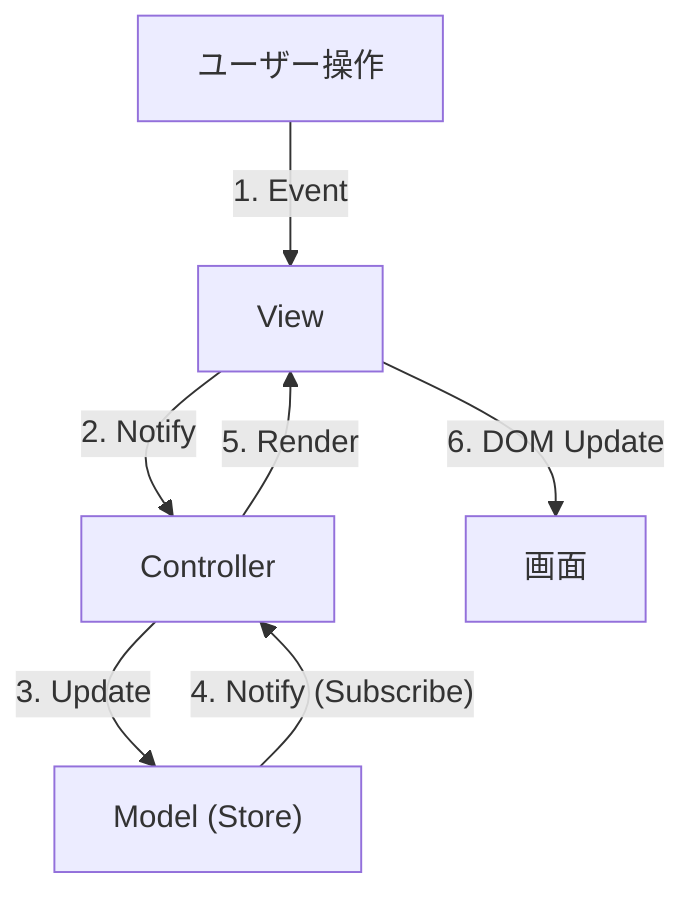

# 第07章：MVCが回る！データフロー（更新→再表示）を固定する🔁✨

この章は「MVCって結局どう回るの？」を **“毎回同じ手順で回る”** ように固定して、バグと迷子を激減させる回です🌀🧠
題材は **完了トグル（done切替）✅🔁** を入れつつ、**更新→再表示の流れ** をガッチリ決めます💪✨

---

## 0) （2026/01時点）ツール周りの軽い最新メモ📝✨

* TypeScript は **5.9 系**のリリースノートが最新更新（2026-01-12更新）になっています🧩 ([TypeScript][1])
* Node.js は **v24 が Active LTS**、**v25 が Current** として更新されています（2026-01-12更新）🟢 ([Node.js][2])

  * 直近のセキュリティ更新も出ているので、学習でも `node -v` は時々チェックすると安心です🔐 ([Node.js][3])
* Vite は **v7系が最新ライン**で、GitHub Releases では **v7.3.1 が Latest** 表示です⚡ ([GitHub][4])

  * v7 ではデフォルトのブラウザターゲットも更新されています🧭 ([vitejs][5])

（この章の本題は設計なので、ここは“豆知識”くらいでOKだよ〜😉）

---

## 1) この章のゴール🎯✨

できたら勝ち🏆💖

* ✅ **「ユーザー操作 → Controller → Model更新 → View再描画」** を毎回同じ形にできる
* ✅ View が勝手に状態を書き換えない（**表示だけ**）🎨🙅‍♀️
* ✅ Model が View を知らない（**依存の向き**）🧭
* ✅ 「完了トグル」でも迷わず回る🔁✅

---

## 2) “固定データフロー”のルール3つ🧷✨

この3つを **クラス設計の憲法** にします📜💘

### ルールA：状態（真実）はModelにだけ置く📦✨

* `todos[]` の正本は **Model（Store）だけ**
* View に「いま done かどうか」みたいな状態を持たせない🧠🚫

### ルールB：更新はController経由だけ🚦

* View は「クリックされたよ！」を通知するだけ📣
* 直接 `todos` をいじらない🙅‍♀️

### ルールC：描画は “1つの入口” にまとめる🎨🚪

* `render(todos)` みたいな **描画の入口は1個**
* 「ちょっとここだけDOM更新…」を散らすと、すぐ地獄になります😇🔥

---

## 3) 回転イメージ🌀（これが毎回同じ形なら勝ち）


（脳内アニメ用🎞️✨）

1. ユーザーがチェックボックスをクリック✅
2. View が「toggle 요청！」を Controller に伝える📣
3. Controller が Model に「toggleして〜」って頼む📦
4. Model が状態を更新して「変わったよ！」を通知🔔
5. View が **Modelの最新状態** を受け取って render 🎨✨

ポイント：**ViewはModelの“今”を表示するだけ** 👀✨
「Viewが自分の都合で状態を持つ」とズレます😵‍💫

---

## 4) 実装方針：Store（Model）に subscribe を生やす🔔✨


ここがこの章のキモ！
**Modelが変わったら“自動で再描画”される**ようにして、流れを固定します🔁💕



### フォルダ構成（例）📁✨

```text
src/
  model/
    TodoStore.ts
  view/
    TodoView.ts
  controller/
    TodoController.ts
  main.ts
```

---

## 5) Model：TodoStore（状態の正本）📦🛡️

* `toggleDone(id)` で **状態更新はここだけ**
* `subscribe()` で変更通知🔔

```ts
// src/model/TodoStore.ts
export type TodoId = string;

export interface TodoItem {
  id: TodoId;
  title: string;
  done: boolean;
  createdAt: number;
}

type Listener = () => void;

export class TodoStore {
  private todos: TodoItem[] = [];
  private listeners = new Set<Listener>();

  getSnapshot(): readonly TodoItem[] {
    // View側で勝手に push できないように「読み取り専用」で渡す✨
    return this.todos;
  }

  subscribe(listener: Listener): () => void {
    this.listeners.add(listener);
    return () => this.listeners.delete(listener);
  }

  private notify(): void {
    for (const l of this.listeners) l();
  }

  add(title: string): void {
    const trimmed = title.trim();
    if (!trimmed) return; // 第11章でちゃんとエラーメッセージにする予定😉

    const item: TodoItem = {
      id: crypto.randomUUID(),
      title: trimmed,
      done: false,
      createdAt: Date.now(),
    };

    this.todos = [item, ...this.todos];
    this.notify();
  }

  toggleDone(id: TodoId): void {
    let changed = false;

    this.todos = this.todos.map(t => {
      if (t.id !== id) return t;
      changed = true;
      return { ...t, done: !t.done };
    });

    if (changed) this.notify();
  }
}
```

🧠ポイント

* `notify()` は **変更が起きたときだけ**
* `getSnapshot()` は **Model→View の一方通行**のデータ供給口🍹✨

---

## 6) View：表示だけ担当（イベントは“通知”だけ）🎨📣

* `render()` は DOM更新だけ
* クリックを受けたら「idを渡してコールバック呼ぶ」だけ💡

```ts
// src/view/TodoView.ts
import type { TodoId, TodoItem } from "../model/TodoStore";

export class TodoView {
  private form: HTMLFormElement;
  private input: HTMLInputElement;
  private list: HTMLUListElement;

  private onAdd?: (title: string) => void;
  private onToggle?: (id: TodoId) => void;

  constructor(root: HTMLElement) {
    this.form = root.querySelector("#todo-form") as HTMLFormElement;
    this.input = root.querySelector("#todo-title") as HTMLInputElement;
    this.list = root.querySelector("#todo-list") as HTMLUListElement;

    // 追加（submit）
    this.form.addEventListener("submit", (e) => {
      e.preventDefault();
      this.onAdd?.(this.input.value);
      // 入力欄クリアは「表示上の都合」なので View 側でOK✨
      this.input.value = "";
      this.input.focus();
    });

    // 完了トグル（イベント委譲で軽くする✨）
    this.list.addEventListener("change", (e) => {
      const target = e.target as HTMLElement;
      if (!(target instanceof HTMLInputElement)) return;
      if (target.type !== "checkbox") return;

      const id = target.dataset.id;
      if (!id) return;

      this.onToggle?.(id);
    });
  }

  bindAdd(handler: (title: string) => void): void {
    this.onAdd = handler;
  }

  bindToggle(handler: (id: TodoId) => void): void {
    this.onToggle = handler;
  }

  render(todos: readonly TodoItem[]): void {
    // ここは「表示だけ」🎨✨
    this.list.innerHTML = "";

    const frag = document.createDocumentFragment();

    for (const t of todos) {
      const li = document.createElement("li");

      // done を View に保存しない。毎回 todos から描く👀✨
      li.innerHTML = `
        <label style="display:flex; gap:8px; align-items:center;">
          <input type="checkbox" data-id="${t.id}" ${t.done ? "checked" : ""} />
          <span>${escapeHtml(t.title)}</span>
        </label>
      `;

      // doneなら薄く表示（見た目だけ）
      if (t.done) li.style.opacity = "0.6";

      frag.appendChild(li);
    }

    this.list.appendChild(frag);
  }
}

// 超簡易：この教材では“まずは守る”✨（本格的には別章でOK）
function escapeHtml(s: string): string {
  return s
    .replaceAll("&", "&amp;")
    .replaceAll("<", "&lt;")
    .replaceAll(">", "&gt;")
    .replaceAll('"', "&quot;")
    .replaceAll("'", "&#039;");
}
```

💡ここ超大事

* `change` イベントで **チェックボックス変更** を拾ってる✅
* `data-id` を埋めておけば、クリック→id特定が楽ちん🧁✨

---

## 7) Controller：交通整理（更新の入口をここに寄せる）🚦🧠

Controller は「操作→Model更新」をやって、再描画は **Modelのsubscribeで固定**します🔁✨
これで Controller が「render呼び忘れた！」が起きなくなります🎉

```ts
// src/controller/TodoController.ts
import { TodoStore } from "../model/TodoStore";
import { TodoView } from "../view/TodoView";

export class TodoController {
  constructor(
    private store: TodoStore,
    private view: TodoView
  ) {}

  init(): void {
    // 変更があったら必ず最新を描く🎨✨（回転が固定される）
    this.store.subscribe(() => {
      this.view.render(this.store.getSnapshot());
    });

    // View → Controller → Model
    this.view.bindAdd((title) => {
      this.store.add(title);
    });

    this.view.bindToggle((id) => {
      this.store.toggleDone(id);
    });

    // 初回描画
    this.view.render(this.store.getSnapshot());
  }
}
```

---

## 8) main.ts：組み立て🧩✨

```ts
// src/main.ts
import { TodoStore } from "./model/TodoStore";
import { TodoView } from "./view/TodoView";
import { TodoController } from "./controller/TodoController";

const root = document.querySelector("#app") as HTMLElement;

const store = new TodoStore();
const view = new TodoView(root);
const controller = new TodoController(store, view);

controller.init();
```

---

## 9) “責務まざり”あるある事故まとめ😇💥（チェックリスト）

以下が出たら、この章に戻ってね📌✨

* ❌ Viewの中で `store.toggleDone()` を直接呼んでる
  → Viewは「通知だけ」📣
* ❌ Controllerのあちこちで `view.render()` を手動で呼びまくってる
  → `store.subscribe(() => render)` で一本化🎨🚪
* ❌ ModelがDOM要素を引数に取ってる（`toggleDone(checkboxEl)` とか）
  → Modelは **データだけ** を扱う📦
* ❌ done状態を View 側の変数に保存してる
  → 常に `store.getSnapshot()` が真実👑

---

## 10) 動作確認の手順✅🧪

* Todo追加 ➕
* チェックON/OFF ✅🔁
* リロード（まだ永続化前だから消えてOK）🔄
* チェック操作を連打しても表示が破綻しない💪✨

---

## 11) AI相棒の使い方🤖💡（この章に効くプロンプト）

Copilot / Codex に投げるなら、こういうのが強いよ〜🪄✨

### 責務レビュー🧐

```text
次のコードは MVC の責務分離ができていますか？
Viewが状態を持っていないか、Controllerが太っていないか、ModelがViewを知らないかを観点に、
問題点と改善案を箇条書きで出してください。
（改善は最小の変更で）
```

### データフロー固定チェック🔁

```text
「ユーザー操作 → Controller → Model更新 → View再描画」の一方向フローに固定できていますか？
renderの入口が1つになっているかも含めて確認して。
```

---

## 12) ミニ演習🎓✨（理解が固まるやつ）

1. `toggleDone` を「見つからないidなら何もしない」だけじゃなく、**デバッグ用に console.warn** 出す（Controllerじゃなく Model 側）🧯
2. done のとき、タイトルに取り消し線を付ける（見た目だけ）✍️✨
3. `render()` の中で **イベントを追加しない**（再描画のたびに増殖する事故を防ぐ）🐛🚫

   * いまは constructor で1回だけ付けてるからOK🎉

---

この章ができると、以降の章（Service層🍔➡️🥗、永続化💾、Repository🔁、テスト🧪）が **めちゃ楽** になります✨
MVCの回転が固定されてると、機能追加が「足すだけ」になって気持ちいいよ〜☺️🌸

[1]: https://www.typescriptlang.org/docs/handbook/release-notes/typescript-5-9.html?utm_source=chatgpt.com "Documentation - TypeScript 5.9"
[2]: https://nodejs.org/en/about/previous-releases?utm_source=chatgpt.com "Node.js Releases"
[3]: https://nodejs.org/en/blog/vulnerability/december-2025-security-releases?utm_source=chatgpt.com "Tuesday, January 13, 2026 Security Releases"
[4]: https://github.com/vitejs/vite/releases?utm_source=chatgpt.com "Releases · vitejs/vite"
[5]: https://ja.vite.dev/guide/migration?utm_source=chatgpt.com "v7 からの移行"
