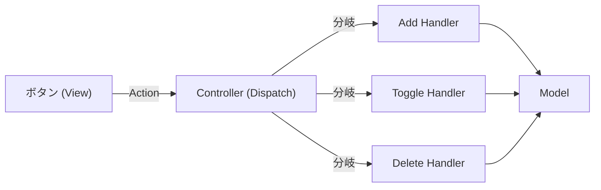

# 第08章：Controller入門②：ルーティング的な“操作表”を作る🗺️📌

〜if地獄を回避して、追加に強いControllerにしよう🍀〜

※この章で使うTypeScriptは現時点だと 5.9 系が最新ラインです🧡（npmの最新が 5.9.3、公式DLページも “currently 5.9” 表記） ([NPM][1])
（Viteも v7 系が最新ラインです✨） ([GitHub][2])

---

## 0) この章のゴール🎯✨

できるようになることはコレ👇

* ✅ Controllerの中で **if/switchが増殖する問題** を説明できる🧠
* ✅ **「操作（Action）」を一覧化**して、Controllerに“操作表”を作れる🧾
* ✅ 新しい操作を増やすときに、**1〜2箇所を足すだけ**で済む構造にできる🧱✨

---

## 1) まず、if地獄ってどんな状態？😇🔥

例えばControllerにこういうのが増えていくやつ👇（あるある〜）

```ts
// Controllerのどこか…
handleClick(action: string, payload: unknown) {
  if (action === "add") {
    // 追加…
  } else if (action === "toggle") {
    // 完了切替…
  } else if (action === "delete") {
    // 削除…
  } else if (action === "filter") {
    // 絞り込み…
  } else {
    // ？？？
  }
}
```

これ、最初はいいんだけど…
操作が増えるほど👇が起きやすいの💥

* 😵 どこに何を書けばいいか迷う
* 😵 変更のたびに壊しやすい
* 😵 「この分岐、別の場所にもある」みたいに重複が増える
* 😵 テストもしづらい（後の章で効いてくる〜🧪）

---

## 2) 解決アイデア：「操作（Action）」を“名前”で揃えて、表で捌く🧾✨


この章の主役はこれ👇

> **操作表（Action → Handler の対応表）** をControllerに置く🗺️
> 「操作名を見て、対応する関数にジャンプする」だけにする💨

イメージは学食の券売機🍜🎟️



* ボタン（操作）を押す
* 対応するメニュー（処理）が実行される
* ifで「カレーなら…ラーメンなら…」って毎回判断しない😆

これ、設計的には **Commandパターン** のミニ版みたいな感じだよ〜（操作を“命令”として扱う発想） ([CodeSignal][3])

---

## 3) まずは「操作（Action）」を型で作る📦✨（discriminated union）


CampusTodoの操作を、まずは最小で4つくらい用意しよ👇
（`type` を合言葉にして判別できる “判別可能なユニオン” だよ🪄）

```ts
// src/controller/actions.ts
export type Action =
  | { type: "todo/add"; title: string; dueDate?: string }
  | { type: "todo/toggle"; id: string }
  | { type: "todo/delete"; id: string }
  | { type: "ui/setFilter"; filter: "all" | "open" | "done" };
```

ポイント💡

* `type: "todo/add"` みたいに **文字列を固定**すると、ミスが減る✨
* `todo/` と `ui/` を分けると、頭の整理がラク🧠🧡

---

## 4) Controllerに「操作表」を作る🧾✨（Action → Handler）

### 4-1) まずは素朴に “表” を作る（気持ちを掴む😆）

```ts
// Controllerの中で…
const handlers = {
  "todo/add": (action: any) => {},
  "todo/toggle": (action: any) => {},
  "todo/delete": (action: any) => {},
  "ui/setFilter": (action: any) => {},
};
```

これだけで「ifの列」が「表」に変わった👍
でも `any` は危ないよね⚠️（型の守りが消える）

---

### 4-2) ちゃんと型で守る🛡️（キーと引数を一致させる）

「`todo/add` のハンドラには `todo/add` のActionだけが来る」
これを **型で保証**したいの！🔥

TypeScriptでは、discriminated unionを `Extract` で絞って
**操作名ごとに引数型が合う“対応表型”** を作れるよ💎 ([Stack Overflow][4])

```ts
// src/controller/handlers.ts
import type { Action } from "./actions";

export type ActionHandlers = {
  [K in Action["type"]]: (action: Extract<Action, { type: K }>) => void;
};
```

そしてController側👇

```ts
// src/controller/TodoController.ts
import type { Action } from "./actions";
import type { ActionHandlers } from "./handlers";

export class TodoController {
  // model / view はすでにある前提でOK（第7章までの流れ✨）

  private filter: "all" | "open" | "done" = "all";

  private handlers: ActionHandlers = {
    "todo/add": (action) => {
      // action.title / action.dueDate が型で効く✨
      this.model.add(action.title, action.dueDate);
      this.render();
    },

    "todo/toggle": (action) => {
      this.model.toggle(action.id);
      this.render();
    },

    "todo/delete": (action) => {
      this.model.remove(action.id);
      this.render();
    },

    "ui/setFilter": (action) => {
      this.filter = action.filter;
      this.render();
    },
  };

  // これが“ルーティング”（dispatch）🗺️
  public dispatch = (action: Action) => {
    // ここは「表を引く」だけ✨
    // 型の都合で1回だけキャスト（初心者向けに割り切り🙏）
    (this.handlers[action.type] as (a: Action) => void)(action);
  };

  private render() {
    const items = this.model.getAll();
    const visible = this.applyFilter(items, this.filter);
    this.view.render(visible, { filter: this.filter });
  }

  private applyFilter(items: TodoItem[], filter: "all" | "open" | "done") {
    if (filter === "open") return items.filter((x) => !x.done);
    if (filter === "done") return items.filter((x) => x.done);
    return items;
  }
}
```

ここで大事なのは👇💡

* `dispatch` は **ifしない**（表を引くだけ）
* 追加するときはだいたい

  1. `Action` に1行追加 ➕
  2. `handlers` に1個追加 ➕
     で終わる✨（成長に強い🧱）

---

## 5) View側：イベントは “Action” に変換してControllerへ投げる🎮➡️🧠

ここがキモ〜！！💖
Viewは「クリックされた！」を受け取ったら、**Actionを作って投げるだけ**にする✨

しかもイベントは **イベント委譲** にするとスッキリするよ🍀
（親1個にリスナー置いて、`event.target` を見て判断するやつ） ([javascript.info][5])

例：各ボタンに `data-action` と `data-id` を持たせる👇

```html
<button data-action="todo/toggle" data-id="a1">完了✅</button>
<button data-action="todo/delete" data-id="a1">削除🗑️</button>
```

Viewの実装例👇

```ts
// src/view/TodoView.ts
import type { Action } from "../controller/actions";

export class TodoView {
  private onAction: (action: Action) => void = () => {};

  constructor(private root: HTMLElement) {}

  public setActionHandler(handler: (action: Action) => void) {
    this.onAction = handler;
  }

  public bindEvents() {
    this.root.addEventListener("click", (e) => {
      const target = e.target as HTMLElement | null;
      const btn = target?.closest<HTMLElement>("[data-action]");
      if (!btn) return;

      const actionType = btn.dataset.action;

      // ガード節の if はOK（長い分岐を作らないのが目的✨）
      if (actionType === "todo/toggle") {
        const id = btn.dataset.id!;
        this.onAction({ type: "todo/toggle", id });
      }

      if (actionType === "todo/delete") {
        const id = btn.dataset.id!;
        this.onAction({ type: "todo/delete", id });
      }
    });

    // 追加フォーム例（submit → todo/add）
    const form = this.root.querySelector<HTMLFormElement>("#todoForm");
    form?.addEventListener("submit", (e) => {
      e.preventDefault();
      const title = (this.root.querySelector("#title") as HTMLInputElement).value.trim();
      const dueDate = (this.root.querySelector("#dueDate") as HTMLInputElement).value || undefined;

      this.onAction({ type: "todo/add", title, dueDate });
    });

    // フィルタ例（select → ui/setFilter）
    const filter = this.root.querySelector<HTMLSelectElement>("#filter");
    filter?.addEventListener("change", () => {
      this.onAction({ type: "ui/setFilter", filter: filter.value as any });
    });
  }

  public render(items: TodoItem[], ui: { filter: string }) {
    // ここは表示だけ🎨（第5章のルール守る✨）
  }
}
```

> ちなみに `data-action` 方式は、ボタンが増えても親1個で捌けるから
> 「イベントが増殖して見失う😵」が減りやすいよ〜✨ ([javascript.info][5])

---

## 6) “操作表”を入れると、何が嬉しいの？🎁✨

### ✅ 追加がラク

新機能「期限を延ばす（todo/postpone）」を足すなら👇

1. `Action` に1行追加
2. `handlers` に1個追加
3. ViewでそのActionを投げる

終わり！🎉
Controllerの巨大ifを編集しなくていい✨

### ✅ 読みやすい

「このアプリでできる操作一覧」が、表として見える👀🧡

### ✅ 責務がキレイ

* View：Action作って投げる
* Controller：ActionをルーティングしてModel更新
* Model：データとルール（第9章で強化🔥）

---

## 7) ミニ演習✍️✨（手を動かすと一気に身につく！）

### 演習A：`ui/setFilter` をちゃんと動かす🎛️✨

* `filter` のUI（select）を用意
* `render()` でフィルタ適用
* “フィルタ操作”が増えてもControllerが荒れないことを確認✅

### 演習B：`todo/editTitle` を追加する📝💖

* Actionを追加：`{ type: "todo/editTitle"; id: string; title: string }`
* handlersに追加：`model.rename(id, title)`
* View：編集UI（promptでもOK）からAction投げる

---

## 8) AI活用🤖💡（この章向け：うまい使い方テンプレ）

そのままコピペでどうぞ🎀

### ✅ 操作一覧の棚卸し（抜け漏れチェック）

```text
CampusTodoの操作(Action)候補を列挙して。
ただし「最小構成」で、追加/完了切替/削除/フィルタの4系統から大きく増やしすぎないで。
```

### ✅ data-action設計（命名そろえる）

```text
data-action の命名ルールを提案して。
例: "todo/add" のようにスラッシュ区切りで、増えても読みやすい形に。
```

### ✅ handlers表の追加レビュー（責務混ざり検知）

```text
このhandlersの各処理はControllerに置いてOK？
View/Modelに移すべきものがあれば理由付きで指摘して。
```

---

## 9) 小さな安全メモ🔒（npm入れる時のやつ）

最近、人気パッケージ名に似せた **typosquatting（偽名パッケージ）** が報告されてるので、`npm install` するときはスペルをよく見る癖つけると安心だよ〜👀⚠️
（例として “typescriptjs” みたいな紛らわしい名前が問題になったケースが報告あり） ([Socket][6])

---

## まとめ🌸✨

この章でやったことは超シンプルで強いです💪💖

* 操作を **Action（型）** にする📦
* Controllerに **操作表（Action→Handler）** を作る🧾
* `dispatch` は **表を引くだけ** にする🗺️✨
* Viewは **Actionを作って投げるだけ** 🎮➡️🧠

次の第9章で、この流れに「ルール（不変条件）」をModel側へ寄せて、さらに強くしていくよ〜🛡️📦✨

[1]: https://www.npmjs.com/package/typescript?utm_source=chatgpt.com "TypeScript"
[2]: https://github.com/vitejs/vite/releases?utm_source=chatgpt.com "Releases · vitejs/vite"
[3]: https://codesignal.com/learn/courses/behavioral-design-patterns-3/lessons/command-pattern-in-typescript?utm_source=chatgpt.com "Command Pattern in TypeScript"
[4]: https://stackoverflow.com/questions/64092736/alternative-to-switch-statement-for-typescript-discriminated-union?utm_source=chatgpt.com "alternative to switch statement for typescript discriminated ..."
[5]: https://javascript.info/event-delegation?utm_source=chatgpt.com "Event delegation"
[6]: https://socket.dev/blog/10-npm-typosquatted-packages-deploy-credential-harvester?utm_source=chatgpt.com "10 npm Typosquatted Packages Deploy Multi-Stage ..."
