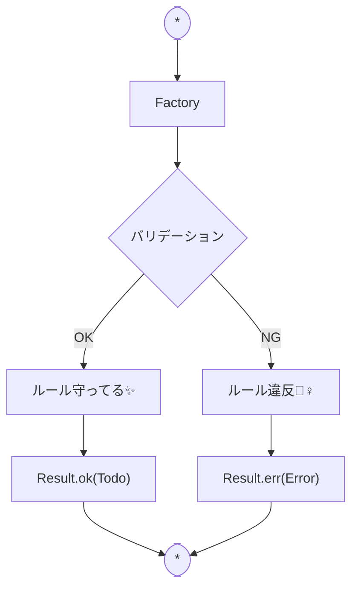

# 第09章：Model入門②：不変条件（ルール）をModel側に寄せる🛡️📦

## この章のゴール🎯

* 「**不変条件**（＝いつでも守りたいルール）」って何か説明できる🗣️
* ルールを **View/Controllerに散らさず**、Model（≒ドメイン）に寄せられる💪
* **「無効なTodoが作れない」**状態をTypeScriptで作れる✅

---

## 0. 最新メモ（2026/01時点）🆕📝

* TypeScriptは **5.9系** のドキュメントが更新されているよ📌 ([TypeScript][1])
* さらに先では、TypeScriptのネイティブ化（TypeScript 7の話）も進捗が出てるみたい👀（ビルド高速化の流れ） ([Microsoft Developer][2])

※この章は「設計の考え方」が主役だけど、最新TSでもそのまま通じる形で書くね🧡

---

## 1. 不変条件（Invariant）ってなに？🧠✨


**不変条件**はひとことで言うと…

> 「そのデータは、いつ見ても“ちゃんとしててほしい”」っていうルール🌼

たとえばTodoなら…👇

* タイトルが空はダメ🙅‍♀️
* 期限が過去はダメ（今日より前はNG）📅⚠️
* `done` が `true/false` 以外になるのはダメ（型で守る）🧷
* `id` が空とか重複はダメ🆔❌

ここで大事なのが、**入力経路は1個じゃない**ってこと😳

* フォーム入力📝
* LocalStorageから復元💾
* 未来：サーバーから取得🌐
* 未来：別画面（編集/インポート）📦

だから **「UIでチェックしたからOK」じゃ足りない**のね💥
最終防衛ラインとして、**Modelが守る**のがいちばん強い🛡️✨

---

## 2. CampusTodoで採用する不変条件セット📚✅

この教材では、まずは“やりすぎない”範囲でいくよ🍀（増やしすぎると混乱しがち😵‍💫）

### ✅ 作成時に守りたいルール

* タイトル：

  * 空文字（空白だけも）NG🙅‍♀️
  * 50文字まで（例）✍️
* 期限：

  * 未設定OK（null）👌
  * 設定するなら「今日以降」📅✨

### ✅ 更新時に守りたいルール

* タイトル変更でも同じルールを使う（重複実装しない）♻️
* 期限変更でも同じルールを使う♻️

---

## 3. ルールをModelに寄せる“型”の作戦🧠🧱✨

この章のコツは3つだけ覚えればOKだよ〜！🫶

### 作戦A：Controllerが受け取るのは「生の文字列」🧃

フォームの値って、基本 `string` だよね？
**それをそのままModelに入れない**！🚫
Modelに入れる直前で「検証＆変換」する✨

### 作戦B：作る時は Factory（生成関数）でしか作れないようにする🏭

`createTodo(...)` みたいな関数を用意して、
**そこを通らないとTodoが作れない**設計にするよ✅

### 作戦C：失敗を握りつぶさず Result で返す📦


例：

* 成功 → Todoが返る🎉
* 失敗 → エラーの理由が返る😢

この「成功/失敗が型で分かる」だけで、設計が一気に安定するよ💪✨



---

## 4. 実装してみよう（Model側）🧩💻✨

### 4-1. Result型（成功 or 失敗）📦✨


```ts
// model/result.ts
export type Result<T, E> =
  | { ok: true; value: T }
  | { ok: false; error: E };

export const ok = <T>(value: T): Result<T, never> => ({ ok: true, value });
export const err = <E>(error: E): Result<never, E> => ({ ok: false, error });
```

---

### 4-2. エラー型（何がダメかを“言語化”）🗣️🚨


```ts
// model/todoErrors.ts
export type TodoValidationError =
  | { kind: "TitleEmpty" }
  | { kind: "TitleTooLong"; max: number }
  | { kind: "DueDateInPast"; todayISO: string };
```

> ここで「文字列のエラーメッセージ」を直接入れないのがポイント🎯
> 表示の言葉は第11章で“優しく”作るよ😌🌸

---

### 4-3. Value Object（タイトルはただのstringじゃない🧷）


「タイトルは文字列です」って言いつつ、
実は **空NG** とか **最大文字数** とか“条件つき文字列”だよね？👀

だから `TodoTitle` を作っちゃう✨

```ts
// model/todoValueObjects.ts
import { Result, ok, err } from "./result";
import { TodoValidationError } from "./todoErrors";

declare const todoTitleBrand: unique symbol;
export type TodoTitle = string & { readonly [todoTitleBrand]: "TodoTitle" };

const TITLE_MAX = 50;

export function createTodoTitle(raw: string): Result<TodoTitle, TodoValidationError[]> {
  const errors: TodoValidationError[] = [];
  const trimmed = raw.trim();

  if (trimmed.length === 0) errors.push({ kind: "TitleEmpty" });
  if (trimmed.length > TITLE_MAX) errors.push({ kind: "TitleTooLong", max: TITLE_MAX });

  if (errors.length > 0) return err(errors);
  return ok(trimmed as TodoTitle);
}
```

---

### 4-4. 期限（input[type="date"]想定の YYYY-MM-DD）📅

ブラウザの `type="date"` は、だいたい `"YYYY-MM-DD"` が来るよね🗓️
（タイムゾーン事故を減らすために、ここでは **ISO日付文字列**で管理するよ🧊）

```ts
// model/todoDueDate.ts
import { Result, ok, err } from "./result";
import { TodoValidationError } from "./todoErrors";

declare const dueDateBrand: unique symbol;
export type DueDateISO = string & { readonly [dueDateBrand]: "DueDateISO" };

// "YYYY-MM-DD" を "今日" と比較するための小物
function todayISO(): string {
  const d = new Date();
  const yyyy = d.getFullYear();
  const mm = String(d.getMonth() + 1).padStart(2, "0");
  const dd = String(d.getDate()).padStart(2, "0");
  return `${yyyy}-${mm}-${dd}`;
}

export function createDueDateISO(raw: string): Result<DueDateISO | null, TodoValidationError[]> {
  const trimmed = raw.trim();
  if (trimmed === "") return ok(null); // 未設定OK👌

  // 雑に形式チェック（ガチガチにしすぎない）
  if (!/^\d{4}-\d{2}-\d{2}$/.test(trimmed)) {
    // 形式エラーは第11章で扱いやすいように、今回は past判定だけに集中してもOK
    return ok(trimmed as DueDateISO); // 教材的に簡略（気になる人はAIで強化してね🤖）
  }

  const t = todayISO();
  if (trimmed < t) return err([{ kind: "DueDateInPast", todayISO: t }]);

  return ok(trimmed as DueDateISO);
}
```

※ここ、形式エラーまで厳密にするのもアリだけど、最初は「やりすぎない」のが正解🙆‍♀️✨
（厳密化は第11章のValidationで気持ちよくやろう〜！）

---

### 4-5. Todo本体：Factoryでしか作れないようにする🏭🛡️


```ts
// model/todo.ts
import { Result, ok, err } from "./result";
import { TodoValidationError } from "./todoErrors";
import { TodoTitle, createTodoTitle } from "./todoValueObjects";
import { DueDateISO, createDueDateISO } from "./todoDueDate";

declare const todoIdBrand: unique symbol;
export type TodoId = string & { readonly [todoIdBrand]: "TodoId" };

export type Todo = Readonly<{
  id: TodoId;
  title: TodoTitle;
  done: boolean;
  dueDateISO: DueDateISO | null;
  createdAtISO: string;
}>;

function nowISO(): string {
  return new Date().toISOString();
}

function newTodoId(): TodoId {
  // 2026の主要ブラウザならだいたいOK（Web Crypto）
  return crypto.randomUUID() as TodoId;
}

export function createTodo(input: {
  titleRaw: string;
  dueDateRaw: string;
}): Result<Todo, TodoValidationError[]> {
  const errors: TodoValidationError[] = [];

  const titleR = createTodoTitle(input.titleRaw);
  if (!titleR.ok) errors.push(...titleR.error);

  const dueR = createDueDateISO(input.dueDateRaw);
  if (!dueR.ok) errors.push(...dueR.error);

  if (errors.length > 0) return err(errors);

  return ok({
    id: newTodoId(),
    title: titleR.value,
    done: false,
    dueDateISO: dueR.value,
    createdAtISO: nowISO(),
  });
}
```

---

### 4-6. 更新も“関数経由”にしてルールを守る🔁✨

```ts
// model/todoOps.ts
import { Result, ok, err } from "./result";
import { Todo, TodoValidationError } from "./todo";
import { createTodoTitle } from "./todoValueObjects";
import { createDueDateISO } from "./todoDueDate";

export function toggleDone(todo: Todo): Todo {
  return { ...todo, done: !todo.done };
}

export function renameTodo(todo: Todo, newTitleRaw: string): Result<Todo, TodoValidationError[]> {
  const r = createTodoTitle(newTitleRaw);
  if (!r.ok) return err(r.error);
  return ok({ ...todo, title: r.value });
}

export function rescheduleTodo(todo: Todo, newDueDateRaw: string): Result<Todo, TodoValidationError[]> {
  const r = createDueDateISO(newDueDateRaw);
  if (!r.ok) return err(r.error);
  return ok({ ...todo, dueDateISO: r.value });
}
```

ここまでできると…
**「ルールを破る更新」が構造的に起きにくい**んだよね👏🥰

---

## 5. Controllerにつなぐ（最小版）🎮➡️🧠


第11章でちゃんとエラー表示するから、ここでは超ミニでOK👌✨

```ts
// controller/addTodo.ts（イメージ）
import { createTodo } from "../model/todo";

const r = createTodo({ titleRaw: titleInput.value, dueDateRaw: dueInput.value });

if (!r.ok) {
  console.warn("validation errors", r.error);
  alert("入力にミスがあるっぽい…！🙏（次章で優しく表示するよ）");
  return;
}

// OKならModelに追加 → View再描画へ
todos = [...todos, r.value];
render(todos);
```

---

## 6. ミニ演習（手を動かすと一気に腹落ち🫶🔥）

### 演習A：不変条件を1個追加してみよ！➕

おすすめ👇

* タイトル先頭に `#` は禁止（メモっぽくなるから…とか理由つけてOK）🙅‍♀️
* 期限は「30日以内まで」📆（やりすぎ防止）

**やる場所**：`createTodoTitle` or `createDueDateISO` ✨

### 演習B：renameでも同じルールが効くか確認✅

* UI側でチェックしてなくても、`renameTodo` が弾いてくれるか見る👀
* 「Modelが最後に守る」が体感できるよ🛡️✨

---

## 7. よくあるミス集（ここ踏むとMVCが崩れがち😇）

* Viewに `if (title === "") alert(...)` を書き始める🚫
  → その場は直るけど、増えると地獄💀
* Controllerで条件分岐が増えすぎる（いつのまにかルール置き場に）🍔
  → “ルール”はModel、Controllerは“交通整理”🚦
* エラーを文字列で直書きして、後で文言管理が崩壊😵
  → まずは `kind` で表現して、文言は後でView側へ🌸

---

## 8. AI活用コーナー🤖💡（この章はAIが超得意！）

そのままコピペで使えるプロンプト置いとくね🧁✨

* 不変条件の洗い出し🧠

  * 「Todoアプリで“不変条件”になりそうなルール候補を10個。初心者でも実装できるものを優先して。理由も一言で。」
* 設計レビュー🧐

  * 「この実装で、ルールがView/Controllerに漏れてないかチェックして。漏れてたら移動案を出して。」
* Result型の改善📦

  * 「このResult型、初心者でも扱いやすくするユーティリティ関数（map/andThenみたいなの）を最小セットで提案して。」

AIが出してきた案は、**“最小に削る”**のがコツだよ✂️✨
（盛りすぎると迷子になるからね🧭💦）

---

## まとめ🎀✨

* 不変条件は「いつでも守りたいルール」🛡️
* 入力がどこから来ても、**Modelが最後に守る**のが強い💪
* Factory + Result + Value Objectで「無効な状態を作りにくく」できる✅

次の第10章では、**表示の都合（期限の見せ方とか）**をModelに混ぜないための **ViewModel** を作っていくよ〜🧺✨

[1]: https://www.typescriptlang.org/docs/handbook/release-notes/typescript-5-9.html?utm_source=chatgpt.com "Documentation - TypeScript 5.9"
[2]: https://developer.microsoft.com/blog/typescript-7-native-preview-in-visual-studio-2026?utm_source=chatgpt.com "TypeScript 7 native preview in Visual Studio 2026"
