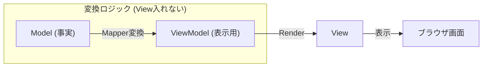

# 第10章：ViewModel導入：表示都合でModelを汚さない🧺✨

この章のテーマは **「見せ方（UI）」の都合を、Model（本体データ）に混ぜない」** だよ〜！🫶
Todoアプリって、見た目をちょいちょい変えたくなるんだけど（「あと◯日」とか、色とか、ラベルとか）それを **Modelに直書きすると地獄** が始まる…😇
そこで **ViewModel** の出番！💖

ちなみに本章は、最近の周辺事情（TypeScript / Vite / 日付まわり）も確認した上で組んでるよ✅

* TypeScript は **5.9.3 が Latest** 扱い（GitHub Releases）だよ🧷 ([GitHub][1])
* Vite は **v7.3.1 が Latest**（2026-01-07 表示）だよ⚡ ([GitHub][2])
* 日付の新定番候補 **Temporal** は Stage 3 Draft（2026-01-13 版）だけど、ブラウザ的にはまだ「どこでもOK」ではないよ⚠️ ([tc39.es][3])
* なので今回は、ブラウザで広く使える **Intl.RelativeTimeFormat**（「あと3日」系）を使うのが安心✨ ([MDN Web Docs][4])

---

## 1) この章のゴール🎯✨

### ゴール（できるようになること）💪

* Model（TodoItem）を **表示用に加工したViewModel** を作れる🧁
* 「表示の工夫」を増やしても、Modelが汚れない設計にできる🧼
* Viewは **ViewModelだけ見て描画** できる状態にできる🎨

### この章で作るもの🛠️

例：期限の表示を、こんなふうにしたい👇

* 期限なし → `期限なし🫧`
* 今日まで → `今日まで🔥`
* 明日まで → `明日まで💦`
* 3日後 → `あと3日⌛`
* 2日前（期限切れ） → `2日前に期限切れ😱`

しかもこれ、**Modelに文字列で持たせない** のがポイント！✨

---

## 2) まず「やっちゃダメ」から知ろう😇🚫（Model汚染）


### ❌ 悪い例：Modelに表示用フィールドを足す

```ts
// ❌ Modelに入れちゃうと汚れる例
type TodoItem = {
  id: string;
  title: string;
  done: boolean;
  dueDate: Date | null;

  // 表示用（悪手）
  dueText: string;      // "あと3日" とか
  dueColor: "red"|"gray";
};
```

これがなぜダメかというと…🥲

* 表示仕様が変わるたびに **Modelが変わる**（しかも影響範囲がデカい）
* 同じTodoでも「一覧用」「詳細用」で表示違うのに、**Modelは1個** しかない
* 保存（LocalStorage）するときに `dueText` みたいな “本質じゃない値” まで混ざって混乱💾💥

👉 Modelは「事実」だけ。**UI都合の装飾は別レイヤ** に逃がす！🏃‍♀️💨

---

## 3) ViewModelってなに？🍓✨（一言で）


**ViewModel = Viewが描画しやすい形にした“表示用データ”** だよ🎀

* Model：事実（title / done / dueDate）
* ViewModel：見せ方（dueLabel / badge / 表示用の並び替えキー など）

イメージ👇

**Model（事実）** →（加工）→ **ViewModel（見せ方）** → View（DOM描画）

Controllerは「加工して渡す係」か、もしくは「加工は専用mapperに任せる係」になるよ🚦✨



---

## 4) 今回の設計ルール（この章の約束）📏✨

### ✅ Modelに残すもの

* `dueDate: Date | null`（事実）
* `done: boolean`（事実）
* `title: string`（事実）

### ✅ ViewModelに持たせていいもの

* `dueLabel: string`（表示テキスト）
* `dueEmoji: string`（アイコン）
* `dueLevel: "none"|"today"|"soon"|"future"|"overdue"`（表示用カテゴリ）
* `sortDue: number`（並び替え用キー）

---

## 5) 実装：ViewModelを作ってViewに渡す🧑‍💻✨

ここからは、**最小で気持ちよく動く** 形を作るよ🫶

### (A) ViewModelの型を作る📦

`src/viewmodel/TodoItemVM.ts`

```ts
export type DueLevel = "none" | "overdue" | "today" | "soon" | "future";

export type TodoItemVM = {
  id: string;
  title: string;
  done: boolean;

  // 表示用
  dueLabel: string;     // 例: "あと3日⌛" / "今日まで🔥" / "期限なし🫧"
  dueLevel: DueLevel;   // 表示のカテゴリ（色分け等に使える）
  sortDue: number;      // 並び替え用（期限なしは大きい値にすると最後へ）
};
```

---

### (B) 「日付を表示用に変換する」関数を作る🗓️✨

今回の「あと◯日」表示は、ブラウザで広く使える `Intl.RelativeTimeFormat` を使うよ✅ ([MDN Web Docs][4])
（Temporalは将来有力だけど、まだ全ブラウザで安定って感じじゃないから今回は見送り🙅‍♀️） ([tc39.es][3])

`src/viewmodel/dueLabel.ts`

```ts
const MS_PER_DAY = 24 * 60 * 60 * 1000;

/** その日の 00:00 にそろえる（「今日/明日」の判定がブレにくくなる） */
function startOfDay(d: Date): Date {
  return new Date(d.getFullYear(), d.getMonth(), d.getDate());
}

/** dueDate を「あと◯日」などの表示ラベルに変換する */
export function buildDuePresentation(dueDate: Date | null, now: Date): {
  dueLabel: string;
  dueLevel: "none" | "overdue" | "today" | "soon" | "future";
  sortDue: number;
} {
  if (!dueDate) {
    return {
      dueLabel: "期限なし🫧",
      dueLevel: "none",
      sortDue: Number.MAX_SAFE_INTEGER,
    };
  }

  const today = startOfDay(now);
  const due = startOfDay(dueDate);

  const diffDays = Math.round((due.getTime() - today.getTime()) / MS_PER_DAY);

  // 「あと3日」「昨日」などを日本語でいい感じに
  const rtf = new Intl.RelativeTimeFormat("ja", { numeric: "auto" });

  // diffDays:  0 => 今日,  1 => 明日, -1 => 昨日,  3 => 3日後
  const base = rtf.format(diffDays, "day");

  // レベル分け（UIの色やバッジ用）
  if (diffDays < 0) {
    return {
      dueLabel: `${base}に期限切れ😱`,
      dueLevel: "overdue",
      sortDue: due.getTime(),
    };
  }
  if (diffDays === 0) {
    return {
      dueLabel: "今日まで🔥",
      dueLevel: "today",
      sortDue: due.getTime(),
    };
  }
  if (diffDays <= 2) {
    return {
      dueLabel: `${base}まで💦`,
      dueLevel: "soon",
      sortDue: due.getTime(),
    };
  }
  return {
    dueLabel: `${base}まで⌛`,
    dueLevel: "future",
    sortDue: due.getTime(),
  };
}
```

ポイント🎀

* **Modelは `dueDate` を持つだけ**
* “今日まで🔥” みたいな表示は **ViewModel側（表示レイヤ）** で作る✨
* `sortDue` があると、並び替えが超ラクになるよ🧹

---

### (C) TodoItem → TodoItemVM へ変換する（Mapper）🧩✨

`src/viewmodel/todoItemMapper.ts`

```ts
import type { TodoItem } from "../model/TodoItem";
import type { TodoItemVM } from "./TodoItemVM";
import { buildDuePresentation } from "./dueLabel";

export function toTodoItemVM(item: TodoItem, now: Date): TodoItemVM {
  const due = buildDuePresentation(item.dueDate, now);

  return {
    id: item.id,
    title: item.title,
    done: item.done,
    dueLabel: due.dueLabel,
    dueLevel: due.dueLevel,
    sortDue: due.sortDue,
  };
}
```

---

### (D) ControllerからViewへ「VMで渡す」🧠➡️🎨

Controllerの再描画部分を、こんな感じにするよ👇
（※あなたのプロジェクトのファイル名に合わせて読み替えてOK！）

```ts
import { toTodoItemVM } from "../viewmodel/todoItemMapper";

render() {
  const now = new Date();
  const vms = this.model.items.map(item => toTodoItemVM(item, now));
  this.view.renderList(vms);
}
```

ここで View は **Modelを一切知らない** 状態にできるのが最高〜！🎉

---

### (E) ViewはVMだけ見て描画する📋✨

```ts
import type { TodoItemVM } from "../viewmodel/TodoItemVM";

renderList(items: TodoItemVM[]) {
  // 例：期限順に並べたいなら sortDue を使う
  const sorted = [...items].sort((a, b) => a.sortDue - b.sortDue);

  // DOM描画（例）
  // title / dueLabel / done を使って描画するだけ！
}
```

---

## 6) ここで「気持ちいい！」が起きる瞬間🫶✨

### ✅ 表示仕様が変わっても…

* 変えるのは `dueLabel.ts` と `TodoItemVM` まわりだけ✨
* Model（ドメイン）は無傷🛡️

### ✅ 画面が増えても…

* 一覧用VM、詳細用VM、カレンダー用VM…って **増やせる** 🪄
  （Modelは共通でOK）

---

## 7) ミニ演習（手を動かす）🧪✅

### 演習1：重要バッジを足してみよ🏷️✨

条件：

* `dueLevel` が `"today"` または `"soon"` かつ `done === false` なら
  `important: true` をVMに追加する

ヒント：`toTodoItemVM` で作れそう！

---

### 演習2：表示用のタイトルを作ろう📝🎀

* `done === true` のとき、タイトル表示を `✅ ${title}` にする
  （※Modelのtitleは変更しない！ここ大事！）

---

## 8) AI活用🤖💡（Copilot/Codex向けプロンプト例）

### そのまま投げてOKな短文プロンプト🪄

* 「TodoItem から TodoItemVM に変換する mapper を作って。VMには dueLabel / dueLevel / sortDue を含めたい。Modelは変更しないで」
* 「Intl.RelativeTimeFormat を使って、日本語の ‘あと◯日’ 表示を作りたい。今日/明日/昨日は自然な文にして」

### AIの出力チェック観点🔍

* Modelに `dueLabel` 足してない？（足してたら即アウト😇）
* Viewが Model を参照してない？（VMだけ見てる？）
* 「期限なし」が sortで先頭に来てない？（`sortDue` を大きくするのが楽）

---

## 9) よくあるつまづき🍂（先に潰す！）

### 😵「ViewModelって、Viewに入れたらダメなの？」

入れても動くけど、**Viewが太りやすい** よ〜！
加工ロジックは `viewmodel/` に寄せると、あとで地獄になりにくい🧯✨

### 😵「ControllerがVM作るのってアリ？」

アリ！でも、Controllerが肥大化しやすいから
**mapper関数に逃がす** のがスッキリでおすすめ🎀

### 😵「日付むずい…」

うん、むずい😂
だから今回みたいに「表示用は表示用で閉じる」設計が効くの。
将来 Temporal がどこでも安定したら置き換えもしやすいよ🧁 ([tc39.es][3])

---

## 10) まとめ🎓🌸

* Modelは「事実」だけを持つ📦
* 表示のための加工は **ViewModel** に寄せる🧺✨
* ViewはVMだけ見て描画🎨（Modelを知らない）
* これで「表示の変更」が怖くなくなるよ〜！🎉

---

次の第11章では、Validation とエラーメッセージで「優しいUI」にしていくよ😌🚨💬

[1]: https://github.com/microsoft/typescript/releases "Releases · microsoft/TypeScript · GitHub"
[2]: https://github.com/vitejs/vite/releases "Releases · vitejs/vite · GitHub"
[3]: https://tc39.es/proposal-temporal/ "Temporal"
[4]: https://developer.mozilla.org/en-US/docs/Web/JavaScript/Reference/Global_Objects/Intl/RelativeTimeFormat?utm_source=chatgpt.com "Intl.RelativeTimeFormat - JavaScript - MDN Web Docs"
