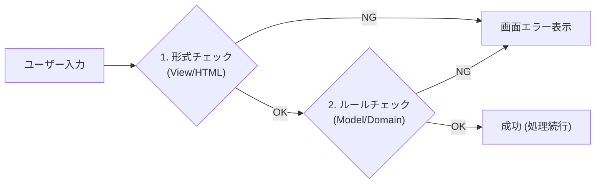

# 第11章：Validationとエラーメッセージ（優しく案内）😌🚨

この章は「入力ミスがあってもアプリが落ちない✨」「ユーザーが次に何をすればいいか分かる💡」を作る回だよ〜！🌸
CampusTodo（課題メモ）に **やさしい入力チェック** を入れて、気持ちよく使えるUIにしよっ🫶✨

---

## 1) この章のゴール🎯✨

できるようになることはこの3つ！💪😊

1. **入力チェックを2段構えで作れる**（Viewの形式チェック＋Modelのルールチェック）🧱🧱
2. **エラーが出ても画面が崩れず、入力内容が消えない**🧯✨
3. **“やさしい日本語”でエラーメッセージを出せる**（怖くない・責めない・次が分かる）🌷💬

---

## 2) バリデーションは「2段階」が勝ち🏆😎




### ✅ ① 形式チェック（View側）＝「入力として成立してる？」📝

* 空欄かどうか
* 長さ（短すぎ/長すぎ）
* 日付の形式、など

ここは **ブラウザ標準のフォーム検証（Constraint Validation API）** が強いよ！💪
フォーム要素単体 or `<form>` 全体で検証できる仕組みが用意されてる🥳 ([MDN Web Docs][1])

### ✅ ② ルールチェック（Model側）＝「アプリの世界のルール守ってる？」🛡️

* タイトルは空白だけNG（`"   "`はダメ🙅‍♀️）
* 期限が過去の日付はNG
* （必要なら）同じタイトル重複NG など

これは **Model（またはDomain）側で保証** するのが正解✨
Viewに置くと、別画面・別入力手段が増えた瞬間に破綻しやすいの🥲

---

## 3) 今回のCampusTodoのチェック仕様📌✅

最低限で気持ちよくいこう！🍀（増やしたくなったら増やせる設計にするよ）

### 入力項目

* `title`（課題名）
* `dueDate`（期限：任意）

### ルール

* title：空欄NG、空白だけNG、最大50文字（例）
* dueDate：入れるなら「今日以降」📅✨

---

## 4) まずはViewで「形式チェック」🌼（HTMLの力を借りる）

HTMLの属性だけでも、けっこう守れるよ〜！✨
（ブラウザの検証は Constraint Validation API によるものだよ） ([MDN Web Docs][1])

```html
<form id="todoForm" novalidate>
  <label>
    課題名
    <input
      id="titleInput"
      name="title"
      type="text"
      required
      minlength="1"
      maxlength="50"
      placeholder="例）レポート提出"
    />
  </label>

  <label>
    期限（任意）
    <input id="dueDateInput" name="dueDate" type="date" />
  </label>

  <button type="submit">追加</button>

  <p id="formError" role="alert" aria-live="polite"></p>
  <ul id="fieldErrors"></ul>
</form>
```

### 🍀 `novalidate`って何？

今回は「ブラウザ任せのポップアップで終わり」じゃなくて、
**自分たちのUI（エラー欄）にも出したい**から、制御しやすくするために付けてるよ😊

---

## 5) Viewで「やさしいエラーメッセージ」に変える💬🌸


ブラウザ標準の文言って、ちょっと硬い時あるよね😇
そこで `setCustomValidity()` を使うと、エラーメッセージを自前にできる！✨ ([MDN Web Docs][2])

さらに `reportValidity()` を呼ぶと、検証して（必要なら）ユーザーに問題を表示してくれるよ🧠✨ ([MDN Web Docs][3])

```ts
function setFriendlyMessage(input: HTMLInputElement) {
  const v = input.validity; // ValidityStateで理由が分かるよ :contentReference[oaicite:4]{index=4}

  if (v.valueMissing) {
    input.setCustomValidity("課題名が空っぽみたい…！1文字以上入れてね🌸");
    return;
  }
  if (v.tooShort) {
    input.setCustomValidity("もうちょいだけ長くしてほしいかも😊");
    return;
  }
  if (v.tooLong) {
    input.setCustomValidity("ちょっと長すぎるかも！50文字以内にしてね✂️");
    return;
  }

  // OKなら空文字に戻すのが大事！
  input.setCustomValidity("");
}
```

### ✅ submit時に動かす（形式チェック）

```ts
const form = document.getElementById("todoForm") as HTMLFormElement;
const titleInput = document.getElementById("titleInput") as HTMLInputElement;

form.addEventListener("submit", (e) => {
  e.preventDefault();

  setFriendlyMessage(titleInput);

  // フォーム全体の制約検証（true/falseを返す） :contentReference[oaicite:5]{index=5}
  if (!form.checkValidity()) {
    // 問題を表示（ブラウザ表示も使うなら） :contentReference[oaicite:6]{index=6}
    titleInput.reportValidity();
    return;
  }

  // ここから先は「形式チェックOK」🎉
});
```

---

## 6) 次はModel側の「ルールチェック」🛡️✨（Domainの守護神）

ここからがMVCらしいところ！😎
「画面がどれだけ増えても」同じルールで守れるようにするよ💪

### ✅ エラーを“コード化”する（あとで表示文言を変えやすい）🏷️

```ts
export type TodoValidationError =
  | { field: "title"; code: "TITLE_REQUIRED" }
  | { field: "title"; code: "TITLE_TOO_LONG"; max: number }
  | { field: "dueDate"; code: "DUE_DATE_IN_PAST" };

export type Result<T> =
  | { ok: true; value: T }
  | { ok: false; errors: TodoValidationError[] };
```

### ✅ Modelの生成時にチェックする（例：TodoItem.create）

```ts
export type TodoItem = {
  id: string;
  title: string;
  done: boolean;
  dueDate?: string; // "YYYY-MM-DD" 想定
};

export const TodoItemFactory = {
  create(input: { title: string; dueDate?: string }): Result<TodoItem> {
    const errors: TodoValidationError[] = [];

    const title = input.title.trim();
    const MAX = 50;

    if (title.length === 0) {
      errors.push({ field: "title", code: "TITLE_REQUIRED" });
    } else if (title.length > MAX) {
      errors.push({ field: "title", code: "TITLE_TOO_LONG", max: MAX });
    }

    if (input.dueDate) {
      const today = new Date();
      const yyyyMMdd = (d: Date) =>
        `${d.getFullYear()}-${String(d.getMonth() + 1).padStart(2, "0")}-${String(d.getDate()).padStart(2, "0")}`;

      if (input.dueDate < yyyyMMdd(today)) {
        errors.push({ field: "dueDate", code: "DUE_DATE_IN_PAST" });
      }
    }

    if (errors.length > 0) return { ok: false, errors };

    const item: TodoItem = {
      id: crypto.randomUUID(),
      title,
      done: false,
      dueDate: input.dueDate,
    };
    return { ok: true, value: item };
  },
};
```

---

## 7) Controller：失敗しても“復帰”できる流れにする🔁🧯

Controllerは交通整理🚦

* 形式チェック（View）
* OKなら Service/Modelへ
* NGなら Viewへ「どう見せる？」を渡す

### ✅ エラー表示をViewに任せるためのインターフェイス（例）

```ts
type FieldErrorViewModel = {
  field: "title" | "dueDate";
  message: string;
};

function mapErrors(errors: TodoValidationError[]): FieldErrorViewModel[] {
  return errors.map((e) => {
    switch (e.code) {
      case "TITLE_REQUIRED":
        return { field: "title", message: "課題名が空っぽだよ〜！1文字以上入れてね🌸" };
      case "TITLE_TOO_LONG":
        return { field: "title", message: `ちょっと長いかも！${e.max}文字以内にしてね✂️` };
      case "DUE_DATE_IN_PAST":
        return { field: "dueDate", message: "期限が過去になってるみたい…！今日以降にしてね📅✨" };
    }
  });
}
```

---

## 8) View：エラーの出し方（怖くしないコツ）🌷✨

### ✅ “やさしいエラー”のテンプレ🫶

* ❌「不正です」 → ✅「ここを直すとOKだよ😊」
* ❌「入力しろ」 → ✅「〜してね🌸」
* ✅ できれば **理由＋具体的な修正**（例：50文字以内）

### ✅ 画面への出し方（おすすめ）

* フィールドの近くに出す（迷子になりにくい）🧭
* まとめ欄も一応出す（全体把握）📋
* 入力内容は消さない（心が折れる🥲）

```ts
const fieldErrorsUl = document.getElementById("fieldErrors") as HTMLUListElement;
const formErrorP = document.getElementById("formError") as HTMLParagraphElement;

function renderErrors(errors: FieldErrorViewModel[]) {
  formErrorP.textContent = errors.length ? "入力をちょっとだけ見直してね😊" : "";

  fieldErrorsUl.innerHTML = "";
  for (const e of errors) {
    const li = document.createElement("li");
    li.textContent = `${e.field}: ${e.message}`;
    fieldErrorsUl.appendChild(li);
  }
}

function clearErrors() {
  formErrorP.textContent = "";
  fieldErrorsUl.innerHTML = "";
}
```

---

## 9) 形式チェック＋ルールチェックを繋げた“完成形”🎉✨

```ts
form.addEventListener("submit", (e) => {
  e.preventDefault();
  clearErrors();

  // ① View：形式チェック
  setFriendlyMessage(titleInput);
  if (!form.checkValidity()) {
    titleInput.reportValidity();
    return;
  }

  // ② Model：ルールチェック
  const dueDateInput = document.getElementById("dueDateInput") as HTMLInputElement;

  const result = TodoItemFactory.create({
    title: titleInput.value,
    dueDate: dueDateInput.value || undefined,
  });

  if (!result.ok) {
    renderErrors(mapErrors(result.errors));
    return;
  }

  // ③ OK：ここで「追加して再描画」へ進む（第7章の流れ🔁）
  // todoStore.add(result.value);
  // view.render(...)
});
```

---

## 10) AI活用🤖💡（この章での使いどころ）

### ✅ 優しい文言づくり（超おすすめ）💬✨

AIにこう頼むと、かなり良い感じになるよ〜！

* 「女子大生に向けて、やさしい口調で、責めないエラーメッセージを5案ください😊」
* 「TITLE_TOO_LONG のメッセージ、短くて分かりやすいのを3案✂️」
* 「“理由＋次にやること”が入ってるかチェックして🧐」

> コツ：**エラーコード（TITLE_REQUIREDなど）を渡して、文言だけ作らせる**と設計がキレイに保てるよ🏷️✨

---

## 11) ミニ演習✍️🎀

1. title が「空白だけ」でも弾けるか確認（`"   "`）🧼
2. dueDate を「昨日」にして、やさしく案内できるか📅
3. エラーが出た状態で、入力を直すとエラーが消えるようにする（`input` イベントで `clearErrors`）✨
4. エラーが複数あるとき（例：title空＋dueDate過去）に **両方表示**できるようにする📋💡

---

## 12) 章のまとめ🧠✨（大事な3行）

* **形式チェックはView**（ブラウザの検証機能も活用）🪄 ([MDN Web Docs][1])
* **ルールチェックはModel**（どの画面から来ても守れる）🛡️
* **エラーは“落とす”んじゃなく“返す”**（ResultでUXが安定）🧯✨

---

次の第12章では、ここで増えてきた「追加処理まわり」を **Service層に寄せてControllerをスリム化**していくよ〜！🍔➡️🥗✨

[1]: https://developer.mozilla.org/en-US/docs/Web/HTML/Guides/Constraint_validation?utm_source=chatgpt.com "Using HTML form validation and the Constraint Validation API"
[2]: https://developer.mozilla.org/ja/docs/Web/API/HTMLInputElement/setCustomValidity?utm_source=chatgpt.com "HTMLInputElement: setCustomValidity() メソッド - Web API"
[3]: https://developer.mozilla.org/en-US/docs/Web/API/HTMLInputElement/reportValidity?utm_source=chatgpt.com "HTMLInputElement: reportValidity() method - Web APIs | MDN"
