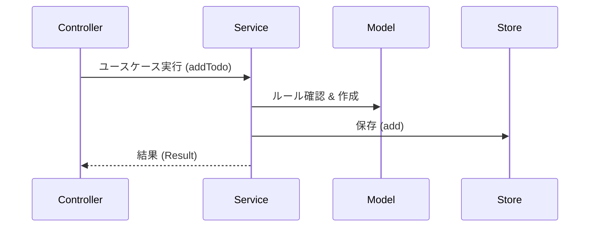

# 第12章：Service層でControllerを太らせない🍔➡️🥗

この章は「機能が増えたらControllerがデブになる問題💦」を、**Service層**でスッキリ解決する回だよ〜！😆✨
CampusTodoを、あとから機能追加しても崩れにくい形にしていくよ💪🧠

---

## 0) いまどきTSまわり小ネタ（最新状況）🧊✨

* **TypeScriptは5.9系がドキュメント更新されてる**（2026-01-12更新）ので、学習の基準はここでOKだよ📘✨ ([TypeScript][1])
* Microsoft側では **TypeScript 6.0は“橋渡し”、7.0はネイティブ化（Go移植）**の話が進んでるよ🚀（ビルド高速化が主役） ([Microsoft for Developers][2])
* Node.jsは **v25がCurrent、v24がActive LTS**って並び（2026-01-12更新）🟩🟦 ([Node.js][3])
* Viteは「Baseline（2026-01-01基準）」の話などが公式ガイドに出てる（ブラウザターゲット方針が明記）🌍✨ ([vitejs][4])

（ね、いまは“ツールが爆速化”に向かってる流れが強いのよ🤖⚡）

---

## 1) まず問題：Fat Controllerってなに？😇🍔

機能が増えると、Controllerがこうなりがち👇

* DOMから値を取る🖱️
* 入力チェックする🧾
* Modelを作る📦
* Todo配列を更新する🧺
* エラー文言も考える💬
* View更新もする🎨
* ついでにログも…📣

👉 これが積み重なると
**「Controllerが何でも屋になって、読めない・直せない・テストしにくい」** が起こるよ〜😭💥

---

## 2) Service層の役割（超だいじ）🧠✨




Service層はひとことでいうと…

✅ **「アプリの“やりたいこと（ユースケース）”を実行する係」** 🎮✨

CampusTodoなら、ユースケースは例えば：

* Todoを追加する➕✅
* 完了を切り替える🔁✅
* タイトルを編集する✏️
* 削除する🗑️
* （次章以降で）保存する💾

### ざっくり責務の分け方🍱

* **Controller**：イベント受ける・Service呼ぶ・結果をViewへ渡す🚦
* **Service**：手順の中心（入力→Model操作→結果まとめ）🧩
* **Model**：ルールを守る（不変条件）🛡️
* **View**：表示だけ🎨

---

## 3) どれをServiceに移す？迷ったらこの基準🧭✨


Serviceに寄せるのは👇

* 「追加」みたいな**動詞**の処理（ユースケース）🏃‍♀️
* 「複数ステップ」がある処理（検証→作成→保存→返却）🔁
* 「UIと関係ない」処理（純粋にアプリの都合）🧠

逆にServiceに置かない👇

* DOM操作・HTML生成（それView！）🚫
* `alert()` とかUI通知（それController/View！）🚫
* ルールの本体（それModel！）🚫

  * Serviceは**ルールを“使う”側**だよ👀✨

---

## 4) 実装してみよう：Service導入でController痩せる🏋️‍♀️✨

ここからは「追加処理」をServiceに移すよ➕✅
（次章のLocalStorageにも繋がる“良い形”で！）

---

### 4-1) Result型（成功/失敗を返す箱）📦✨

「失敗してもアプリ落とさない😌」ために、Serviceはこう返すのが便利👇

```ts
// src/shared/result.ts
export type Result<T> =
  | { ok: true; value: T }
  | { ok: false; errors: string[] };

export const ok = <T>(value: T): Result<T> => ({ ok: true, value });
export const fail = (errors: string[]): Result<never> => ({ ok: false, errors });
```

---

### 4-2) Model（TodoItem）🛡️📦

Model側で「空タイトル禁止」みたいな最低限のルールを守るよ✨
（第9章の“不変条件”の考え方ね🛡️）

```ts
// src/model/todoItem.ts
export type TodoId = string;

export type TodoItem = {
  id: TodoId;
  title: string;
  done: boolean;
  createdAt: number; // epoch ms
};

export const TodoRules = {
  validateTitle(title: string): string[] {
    const t = title.trim();
    const errors: string[] = [];
    if (t.length === 0) errors.push("タイトルが空だよ🥺 何する課題か書いてね！");
    if (t.length > 60) errors.push("タイトルが長すぎるかも…！60文字以内にしてみよ📝");
    return errors;
  },
};

export const TodoFactory = {
  create(title: string, now = Date.now()): TodoItem {
    // ルールはServiceでも確認するけど、最終防衛線はModel側にも置けると強い💪
    return {
      id: crypto.randomUUID(),
      title: title.trim(),
      done: false,
      createdAt: now,
    };
  },
};
```

---

### 4-3) “保存場所（今はメモリ）”を薄く分離🧺✨

まだRepository章じゃないから、まずは簡単に「置き場所」だけ作るよ（後で差し替えやすくなる👍）

```ts
// src/model/todoStore.ts
import { TodoItem, TodoId } from "./todoItem";

export class TodoStore {
  private todos: TodoItem[] = [];

  getAll(): TodoItem[] {
    return [...this.todos];
  }

  add(todo: TodoItem): void {
    this.todos = [todo, ...this.todos];
  }

  toggleDone(id: TodoId): boolean {
    const idx = this.todos.findIndex(t => t.id === id);
    if (idx < 0) return false;

    const current = this.todos[idx];
    this.todos[idx] = { ...current, done: !current.done };
    return true;
  }
}
```

---

### 4-4) Service（ユースケースの中心）🥗✨

ここが主役！
Controllerが抱えてた「追加処理の手順」を全部ここへ移すよ〜🧠🔁

```ts
// src/service/todoService.ts
import { Result, ok, fail } from "../shared/result";
import { TodoFactory, TodoItem, TodoRules, TodoId } from "../model/todoItem";
import { TodoStore } from "../model/todoStore";

export class TodoService {
  constructor(private readonly store: TodoStore) {}

  addTodo(title: string): Result<TodoItem> {
    const errors = TodoRules.validateTitle(title);
    if (errors.length > 0) return fail(errors);

    const todo = TodoFactory.create(title);
    this.store.add(todo);

    return ok(todo);
  }

  toggleDone(id: TodoId): Result<void> {
    const changed = this.store.toggleDone(id);
    if (!changed) return fail(["そのTodoが見つからなかったよ🥲（一覧が古いかも）"]);

    return ok(undefined);
  }

  getAll(): TodoItem[] {
    return this.store.getAll();
  }
}
```

---

### 4-5) Controller（イベントだけ担当にして痩せる）🚦✨

Controllerは「DOM→Service→View」だけやる感じにするよ！
“手順の中心”がなくなるのでスッキリ✨

```ts
// src/controller/todoController.ts
import { TodoService } from "../service/todoService";
import { TodoView } from "../view/todoView";

export class TodoController {
  constructor(
    private readonly service: TodoService,
    private readonly view: TodoView
  ) {}

  init(): void {
    this.view.bindAdd((title) => this.onAdd(title));
    this.view.bindToggle((id) => this.onToggle(id));

    this.render();
  }

  private onAdd(title: string): void {
    const result = this.service.addTodo(title);

    if (!result.ok) {
      this.view.showErrors(result.errors);
      return;
    }

    this.view.clearErrors();
    this.view.clearInput();
    this.render();
  }

  private onToggle(id: string): void {
    const result = this.service.toggleDone(id);

    if (!result.ok) {
      this.view.showErrors(result.errors);
      return;
    }

    this.view.clearErrors();
    this.render();
  }

  private render(): void {
    const todos = this.service.getAll();
    this.view.render(todos);
  }
}
```

---

### 4-6) View（受け口だけ用意するイメージ）🎨✨

Viewは「表示」と「イベントを外へ渡す」だけにするよ💡
（この章では最低限の形だけね！）

```ts
// src/view/todoView.ts
import { TodoItem } from "../model/todoItem";

export class TodoView {
  constructor(
    private readonly input: HTMLInputElement,
    private readonly addButton: HTMLButtonElement,
    private readonly list: HTMLElement,
    private readonly errorArea: HTMLElement
  ) {}

  bindAdd(handler: (title: string) => void): void {
    this.addButton.addEventListener("click", () => handler(this.input.value));
  }

  bindToggle(handler: (id: string) => void): void {
    this.list.addEventListener("click", (e) => {
      const target = e.target as HTMLElement;
      const btn = target.closest<HTMLButtonElement>("[data-action='toggle']");
      if (!btn) return;

      const id = btn.dataset.id;
      if (!id) return;

      handler(id);
    });
  }

  render(todos: TodoItem[]): void {
    this.list.innerHTML = todos
      .map(
        (t) => `
          <li>
            <span>${t.done ? "✅" : "⬜"} ${escapeHtml(t.title)}</span>
            <button data-action="toggle" data-id="${t.id}">切替🔁</button>
          </li>
        `
      )
      .join("");
  }

  showErrors(errors: string[]): void {
    this.errorArea.innerHTML = errors.map(e => `<div>⚠️ ${escapeHtml(e)}</div>`).join("");
  }

  clearErrors(): void {
    this.errorArea.innerHTML = "";
  }

  clearInput(): void {
    this.input.value = "";
  }
}

const escapeHtml = (s: string): string =>
  s.replaceAll("&", "&amp;")
   .replaceAll("<", "&lt;")
   .replaceAll(">", "&gt;")
   .replaceAll('"', "&quot;")
   .replaceAll("'", "&#039;");
```

---

## 5) ここが嬉しいポイント（Service層のご褒美）🎁✨

* Controllerが痩せる＝読みやすい🥰📖
* 「追加」みたいな処理を**Serviceだけ見れば理解できる**👀
* 次章のLocalStorageで「保存する」が増えても
  👉 Serviceに足すだけで済む💾✨
* テストするときもServiceが主役になる（第16章に繋がる！）🧪🌸

---

## 6) よくある失敗あるある😵‍💫（先回りで潰す！）

### ❌ 失敗1：ServiceがDOM触り始める

* `document.querySelector` とかやりだしたら黄色信号🚥
  👉 それView/Controller側！

### ❌ 失敗2：Serviceが“神クラス”になっていく

* `TodoService` に全部入れると、結局またデブ化🐷
  👉 「ユースケース単位」で分けるのもアリ（例：`AddTodoService`）✨

### ❌ 失敗3：Modelがただのデータ袋になってルールが消える

* ルールをServiceに全部置くと散りやすい💦
  👉 ルールはModel側へ寄せる（第9章の勝ち筋🛡️）

---

## 7) ミニ演習✍️✨（今日の手を動かすとこ）

### 演習A：toggleDoneもServiceへ移して、Controllerをさらに痩せさせよう🔁✅

* もうほぼ上の例でできてるけど、既存コードがあるなら移植してみてね！

### 演習B：Serviceに「編集 editTitle」を追加してみよう✏️✨

* `editTitle(id, newTitle)` を作って

  * validate
  * 更新
  * Result返す
    をやってみてね！

---

## 8) AI活用コーナー🤖💡（使うと爆速になるやつ）

### ①「この処理どこに置く？」判定

**プロンプト例：**

* 「この処理はController/Service/Model/Viewのどこが適切？理由も1行ずつで。処理はこれ→（貼る）」🧠✨

### ② Fat Controllerを“抽出リファクタ”してもらう

* 「このControllerからServiceに移すべき処理を3つ挙げて、抽出後のクラス案を出して」✂️✨

### ③ Result型の設計を整える

* 「Result型を使って、エラーをユーザー向け文言と開発者向け情報に分ける設計案を出して」📦🔍

（※出てきたコードは“差分”で眺めて、納得したら取り込むのがコツだよ🫶✨）

---

## 9) まとめ🌸✨

* Controllerが太る原因は「ユースケースの手順」を抱え込むこと🍔
* **Service層＝ユースケースの中心**にすると、Controllerが痩せる🥗
* Modelはルール、Viewは表示、Controllerは交通整理、Serviceは実行部隊🚦⚔️
* 次章の永続化（LocalStorage）でServiceがさらに効いてくるよ💾✨

---

必要なら、この章の形をそのまま使って「第13章：LocalStorage保存」を**Serviceに自然に組み込む形**で、超スムーズに繋げる構成も作れるよ〜！😆📚✨

[1]: https://www.typescriptlang.org/docs/handbook/release-notes/typescript-5-9.html?utm_source=chatgpt.com "Documentation - TypeScript 5.9"
[2]: https://devblogs.microsoft.com/typescript/progress-on-typescript-7-december-2025/?utm_source=chatgpt.com "Progress on TypeScript 7 - December 2025"
[3]: https://nodejs.org/en/about/previous-releases?utm_source=chatgpt.com "Node.js Releases"
[4]: https://ja.vite.dev/guide/?utm_source=chatgpt.com "はじめに"
