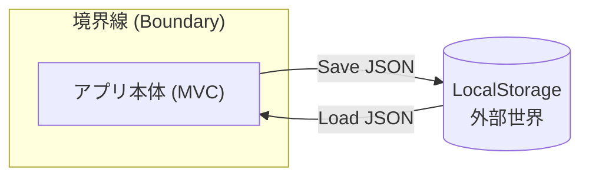

# 第13章：永続化①：まずはLocalStorageで保存する💾✨

この章の「いまどき」前提メモだけ先に置くね📝✨
TypeScript は npm だと **5.9.3** が最新（2025/09公開）で、Vite は **7.3.1** が最新（2026/01公開）になってるよ〜🎯 ([NPM][1])

---

## 0. この章のゴール🎯✨

* Todoを追加しても、**ページを更新しても消えない**ようにする🔄✅
* MVCの責務を崩さずに、**保存＝外部**として扱えるようになる🧠🧱
* `localStorage` のクセ（文字列だけ・容量・同期処理）に慣れる💪📦

---

## 1. 永続化って、なんで「外部」なの？🪐




保存（localStorage / サーバー / DB）って、アプリの外側の世界だよね🌍
だから **Modelの純度を保つために**、Modelの中に `localStorage.setItem(...)` とかを書かないのがコツ🙅‍♀️💦

* Model：ルールと状態（Todoの正しさを守る）🛡️
* View：表示だけ🎨
* Controller：入力を受けて指示🚦
* Service：処理のまとめ役🥗
* 永続化：アプリの外（今回は localStorage）💾✨

`localStorage` は「同一オリジンの key/value 保存」で、ブラウザを閉じても残るよ〜📌 ([MDN Web Docs][2])

---

## 2. localStorageの基礎だけ、最短で押さえよう⚡

### 2-1. 文字列しか入らない📎


`localStorage` は **key/value どっちも文字列**。
だから **JSONにして保存** → **JSONをパースして復元** が基本だよ📄✨ ([MDN Web Docs][3])

### 2-2. 同期処理（＝重いと固まることある）🐢


`setItem/getItem/removeItem` は **同期**なので、量が多いとUIがモタつく原因になりやすいの⚠️ ([MDN Web Docs][4])
→ 今回はTodo数が少ない想定だからOKだけど、「大量データ」はIndexedDBへ…って流れが王道だよ🧠✨

### 2-3. 容量制限がある📦

ブラウザは localStorage に **1オリジンあたりだいたい 5MiB** くらいまで、上限超えると `QuotaExceededError` を投げる想定で `try/catch` が安心💡 ([MDN Web Docs][5])

---

## 3. 今回の設計方針（第14章の伏線つき🧲✨）

第14章で Repository に差し替え可能にするんだけど、今章はまず **「保存と復元が動く」**を最優先にするよ✅

ここでは「雑に混ぜない」ために、最低限こう分けるね👇

* `TodoLocalStorageStore`：localStorageとのやりとり専門💾
* `TodoService`：操作（追加・トグル）後に保存を呼ぶ🥗
* `Controller`：起動時にロードして Model に流し込む🚦➡️📦

---

## 4. 実装していこう〜！🛠️✨（手順どおりでOK）

### 4-1. 永続化用の型（DTO）を作る📦🧷


**ポイント**：Modelの型（`Date` とか）をそのまま保存しないで、保存用に整えるよ🧁
Dateは文字列（ISO）にして保存→復元時に Date に戻すのが王道✨

```ts
// src/infra/todoPersistenceTypes.ts
export type PersistedTodoItem = {
  id: string;
  title: string;
  done: boolean;
  dueDateIso: string | null; // DateはISO文字列にする
};

export type PersistedTodoStateV1 = {
  version: 1;
  items: PersistedTodoItem[];
};
```

---

### 4-2. localStorage アダプターを作る💾🧱


* 保存キーはアプリ名＋バージョンで固定（あとで移行しやすい）🗝️✨
* `JSON.parse` は壊れたデータで落ちるので、必ず `try/catch` 🧯

```ts
// src/infra/todoLocalStorageStore.ts
import type { PersistedTodoItem, PersistedTodoStateV1 } from "./todoPersistenceTypes";
import type { TodoItem } from "../model/todoItem";

const STORAGE_KEY = "campusTodo:v1";

export class TodoLocalStorageStore {
  load(): TodoItem[] {
    const raw = localStorage.getItem(STORAGE_KEY);
    if (!raw) return [];

    try {
      const parsed = JSON.parse(raw) as PersistedTodoStateV1;

      // ちょい安全チェック（最低限）
      if (!parsed || parsed.version !== 1 || !Array.isArray(parsed.items)) return [];

      return parsed.items.map((p): TodoItem => ({
        id: p.id,
        title: p.title,
        done: p.done,
        dueDate: p.dueDateIso ? new Date(p.dueDateIso) : null,
      }));
    } catch {
      // 壊れてたら潔く空に（学習用としてはこれでOK）
      return [];
    }
  }

  save(items: TodoItem[]): void {
    const payload: PersistedTodoStateV1 = {
      version: 1,
      items: items.map(
        (i): PersistedTodoItem => ({
          id: i.id,
          title: i.title,
          done: i.done,
          dueDateIso: i.dueDate ? i.dueDate.toISOString() : null,
        }),
      ),
    };

    try {
      localStorage.setItem(STORAGE_KEY, JSON.stringify(payload));
    } catch (e) {
      // QuotaExceededError 等も想定（本番なら通知UIへ）
      console.warn("Failed to save to localStorage", e);
    }
  }

  clear(): void {
    localStorage.removeItem(STORAGE_KEY);
  }
}
```

---

### 4-3. Controller（または起動処理）で「復元」する🔁✨


アプリ起動時に

1. store.load()
2. Modelに流し込む
3. Viewを描画する

この順番が気持ちいいよ〜🌀

例として Model に `replaceAll(items)` がある想定で書くね（なければ追加してOK）🧡

```ts
// src/controller/todoController.ts（例：一部だけ）
import { TodoLocalStorageStore } from "../infra/todoLocalStorageStore";
import { TodoService } from "../service/todoService";
import { TodoListModel } from "../model/todoListModel";
import { TodoView } from "../view/todoView";

export class TodoController {
  constructor(
    private readonly model: TodoListModel,
    private readonly view: TodoView,
    private readonly service: TodoService,
    private readonly store: TodoLocalStorageStore,
  ) {}

  init(): void {
    const restored = this.store.load();
    this.model.replaceAll(restored);
    this.view.render(this.model.getSnapshot());

    // ここでイベント購読などをセットアップ…（既にある想定）🎮
    this.wireEvents();
  }

  private wireEvents(): void {
    // 例：view.onAdd((title, due) => ...)
  }
}
```

---

### 4-4. Serviceで「操作のあと保存」する✅💾


「追加したら保存」「トグルしたら保存」みたいに、**状態が変わる操作の最後**で `store.save(...)` を呼ぶのが超わかりやすいよ🍀

```ts
// src/service/todoService.ts（例）
import type { TodoItem } from "../model/todoItem";
import { TodoListModel } from "../model/todoListModel";
import { TodoLocalStorageStore } from "../infra/todoLocalStorageStore";

export class TodoService {
  constructor(
    private readonly model: TodoListModel,
    private readonly store: TodoLocalStorageStore,
  ) {}

  addTodo(title: string, dueDate: Date | null): void {
    this.model.addTodo(title, dueDate);

    // 状態が変わったら保存💾
    this.store.save(this.model.getAll());
  }

  toggleDone(id: string): void {
    this.model.toggleDone(id);
    this.store.save(this.model.getAll());
  }
}
```

---

## 5. 動作チェック✅✨（ここまでできたら勝ち🎉）

チェック項目はこれだけ👇

* Todoを追加する ➕✅
* ページ更新（F5）🔄
* 追加したTodoが残ってる🎉💾
* 完了チェックを切り替える✅🔁
* 更新しても状態が残る✨

---

## 6. よくある落とし穴🕳️（先に回避しよっ😇）

### 6-1. Dateが文字列になって戻ってくる問題📅

JSONはDateを保存できないから、**ISO文字列**で保存→復元時 `new Date(...)` が正解🙆‍♀️✨

### 6-2. localStorageの処理は同期（重いと固まる）🐢

大量データを毎回 `JSON.stringify` するとカクつきやすい⚠️ ([MDN Web Docs][4])
→ 今は小規模なのでOK。増えたら「保存頻度を減らす」「IndexedDB」へ💡

### 6-3. 容量上限で保存に失敗する📦

上限に達すると例外が出る想定（`QuotaExceededError`）だから `try/catch` が安心🧯 ([MDN Web Docs][5])

---

## 7. 発展：別タブで開いたとき同期したい人向け🔁🪟

`storage` イベントで「別タブの変更」を受け取れるよ✨
※変更した同じタブには飛んでこない仕様！ ([MDN Web Docs][6])

```ts
window.addEventListener("storage", (e) => {
  if (e.key !== "campusTodo:v1") return;
  // ここで store.load() して model.replaceAll → view.render すれば同期できる✨
});
```

---

## 8. AI相棒（Copilot / Codex）への頼み方🤖💡（そのままコピってOK）

### 保存の型づくりを手伝ってもらう🧁

* 「TodoItem（id/title/done/dueDate）を localStorage に保存するための DTO 型と変換関数を TypeScript で作って。dueDate は ISO 文字列にして」

### 例外・壊れたデータへの耐性🧯

* 「JSON.parse が壊れてても落ちない load 実装にして。最低限の型チェックも入れて」

### 差分レビュー用🧐

* 「この変更で MVC の責務が混ざってる箇所がないかチェックして。混ざってたら理由つきで指摘して」

---

## 9. 次章へのつなぎ（第14章の予告）🔁🧲✨

今は `TodoService → TodoLocalStorageStore` に直結してるけど、次はここを

* `ITodoRepository`（interface）
* `LocalStorageTodoRepository`（実装）

みたいにして、保存先を差し替え可能にするよ〜！🧱✨
「永続化は外部」って考え方が、ここで一気に強くなるはず💪💖

[1]: https://www.npmjs.com/package/typescript?utm_source=chatgpt.com "TypeScript"
[2]: https://developer.mozilla.org/en-US/docs/Web/API/Window/localStorage?utm_source=chatgpt.com "Window: localStorage property - Web APIs | MDN"
[3]: https://developer.mozilla.org/en-US/docs/Web/API/Web_Storage_API/Using_the_Web_Storage_API?utm_source=chatgpt.com "Using the Web Storage API - Web APIs - MDN Web Docs"
[4]: https://developer.mozilla.org/en-US/docs/Web/API/Web_Storage_API?utm_source=chatgpt.com "Web Storage API - MDN Web Docs - Mozilla"
[5]: https://developer.mozilla.org/en-US/docs/Web/API/Storage_API/Storage_quotas_and_eviction_criteria?utm_source=chatgpt.com "Storage quotas and eviction criteria - Web APIs | MDN"
[6]: https://developer.mozilla.org/en-US/docs/Web/API/Window/storage_event?utm_source=chatgpt.com "Window: storage event - Web APIs | MDN"
