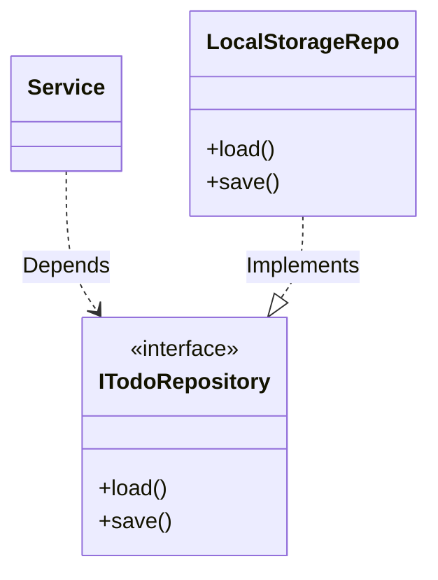

# 第14章：永続化②：Repositoryで差し替え可能にする🔁🧲

## この章のゴール🎯✨

* 「保存する処理（LocalStorageなど）」をアプリの本体ロジックから引きはがす✂️
* `interface（契約）` を挟んで、保存先を **あとから差し替え** できるようにする🔁
* 次の章（DI/テスト）に超つながる形に整える🧪🔌

---

## 1) まず“つらみ”を確認しよ🥺💦


第13章で `localStorage` 保存ができた！えらい！🎉
でも…もし Service の中にこんなのが入ってたらどうなる？👇

* Serviceが `localStorage.getItem()` を直接呼ぶ
* JSONの `parse/stringify` もServiceがやる
* 保存キー文字列もServiceが知ってる

こうなると将来、保存先を👇に変えたい時に地獄😇💥

* IndexedDBにしたい📦（大量データ向き）
* サーバーAPIにしたい🌐
* テスト用にメモリ保存にしたい🧸

そこで登場！Repository✨
「保存の詳細は外側に追い出して、アプリ本体は“保存できる”という事実だけを知る」っていう考え方だよ🧠💡
（Repositoryは永続化の関心事をドメイン（本体）から外へ出すためのパターンとして説明されることが多いよ）([Microsoft Learn][1])

---

## 2) 今回の完成形の“依存の向き”🚦➡️




イメージはこれ👇（矢印＝「知ってる/呼べる」）

* Controller → Service → **ITodoRepository（interface）**
* LocalStorageTodoRepository → **ITodoRepository（interface）**
* （Serviceは LocalStorage を知らない🙅‍♀️）

「本体（Service）が、外部の都合（LocalStorage）を知らない」状態が作れたら勝ち🏆✨

---

## 3) 重要ポイント：LocalStorageは“文字列の箱”📦🧵


LocalStorageは **キー/値のペア**で、キーは文字列で扱われるよ🗝️🧾([MDN Web Docs][2])
あと、`localStorage` は基本的に **同期的**（処理がその場で走る）だから、デカいデータを頻繁に出し入れすると重くなりがち⚠️([MDN Web Docs][3])

だからこそ、

* JSON変換
* 例外処理（壊れたデータ対策）
* 保存キー管理

このへんは **Repository側に隔離**しようね😉✨

---

## 4) 実装していこう〜！🧑‍💻✨（CampusTodo）

### 4-1. フォルダ構成（例）📁

* `src/model/` … TodoItemなど（アプリの中心の型）
* `src/repository/` … interfaceと実装（保存の世界）
* `src/service/` … 操作の本体（追加/完了/編集）
* `src/main.ts` … 組み立て（どのRepositoryを使うか決める場所）

---

## 5) Step1：Repositoryの“契約”を作る📜✨


まずは最小でOK！
このアプリは「一覧をまとめて保存/読み込み」できれば十分なので、こうしちゃう👇

```ts
// src/repository/ITodoRepository.ts
import type { TodoItem } from "../model/TodoItem";

export interface ITodoRepository {
  loadAll(): TodoItem[];
  saveAll(todos: TodoItem[]): void;
}
```

> ポイント💡
>
> * Serviceは `ITodoRepository` だけ知っていればいい🫶
> * 保存先がLocalStorageでも、IndexedDBでも、サーバーでも関係なし🎉

---

## 6) Step2：LocalStorage実装を“外側”に作る💾🧱


### 6-1. Dateがあるなら注意！⏰⚠️

`Date` は `JSON.stringify()` で文字列になっちゃうから、読み込み時に `new Date()` で戻す必要があるよ🌀
（dueDate/createdAtを使ってる想定で例を書くね）

```ts
// src/repository/LocalStorageTodoRepository.ts
import type { ITodoRepository } from "./ITodoRepository";
import type { TodoItem } from "../model/TodoItem";

type StoredTodoItem = Omit<TodoItem, "dueDate" | "createdAt"> & {
  dueDate?: string;   // ISO文字列
  createdAt: string;  // ISO文字列
};

const STORAGE_KEY = "campusTodo.todos.v1";

function toStored(todo: TodoItem): StoredTodoItem {
  return {
    ...todo,
    dueDate: todo.dueDate ? todo.dueDate.toISOString() : undefined,
    createdAt: todo.createdAt.toISOString(),
  };
}

function fromStored(todo: StoredTodoItem): TodoItem {
  return {
    ...todo,
    dueDate: todo.dueDate ? new Date(todo.dueDate) : undefined,
    createdAt: new Date(todo.createdAt),
  };
}

export class LocalStorageTodoRepository implements ITodoRepository {
  loadAll(): TodoItem[] {
    const raw = localStorage.getItem(STORAGE_KEY);
    if (!raw) return [];

    try {
      const stored = JSON.parse(raw) as StoredTodoItem[];
      if (!Array.isArray(stored)) return [];
      return stored.map(fromStored);
    } catch {
      // 壊れたJSONが入っててもアプリが落ちないように保険🧯
      return [];
    }
  }

  saveAll(todos: TodoItem[]): void {
    const stored = todos.map(toStored);
    const json = JSON.stringify(stored);
    localStorage.setItem(STORAGE_KEY, json);
  }
}
```

> ここが最高ポイント🥳
>
> * JSONの事情、保存キー、例外処理、Date変換…全部Repositoryの中！
> * Serviceは「配列を渡したら保存される」だけ知ってればOK💞

---

## 7) Step3：Serviceを“Repository経由”に統一する🍔➡️🥗✨

Serviceから `localStorage` を完全に消す！🔥

```ts
// src/service/TodoService.ts
import type { ITodoRepository } from "../repository/ITodoRepository";
import type { TodoItem } from "../model/TodoItem";

export class TodoService {
  private todos: TodoItem[] = [];

  constructor(private readonly repo: ITodoRepository) {}

  load(): ReadonlyArray<TodoItem> {
    this.todos = this.repo.loadAll();
    return this.todos;
  }

  getSnapshot(): ReadonlyArray<TodoItem> {
    return this.todos;
  }

  add(todo: TodoItem): void {
    this.todos = [todo, ...this.todos];
    this.repo.saveAll(this.todos);
  }

  toggleDone(id: string): void {
    this.todos = this.todos.map(t =>
      t.id === id ? { ...t, done: !t.done } : t
    );
    this.repo.saveAll(this.todos);
  }

  // もし必要なら delete / edit も同じノリでOK🧡
}
```

---

## 8) Step4：差し替えポイントは“組み立て側”だけ🧩✨


`main.ts`（またはComposition Root）で「どのRepositoryを使うか」を決めるよ🎛️

```ts
// src/main.ts
import { LocalStorageTodoRepository } from "./repository/LocalStorageTodoRepository";
import { TodoService } from "./service/TodoService";

// （ViewやControllerの生成は既存のままでOK想定）

const repo = new LocalStorageTodoRepository();
const service = new TodoService(repo);

// controller.init() の中で service.load() → view.render() みたいに繋ぐと綺麗🎀
```

これで、保存先を変える時は **ここだけ**いじればOK🎉🎉🎉

---

## 9) ミニ演習：メモリRepositoryに差し替えてみよ🧸✨


「保存しないけど動作確認したい」って時に便利！

```ts
// src/repository/InMemoryTodoRepository.ts
import type { ITodoRepository } from "./ITodoRepository";
import type { TodoItem } from "../model/TodoItem";

export class InMemoryTodoRepository implements ITodoRepository {
  private data: TodoItem[] = [];

  loadAll(): TodoItem[] {
    return [...this.data];
  }

  saveAll(todos: TodoItem[]): void {
    this.data = [...todos];
  }
}
```

`main.ts` の差し替えは1行！🥳

```ts
// const repo = new LocalStorageTodoRepository();
const repo = new InMemoryTodoRepository();
```

> これ、次の章の「FakeRepositoryでテスト」がほぼ同じ形になるよ🧪✨

---

## 10) よくあるミス集（先に潰す！）🚧😇

* **ServiceがlocalStorageを呼んでる**
  → Repository導入の意味が半減🥲（Serviceはinterfaceだけ見よう）
* **JSON.parseで落ちる**
  → try/catch必須🧯（壊れたデータは現実に起きる）
* **Dateが文字列のままでバグる**
  → `toStored/fromStored` みたいに変換を置くと安全💖
* **保存キーがあちこちに散らばる**
  → Repository内で `STORAGE_KEY` を1つにまとめる🧷

---

## 11) AI活用プロンプト例🤖💡（“最小に削る”のがコツ✂️）

### interface案を出してもらう🧾

* 「Todoの保存を差し替え可能にしたい。最小の `ITodoRepository` を提案して。メソッドは2〜4個まで。」

### 実装のレビューをしてもらう🧐

* 「このServiceがLocalStorageに依存してないか確認して。依存してたら、どこをRepositoryに移すべきか指摘して。」

### 事故対策チェック🧯

* 「JSONが壊れてても落ちない実装になってる？危ない箇所を列挙して直して。」

---

## 12) 章末チェック✅✨（できたら勝ち！）

* [ ] `ITodoRepository` を作った
* [ ] Serviceから `localStorage` が消えた🙅‍♀️
* [ ] LocalStorage実装はRepositoryに閉じ込めた📦
* [ ] `main.ts` でRepositoryを差し替えできた🔁🧲
* [ ] 変換（Date/JSON）と例外処理がRepository側にある🧯

---

## おまけ：この章の“今っぽさ”メモ🗓️✨

* TypeScriptは現在 **5.9 系**のリリースノートが公開されてるよ📘([TypeScript][4])
* Node.js は **v24 が Active LTS**として扱われ、直近でもセキュリティリリースが出てる感じ🛡️([Node.js][5])
* Vite も継続的にアップデートされて、GitHub上で最新タグが追えるよ⚡([GitHub][6])

---

次の第15章は、このRepositoryを **DI（差し替え注入）** でさらに綺麗にして、テスト可能にしていくよ〜🔌🧪✨
そのまま続けていこっか？😊💕

[1]: https://learn.microsoft.com/en-us/dotnet/architecture/microservices/microservice-ddd-cqrs-patterns/infrastructure-persistence-layer-design?utm_source=chatgpt.com "Designing the infrastructure persistence layer - .NET"
[2]: https://developer.mozilla.org/ja/docs/Web/API/Web_Storage_API/Using_the_Web_Storage_API?utm_source=chatgpt.com "ウェブストレージ API の使用 - MDN Web Docs"
[3]: https://developer.mozilla.org/en-US/docs/Web/API/Web_Storage_API?utm_source=chatgpt.com "Web Storage API - MDN Web Docs - Mozilla"
[4]: https://www.typescriptlang.org/docs/handbook/release-notes/typescript-5-9.html?utm_source=chatgpt.com "Documentation - TypeScript 5.9"
[5]: https://nodejs.org/en/about/previous-releases?utm_source=chatgpt.com "Node.js Releases"
[6]: https://github.com/vitejs/vite/releases?utm_source=chatgpt.com "Releases · vitejs/vite"
