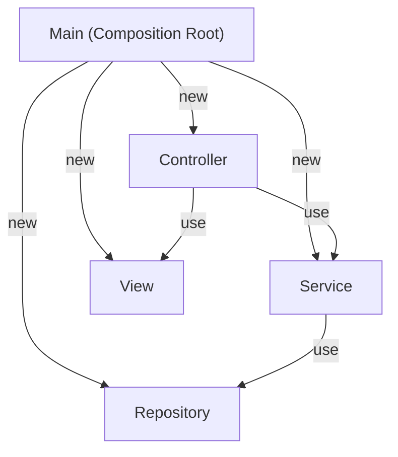

# 第15章：テスタブルMVC：依存を注入する（DIの超入門）🔌🧪

（題材：CampusTodo📚✅）

---

## 0) この章のゴール🎯✨

ここまで作ってきたCampusTodoを、**テストしやすい形に変身**させるよ〜！💪🥰

* 「`new`直書き」がなぜテストを邪魔するか、説明できる🧠
* **DI（依存性注入）**の超基本「コンストラクタ注入」を使える🔧
* `LocalStorageRepository` を **Fake（偽物）**に差し替えて動かせる🧸✅
* 「組み立て担当（Composition Root）」を作って、MVCがスッキリする🧼✨

> ちなみに今どきの周辺事情：TypeScriptは **5.9.3 が最新タグ**として案内されてるよ📌 ([GitHub][1])
> テストはVite系なら **Vitest** が相性良くて、Vitestは「Viteにpowered」って公式が明言してるよ⚡ ([vitest.dev][2])
> さらにVitest 4系ではブラウザ実行まわりも強化されてる〜🌐 ([vitest.dev][3])

---

## 1) まず「テストしにくいコード」ってどんなの？😇💦


### ありがちな地獄🔥：クラスの中で `new` してる

例：Serviceの中でRepositoryを作っちゃうパターン。

```ts
// ❌テストしにくい例：依存が隠れてる
export class TodoService {
  private repo = new LocalStorageTodoRepository("campusTodo");

  async add(title: string) {
    const items = await this.repo.load();
    // ...追加して
    await this.repo.save(items);
  }
}
```

これ、何が困るの？🤔

* テストで **LocalStorageを触っちゃう**（外部依存が混ざる）💾
* 状態が残ったり消えたりして **テストが不安定**になる🌀
* 「Serviceのロジックだけ」を検証したいのに、保存処理が邪魔😵‍💫

---

## 2) DIってなに？（超ざっくり）🌼


DI（Dependency Injection）は、ひとことで言うと👇

**「必要な部品（依存）を、外から渡してあげる」** ことだよ〜🔌✨

* ServiceがRepositoryを「作る」のをやめる🙅‍♀️
* 代わりに **もらう**（注入する）🎁
* だからテストではFakeに差し替えできる🧸✅

---

## 3) 今日の設計図（依存の向き）🗺️✨

目指す形はこれ👇（わかりやすさ最優先💞）

* Controller → Service → Repository
* Controller → View（表示はViewに任せる）

**ポイント🌟**：

* **「組み立て（newする）」の仕事を main 側に寄せる**
* 中身（Service/Controller）は「受け取って使うだけ」になる

---

## 4) Step1：Repositoryを“差し替え可能”にする🔁🧲

### 4-1) まずは契約（interface）を作る📜✨

```ts
// src/app/ITodoRepository.ts
import type { TodoItem } from "../domain/TodoItem";

export interface ITodoRepository {
  load(): Promise<TodoItem[]>;
  save(items: TodoItem[]): Promise<void>;
}
```

> TypeScriptの`interface`は「こういう形だよね」っていう契約を作るのに便利✨（型安全の土台）

### 4-2) 本番用：LocalStorageRepository（既にある想定）💾

```ts
// src/infra/LocalStorageTodoRepository.ts
import type { ITodoRepository } from "../app/ITodoRepository";
import type { TodoItem } from "../domain/TodoItem";

export class LocalStorageTodoRepository implements ITodoRepository {
  constructor(private readonly key: string) {}

  async load(): Promise<TodoItem[]> {
    const raw = localStorage.getItem(this.key);
    if (!raw) return [];
    return JSON.parse(raw) as TodoItem[];
  }

  async save(items: TodoItem[]): Promise<void> {
    localStorage.setItem(this.key, JSON.stringify(items));
  }
}
```

### 4-3) テスト用：InMemory（Fake）Repository🧸

「保存」をメモリ配列でやるだけ。最強に軽い✨

```ts
// src/infra/InMemoryTodoRepository.ts
import type { ITodoRepository } from "../app/ITodoRepository";
import type { TodoItem } from "../domain/TodoItem";

export class InMemoryTodoRepository implements ITodoRepository {
  private items: TodoItem[];

  constructor(seed: TodoItem[] = []) {
    // 外から渡された配列をそのまま持つと事故るのでコピー推奨💡
    this.items = [...seed];
  }

  async load(): Promise<TodoItem[]> {
    return [...this.items];
  }

  async save(items: TodoItem[]): Promise<void> {
    this.items = [...items];
  }
}
```

---

## 5) Step2：ServiceにRepositoryを注入する（コンストラクタ注入）🔌✨


```ts
// src/app/TodoService.ts
import type { ITodoRepository } from "./ITodoRepository";
import type { TodoItem } from "../domain/TodoItem";

export class TodoService {
  constructor(private readonly repo: ITodoRepository) {}

  async add(title: string): Promise<void> {
    const items = await this.repo.load();

    // 例：最低限のロジック（本当は第9章の不変条件などがここに絡む想定🛡️）
    const newItem: TodoItem = {
      id: crypto.randomUUID(),
      title,
      done: false,
      createdAt: new Date().toISOString(),
    };

    await this.repo.save([newItem, ...items]);
  }

  async toggleDone(id: string): Promise<void> {
    const items = await this.repo.load();
    const next = items.map((t) => (t.id === id ? { ...t, done: !t.done } : t));
    await this.repo.save(next);
  }

  async getAll(): Promise<TodoItem[]> {
    return this.repo.load();
  }
}
```

**ここがDIの芯❤️**

* Serviceの中から `new LocalStorage...` が消えた！🎉
* 何RepositoryでもOKになった！🔁✨

---

## 6) Step3：Controllerにも“外から渡す”を徹底する🚦✨

ViewもControllerの中で`new`しちゃうと、UI絡みが重くなりがち😵
だからViewも「契約」で渡しちゃうと綺麗だよ〜🎀

### 6-1) Viewの契約（interface）を作る🎨

```ts
// src/ui/ITodoView.ts
import type { TodoItem } from "../domain/TodoItem";

export interface ITodoView {
  render(items: TodoItem[]): void;

  onAdd(handler: (title: string) => void): void;
  onToggleDone(handler: (id: string) => void): void;

  showError(message: string): void;
}
```

### 6-2) Controllerは「受け取ってつなぐ」だけにする🧠➡️🎛️

```ts
// src/app/TodoController.ts
import type { TodoService } from "./TodoService";
import type { ITodoView } from "../ui/ITodoView";

export class TodoController {
  constructor(
    private readonly service: TodoService,
    private readonly view: ITodoView
  ) {}

  async init(): Promise<void> {
    // イベント接続（入力）
    this.view.onAdd(async (title) => {
      try {
        await this.service.add(title);
        await this.refresh();
      } catch {
        this.view.showError("追加できなかったよ〜🥲 もう一回試してみて🙏");
      }
    });

    this.view.onToggleDone(async (id) => {
      try {
        await this.service.toggleDone(id);
        await this.refresh();
      } catch {
        this.view.showError("切り替え失敗〜😵‍💫 画面を更新してみて🙏");
      }
    });

    // 初回表示
    await this.refresh();
  }

  private async refresh(): Promise<void> {
    const items = await this.service.getAll();
    this.view.render(items);
  }
}
```

Controllerが「交通整理🚦」っぽくなってきた〜！🥳✨

---

## 7) Step4：組み立て担当（Composition Root）を作る🧩✨




**`new`はここに集約！**（←超大事‼️）
アプリの入口（例：`main.ts`）で全部組み立てるよ〜🧷


```ts
// src/main.ts
import { LocalStorageTodoRepository } from "./infra/LocalStorageTodoRepository";
import { TodoService } from "./app/TodoService";
import { TodoController } from "./app/TodoController";
import { TodoView } from "./ui/TodoView"; // 既存の実装クラス想定

const repo = new LocalStorageTodoRepository("campusTodo");
const service = new TodoService(repo);

const view = new TodoView(document.querySelector("#app")!);
const controller = new TodoController(service, view);

controller.init();
```

これで、もしテストやデバッグでFakeを使いたかったら…👇

```ts
// 例：repoだけ差し替え（この書き方自体がDIの嬉しさ💞）
import { InMemoryTodoRepository } from "./infra/InMemoryTodoRepository";

const repo = new InMemoryTodoRepository([]);
const service = new TodoService(repo);
// あとは同じ
```

---

## 8) 演習：Fakeで動作確認（手動でOK）✅🧸


### ミッション🎒

1. `InMemoryTodoRepository` を使うように `main.ts` を一瞬だけ差し替え
2. Todoを追加して、リロードしても消える（＝メモリだから）ことを確認
3. `LocalStorageTodoRepository` に戻して、リロードしても残ることを確認

**確認ポイント👀✨**

* Service/Controllerのコードは変えてないのに動作が変わる！😳
* 「外部依存は差し替えられる部品」って感覚がつかめる💡

---

## 9) AI活用プロンプト（そのままコピペOK）🤖💬✨

* 「このプロジェクトで `new` してる箇所を一覧にして、テストしにくい順に並べて」🔍
* 「`TodoService` の依存を注入に変えるリファクタ案を、差分が小さくなる順で3案ちょうだい」✂️
* 「`ITodoView` を満たす FakeView を作って。受け取った引数を記録できるようにして」🧾
* 「RepositoryのFakeを作るときに気をつけること（コピー、参照共有の事故）をチェックリスト化して」✅

---

## 10) よくあるミス集（先に潰すよ〜😎✨）

### ❌ ミス1：結局Serviceの中で `new` しちゃう

👉 **“外部に触るもの”は注入**（Repository/Clock/HTTPなど）

### ❌ ミス2：Fakeが本番と挙動違いすぎる

👉 Fakeは「最小でOK」だけど、**load/saveの形だけは揃える**🧸

### ❌ ミス3：DIコンテナをいきなり入れて迷子

👉 まずは今回の「手動DI（組み立てをmainに集約）」が最強に学びやすいよ🧠✨
（TypeScriptは`interface`が実行時に消えるので、重いDIはトークン設計が必要になりがち💦）

---

## まとめ🎀✨

この章でやったことはシンプルで強いよ〜💪🥰

* `new`直書きを減らして、依存を「外から渡す」ようにした🔌
* RepositoryをFakeに差し替えできるようにした🧸
* 組み立て（Composition Root）に `new` を集約した🧩

次の章（第16章）では、この土台の上で **テスト（Vitest）を気持ちよく書ける**ようになるよ🧪✨
VitestはViteと相性が良く、最近のVitest 4系は **Vite 6+ / Node 20+** が要件として案内されてるよ📌 ([vitest.dev][2])

---

もし今のCampusTodoのコード（特に`TodoService`と`TodoController`と`Repository`周り）を貼ってくれたら、**「どこをどうDIに変えると一番キレイか」**を、差分小さめで具体的にリファクタ案出すね〜🫶✨

[1]: https://github.com/microsoft/typescript/releases "Releases · microsoft/TypeScript · GitHub"
[2]: https://vitest.dev/guide/ "Getting Started | Guide | Vitest"
[3]: https://vitest.dev/blog/vitest-4 "Vitest 4.0 is out! | Vitest"
