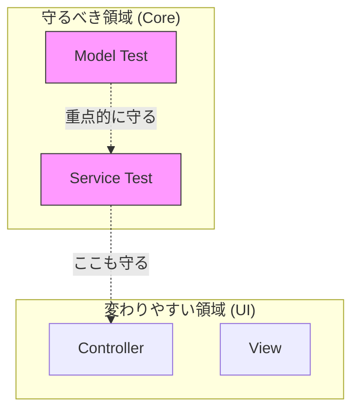

# 第16章：テスト入門（Model/Serviceを守る）🛡️🧪✨

この章は、「壊れやすいのに、壊れると地味に痛いところ」＝ **Model / Service** をテストで守る章だよ〜🥳
（ViewやControllerはUI変更で揺れやすいので、まずは“ロジックの心臓部”から守るのがコスパ最高💘）

---

## 16.1 まず今日のゴール🎯✨




終わる頃にはこれができるようになるよ👇

* Modelの「ルール（不変条件）」をテストで固定できる🧱🛡️
* Serviceの「処理の流れ（保存した？戻り値どう？）」をテストで確認できる🔁✅
* **正常 / 異常 / 境界値** を意識してテストを作れる📏🧠
* AIに「テストケース案」を出してもらって、自分で取捨選択できる🤖✂️

---

## 16.2 テストって結局なに？（超ざっくり）🍀


テストは一言でいうと、

> 「このコード、**これから先も同じ約束を守れてる？**」を自動で確認する仕組み🔒✨

特にModel/Serviceは、ちょっとした修正で壊れやすいのに、壊れても気づきにくい😇
だからテストで “地雷除去” しておくと安心感が段違いだよ〜〜🧯💕

---

## 16.3 この章で使うテスト道具（いまどき構成）🧰✨

今回は **Vitest** を使うよ〜！
Vite系の開発と相性が良くて、導入も軽め🪽
公式でも「依存関係として入れるのがおすすめ」って書かれてるよ📦✨ ([vitest.dev][1])

さらに👇みたいな特徴もあるよ：

* ふだんは **watchモードが基本**（変更すると関連テストが賢く走る）🔁⚡ ([vitest.dev][2])
* 1回だけ実行したいときは `vitest run` が使える🏃‍♀️💨 ([vitest.dev][1])
* カバレッジは既定で **V8 provider**（NodeみたいなV8系ランタイムが必要）📊 ([vitest.dev][3])

> ちなみにNodeは2026年1月時点で v24 が Active LTS、v25 が Current だよ🟢🆕（更新日も確認できる） ([Node.js][4])
> TypeScriptも 5.9 が提供されてるよ〜🧡 ([Microsoft for Developers][5])

---

## 16.4 セットアップ（最小）🛠️✨

### ① 依存関係を追加📦

```bash
npm i -D vitest @vitest/coverage-v8
```

* `@vitest/coverage-v8` はカバレッジ（網羅率）を出す用📊 ([npm][6])

### ② package.json に scripts を追加▶️

```json
{
  "scripts": {
    "test": "vitest",
    "test:run": "vitest run",
    "test:ui": "vitest --ui",
    "test:coverage": "vitest run --coverage"
  }
}
```

* `test`：開発中はこれが一番ラク（watch）🔁
* `test:run`：CIや「1回だけ」で便利🏁 ([vitest.dev][1])
* `test:ui`：ブラウザUIで気持ちよく確認できるやつ✨ ([vitest.dev][7])

### ③ 設定ファイル（必要なら）⚙️

まずはデフォルトでもOK！
でもカバレッジ出力先とか整えたいなら👇

```ts
// vitest.config.ts
import { defineConfig } from 'vitest/config';

export default defineConfig({
  test: {
    globals: true,
    environment: 'node',
    coverage: {
      reporter: ['text', 'html'],
      reportsDirectory: './tests/coverage'
    }
  }
});
```

* `environment` は既定が Node だよ🐢（DOMテストしたいなら `jsdom` / `happy-dom` も選べる） ([vitest.dev][8])

---

## 16.5 テストの置き場所＆命名ルール（迷子防止）🗂️✨

おすすめはこれ👇（シンプルでOK）

* `src/` …本体
* `tests/` …テスト

  * `tests/model/xxx.test.ts`
  * `tests/service/yyy.test.ts`

命名の雰囲気はこんな感じ💡

* `TodoItem.test.ts`（または `todoItem.test.ts`）
* `TodoService.test.ts`

---

## 16.6 まず1本：Modelテスト（不変条件を守る）🛡️📦

### ✅ ねらい

Modelが保証したいルール（例）👇

* タイトルは空欄ダメ🙅‍♀️
* タイトルは前後の空白をトリムする✂️
* 期限は「過去日付」ダメ（必要なら）⏳🚫

### 例：Model（TodoItem）側をこんな形にする📦

※すでに似た構造があるなら、読み替えてOKだよ〜🙆‍♀️✨

```ts
// src/model/TodoItem.ts
export class DomainError extends Error {
  constructor(public code: 'TITLE_EMPTY' | 'DUE_IN_PAST') {
    super(code);
  }
}

export type TodoItemParams = {
  id: string;
  title: string;
  done?: boolean;
  dueDate?: Date;
};

export class TodoItem {
  private _title: string;
  private _done: boolean;
  private _dueDate?: Date;

  private constructor(params: TodoItemParams) {
    this._title = params.title;
    this._done = params.done ?? false;
    this._dueDate = params.dueDate;
  }

  static create(params: TodoItemParams, now: Date = new Date()): TodoItem {
    const title = params.title.trim();
    if (title.length === 0) throw new DomainError('TITLE_EMPTY');

    if (params.dueDate) {
      // “過去”判定はプロジェクトのルールに合わせてね（ここでは now より前はNG）
      if (params.dueDate.getTime() < now.getTime()) throw new DomainError('DUE_IN_PAST');
    }

    return new TodoItem({ ...params, title });
  }

  get title(): string {
    return this._title;
  }
}
```

### ✅ Modelテスト（1本目）✍️

```ts
// tests/model/TodoItem.test.ts
import { describe, it, expect } from 'vitest';
import { TodoItem, DomainError } from '../../src/model/TodoItem';

describe('TodoItem.create', () => {
  it('タイトル前後の空白をトリムして作成できる✨', () => {
    const now = new Date('2026-01-14T00:00:00+09:00');
    const todo = TodoItem.create({ id: '1', title: '  レポート  ' }, now);

    expect(todo.title).toBe('レポート');
  });

  it('タイトルが空欄（空白だけ）ならエラーになる🚫', () => {
    const now = new Date('2026-01-14T00:00:00+09:00');

    expect(() => TodoItem.create({ id: '1', title: '   ' }, now))
      .toThrowError(DomainError);
  });

  it('期限が過去ならエラーになる⏳🚫', () => {
    const now = new Date('2026-01-14T00:00:00+09:00');
    const past = new Date('2026-01-13T23:59:59+09:00');

    expect(() => TodoItem.create({ id: '1', title: '課題', dueDate: past }, now))
      .toThrowError(DomainError);
  });
});
```

### 🌟ここがポイント

* **nowを引数で固定**してるから、テストが日付でブレないよ📅🧊
* ルールが変わったら「Modelとテスト」だけ直せばOKになりやすい🙆‍♀️✨

---

## 16.7 次の1本：Serviceテスト（処理の流れを守る）🍔➡️🥗🧪

### ✅ ねらい

Serviceはだいたいこういう事故が起きがち💥

* 保存し忘れて、再読み込みで消える😇
* 返すデータがズレる（UIが変になる）😵‍💫
* 例外/エラー時の扱いが曖昧でバグる🌀

だから Service は **FakeRepository** を使って “外部なし” で確かめるよ🧸✨

### 例：RepositoryとService（超ミニ）📦

```ts
// src/repository/ITodoRepository.ts
import { TodoItem } from '../model/TodoItem';

export interface ITodoRepository {
  saveAll(items: TodoItem[]): Promise<void>;
  loadAll(): Promise<TodoItem[]>;
}
```

```ts
// src/service/TodoService.ts
import { ITodoRepository } from '../repository/ITodoRepository';
import { TodoItem } from '../model/TodoItem';

export class TodoService {
  constructor(
    private repo: ITodoRepository,
    private nowProvider: () => Date = () => new Date()
  ) {}

  async add(title: string): Promise<TodoItem[]> {
    const now = this.nowProvider();
    const current = await this.repo.loadAll();

    const newItem = TodoItem.create(
      { id: crypto.randomUUID(), title },
      now
    );

    const next = [...current, newItem];
    await this.repo.saveAll(next);
    return next;
  }
}
```

> `crypto.randomUUID()` はブラウザ環境だとOKだけど、テストで不安なら「ID生成もDI」するとさらに安定するよ🧠✨

### FakeRepository（テスト用）🧸

```ts
// tests/fakes/FakeTodoRepository.ts
import { ITodoRepository } from '../../src/repository/ITodoRepository';
import { TodoItem } from '../../src/model/TodoItem';

export class FakeTodoRepository implements ITodoRepository {
  private items: TodoItem[] = [];
  public savedSnapshots: TodoItem[][] = [];

  constructor(initial: TodoItem[] = []) {
    this.items = [...initial];
  }

  async loadAll(): Promise<TodoItem[]> {
    return [...this.items];
  }

  async saveAll(items: TodoItem[]): Promise<void> {
    this.items = [...items];
    this.savedSnapshots.push([...items]);
  }
}
```

### ✅ Serviceテスト（1本目）✍️

```ts
// tests/service/TodoService.test.ts
import { describe, it, expect } from 'vitest';
import { TodoService } from '../../src/service/TodoService';
import { FakeTodoRepository } from '../fakes/FakeTodoRepository';
import { TodoItem } from '../../src/model/TodoItem';

describe('TodoService.add', () => {
  it('追加すると、保存されて、一覧が1件増える✅✨', async () => {
    const now = new Date('2026-01-14T00:00:00+09:00');
    const repo = new FakeTodoRepository([
      TodoItem.create({ id: 'a', title: '既存' }, now)
    ]);

    const service = new TodoService(repo, () => now);

    const result = await service.add('新規');

    expect(result).toHaveLength(2);
    expect(repo.savedSnapshots).toHaveLength(1);
    expect(repo.savedSnapshots[0]).toHaveLength(2);
    expect(result[1].title).toBe('新規');
  });
});
```

---

## 16.8 境界値テストの作り方（初心者でもすぐ強くなる）📏✨

境界値っていうのは「ギリギリ」のところだよ〜🧠💡
たとえば👇

* タイトル長さ：0文字 / 1文字 / 最大文字数ちょうど
* 日付：今ちょうど / 1ms前 / 1ms後
* 件数：0件 / 1件 / たくさん（必要になったら）

### AIに出してもらうプロンプト例🤖💬

（そのままコピペOK）

* 「TodoItemの不変条件テストケースを、正常/異常/境界値で10個出して」🧠📋
* 「TodoService.add の失敗パターンを洗い出して（保存失敗、重複、無効入力など）」🕵️‍♀️💥
* 「この仕様（貼る）に対して、最小のユニットテストセットを提案して」✂️✅

👉 ただし！AI案は “盛りがち” だから、**今の章で守りたい最小**に削るのが勝ち✨✂️

---

## 16.9 よくあるミス集（先に潰す）🧯💥

* **テストが日付や乱数でブレる**
  → `nowProvider` / `idGenerator` をDIして固定しよ🧊
* **1テストで確認しすぎて、壊れた時どこが原因かわからない**
  → “1テスト1理由” が気持ちいい🥰
* **UI（DOM）まで一緒にテストして辛くなる**
  → まずModel/Serviceだけ守るのが正解🙆‍♀️💘
  （DOMテストが必要になったら `jsdom` / `happy-dom` を使う感じだよ） ([vitest.dev][8])

---

## 16.10 ミニ演習（この章のゴール達成セット）📝✨

### 演習A：Modelテストをもう1本追加🛡️

* done切替や編集メソッドがあるなら、それを1本テスト✅
  例）`toggleDone()` が true/false 反転する、など🔁

### 演習B：Serviceテストをもう1本追加🧪

* 例）無効タイトルで追加したらエラーになる🚫
* 例）Repository保存が失敗した時の扱い（throwする/Resultで返す）を決めてテスト📌

### 演習C：カバレッジを出して眺める📊👀

```bash
npm run test:coverage
```

* VitestはV8カバレッジが基本だよ〜📈 ([vitest.dev][3])

---

## 16.11 まとめ🎀✨

* まず守るべきは **Model / Service**（ロジックの心臓部）🫀🛡️
* テストは「未来の自分を助ける保険」💝
* **正常/異常/境界値** の3点セットができたら、もう強い💪✨

次の章（第17章）では、完成＋ふりかえりで「MVCを説明できる」状態まで仕上げるよ〜🎓🌸

[1]: https://vitest.dev/guide/?utm_source=chatgpt.com "Getting Started | Guide"
[2]: https://vitest.dev/guide/features?utm_source=chatgpt.com "Features | Guide"
[3]: https://vitest.dev/guide/coverage?utm_source=chatgpt.com "Coverage | Guide"
[4]: https://nodejs.org/en/about/previous-releases?utm_source=chatgpt.com "Node.js Releases"
[5]: https://devblogs.microsoft.com/typescript/announcing-typescript-5-9/?utm_source=chatgpt.com "Announcing TypeScript 5.9"
[6]: https://www.npmjs.com/package/%40vitest/coverage-v8?utm_source=chatgpt.com "vitest/coverage-v8"
[7]: https://vitest.dev/guide/ui.html?utm_source=chatgpt.com "Vitest UI | Guide"
[8]: https://vitest.dev/config/environment?utm_source=chatgpt.com "environment | Config"
