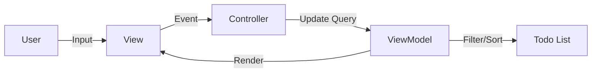
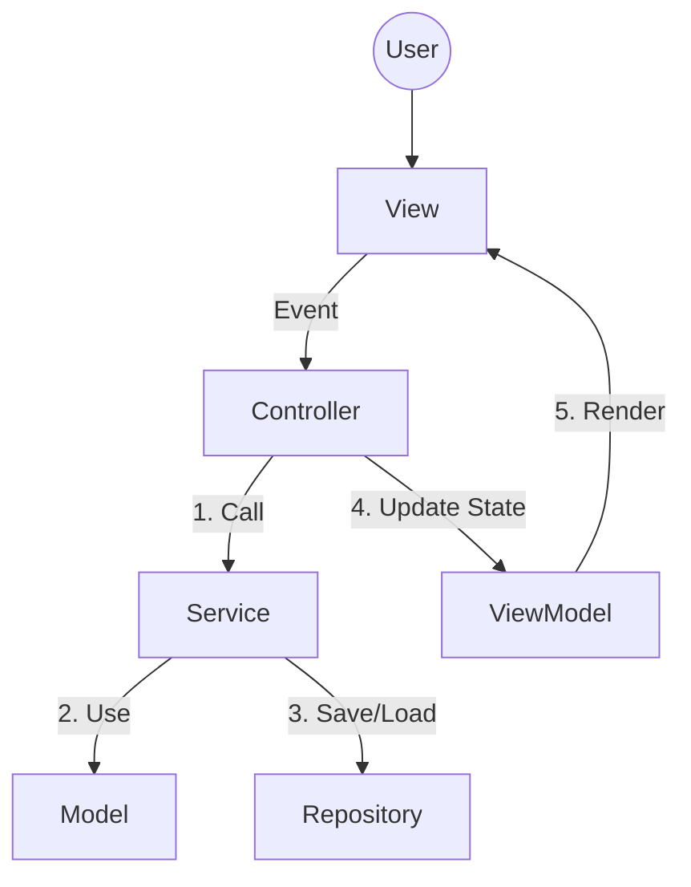

# 第17章：総合演習（完成）＋ふりかえり（MVCを説明できる）🎓🌸

この章は「完成させる」だけじゃなくて、**“あとから自分で育てられる構造”**に整えて、最後に**MVCを言葉で説明できる**ようになるのがゴールだよ〜！✨🫶

---

## 17-0 今日のメニュー🍽️✨

* ✅ 仕上げ機能：検索🔍／並び替え🔃（軽めに）
* ✅ “混ざってる責務”をほどくリファクタ🧹
* ✅ テストで安心を作る🧪🛡️（Model/Service中心）
* ✅ READMEを書いて、MVC構造を説明できるようにする📘📝
* ✅ ふりかえりで「自分の言葉」を作る💬🌷

---

## 17-1 完成チェック（まずは“壊れてない”を確認）✅✅✅

### 手動チェックリスト（5分でOK）⏱️

* [ ] Todoを追加できる➕
* [ ] 完了トグルできる✅🔁
* [ ] バリデーションが効いて、優しいエラー表示になる😌⚠️
* [ ] リロードしてもデータが残る💾
* [ ] 検索すると絞り込まれる🔍
* [ ] 並び替えが効く🔃
* [ ] （できれば）テストが通る🧪✨

---

## 17-2 仕上げ機能①：検索🔍（“UIの気持ちいい”を作る）




### 方針（MVC的にきれいに）🧠✨

* **View**：検索欄の入力イベントを拾う（ただ拾うだけ）🎛️
* **Controller**：`searchQuery` を受け取って「検索条件を更新して再表示してね」と指示🚦
* **Service / ViewModel**：検索条件に応じて表示用リストを作る🧺

  * どっちでやる？→おすすめは **ViewModel側**（表示都合だから）✨

### まず型を作る（読みやすさが爆上がり）🧷

```ts
export type TodoQuery = {
  text: string; // 検索文字（titleに対して部分一致とか）
};
```

### Controller側のイメージ（超ざっくり）🚦

* `onSearchInput(text)` を受ける
* `query.text = text` を更新
* `render()`（= Viewに描画指示）

```ts
private query: TodoQuery = { text: "" };

onSearchInput(text: string) {
  this.query = { ...this.query, text };
  this.render();
}
```

### View側のイメージ（イベントを渡すだけ）🎛️

```ts
searchInput.addEventListener("input", () => {
  controller.onSearchInput(searchInput.value);
});
```

### ViewModel側（表示用の加工）🧺✨

```ts
function buildTodoListVM(items: TodoItem[], query: TodoQuery): TodoItem[] {
  const q = query.text.trim().toLowerCase();
  if (!q) return items;

  return items.filter(x => x.title.toLowerCase().includes(q));
}
```

#### ありがち落とし穴💥

* ❶ 検索条件を **Modelに持たせちゃう**（→表示都合なのでModelが汚れがち😇）
* ❷ 検索のたびに永続化を書き換えちゃう（→検索は状態じゃなく“表示条件”でOKなこと多い）

---

## 17-3 仕上げ機能②：並び替え🔃（“if地獄”にしない）

### まず“並び替え条件”を型で固定🧷✨

```ts
export type SortKey = "createdAt" | "dueDate" | "title" | "done";
export type SortDirection = "asc" | "desc";

export type SortState = {
  key: SortKey;
  dir: SortDirection;
};
```

### どこに置く？おすすめ配置🗂️

* **Controller**：`sortState` を持つ（UI操作の結果なので）
* **ViewModel**：`sortState` を受けて並び替えた配列を返す

```ts
function sortItems(items: TodoItem[], sort: SortState): TodoItem[] {
  const copied = [...items];

  const factor = sort.dir === "asc" ? 1 : -1;
  copied.sort((a, b) => {
    switch (sort.key) {
      case "createdAt":
        return (a.createdAt - b.createdAt) * factor;
      case "dueDate":
        return ((a.dueDate ?? Infinity) - (b.dueDate ?? Infinity)) * factor;
      case "title":
        return a.title.localeCompare(b.title) * factor;
      case "done":
        return (Number(a.done) - Number(b.done)) * factor;
    }
  });

  return copied;
}
```

### UI（View）例：セレクトで選ぶ🎛️

* “期限順”“作成順”“タイトル順”みたいな感じでOK🌸
* 方向（昇順/降順）はボタンでも良い🔁

---

## 17-4 リファクタ（ここが本番）🧹✨

「動いてるからOK」じゃなくて、**“役割が分かれてるから強い”**へ💪

### リファクタ目標（この3つだけで大勝利）🏆

1. **Controllerが太ってない**（交通整理だけ🚦）
2. **Viewが薄い**（DOMとイベントだけ🎨🎛️）
3. **ルールはModel/Serviceが守る**（不変条件🛡️）

### よくある“混ざりポイント”と分離のコツ🧩

* ❌ Viewの中に「空欄なら追加しない」がある
  → ✅ Model/Serviceに「空欄はエラー」を置く（Viewは表示だけ）
* ❌ Controllerの中に「並び替えロジック」がベタ書き
  → ✅ ViewModel（or helper）へ移す
* ❌ RepositoryをControllerが直接呼んでる
  → ✅ Service経由に統一（Controllerは指示だけ）

### “依存の向き”の最終チェック✅

* Model → View を知らない🙅‍♀️
* Service → View を知らない🙅‍♀️
* Controller → Model/Service を呼ぶ✅
* View → Controller にイベントを渡す✅

---

## 17-5 テストで「壊してない」を保証する🧪🛡️

### 何を守る？（優先度）🥇🥈🥉

* 🥇 Model：不変条件（作れちゃダメな状態を防ぐ）
* 🥈 Service：追加・完了・編集などのユースケース
* 🥉 View/Controller：最小限（E2E寄りになりやすいから）

Vitestは **v4系**が提供されていて（2025年10月に4.0がアナウンス）、細かい更新も続いてるよ〜🧪✨ ([vitest.dev][1])

---

## 17-6 READMEを作る📘✨（“説明できる”が完成の証！）




### READMEに最低限ほしいもの（テンプレ）🧩

* アプリ概要（何ができる？）
* 起動方法（`npm install` → `npm run dev`）
* 構成（フォルダ、責務）
* データフロー（イベント→Controller→Service→Repository→ViewModel→View）
* テスト実行方法

そのまま使える叩き台👇（コピペOK！）

````md
# CampusTodo 📚✅

ブラウザで動く「課題メモ」アプリです。MVCで作って、役割分担を練習しました✨

## Features 🌸
- Todo追加 / 一覧 / 完了トグル
- 入力バリデーション（優しいエラー表示）
- LocalStorage保存
- 検索（絞り込み） / 並び替え

## Setup 🚀
```bash
npm install
npm run dev
```

## Architecture (MVC) 🧠✨

### Model
- TodoItem: Todoのデータと不変条件を守る

### View
- DOM描画 / イベント取得（入力値をControllerへ渡す）

### Controller
- イベントを受けてServiceへ指示し、再描画をトリガーする

### Service
- ユースケース（追加、完了、編集など）を担当

### Repository
- 永続化（LocalStorage）を担当。差し替え可能な形にしている

## Data Flow 🔁
1. Viewがユーザー操作をイベントとして受け取る
2. Controllerが受け取り、Serviceへ指示
3. ServiceがModel/Repositoryを使って状態更新
4. ViewModelで表示用に加工
5. Viewが描画

## Tests 🧪
```bash
npm run test
```
````

> ※上のREADME内のコードフェンスはREADME用なので ``` のままでOKだよ（README上でちゃんと表示される）😊

---

## 17-7 “MVCを説明できる”練習🗣️✨（口に出すと一気に定着するよ〜！）

### 30秒バージョン⏱️

* Model：データとルール🛡️
* View：表示🎨
* Controller：操作を受けて指示🚦
* 分けると「直しやすい」「増やしやすい」💪✨

### 3分バージョン🎙️

* なぜ分ける？（変更に強くするため）
* 依存の向き（ModelがViewを知らない）
* 追加機能（検索・並び替え）を入れても、どこを触るか迷わない
* テストはModel/Serviceを中心に守る🧪

---

## 17-8 AI活用🤖💡（最終章っぽく“賢い使い方”で締める✨）

### 使いやすい指示例（コピペOK）🪄

* 「このController、責務が混ざってないかレビューして。混ざってたら“どこへ移すべきか”も提案して」🧐
* 「検索と並び替えを追加したい。Modelを汚さず、ViewModel中心で実装する案を出して」🔍🔃
* 「READMEをこの構造で書きたい。MVCの説明を“初心者にも分かる言葉”で整えて」📘✨

### AIを使うときのコツ🌷

* 生成→差分確認→自分の言葉で直す、の3点セットが最強💪💕

---

## 17-9 最終課題（提出物）🎓✅

### 提出物①：動くCampusTodo（検索・並び替えつき）🔍🔃

* ✅ 追加/完了/保存が壊れてない
* ✅ 検索と並び替えが効く
* ✅ Controllerが太ってない（Service/ViewModelに寄ってる）

### 提出物②：README📝

* ✅ 起動方法
* ✅ MVCの役割説明
* ✅ データフロー

### 提出物③：ふりかえりメモ（5行でOK）🌸

* 1. MVCで一番大事だと思ったこと
* 2. つまずいたポイント
* 3. 次に増やすなら何を足す？（編集？期限？タグ？）

---

## 最新ツール事情メモ（今回の実装に関係あるところだけ）🧾✨

* Node.js は **v24 が Active LTS**、v25 が Current という扱いだよ（安定重視ならLTSが安心）([Node.js][2])
* Vite は **v7.3.1** が最新リリースとして表示されているよ ([GitHub][3])
* TypeScript は **5.9 系**のリリースノートが公開されていて、5.9では `import defer` みたいな新要素も入ってるよ ([TypeScript][4])
* TypeScript はネイティブ移行のプレビュー（`@typescript/native-preview`）も案内されてるよ（興味があれば触ってみてOK！）([Microsoft for Developers][5])

---

必要なら、この第17章の内容をベースに「検索＆並び替え」の実装を、あなたの今のクラス構成（Controller/Service/View/Repository/ViewModel）に合わせて**具体コードに当てはめた完全版**も書けるよ〜！🫶✨

[1]: https://vitest.dev/blog/vitest-4?utm_source=chatgpt.com "Vitest 4.0 is out!"
[2]: https://nodejs.org/en/about/previous-releases "Node.js — Node.js Releases"
[3]: https://github.com/vitejs/vite/releases "Releases · vitejs/vite · GitHub"
[4]: https://www.typescriptlang.org/docs/handbook/release-notes/typescript-5-9.html "TypeScript: Documentation - TypeScript 5.9"
[5]: https://devblogs.microsoft.com/typescript/announcing-typescript-native-previews/?utm_source=chatgpt.com "Announcing TypeScript Native Previews"
