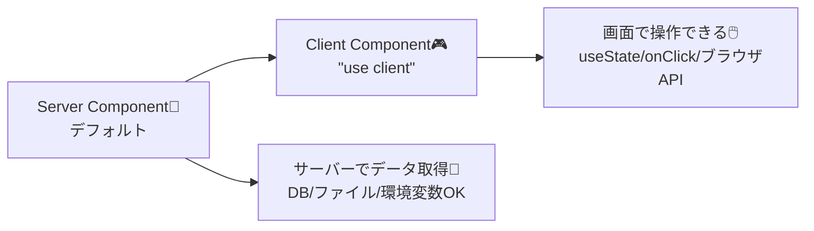
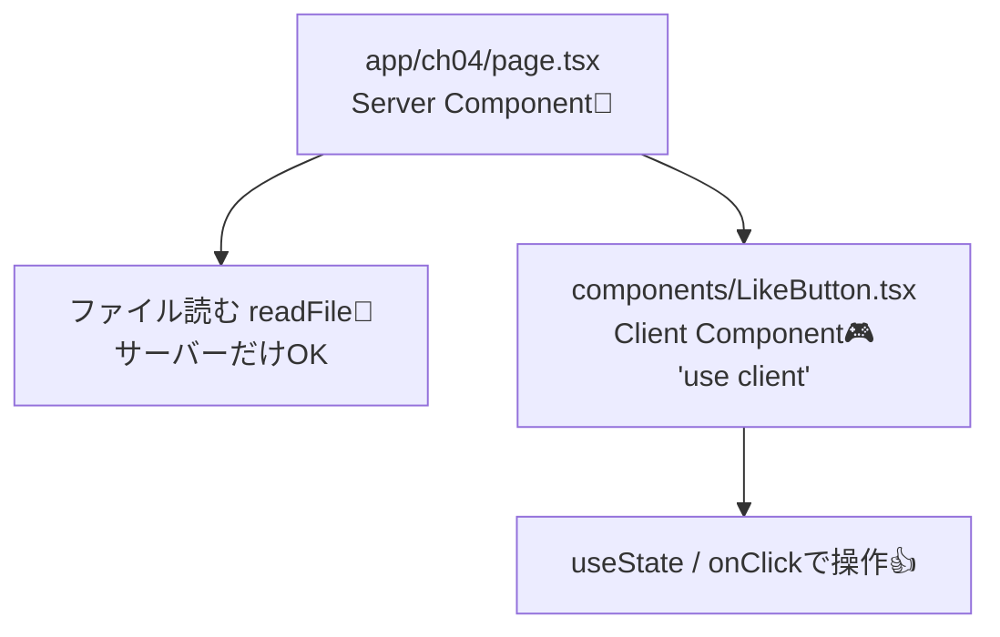

# 第4章：Server Components って何が嬉しいの？🧊

この章は「Next.jsの世界観のど真ん中」だよ〜！😆💡
ここをつかむと、後の章がスルスル進む👌🌸

---

## この章のゴール🎯

* **Server Components（サーバーで動くReact部品）**の“うれしさ”が言えるようになる🗣️✨
* **「基本はServer、必要なところだけClient」**が感覚でわかるようになる🧠🎮
* 小さいミニ実装で、**Server→Clientの組み合わせ**を体験する🧪💕

---

## まずは図でイメージ🧊➡️🎮



```mermaid
flowchart LR
  A["Server Component🧊<br/>デフォルト"] --> B["Client Component🎮<br/>#quot;use client#quot;"]
  A --> C["サーバーでデータ取得🍵<br/>DB/ファイル/環境変数OK"]
  B --> D["画面で操作できる🖱️<br/>useState/onClick/ブラウザAPI"]
```

---

## 5分でわかる！Server Componentsのうれしさ🫶✨

### 1) ブラウザに“余計なJS”を送らなくていい📦⬇️


Server Componentは **サーバーで描画して結果を送る**ので、
**その部品のJSは基本ブラウザに配られない** → 初回表示が軽くなりやすいよ〜⚡✨
Next.jsのApp Routerでは、**page/layoutはデフォルトがServer Components**だよ。([Next.js][1])

### 2) サーバーだけのものに触れる🔐🗄️


たとえば👇

* 環境変数（秘密のキー）🔑
* DB接続🗃️
* ファイル読み込み📄
  こういうのを、**UIを作りながら自然に扱える**のが強い！💪✨（もちろん秘密は画面に出しちゃダメだよ🙅‍♀️）

### 3) でも「操作」はできない（ここが分かれ目）🚦


クリックしたら増える、とか
入力しながら表示が変わる、とか
そういう **インタラクティブ**は **Client Componentの担当**🎮✨

Next.js公式も、Client Componentsが必要なのは
**state / event handlers / useEffect / ブラウザAPI**みたいな時って言ってるよ。([Next.js][1])

### 4) `"use client"`は“境界線”の合図🧱✨

Client側で動かしたいコンポーネントのファイル先頭に **`'use client'`** を書くよ✍️
しかも「全部のファイルに書く必要はない」って公式がはっきり言ってる👌
**境界になる入口のファイルだけ**でOK！([Next.js][2])


---

## 10分ハンズオン🧪：「サーバーで読んだプロフィール」＋「いいねボタン」💖

やることはこれだけ👇

* Server Componentで **ファイルを読んで表示**📄🧊
* Client Componentで **いいねをカウント**👍🎮
* Server→Clientを合体させる🧩✨

### 0) 前提（すでにプロジェクトがある想定）✅

VSCodeでプロジェクトを開いてる状態からいくよ〜🫶

---

### 1) プロフィールの元データを作る📄✨

プロジェクト直下に `data` フォルダを作って、`profile.txt` を作成！

**data/profile.txt**

```txt
こんにちは！🌸
学科：情報系📚
好き：カフェ巡り☕✨ / 旅行🧳 / コーデ👗
ひとこと：Next.jsがんばるぞ〜！🔥
```

---

### 2) Client Component（いいねボタン）を作る👍🎮

`components` フォルダを作って、`LikeButton.tsx` を作成！

**components/LikeButton.tsx**

```tsx
'use client'

import { useState } from 'react'

export function LikeButton() {
  const [count, setCount] = useState(0)

  return (
    <button
      onClick={() => setCount((c) => c + 1)}
      style={{
        padding: '10px 14px',
        borderRadius: 12,
        border: '1px solid #ddd',
        cursor: 'pointer',
        background: 'white',
      }}
    >
      👍 いいね！ <b>{count}</b>
    </button>
  )
}
```

ポイント💡

* 先頭の **`'use client'`** が超重要！([Next.js][2])
* `useState` と `onClick` は **Clientの特権**🎮✨ ([Next.js][1])

---

### 3) Server Component（ページ）を作る🧊🏠

`app/ch04/page.tsx` を作成！

**app/ch04/page.tsx**

```tsx
import { readFile } from 'node:fs/promises'
import path from 'node:path'
import { LikeButton } from '@/components/LikeButton'

export default async function Page() {
  const filePath = path.join(process.cwd(), 'data', 'profile.txt')
  const profileText = await readFile(filePath, 'utf-8')

  return (
    <main style={{ padding: 24, fontFamily: 'system-ui' }}>
      <h1 style={{ fontSize: 26, marginBottom: 12 }}>第4章：Server Components体験🧊✨</h1>

      <section
        style={{
          padding: 16,
          border: '1px solid #eee',
          borderRadius: 16,
          background: '#fafafa',
          marginBottom: 14,
          whiteSpace: 'pre-wrap',
          lineHeight: 1.7,
        }}
      >
        <h2 style={{ fontSize: 18, marginTop: 0 }}>サーバーで読んだプロフィール📄🧊</h2>
        <p style={{ marginBottom: 0 }}>{profileText}</p>
      </section>

      <section
        style={{
          display: 'flex',
          gap: 12,
          alignItems: 'center',
          padding: 16,
          border: '1px solid #eee',
          borderRadius: 16,
        }}
      >
        <LikeButton />
        <span style={{ opacity: 0.8 }}>← ここだけClientで動いてるよ🎮✨</span>
      </section>
    </main>
  )
}
```

ここがミソ〜！😆

* `readFile`（Nodeのファイル読み込み）は **サーバー側でしかできない**📄🧊
* でもページの中に `<LikeButton />` を置けば、**そこだけClientで操作できる**👍🎮

---

### 4) 動かす🚀

ターミナルで👇

```bash
npm run dev
```

ブラウザで👇へアクセス

* `http://localhost:3000/ch04` 🏃‍♀️💨

✅ 見えたら成功！

* プロフィール文章が表示される📄
* いいねボタン押すと増える👍✨

---


## ここで整理：どこがServer？どこがClient？🧠✨


```mermaid
flowchart TD
  P["app/ch04/page.tsx<br/>Server Component🧊"] --> R["ファイル読む readFile📄<br/>サーバーだけOK"]
  P --> L["components/LikeButton.tsx<br/>Client Component🎮<br/>'use client'"]
  L --> S["useState / onClickで操作👍"]
```

---

## よくあるつまずき（今のうちに回避！）🪤😵‍💫

### ① Server Componentで `useState` 使っちゃった！

👉 **その部品をClientにする**（ファイル先頭に`'use client'`）か、
👉 **操作が必要な部分だけ別コンポーネントに分ける**（おすすめ✨）

Clientが必要な条件（state / event / useEffect / ブラウザAPI）って公式も言ってるよ。([Next.js][1])

### ② `'use client'` を“全部”に付けたくなる！

気持ちはわかる😂 でもそれやると **全部がClientになって重くなりがち**💦
入口のファイルだけでOK、って公式が言ってるよ〜！([Next.js][2])

---

## 3分ふりかえり📝💗（超だいじ）

自分の言葉でこれ言えたら勝ち🏆✨

* Q1：Server Componentsの良さ、1つ言うと？🧊
  →（例：ファイルやDBを直接読める / ブラウザに余計なJSを送らない など）

* Q2：Client Componentsが必要なのはどんな時？🎮
  →（例：クリック、入力、useState、useEffect、localStorage…）

* Q3：今日作ったページで、Clientなのはどこ？🔍
  → `LikeButton` 👍✨

---

## ミニ課題（できたら天才💯✨）🧁

1. `profile.txt` の内容を好きに書き換えて、画面が変わるのを確認📄✍️
2. いいねボタンの横に「リセット」ボタンも付けてみる🔁（もちろんClient側🎮）

---

## プチ安全メモ🛡️⚠️（さらっと）

RSC（React Server Components）まわりは新しい仕組みなので、**セキュリティ更新が出たら早めに追う**の大事だよ〜！
最近もRSC関連の注意喚起が出てるから、**Next.js/Reactは最新の安定版へ**を意識すると安心💡([react.dev][3])

---

次の章（第5章）で「じゃあClient Componentsっていつ必要？」がもっとスッキリするよ🎮✨
この章で作った `ch04` ページ、残しておくと復習にめっちゃ便利☺️💖

[1]: https://nextjs.org/docs/app/getting-started/server-and-client-components "Getting Started: Server and Client Components | Next.js"
[2]: https://nextjs.org/docs/app/api-reference/directives/use-client "Directives: use client | Next.js"
[3]: https://react.dev/blog/2025/12/03/critical-security-vulnerability-in-react-server-components?utm_source=chatgpt.com "Critical Security Vulnerability in React Server Components"
