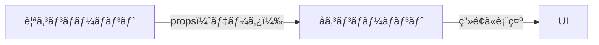

# 第39章：Propsã®å‹ï¼š`type Props = {}` ã®åŸºæœ¬ğŸ§·

ã“ã®ç« ã§ã¯ã€Œã‚³ãƒ³ãƒãƒ¼ãƒãƒ³ãƒˆã«æ¸¡ã™ãƒ‡ãƒ¼ã‚¿ï¼ˆProps）ã€ã‚’ **TypeScriptã§å®‰å…¨ã«ã™ã‚‹**方法をやるよ〜😊ğŸ€
「渡ã™å´ï¼ˆè¦ªï¼‰ã€ã¨ã€Œå—ã‘å–ã‚‹å´ï¼ˆå­ï¼‰ã€ã§ã€ã‚ºãƒ¬ãªã„よã†ã«ã™ã‚‹ã®ãŒç›®çš„ï¼ğŸ’ªâœ¨

---

## 1) Propsã£ã¦ãªã«ï¼Ÿè¶…ã–ã£ãã‚ŠğŸ©


Props（プロップス）ã¯ã€**親コンãƒãƒ¼ãƒãƒ³ãƒˆâ†’å­ã‚³ãƒ³ãƒãƒ¼ãƒãƒ³ãƒˆ**ã¸æ¸¡ã™ã€Œå¼•ã継ãメモã€ã¿ãŸã„ãªã‚‚ã®ã ã‚ˆğŸ“✨
å­ã¯ãれをå—ã‘å–ã£ã¦è¡¨ç¤ºã‚’変ãˆãŸã‚Šã™ã‚‹ã‚ˆã€œğŸ¨


```mermaid
flowchart LR
  P["親コンãƒãƒ¼ãƒãƒ³ãƒˆ"] -->|"props（データ）"| C["å­ã‚³ãƒ³ãƒãƒ¼ãƒãƒ³ãƒˆ"]
  C -->|"ç”»é¢ã«è¡¨ç¤º"| UI["UI"]
```

---

## 2) 基本形：`type Props = { ... }` を作る🧩


一番よã使ã†å½¢ã¯ã“ã‚Œï¼ğŸ‘‡âœ¨

```tsx
type Props = {
  name: string;
};

export function Greeting(props: Props) {
  return <p>ã“ã‚“ã«ã¡ã¯ã€{props.name}ã•ã‚“🌸</p>;
}
```

ã§ã‚‚実務ã§ã¯ **分割代入（destructuring）**ã§æ›¸ãã“ã¨ãŒå¤šã„よ〜😺

```tsx
type Props = {
  name: string;
};

export function Greeting({ name }: Props) {
  return <p>ã“ã‚“ã«ã¡ã¯ã€{name}ã•ã‚“🌸</p>;
}
```

✅ ã“ã‚Œã§ã€Œ`name` 㯠string å¿…é ˆï¼ã€ã£ã¦ TypeScript ãŒè¦‹å¼µã£ã¦ãれる👀🛡ï¸

---

## 3) 使ã†å´ï¼ˆè¦ªï¼‰ã§ã€Œå‹ã®æ©æµã€ã‚’æ„Ÿã˜ã‚‹ğŸ


親ã§ã“ã†ã‚„ã£ã¦ä½¿ã†ã¨â€¦

```tsx
import { Greeting } from "@/components/Greeting";

export default function Page() {
  return (
    <main>
      <Greeting name="ã•ãら" />
    </main>
  );
}
```

ã‚‚ã—é–“é•ãˆã¦ã“ã†æ›¸ã„ãŸã‚‰â€¦ğŸ‘‡

```tsx
<Greeting name={123} />
```

✅ TypeScriptãŒã€Œãã‚Œé•ã†ã‚ˆã€œï¼ã€ã£ã¦æ­¢ã‚ã¦ãれる😆🧯
（`name` 㯠`string` ã£ã¦æ±ºã‚ãŸã‹ã‚‰ã­ï¼ï¼‰

---

## 4) よã使ã†Propsã®å‹ãƒ†ã‚¯3ã¤ğŸ§ âœ¨

### (A) ä»»æ„（オプショナル）ã«ã™ã‚‹ï¼š`?` 🌷


「渡ã—ã¦ã‚‚ã„ã„ã—ã€æ¸¡ã•ãªãã¦ã‚‚ã„ã„ã€ã‚„ã¤ï¼

```tsx
type Props = {
  name: string;
  subtitle?: string;
};

export function Greeting({ name, subtitle }: Props) {
  return (
    <div>
      <p>ã“ã‚“ã«ã¡ã¯ã€{name}ã•ã‚“🌸</p>
      {subtitle && <p>— {subtitle} —</p>}
    </div>
  );
}
```

---

### (B) é¸ã¹ã‚‹å€¤ã«ã™ã‚‹ï¼ˆãƒ¦ãƒ‹ã‚ªãƒ³ï¼‰ï¼š`"sm" | "md" | "lg"` 👗


「サイズã¯ã“ã®3ã¤ã ã‘ï¼ã€ã¿ãŸã„ã«ç¸›ã‚Œã‚‹âœ¨

```tsx
type Props = {
  label: string;
  size: "sm" | "md" | "lg";
};

export function Badge({ label, size }: Props) {
  return <span data-size={size}>{label}</span>;
}
```

ã“れ㧠`size="big"` ã¨ã‹ã¯å¼¾ã‘るよ〜💥😆

---

### (C) デフォルト値を入れる（åˆå¿ƒè€…ã«è¶…ãŠã™ã™ã‚）ğŸ€


propsãŒä»»æ„ã®ã¨ãã€è¡¨ç¤ºãŒå®‰å®šã™ã‚‹ğŸ˜Šâœ¨

```tsx
type Props = {
  name: string;
  emoji?: string;
};

export function Greeting({ name, emoji = "🌸" }: Props) {
  return <p>{emoji} ã“ã‚“ã«ã¡ã¯ã€{name}ã•ã‚“</p>;
}
```

---

## 5) ã‚ã‚ŠãŒã¡ãƒŸã‚¹é›†ï¼ˆã“ã“ã ã‘覚ãˆã‚Œã°OK）🧯


* `type Props` ã«æ›¸ã„ãŸåå‰ã¨ã€å®Ÿéš›ã«æ¸¡ã™åå‰ãŒé•ã†ğŸ˜µâ€ğŸ’«
  例：`type Props = { userName: string }` ãªã®ã« `<Comp name="..." />` ã¿ãŸã„ãªã‚ºãƒ¬
* å¿…é ˆãªã®ã«æ¸¡ã—忘れãŸğŸ™ˆ
  例：`name: string` ãªã®ã« `<Greeting />`
* ãªã‚“ã§ã‚‚ `any` ã«ã—ã¦ã—ã¾ã†ï¼ˆå‹ãƒã‚§ãƒƒã‚¯ãŒæ¶ˆãˆã‚‹ï¼‰ğŸ«¥
  👉 å›°ã£ãŸã‚‰ã¾ãš `string` / `number` / `boolean` / `("a" | "b")` ã‹ã‚‰ã§OKï¼

---

## 6) ミニ練習（5分）â±ï¸ğŸ€

### ãŠé¡ŒğŸ¯

`ProfileCard` を作ã£ã¦ã€Propsã«å‹ã‚’付ã‘よã†ï¼

**æ¡ä»¶**

* `name`：必須（string）
* `faculty`：必須（string）
* `grade`：任æ„（1〜4想定ã ã‘ã©ã€ã¾ãšã¯ number ã§OK）
* `emoji`：任æ„（デフォルト "ğŸ“"）

---

### 例（解答）✅

```tsx
type Props = {
  name: string;
  faculty: string;
  grade?: number;
  emoji?: string;
};

export function ProfileCard({ name, faculty, grade, emoji = "ğŸ“" }: Props) {
  return (
    <section>
      <h2>{emoji} {name}</h2>
      <p>学部：{faculty}</p>
      {grade && <p>学年：{grade}年</p>}
    </section>
  );
}
```

---

## ã“ã®ç« ã®ã‚´ãƒ¼ãƒ«é”æˆãƒã‚§ãƒƒã‚¯âœ…✨

* `type Props = { ... }` を書ã‘る😊
* 必須・任æ„（`?`）を使ã„分ã‘ã§ãる🌷
* `"sm" | "md" | "lg"` ã¿ãŸã„ãªã€Œé¸ã¹ã‚‹å€¤ã€ã‚‚作れる👗
* デフォルト値ã§UIを安定ã•ã›ã‚‰ã‚Œã‚‹ğŸ€

次ã®ç« ã§ã¯ã€Propsã®ä¸­ã§ã‚‚特別æ ã® **`children`** ã‚’ãã‚Œã„ã«å‹ä»˜ã‘ã—ã¦ã„ãよ〜🧸✨
