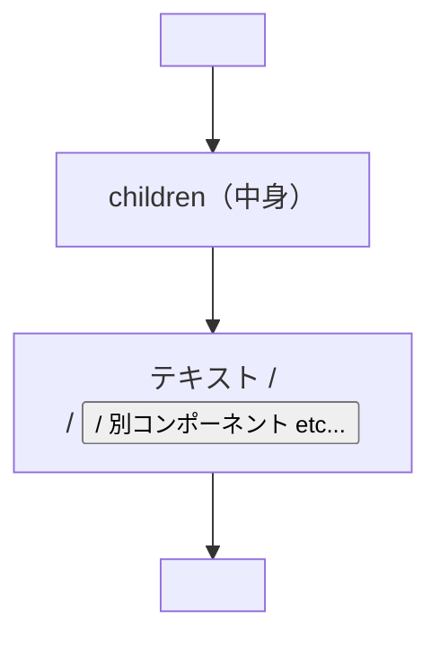

# 第40章：子要素：`children: React.ReactNode` 🧸

この章では「コンポーネントの中に、別のUIを入れ子で入れられる」しくみ＝**children** をマスターするよ〜！🎁💖
Next.js（App Router）だと `layout.tsx` で毎日レベルで出てくるから、ここでしっかり慣れちゃおう！🧠✨

---

## 1) `children` ってなに？🧸

**children = コンポーネントの“中身”**だよ！📦➡️✨
たとえばこう👇

* `<Card>ここが children</Card>`
* `<Layout><Page /></Layout>`

つまり **「枠（コンポーネント）」の中に「内容（children）」を入れる**感じ🥰

---

## 2) 図でイメージしよっか 🍰



```mermaid
flowchart TD
  A["<Card>"] --> B["children（中身）"]
  B --> C["テキスト / <p> / <button> / 別コンポーネント etc..."]
  C --> D["</Card>"]
```

`Card` はお皿🍽️、`children` はケーキ🎂みたいなイメージでOK！✨

---

## 3) 型はこれ！ `React.ReactNode` 🧷

`children` の型は基本これでOK👇

```tsx
type Props = {
  children: React.ReactNode;
};
```

### `React.ReactNode` って何が入るの？🤔


だいたいこれ全部入るよ〜！🙆‍♀️✨

* 文字（"hello"）
* JSX（`<div>...</div>`）
* コンポーネント（`<Button />`）
* 配列（複数の要素）
* `null`（何も出さない）

---

## 4) Next.js で一番よく見る：`layout.tsx` の `children` 🏠


App Router のレイアウトは「外枠」で、ページの中身が `children` として入ってくるよ〜！🧱✨

```tsx
// app/layout.tsx
export default function RootLayout({
  children,
}: {
  children: React.ReactNode;
}) {
  return (
    <html lang="ja">
      <body>
        <header style={{ padding: 16, borderBottom: "1px solid #ddd" }}>
          ヘッダーだよ〜🌸
        </header>

        <main style={{ padding: 16 }}>{children}</main>

        <footer style={{ padding: 16, borderTop: "1px solid #ddd" }}>
          フッターだよ〜🫶
        </footer>
      </body>
    </html>
  );
}
```

この `{children}` の場所に、各ページ（`app/page.tsx` とか）の内容がスポッて入るよ！✨

---

## 5) 自分で「枠コンポーネント」を作ってみよう！🎀（超重要）

ここからが本番〜！😆✨
`Card` みたいな「囲うだけの部品」を作れるようになると、UIが一気に作りやすくなるよ🧱💕

### ✅ ① `components/Card.tsx` を作る


```tsx
// components/Card.tsx
type Props = {
  title?: string;
  children: React.ReactNode;
};

export function Card({ title, children }: Props) {
  return (
    <section
      style={{
        border: "1px solid #ddd",
        borderRadius: 12,
        padding: 16,
        background: "#fff",
      }}
    >
      {title ? <h2 style={{ marginTop: 0 }}>{title}</h2> : null}
      <div>{children}</div>
    </section>
  );
}
```

### ✅ ② `app/page.tsx` で使う

```tsx
// app/page.tsx
import { Card } from "@/components/Card";

export default function Page() {
  return (
    <div style={{ display: "grid", gap: 12 }}>
      <Card title="自己紹介カード🌷">
        <p>こんにちは！今日は children を覚えたよ〜🧸✨</p>
        <button>押してもいいよ🥳</button>
      </Card>

      <Card title="もう1枚📌">
        <ul>
          <li>children は「中身」🎁</li>
          <li>枠はコンポーネント🧱</li>
          <li>型は React.ReactNode 🧷</li>
        </ul>
      </Card>
    </div>
  );
}
```

---

## 6) よくあるハマりポイント ⚠️😵‍💫

### ❌ `{children}` を書き忘れる


枠だけ出て「中身が表示されない」あるある！😂

* ちゃんと `<div>{children}</div>` があるかチェック✅

### ❌ `children: string` とかにしちゃう


文字しか入らなくなって、`<p>` とか入れると詰むよ〜🫠
基本は `React.ReactNode` でOK！🙆‍♀️

---

## 7) ミニ練習問題（5分）⏱️💪


### 🎯 お題：`Panel` を作ろう！

* `components/Panel.tsx` を作る
* 背景をうすい色にして、角丸にする
* `children` を表示する

イメージ👇

```tsx
<Panel>
  <p>ここが中身だよ〜✨</p>
</Panel>
```

---

## 8) 今日のまとめ 🌟

* `children` は **コンポーネントの中身** 🧸🎁
* 型は基本 **`children: React.ReactNode`** 🧷
* Next.js の `layout.tsx` は **children の代表選手** 🏠✨
* 「枠コンポーネント」を作れると UI が一気に楽になる 🎀💖

---

次の章（第41章）では「コンポーネントってどこに置くのが正解？」っていう整理術に入るよ〜！🗂️✨
