# 第66章：Intercepting Routes の考え方（モーダル遷移）🪄

## この章でできるようになること🎯

* 一覧ページの上に、**詳細をモーダルで重ねて表示**できるようになる✨
* しかも **URLはちゃんと詳細URLになる**（共有できる）📎
* でも **直URLアクセス / リロード時は、ちゃんと詳細ページとして表示**できる🔁

この仕組みが **Intercepting Routes** だよ〜🪄（「別ルートの中身を、今のレイアウトの上で表示する」感じ） ([Next.js][1])

---

## ざっくりイメージ図🧠✨（ソフト遷移 vs ハード遷移）


* **ソフト遷移**：アプリ内の `<Link>` クリック（Nextが“いい感じ”に部分更新してくれる）🧩
* **ハード遷移**：ブラウザ更新 / 直URL入力（最初からページを丸ごと読み込み）🔄

```mermaid
flowchart TD
  A["/photos（一覧）を見てる📷"] -->|"Linkでクリック（ソフト遷移）🧸"| B["URLは /photos/1 になる🔗"]
  B --> C["でも画面は一覧のまま！<br>@modal に詳細を重ねて表示🪟✨"]
  D["/photos/1 を直で開く<br>or リロード（ハード遷移）🔄"] --> E["ふつうに /photos/[#quot;id#quot;] の詳細ページを表示📄"]
```




この「ソフト遷移のときだけ“横取りしてモーダル表示”」が Intercepting Routes のおいしいところだよ〜😆 ([Next.js][1])

---

## 重要ルール（ここだけ覚えればOK）✅

### ① どのルートを“横取り”するかは、フォルダ名で決まる📁


Intercepting Routes の目印はこれ👇（ルート**セグメント**基準だよ〜） ([Next.js][1])

* `(.)`：同じ階層のセグメントを横取り
* `(..)`：1つ上の階層のセグメントを横取り
* `(..)(..)`：2つ上
* `(...)`：`app` 直下（ルート）から

> そして大事ポイント：`@modal` みたいな **スロットはURLのセグメントじゃない**よ！ ([Next.js][1])

### ② モーダルは Parallel Routes（@modal）とセット運用が王道🪟

`layout.tsx` で `{children}` と `{modal}` を並べて描画するやつね✨ ([Next.js][2])

---

## ハンズオン：写真ギャラリーで「詳細＝モーダル」を作る📷🪄

### 完成フォルダ構成（これを作る！）🧱

```txt
app/
  photos/
    layout.tsx
    page.tsx
    [id]/
      page.tsx
    @modal/
      default.tsx
      (.)[id]/
        page.tsx
components/
  Modal.tsx
```

---

## 1) `app/photos/layout.tsx`（モーダル枠を置く）🧱🪟


`@modal` を使うには **layoutで受け取って描画**するよ〜！（pageじゃなくて layout！） ([Next.js][2])

```tsx
// app/photos/layout.tsx
export default function PhotosLayout({
  children,
  modal,
}: {
  children: React.ReactNode
  modal: React.ReactNode
}) {
  return (
    <>
      {children}
      {modal}
    </>
  )
}
```

---

## 2) `app/photos/page.tsx`（一覧ページ）📷📚


クリックしたら `/photos/1` に行くけど、**ソフト遷移だとモーダルになる**よ✨
スクロール位置が気になるときは `scroll={false}` が便利🫶

```tsx
// app/photos/page.tsx
import Link from 'next/link'

const photos = [
  { id: '1', title: '学食のカレー🍛' },
  { id: '2', title: '図書館の窓際📚' },
  { id: '3', title: 'キャンパスの夕焼け🌇' },
]

export default function PhotosPage() {
  return (
    <main style={{ padding: 16 }}>
      <h1>写真一覧📷</h1>

      <ul style={{ lineHeight: 2 }}>
        {photos.map((p) => (
          <li key={p.id}>
            <Link href={`/photos/${p.id}`} scroll={false}>
              {p.title}（開く👉）
            </Link>
          </li>
        ))}
      </ul>

      <p style={{ marginTop: 16, opacity: 0.7 }}>
        ここからクリックすると「モーダルで開く」動きになるよ🪄
      </p>
    </main>
  )
}
```

---

## 3) `app/photos/[id]/page.tsx`（直アクセス時の“普通の詳細ページ”）📄✨

これは **ハード遷移（直URL/リロード）用の本体**だよ〜🔄

```tsx
// app/photos/[id]/page.tsx
export default async function PhotoDetailPage({
  params,
}: {
  params: Promise<{ id: string }>
}) {
  const { id } = await params

  return (
    <main style={{ padding: 16 }}>
      <h1>写真詳細（ページ表示）📄</h1>
      <p>id: {id}</p>
      <p style={{ marginTop: 12 }}>
        これは「直URLアクセス / リロード」したときに出る通常ページだよ🔄
      </p>
    </main>
  )
}
```

---

## 4) `app/photos/@modal/default.tsx`（モーダルが無い時は何も出さない）🫥


`default.tsx` は **スロットにマッチしないときの保険**！
これが無いと、リロード時に困ることがあるよ〜⚠️ ([Next.js][2])

```tsx
// app/photos/@modal/default.tsx
export default function Default() {
  return null
}
```

---

## 5) `components/Modal.tsx`（モーダルの見た目＋閉じる）🪟🧸


閉じるは `router.back()` が気持ちいい✨（戻るボタンと同じ動きになる） ([Next.js][2])

```tsx
// components/Modal.tsx
'use client'

import { useRouter } from 'next/navigation'

export function Modal({ children }: { children: React.ReactNode }) {
  const router = useRouter()

  return (
    <div
      role="dialog"
      aria-modal="true"
      onClick={() => router.back()}
      style={{
        position: 'fixed',
        inset: 0,
        background: 'rgba(0,0,0,0.35)',
        display: 'grid',
        placeItems: 'center',
        padding: 16,
      }}
    >
      <div
        onClick={(e) => e.stopPropagation()}
        style={{
          width: 'min(520px, 100%)',
          background: 'white',
          borderRadius: 16,
          padding: 16,
          boxShadow: '0 10px 30px rgba(0,0,0,0.2)',
        }}
      >
        <button
          onClick={() => router.back()}
          style={{
            border: 'none',
            background: '#eee',
            padding: '8px 12px',
            borderRadius: 12,
            cursor: 'pointer',
          }}
        >
          閉じる✖️
        </button>

        <div style={{ marginTop: 12 }}>{children}</div>
      </div>
    </div>
  )
}
```

---

## 6) `app/photos/@modal/(.)[id]/page.tsx`（ここが主役：横取りルート！）🪄🔥


`(.)` で **同じ階層の `[id]` を横取り**して、`@modal` に表示するよ✨ ([Next.js][1])

```tsx
// app/photos/@modal/(.)[id]/page.tsx
import { Modal } from '@/components/Modal'

export default async function PhotoDetailModalPage({
  params,
}: {
  params: Promise<{ id: string }>
}) {
  const { id } = await params

  return (
    <Modal>
      <h2>写真詳細（モーダル表示）🪟</h2>
      <p>id: {id}</p>
      <p style={{ marginTop: 12, opacity: 0.75 }}>
        一覧の上に重なって出てるはず！✨
      </p>
    </Modal>
  )
}
```

---

## 動作チェック（ここまでできたら勝ち🎉）✅

1. `npm run dev` で起動🚀
2. `/photos` を開く📷
3. 一覧のリンクをクリック 👉 **モーダルで出る**（URLは `/photos/1`）🪄
4. ブラウザ更新 🔄 👉 **モーダルじゃなく通常ページになる**📄
5. モーダルの「閉じる✖️」 or 背景クリック 👉 **元の一覧に戻る**🫶

---

## よくあるハマり（先に潰す😇）🧯

* `@modal` を `page.tsx` に置いても動かない 👉 **layout.tsx に置く！** ([Next.js][2])
* `default.tsx` を作ってなくてリロード時に変になる 👉 **default.tsx は必須寄り！** ([Next.js][2])
* モーダル閉じるのにURLいじって迷子 👉 まずは **router.back()** が安定✨ ([Next.js][2])

---

この章はここまでだよ〜！😆🪄
「一覧→詳細をモーダル、直アクセス→詳細ページ」っていう“それっぽいUI”が作れるようになったね📷✨

[1]: https://nextjs.org/docs/app/api-reference/file-conventions/intercepting-routes "File-system conventions: Intercepting Routes | Next.js"
[2]: https://nextjs.org/docs/app/api-reference/file-conventions/parallel-routes "File-system conventions: Parallel Routes | Next.js"
