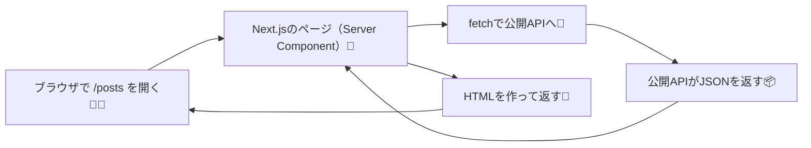

# 第82章：練習：公開APIから一覧を取って表示する📥

この章では、**公開API（外部の無料API）からデータ一覧を取って、Next.jsのページに表示**してみるよ〜！😊🌸
ポイントは「**Server Componentで `fetch` するのが基本**」って感覚をつかむことだよ🧊🍵

---

## 1) ゴール🎯


* `/posts` にアクセスしたら、**記事っぽい一覧**が表示される📃✨
* データは **公開API** から取得する🌍📥

---

## 2) まず作るもの（完成イメージ）🧠✨


```mermaid
flowchart LR
  U["ブラウザで /posts を開く🧑‍💻"] --> N["Next.jsのページ（Server Component）🧊"]
  N --> F["fetchで公開APIへ📡"]
  F --> A["公開APIがJSONを返す📦"]
  A --> N
  N --> H["HTMLを作って返す🧾"]
  H --> U
```


---

## 3) ルートを作ろう：`app/posts/page.tsx` 🛣️📄


### ✅ 作成するファイル

* `app/posts/page.tsx`

中身はこれ👇（コピペOKだよ！）💖

```tsx
// app/posts/page.tsx
import Link from "next/link";

type Post = {
  userId: number;
  id: number;
  title: string;
  body: string;
};

async function getPosts(): Promise<Post[]> {
  // 無料で使えるダミー記事API（よく教材で使われるやつだよ📦）
  const url = "https://jsonplaceholder.typicode.com/posts?_limit=10";

  const res = await fetch(url);

  // 失敗してたら、エラーにして気づけるようにする🧯
  if (!res.ok) {
    throw new Error("投稿一覧の取得に失敗しました🥲");
  }

  const data: Post[] = await res.json();
  return data;
}

export default async function PostsPage() {
  const posts = await getPosts();

  return (
    <main style={{ padding: 24 }}>
      <h1 style={{ fontSize: 28, fontWeight: 700 }}>投稿一覧📥✨</h1>
      <p style={{ marginTop: 8, opacity: 0.8 }}>
        公開APIから取ってきたデータを表示してるよ〜😊🌸
      </p>

      <div style={{ marginTop: 16 }}>
        <Link href="/" style={{ textDecoration: "underline" }}>
          ← トップへ戻る🏠
        </Link>
      </div>

      <ul style={{ marginTop: 20, display: "grid", gap: 12, padding: 0, listStyle: "none" }}>
        {posts.map((post) => (
          <li
            key={post.id}
            style={{
              border: "1px solid #ddd",
              borderRadius: 12,
              padding: 16,
              background: "white",
            }}
          >
            <div style={{ fontSize: 12, opacity: 0.7 }}>ID: {post.id} 🆔</div>
            <h2 style={{ marginTop: 6, fontSize: 18 }}>{post.title} 📝</h2>
            <p style={{ marginTop: 8, lineHeight: 1.6 }}>{post.body}</p>
          </li>
        ))}
      </ul>
    </main>
  );
}
```

---

## 4) トップから `/posts` に行けるようにしよう🏠➡️📥


`app/page.tsx` にリンクを1個置くと親切だよ〜😊🔗
（すでにトップが別内容なら、リンクだけ追加してね）

例👇

```tsx
// app/page.tsx
import Link from "next/link";

export default function Home() {
  return (
    <main style={{ padding: 24 }}>
      <h1 style={{ fontSize: 28, fontWeight: 700 }}>トップ🏠</h1>

      <p style={{ marginTop: 12 }}>
        <Link href="/posts" style={{ textDecoration: "underline" }}>
          投稿一覧へ行く📥✨
        </Link>
      </p>
    </main>
  );
}
```

---

## 5) 動かして確認しよう🚀✨

ターミナルで👇（プロジェクト直下でね！）

```bash
npm run dev
```

ブラウザで👇を開く✅

* `http://localhost:3000/posts`

記事っぽいカードが10個出たら成功だよ〜！🎉🥳✨

---

## 6) よくあるつまずきポイント集🪤🧯

### ❓ なんか表示されない🥲

* コンソール（ターミナル）にエラー出てないか見てね👀
* URLのコピペミスが多いよ〜📎💦

### ❓ `fetch` ってどこで動いてるの？


* ここでは **Server Component** だから、`fetch` は基本 **サーバー側**で動くよ🧊🍵
  （だから、ブラウザのCORSに悩みにくいのが嬉しいポイント✨）

### ❓ 開発中は毎回取りに行ってるっぽい？

* うんうん！開発モードは分かりやすさ優先で、挙動が本番と違うことあるよ😊
  キャッシュの細かいコントロールはこの後の章で気持ちよく整理できるよ🧠🧊

---

## 7) ミニ課題（できたら最高🌟）🎒


* 表示件数を変えてみよう（`_limit=5` とか）✂️
* `body` を短くして「…」にしてみよう（見た目がそれっぽくなる😊）✨

---

次の **第83章** では、ここで出てきた **IDを使って詳細ページで取得**するよ〜！🔎📄✨
