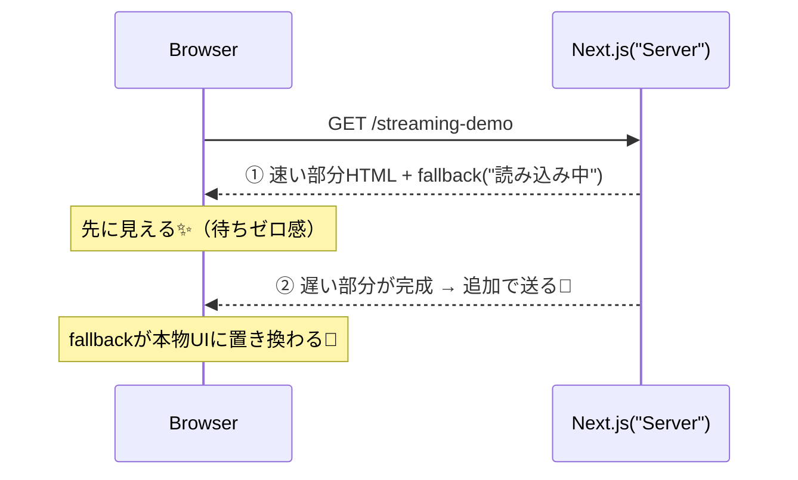

# 第86章：Streamingの“うれしさ”を体験する🌊

この章では「ページ全部が完成するまで待つ…😵」じゃなくて、**できたところから先に見せる**（＝Streaming）を、実際に体験しちゃうよ〜！🥳
Next.js（App Router）は **Suspense** と組み合わせると、**遅いパーツだけ後から差し込み**できるんだ〜！🌊 ([Next.js][1])

---

## 今日のゴール🎯💖

* ✅ **Streamingって何が嬉しいの？**を体感する
* ✅ **Suspenseで「遅い部品だけ後から表示」**を作れるようになる
* ✅ 「あ、これなら待ち時間イライラ減る😆」ってなる

---

## Streamingってなに？🌊（超ざっくり）


普通の表示だと、遅い処理（APIとかDBとか）があると **全部そろうまで画面が出ない**ことがあるよね🥲
でもStreamingだと…

* 🟢 **速い部分（ヘッダーとか説明とか）** → 先に表示✨
* 🟠 **遅い部分（ランキングとかおすすめとか）** → 後から到着して差し替え🌊

Suspenseは「ここはあとでOK！」っていう**境界線**を作る感じだよ〜🫧 ([React][2])


---

## 図でイメージ🌈（Streamingの流れ）



```mermaid
sequenceDiagram
  participant B as Browser
  participant S as Next.js("Server")
  B->>S: GET /streaming-demo
  S-->>B: ① 速い部分HTML + fallback("読み込み中")
  Note over B: 先に見える✨（待ちゼロ感）
  S-->>B: ② 遅い部分が完成 → 追加で送る🌊
  Note over B: fallbackが本物UIに置き換わる🔁
```

---

## ハンズオン🛠️：遅いランキングだけ「あとから出す」🌊📈

### 1) ルートを作る📁✨

`app/streaming-demo/` を作って、まずこの2ファイルを用意してね👇

* `app/streaming-demo/page.tsx`
* `app/streaming-demo/SlowRanking.tsx`

---

### 2) `page.tsx`（速い部分＋Suspense）を書く🏠🫧


```tsx
// app/streaming-demo/page.tsx
import { Suspense } from "react";
import SlowRanking from "./SlowRanking";

function Card({
  title,
  children,
}: {
  title: string;
  children: React.ReactNode;
}) {
  return (
    <section
      style={{
        border: "1px solid #ddd",
        borderRadius: 12,
        padding: 16,
        marginTop: 12,
      }}
    >
      <h2 style={{ margin: 0, fontSize: 18 }}>{title}</h2>
      <div style={{ marginTop: 10 }}>{children}</div>
    </section>
  );
}

export default function Page() {
  return (
    <main style={{ padding: 24, fontFamily: "system-ui, sans-serif" }}>
      <h1 style={{ margin: 0 }}>🌊 Streaming 体験ページ</h1>
      <p style={{ marginTop: 8 }}>
        まずは上の部分がすぐ出て、ランキングだけ後から出るよ〜😆✨
      </p>

      <Card title="🍙 今日のおすすめ（速い）">
        <ul style={{ margin: 0, paddingLeft: 18 }}>
          <li>塩むすび</li>
          <li>からあげ</li>
          <li>味噌汁</li>
        </ul>
      </Card>

      {/* 🌊 ここからがStreamingの主役！ */}
      <Suspense
        fallback={
          <Card title="📈 人気ランキング（読み込み中…）">
            <p style={{ margin: 0 }}>⏳ ただいま集計中だよ〜…</p>
          </Card>
        }
      >
        <SlowRanking />
      </Suspense>

      <p style={{ marginTop: 18, opacity: 0.75 }}>
        👉 ポイント：fallback（読み込み中）を先に表示しておいて、完成したら差し替える🌊
      </p>
    </main>
  );
}
```

---

### 3) `SlowRanking.tsx`（わざと遅い部品）を書く🐢💤


```tsx
// app/streaming-demo/SlowRanking.tsx
function delay(ms: number) {
  return new Promise<void>((resolve) => setTimeout(resolve, ms));
}

export default async function SlowRanking() {
  // わざと遅くする（3秒）
  await delay(3000);

  const ranking = [
    { name: "チキン南蛮", votes: 128 },
    { name: "オムライス", votes: 121 },
    { name: "カレー", votes: 119 },
  ];

  return (
    <section
      style={{
        border: "1px solid #ddd",
        borderRadius: 12,
        padding: 16,
        marginTop: 12,
      }}
    >
      <h2 style={{ margin: 0, fontSize: 18 }}>📈 人気ランキング（遅い）</h2>
      <ol style={{ marginTop: 10, marginBottom: 0, paddingLeft: 18 }}>
        {ranking.map((item) => (
          <li key={item.name}>
            {item.name}（{item.votes}票）✨
          </li>
        ))}
      </ol>
      <p style={{ marginTop: 10, opacity: 0.75 }}>
        ✅ ここは3秒後に“後から”届いて表示されるよ〜🌊
      </p>
    </section>
  );
}
```

---

### 4) 動かして体験する🚀😆

ターミナルで👇

```bash
npm run dev
```

そしてブラウザで👇にアクセス🌈
`http://localhost:3000/streaming-demo`

**見え方：**

* 最初に「Streaming体験ページ」「今日のおすすめ」がすぐ表示✨
* 「人気ランキング（読み込み中…）」が出る⏳
* 3秒後にランキングが **スッ** と表示されて差し替わる🌊😆

これが「Streamingのうれしさ」だよ〜！🥳 ([Next.js][1])

---

## うれしさポイント3つ💖


* 🏎️ **体感が速い**：全部待たなくていい
* 🧩 **遅いところだけ隔離できる**：ページ全体が巻き込まれない
* 🫧 **ローディングUIを狙って置ける**：ユーザーが安心する

Suspenseは「遅い部品のための待ち受け席」みたいな感じだね🪑✨ ([React][2])

---

## よくあるハマりどころ🪤😵‍💫（ここだけ注意！）

* 😿 **fallbackが出ない**
  → `<SlowRanking />` を **`<Suspense>`で包んでるか**チェック！
* 🧨 **遅いコンポーネントに `"use client"` を付けちゃう**
  → それだと「サーバーで待って後から差し込む」形が崩れやすいよ（まずはServerのままでOK）🧊
* 🌀 **開発モードだと挙動が分かりにくい時がある**
  → その場合は `npm run build` → `npm start` で試すと体感しやすいことがあるよ〜🔍✨（環境差はある）

---

## ミニ課題🎓✨（10分でOK）

できたら超つよい💪💕

* ⏱️ `delay(3000)` を `delay(6000)` にして、待ち時間を伸ばしてみよう
* 🧩 `SlowRanking` をもう1個作って、**Suspenseを2つ**にしてみよう
  → 「ランキングAは先に来た！ランキングBはまだ！」みたいに分かれて表示されたら成功🌊✨

---

ここまでで、第86章はクリア🎉😆
「待ち時間＝真っ白」じゃなくて、**“見せながら待つ”**ができるのがStreamingの強みだよ〜🌊💖

[1]: https://nextjs.org/docs/app/api-reference/file-conventions/loading?utm_source=chatgpt.com "File-system conventions: loading.js"
[2]: https://react.dev/reference/react/Suspense?utm_source=chatgpt.com "<Suspense> – React"
