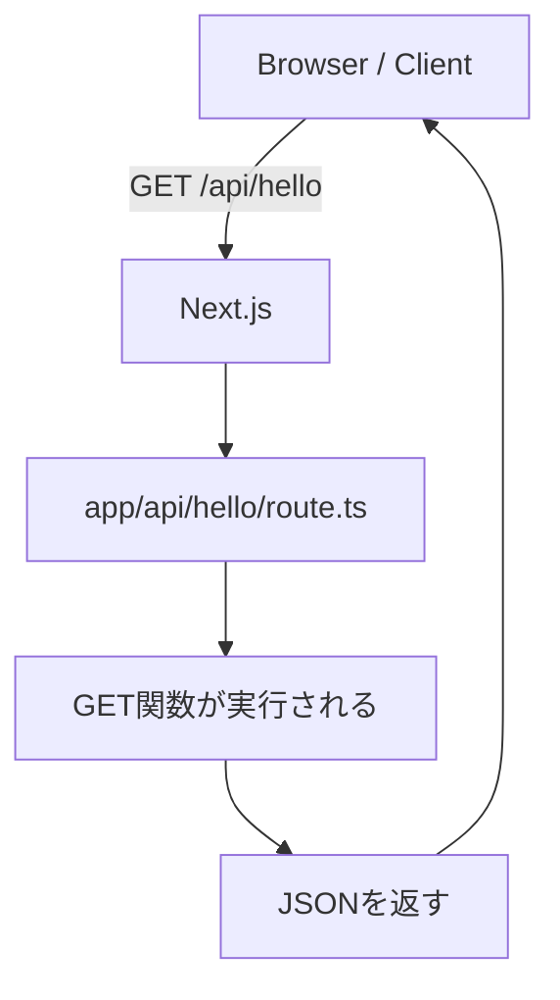

# 第106章：`app/api/xxx/route.ts` の基本🗂️

この章では「Next.jsのアプリの中に API を生やす」超基本をやるよ〜！🧪💕

---

## 1) Route Handler ってなに？🧠💡

**Route Handler** は、Next.js の **`app/api/.../route.ts`** に置くと作れる「アプリ内API」だよ！

* ブラウザやアプリから `fetch` で叩ける📡
* サーバー側で動く（＝秘密情報も扱いやすい）🔐
* ファイルの置き場所がそのまま URL になる🚪

---

## 2) ルールはこれだけ覚えればOK✅🗂️

### ✅ ルール①：場所で URL が決まる


* `app/api/hello/route.ts` → `/api/hello` になる✨

### ✅ ルール②：ファイル名は **`route.ts`** 固定


* `route.ts` じゃないと Route Handler にならないよ🙅‍♀️

### ✅ ルール③：HTTPメソッドは “関数を export” する


* `export async function GET()` を書けば GET に反応するよ📥📤

---

## 3) フォルダ構成イメージ🌳✨


```txt
my-next-app/
  app/
    api/
      hello/
        route.ts   ← これが /api/hello
    page.tsx
```

---

## 4) まずは作ってみよう！ `/api/hello` を作る🎯🧸

### Step 1：ファイルを作る🛠️


`app/api/hello/route.ts` を作成して、これを書いてね👇

```ts
import { NextResponse } from "next/server";

export async function GET() {
  return NextResponse.json({
    message: "Hello API! 🎉",
    time: new Date().toISOString(),
  });
}
```

### Step 2：開発サーバー起動🚀


```bash
npm run dev
```

### Step 3：ブラウザでアクセス🌈


ブラウザでここへ👇
`http://localhost:3000/api/hello`

JSON が出たら成功〜！🎊✨

---

## 5) どういう流れで動いてるの？（図解）📨➡️🧠




---

## 6) よくある「つまずき」あるある🫠🧯


### ❓ 404になる…

* `app/api/hello/route.ts` になってる？（`api` の下だよ！）🗂️
* ファイル名が **`route.ts`** になってる？（`routes.ts` とかダメ🙅‍♀️）
* 途中でフォルダ名を変えたなら、開発サーバー再起動すると直ることある🔁

### ❓ `page.tsx` を置いちゃった…

* `app/api/...` は「画面」じゃなくて「API」ゾーンだよ！
  `page.tsx` じゃなくて **`route.ts`** を置こう😊

---

## 7) まとめ🌟（ここだけ覚えたら勝ち！）🏆💕

* APIは **`app/api/○○/route.ts`** に置く🗂️
* そのまま **`/api/○○`** になる🚪
* `export async function GET()` みたいに **メソッド名で書く**📩
* 返すのは JSON でもテキストでもOK（まずは JSON が楽）✨

次の章では、GETでちゃんと「JSONを返す形」をもう少し気持ちよく整えていけるよ〜！📤😊
