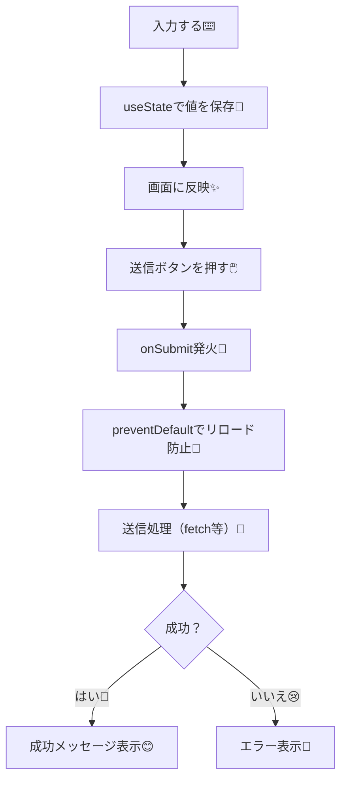

# 第133章：昔のフォーム（onSubmit + useState）を思い出す🕰️

この章では、**「Next.jsに入る前に、昔ながらのReactフォームってこうだったよね！」**を思い出します😊
（次の章から出てくる Server Actions が、どれだけ楽になるかの“比較対象”を作る感じだよ〜🧡）

---

## 1) まず「昔のフォーム」ってどんな感じ？🧁


昔のReactフォームはだいたいこの型👇

* 入力欄の値を **useState** で持つ（＝状態として管理）🧠
* `<form onSubmit={...}>` を書く📨
* 送信時に `event.preventDefault()` してページ遷移（リロード）を止める🛑
* `fetch()` でAPIに投げたり、何か処理して、結果でUIを変える✨

---

## 2) ざっくり流れを図で確認しよ〜🗺️



```mermaid
flowchart TD
  A["入力する⌨️"] --> B["useStateで値を保存🧠"]
  B --> C["画面に反映✨"]
  C --> D["送信ボタンを押す🖱️"]
  D --> E["onSubmit発火📨"]
  E --> F["preventDefaultでリロード防止🛑"]
  F --> G["送信処理（fetch等）🚀"]
  G --> H{"成功？"}
  H -->|"はい🎉"| I["成功メッセージ表示😊"]
  H -->|"いいえ😢"| J["エラー表示🧯"]
```

---

## 3) 最小サンプル：超シンプルなフォーム（昔のやつ）🧪✨


ここでは「ニックネーム」を送るだけのミニフォームを作ります😊
※ 実際の通信はまだやらず、**送信したフリ**をします（次章以降で本物にしていけるよ）🧡

### 3-1) ファイル例（どこに置く？）📁

たとえばこんな場所に作るイメージ：

* `app/form-sample/page.tsx`

> フォームで `useState` を使うので、このページは **Client Component** にします🎮

### 3-2) コード🧩

```tsx
"use client";

import { useState } from "react";

export default function Page() {
  const [nickname, setNickname] = useState("");
  const [status, setStatus] = useState<"idle" | "sending" | "success" | "error">("idle");
  const [message, setMessage] = useState("");

  async function handleSubmit(e: React.FormEvent<HTMLFormElement>) {
    e.preventDefault(); // ✅ これがないと、送信時にページがリロードされがち！

    // 送信前チェック（超ミニ）
    if (!nickname.trim()) {
      setStatus("error");
      setMessage("ニックネームを入れてね🥺");
      return;
    }

    try {
      setStatus("sending");
      setMessage("");

      // 本当はここで fetch("/api/...", { method: "POST", body: ... }) とかする✨
      await new Promise((r) => setTimeout(r, 700)); // 送信っぽい待ち時間

      setStatus("success");
      setMessage(`送信できたよ🎉 ニックネーム：${nickname}`);

      // 送信後に空にするのも定番🧼
      setNickname("");
    } catch {
      setStatus("error");
      setMessage("送信に失敗したみたい…😢 もう一回ためしてね");
    }
  }

  return (
    <main style={{ padding: 24 }}>
      <h1 style={{ fontSize: 24, fontWeight: 700 }}>昔ながらフォーム練習🕰️</h1>

      <form onSubmit={handleSubmit} style={{ marginTop: 16, display: "grid", gap: 12, maxWidth: 420 }}>
        <label style={{ display: "grid", gap: 6 }}>
          <span>ニックネーム🧸</span>
          <input
            value={nickname}
            onChange={(e) => setNickname(e.target.value)}
            placeholder="例：あき"
            style={{ padding: 10, border: "1px solid #ccc", borderRadius: 8 }}
          />
        </label>

        <button
          type="submit"
          disabled={status === "sending"}
          style={{ padding: 10, borderRadius: 8, border: "1px solid #ccc", cursor: "pointer" }}
        >
          {status === "sending" ? "送信中…⏳" : "送信する📨"}
        </button>

        {message && (
          <p style={{ padding: 10, borderRadius: 8, background: "#f6f6f6" }}>
            {status === "error" ? "⚠️ " : ""}
            {message}
          </p>
        )}
      </form>

      <p style={{ marginTop: 16, opacity: 0.75 }}>
        ポイント：入力欄の value が state につながってるから、これを <b>Controlled Component</b> って呼ぶよ〜🎛️
      </p>


    </main>
  );
}
```

---

## 4) ここが「昔のフォーム」のしんどい所あるある😵‍💫（でも大事！）


* 状態が増える（入力が3つ→useStateも3つ…💦）
* 送信中/成功/失敗のUIを自分で作る必要がある⏳🧯
* バリデーション（入力チェック）をどこでどれだけやるか悩む🤔
* “サーバー側の本気チェック”まで入れると、さらに設計が必要🛡️

> だからこそ、次の章以降の「新しいやり方」が輝く✨…って流れになるよ😉🌸

---

## 5) ミニ練習（3分）⏱️🎀


上のコードに、これを足してみてね👇

1. 入力欄の下に「いまの入力：〇〇」って表示してみる👀
2. ニックネームが **10文字以上ならエラー**にする（送信しない）🚫
3. 成功したらボタンの下に「ありがとう〜💖」って出す🎉

---

## 6) この章のまとめ📦✨

* 昔のフォームは **onSubmit + useState** が基本形🧠📨
* `preventDefault()` は超重要🛑
* 状態管理や送信中UIなど、**やることが多くなりがち**😵‍💫
* 次から「もっと自然に書ける」方向に進むよ〜🚀💕

---
